# 【小红书运营】B站最详细的小红书无货源电商实战全流程演示，必爆选品指南，多平台选爆款 - P14：13、小红书商城流量运营-整店运营节奏 - 乜没sui意 - BV1F1421t75o

这节课给大家讲那个呃那个小红书整店的商城，流量的一个运营啊，精细化运营的一个流程啊，这叫流程嗯。

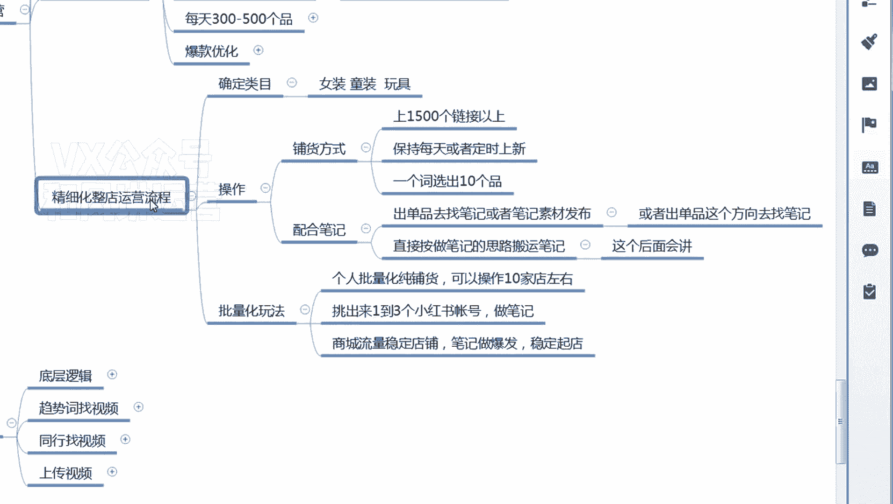

嗯我再捋一下，首先咱们是不是要确定类目，比如说你要做女装童装玩具，母婴对吧，你要确定一个类目，确定类目之后，咱们要干嘛，具体每天你要去铺货啊，我之前说了，每天铺个两三百节货嘛。

大概铺个一个来星期一个一两千的一个链接，以上这样店铺会陆陆续出效果，然后铺货的节奏是保持每天或者定时，这个呃这个大家不要去就那么死啊，就是你不需要每天也可以那么两三天，但是你每天会更好呀，因为呃他对。

因为小红书的商城对新品是有流量加权的，嗯这个跟开始的抖音一样，你上了新品，他会给你先给你系统给你那个索引给你过一遍，然后有一点翻新那个感觉啊，嗯就是每一个店给你给你轮轮流去那个呃，轮轮番展现那个感觉。

就是轮番展现的逻辑呢，肯定你上了新品，我要去先去给你做一个推荐啊，就这个意思咳，然后是新品，新品其实不是让让大家一个一个去选啊，你选一个词词，下面5~10个品你就直接扒就行了。

大概看一下额销量评价没什么问题，直接搬啊，嗯嗯当然也因为有些人呃也跟我说了，他说把抖店的或者是什么，他之前做其他平台那个电商的一个链接，整个扒过来，这个也不能说不可以，就是如果你你比如说你做抖店。

抖店有300个品，你把三个300个品的选品逻辑给我的，差不多的情况下，你可以直接搬过来，因为底层逻辑只要是一样就可以了啊，嗯嗯然后除了铺货之外啊，如果你纯铺货的话，你也可以配配合笔记嘛。

配合笔记就是你铺货当中肯定会出现小爆款啊，就连续出单的款，那么连续出单的款，你除了做爆款优化之外，你可以因为这个款他连续出单了，你你上了你上了一两千个品，对不对啊，那那只有那某某几个品类就出单了。

那说明这个品它既有流量，而且又有竞争力，而且你呢还能拿到流量，在不做动销，不做坑产，什么都不做的情况下，他还能成交，对不对，那说明这个品是有潜力的，那这个品的话嗯，你通过这个品去找这个品的呃。

短视频素材或者是图文素材，你直接照搬或者二次编辑，然后去发布啊，等当然这个二次编辑发布什么东西，咱们后面去讲啊，咱们现在只只只先讲电商，就是这个啊，第一个如果你找不来，或者是你觉得发一个视频不够。

对不对，或者是视频素材太少，那你找这个品这个方向，这种类型的就是一个品能爆，其实这个品背后是代表方向，比如说我说碎花连裙能爆，是不是碎花是目前的一个趋势的一个属性，对不对，是不是我就可以可以找那个啊。

其他的碎花或者类似于这种碎花的，其他的产品都可以，其他的比如说是嗯，嗯其他的是碎花的那个款式不一样，但是也是碎花的都可以，不一定非要是这个款咳，而且一个品你可以发多个笔记啊，如果你有多个笔记资源的话。

你可以发多个笔记嗯，因为笔记报不报，就是带货，笔记报不报，第一个是看这个笔记本身，就是这个图文和短视频本身，这个素材内容容不容易爆，第一个就是这个内容背后的产品容不容易爆，如果这个产品好，他也他能加持。

这个视频比较容易爆，你们做的时候都会有这种感觉啊，有些款就是嗯我怎么拍，反正都能拿到一定的流量，但是我拍的好一点，啪一下就爆了，这是这就是款式取胜啊，你就已经选出来款。

那你就顺带通过这个款做一下这个笔记啊，这个后面做笔记的时候再给大家讲。

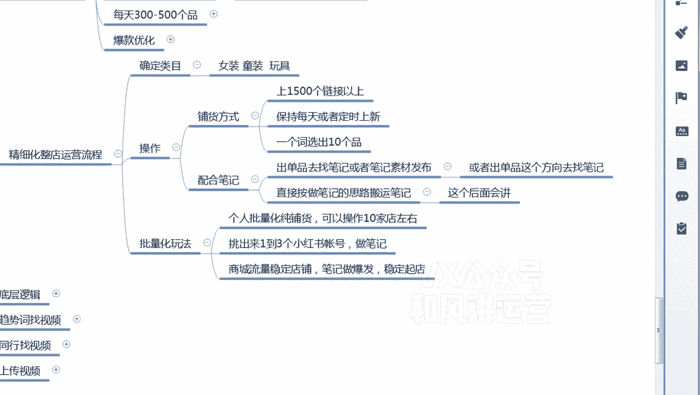

呃这是通过这个款那个，但是如果你你店铺爆单的款比较少，你不可能只只比如说你五个款去连续报单，你不可能天天就做这五个款的笔记啊。

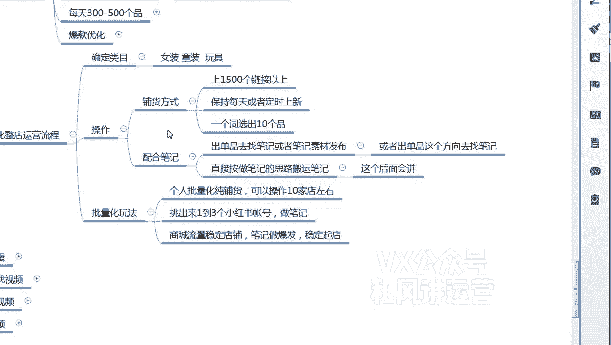

也没啥做的，所以说你可以啊跳出来这个思路。

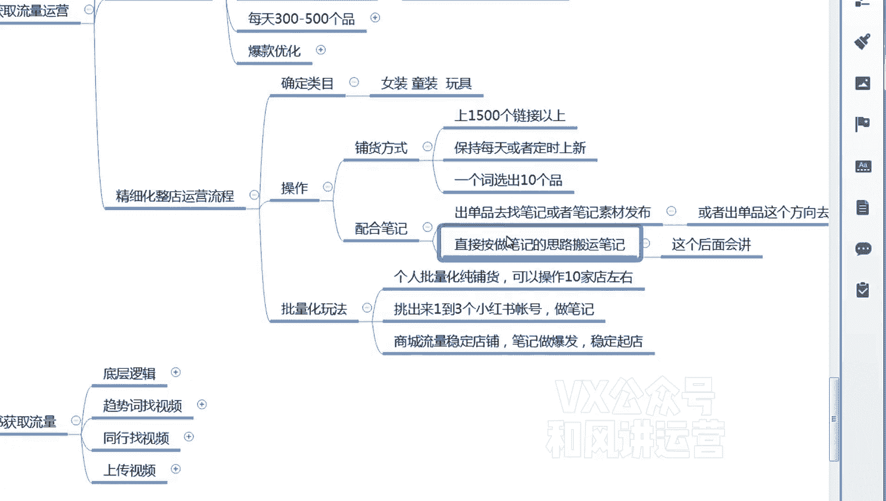

在这个笔记这个方向，或者直接不在这个方向嗯，直接换其他的一些趋势呃，然后去选一些比较优质的笔记，这个也是后面做笔记的这个课程会去讲啊，只是只是这里面跟大家说一下这个整电玩法。

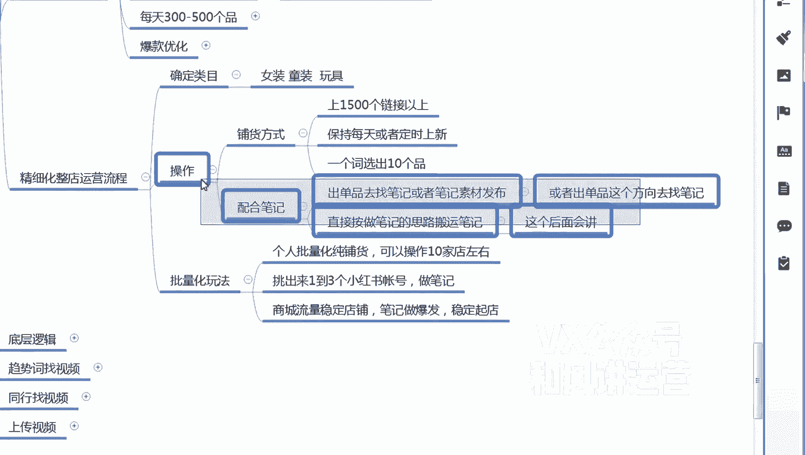

就铺货的整电玩法嗯，如果是呃个人和团队，就是大家怎么样一个节奏去做啊。

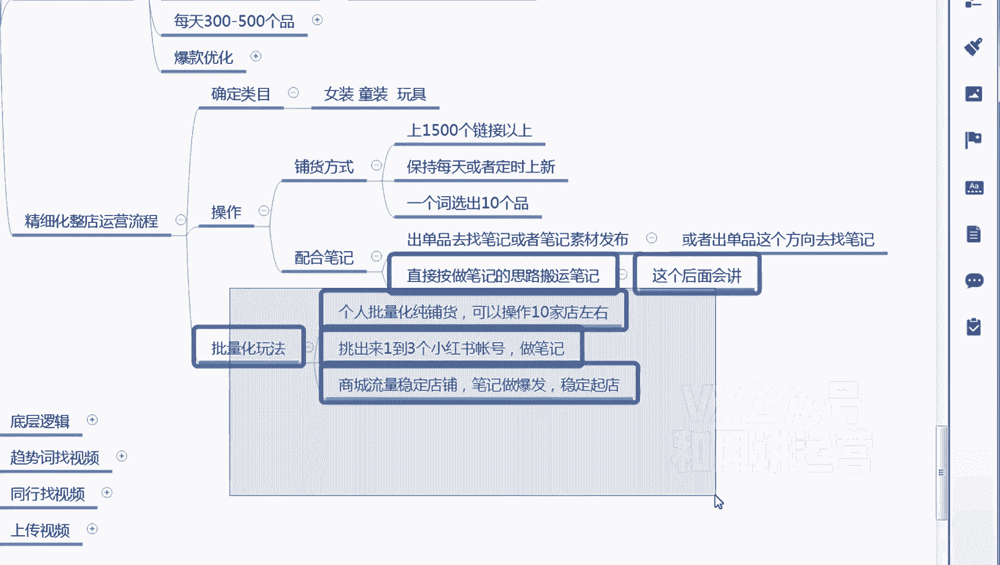

个人化去个人，如果批量化纯铺货的情况下，一般可以操作十家店，十家左右的店铺啊，不是说同时操作十加啊，就是你总共加起来能操作十加，比如我先先嗯我先操作1+2加啊，那铺到2000个品，铺完之后。

我再铺第二个，第一个铺不铺第三个两三个品，等个基础全部铺完了，然后我每个品我可以每天不铺那么多了，每天铺100个，我分散的每天就铺每天铺五十一百，我分散了十个点，每天都上跌上跌啊，就这样一个节奏啊。

嗯建议大家是先先一个店铺满2000后，再接下来操作另一加嗯。

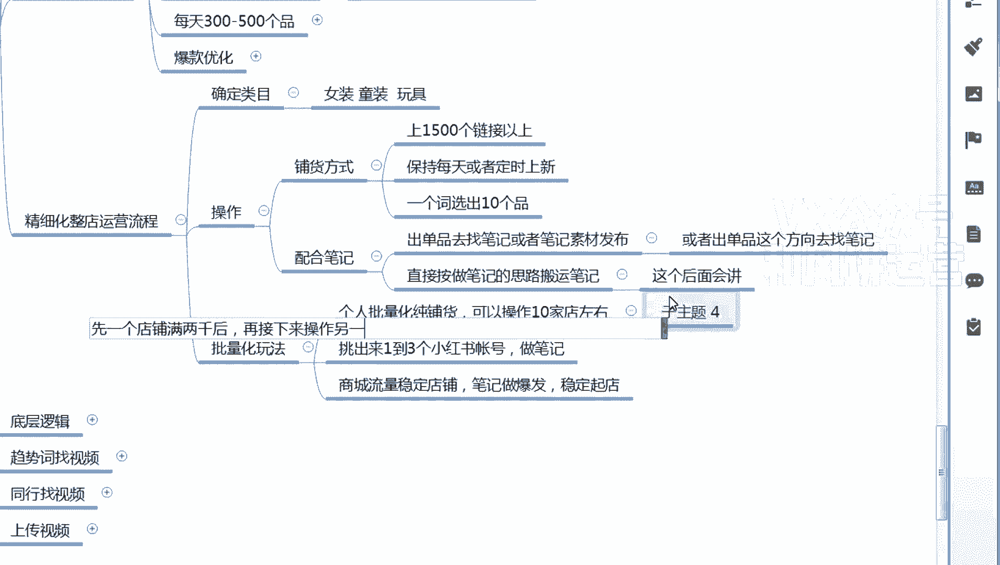

当有个2000基础之后，你基本上店铺陆陆续续都能出单了。

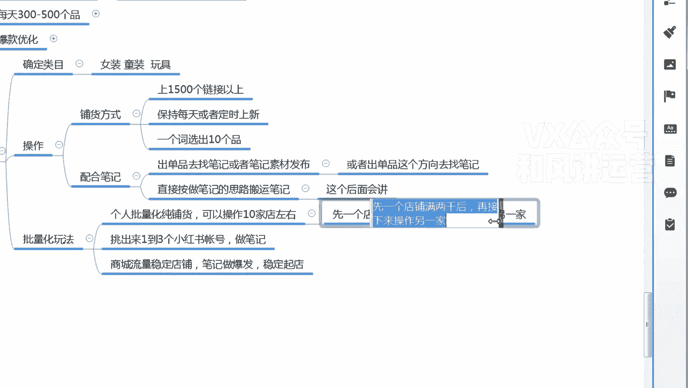

那出单之后你呃批量化同时操作的话，嗯嗯同时操作，因为你有一个基础了，你你这个时候你都不慌了嘛，不慌，批量化操作的话就是每个店每天上个啊，100左右就行了，不需要那么多。

那么这个时候你是不是一天可以上几个电，上五个电啊，就是看看自己自己一个体量嘛，你看有个执行力。

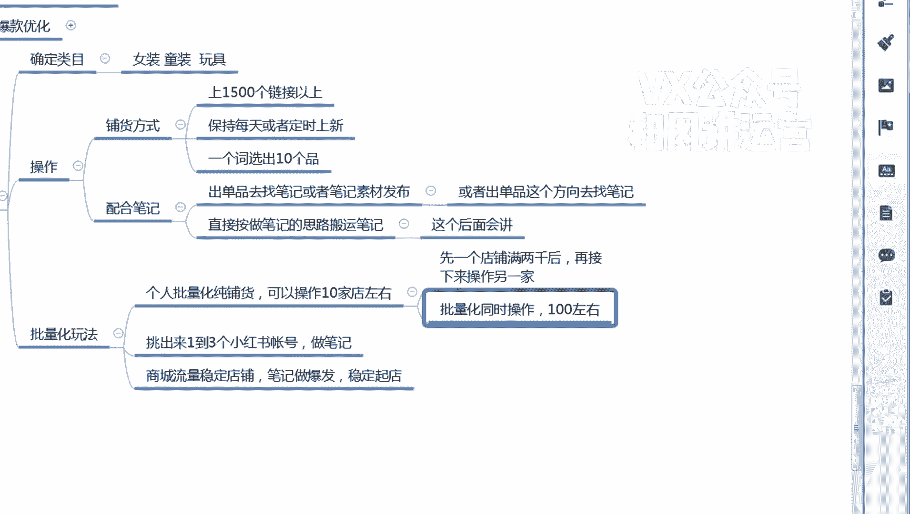

还有你的你的那个坐垫时间嗯，还有一种是嗯但是在这个操作过程当中，你也可以挑出1~3个小红书账号做笔记，那做笔记还是后面给大家讲这么去做笔记吗，然后商城流量稳定爆发，然后笔记是商城流量稳定稳定出单啊。

嗯但是我之前跟大家讲了嘛，商城稳商城流量稳定出单，但是这个单并不多啊，就一个十单二三十单这个样子，然后笔记去做爆发，然后这这个时候你平均下来，你的店铺的体量其实很可观的啊。

就我我我们这店铺就做了一个多星期，然后是一天两三千，那有多的有一天就1万多都有啊，所以说这个报多报少看笔记呃，然后是稳定性，就是看那个就是日常出单稳定性，就是看那个铺货啊，这个大家去参考一下。

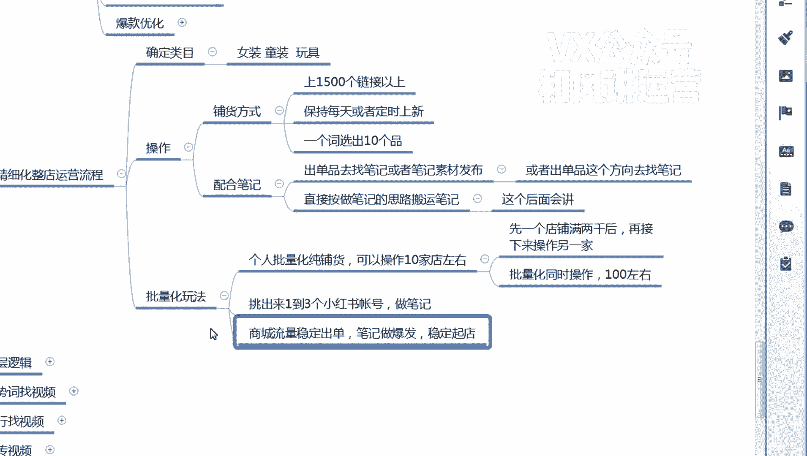

嗯这是嗯嗯商城流量整体运营的一个节奏啊。

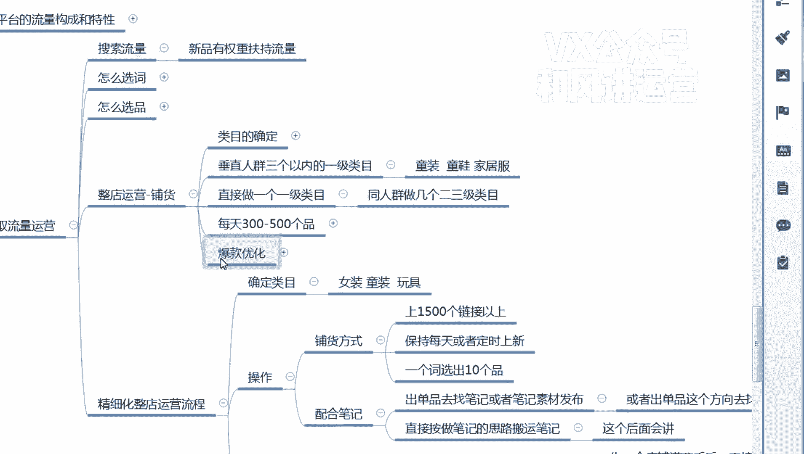

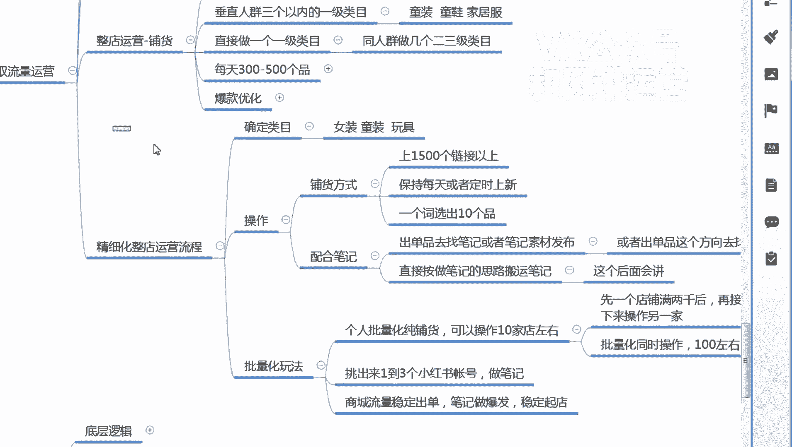