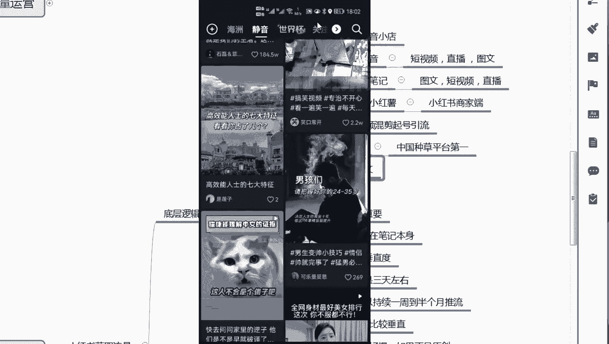

# 【小红书运营】B站最详细的小红书无货源电商实战全流程演示，必爆选品指南，多平台选爆款 - P15：14、小红书笔记流量运营-小红书笔记认知逻辑 - 乜没sui意 - BV1F1421t75o

大家好，这节课给大家讲笔记流量运营嗯，这个笔记流量运营，是小红书主要的一个流量渠道，额这个笔记我给大家类比一下啊，它相当于什么东西啊，呃，笔记，叫什么啊，嗯大家类比一下，比如说我咱们最熟悉的是吧。

肯定抖音嘛，额那抖音有什么抖音是不是抖音，是是那个头条系的一个主要的产品，它是一个娱乐性软件嘛，那么抖音想做电商，他做了什么东西啊，抖音小店对不对，就是抖店啊，那么这个笔记就相当于什么东西，相当于抖音。

有点类似于抖音，那么那么抖抖音不是分了两块吗，啊分了两块分12，抖音也有短视频，是不是啊，有直播，对不对啊，也有那个图文咳啊抖音的图文，我觉得他就是对标对标那个小红书直接抄的啊，他是很多逻辑逻辑形式。

他就想抄那个想抄那个小红书，但是笔记笔记延伸出来笔记就相当于抖音吗，那么额这是小红书的，小红书的笔记相当于抖音，那么抖音的额，抖音的，抖音抖音的娱乐平台是抖音嘛，然后形式是短视频直播图文。

然后他的电商抖音小店，那小红书他的呃，他的主要的一个产品是笔记，那笔记的形式是啊，短视频也有啊，短视频我先先拿主要的吧，他主要是图文，嗯但最近最近最近两年那个比较流行短视频嘛，所以短视频也起来了。

但他发家是图文啊，然后最后直播，但是小红书直播，小红书的直播一般般，嗯不是太好，因为体量太小了，咳嗯然后他的电商小红书的电商叫小红薯，这这这个名，我我到现在我都不知道他有没有去。

正儿八经的说他的电商就叫小红书，没有他其实现在它它很模糊啊，有些地方说小红书有些不是他那个，他现在这个电商叫小红书电商啊，小红书商家端他没有一个具体的名商家端，那app也是小红书商家端吗。

手机上这个手呃app，这个小红书商家端，就是咱们做那个做店铺的，你们可以在手机上下载，也可以在那个电脑上下载都有啊，跟他他跟那个抖电基本上形式一样的，也可以开子账号都可以啊，这是笔记的一个一个性质啊。

大家了解一下，然后他现在的趋势，它现在趋势啊，趋势有点类似于20年一以前的短视频混剪，旗号引流内那一波，因为小红书，目前目前大家现在它相当于一个出什么东西啊，相当于百度嗯，现代版的百度啊。

百度其实正儿八经做，他是要做成小红书的，但是他错过了这个机会，已经错过了，现在小红书把之前咱们对百度的需求，全部他自己做出来这个结果了啊，包括我自己也一样，我的很多东西。

真的我是在是我在去淘宝或者京东去抖音，我买一个东西之前，这个东西而且对我比较重要，我是一定要去小红书搜一下呃，要么搜一个公路，要么搜一下大家真实的推荐，就因为我真的能获取到很真实的，就是以其他人买过的。

或者他们用过的经验，这是很真实的，就是几乎很少掺杂广，那个掺掺掺杂一些那个广告性质的，即便他是广告性质，它也很软软的，让我对他有信服，现在小红书说现在就是这么牛，他是指他是嗯他是中国啊种草平台第一嘛。

嗯第一这个都不用说了，这个小红书不是一个新的平台，已经很长时间了，但是嗯一直没有被深度去挖掘啊，所所以你会发现你会发现抖音在仿抖音，在学小红书的图文，抖音为什么要推图文，而且图文的点赞量，包括他的啊。

获取流，获取流量都比较多，你们自己如果做过短视频，你们会发现啊，做过抖音会发现，就图文普遍的比较比较容易去获取流量，第一个嗯图文适合拍照，因为很多的女孩嘛他们就喜欢拍照，你让她录个短视频。

其实他要情景啊，还要干嘛，还要拍周围呀，就是他有一个环境或环境啊，他在一个环境，但图文我可以通过某一个角度，我拍一个非常美的照片，我已经分享出来，所以图文有图文的优势，短视频有时候是比不了的。

但短视频的优势有时候图文又比不了，所以他们这两个东西嗯都各有利弊，所以说不能抛弃，它是单独可以拎出来的一个东西，所以小红书现在叫学图文，不是抖音，在学图文，抖音现在在主页端。

那么咱们主页端不是不是有那个，你们打开抖音啊，比如我我打开抖音，你们跟跟着我来啊，呃你们点首页之后不是第一栏不是推荐吗，第一个栏是商城，然后关注，然后世界杯，然后有一个嗯这个我我我给你们大家打开吧。

呃大家看下我这个抖音啊，抖音下面下面他有一个推荐。

第一个推荐第一个商城，第三个关注世界杯哎。

有一个静音看好了，有个静音静音里面他现在有些视频啊，但因为静音的，他他这刚做啊，刚做做做那个做的不是太好。

你看静音里面全是图文，全是图文，大家看好了啊。

你看都图基本上80%都是图文啊，其实他这个静音是没有声音的图文吗。

因为图文是没有声音的嘛，有些人就喜欢刷图文。

你可以是单单如果刷图文的话，你就在这里面刷，他是这样的，看他单独把图文列为列。

嗯嗯列出来了，这就代表额好。

这是咱们的抖音啊，你们打开抖音，你看第一个不是推荐吗，第一个是商城，第三个是关注第四个世界杯。

第五个看好了静音，有些有些没有啊，你们新版的你们应该是都有的。

这个静音你看啊，80%都是图文的。

图文没有声音吗，你们点开你看80%都是图文的，哭的我却难平嗯。

这个静音我不知道为什么起个静音，反正是这个静音里面80%都有我。

我觉得抖音在学那个小红书，你看连抖音都在学，小红书的图文，说明图文图问这个市场还是可以的啊，所以说这种形式还是还是没办法取代的，所以说抖音也来学小红书这个图文了啊，咳然后说一下趋势啊。

趋势嗯嗯趋势的抖音目前的不是那个小红书，目前的体量体量官方的统计是月活是两个亿，但是日活还没有一个明确的统计啊，但日活月活两个亿已经非常不错了啊，啊这个体量已经可以了，然后抖那个笔记的流量特性嗯。

笔记的流量特性，第一个冷启动，第一个粉丝量不重要，第三个权重八成落在笔记本身，第四个还有账号的垂直度冷启动，这个怎么理解，给大家去看一个案例啊，嗯就是我们那个账号非常牛牛逼，那个账号的一个案例。

你看我们这个账号其实上架是在，应该是13号上架的，上架完之后第二天直接就出单了，就是嗯小红书你们铺货铺货没有问题啊，就是出出摊很快，但是体量不大，你看我们13号嗯，应该是12号，13号上了两天。

上了大概五五，那个五六百个，上完之后哎，第二天直接出单，14号直接出了一单，然后接下来啊每天每天接单接单，然后直接因，因为因为这个这个还是我们我们那个新店铺，以测试为主的，他没有暗中铺货。

压铺2000个，如果你们能连续慢慢单量递增，如果纯铺货的话，500个肯定是不够的啊，差不多5000个打底，这个是测试的一个点，所以说你不要看那个铺货的单量啊，大家只看笔记。

你看呃他整个店铺整个店铺的商品数也不多，所以说他是还是主要那个这个电是测试笔记的，然后是我们第13号18号五天时间，五天时间笔记发，总共才发十几条，那么我们是一个全新的号，你看总共做才是11号嘛。

11号12号全新的账号当天还没有发笔记，那么我们发完发笔记，你看从十，如果从13号开始算的话，18号就五天时间，如果发笔记的时间就五天时间，五天时间发了十几条，十几条笔记，直接有一个笔记爆了。

那十几条笔记我肯定没有粉丝呀，我可能就二三十个粉丝对，把之前的笔记去去那个累计二三十个，我就能有一个笔记报，当天直接报1万4，知道吧，当天直接报1万4，然后这个笔记慢慢慢慢啊慢慢慢慢慢。

大概因为因为这个产品是有特性的啊，只大家只看笔记的爆发性，我们其他店的笔记，我们另一个另一个电的笔记会非常稳定，这个笔记为啥它降了，是其他原因，是因为我们不想让他卖，因为没货，因为没货，厂家那边在调货。

我们不想让他卖啊，然后笔记各方面优化也也没去做，然后笔记后面是需要去维护的，我们也没维护，我们就是想不想让他卖那么多，卖的多了，我们发布优货这个店铺店铺会，但那个会有问题嗯，当然我们报备了。

直接报备了半个月，因为没货嘛，就没有做追加啊，流量追加，但是你看啊，我们完全冷启动没，几乎在没有粉丝的情况下，他能有这么大的一个爆发力，这就是笔记的冷启动啊，冷启动第一个粉丝量不重要，只有我们几乎没有。

没有什么粉丝直接可以报这个，这在这个抖音里面的逻辑也不一样呀，抖音里面你没有一个基数量的粉丝，这个是很难报的啊，权重八层层摞在笔记本身对吧，就说我好不好呃，粉丝量多不多，最多算加成，但是视频爆不爆。

完全看视频本身，完全看笔记本身，还有账号的垂直度，你账号越垂直，你的发的不太爆的视频更容易被推荐，这叫这是整个账号的一个权重啊，嗯然后小红书的帖子推流啊，且子推流是一般是抖音，一般是三天左右。

是一个大的爆发，小红书一般是一周到半个月，但是这个我没有维护他，大概就是一周呃，我们其他的呃，那个那个视频能差不多基本上都能报，一周到半个月之间啊，一周到半个月之间，这是就是小红书的帖子会更持久。

特别是帖帖子更持久，是图文是比视频更持久一些啊，因为图文它相当于一个知识公路啊，他可以一直被人去收藏和推荐的啊，这是图文，视频的话，就是大概是啊一周到半个月，那图文可能更长，两种方式，那咱们做两种方式。

第一个图文图文我标签比较垂直，不太好报，如果非原创图文其实不太好报啊，嗯因为图文它的检测性嗯更强烈，他他他没有太多，大家可以去去那个嗯去编辑的东西，二次编辑的东西，你要么就原创，你直接放上去就行了。

它可编辑的东西不多，所以这个容易被检测，如果不是太不是原创，不太好报，然后短视频的话是视频，视频搬运或者图文转视频都行啊，所以短视频有更多的操作空间，你就是你就算那个别人的视频，是一个比较爆的视频。

你拿来二次编辑一下，这个这个系统是不太好去判断，你是一个重复视频的啊，这只如果做的话是两种方式，这是小红书的一个底层逻辑。

