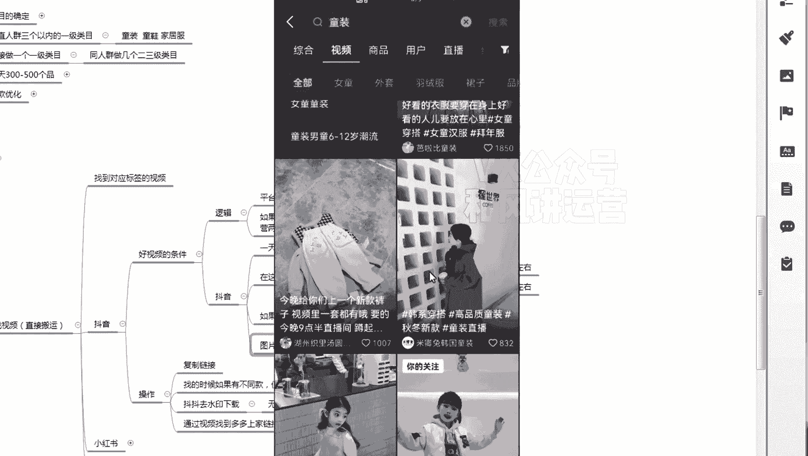

# 【小红书运营】B站最详细的小红书无货源电商实战全流程演示，必爆选品指南，多平台选爆款 - P17：16、小红书笔记流量运营-抖音选视频-什么样的视频是好视频 - 乜没sui意 - BV1F1421t75o

这节课给大家讲如何通过我找到的词曲，去找对应的一个对标的一个视频去找视频啊，嗯然后是先讲，先讲一下什么样的饰品是一个好视频，好视频的一个条件啊，嗯好视频先讲一下逻辑，第一个逻辑就是咱们看是卡什么东西。

如果纯粹搬运视频，卡的是平台的发布信息差，嗯你比如说我一个达人，比如说小杨哥，小杨哥这个达人，他他发布视频嘛，假如说他发布视频，他呃一般情况下他会只发布抖音，因为大家其实现在对小红书的认知都不是很高。

都没有去深耕，都不用说啊，我我全部嗯大家可能会想着取视频号，因为这些热度都比较高，很少有人想起来哦，我发了抖音之后，我就去发那个小红书，他可能最多会想到我在视频号里面再发一遍，对不对，这就是这个意思啊。

嗯所以说他的逻辑是平台发布信息差就是很多，就只做抖音的人，咱们把他的产品完，把把它比较爆的这个视频搬到小红书里面，他一样大概率会爆啊，这就是这就是卡一个平台发布信息差，第一个评第一个。

为什么小红书能卡那个平台发布信息差，而且短视频视频号和其他的很难，因为小红书关注度不高啊，嗯很多人没有没有这种意识，很多人不会在两个平台一起做，他可以抖音和视频号，他不会抖音和小红书不多咳。

额这是逻辑啊，这那那么其他的一个指标指标的话，就第一个如果是抖音的指标给大家讲一下，我是主要讲抖音啊，其他的同理啊，其他的你们自己去再去扩展啊，抖音第一天内发布就是24小时啊。

第二在这个账号上点赞普遍高于日常的点赞量，第三如果有模特不要啊，尽量不要露点，不是说不要露点，尽量啊，嗯这个看情况看专业度，如果对方挺专业的，而且是一个知名的一个网红，他的露点的你尽量不要用。

因为这个容易被平台去检测，嗯如果是我觉得童装和美音都很好，因为小盒太多了，而且很多很多的就是他的小盒，是不是他一家用的，他是专业干这个小盒是专业拍模特的，就很多家都用平台，也没办法去识别到底谁是原创。

嗯就是女装会偏专业点啊，女装女装偏专业一点啊，嗯像母婴童装会好很多，嗯图片幻灯片那个是视频，不要就是咱们嗯咱因为咱们是搬视频对吧，你搬视频，你肯定是那个呃，就是抖音上的那个幻灯片的视频都不用。

嗯就不要了啊，就没什么没什么意义，如果你要的话，你要把他的幻灯片去把它生成一个视频，但生成如果他是个图文，你可以生成视频可以，但是如果他直接是图文生成的视频，这个没有意义啊，所以不要啊。

哦那接下来就是实操，我给大家演示一下啊，嗯嗯实操演示的时候大家卡几个点，第一个一天内发布就是24小时，第一个这个账号行，点赞量普遍高于这个账号本身日常的点赞量，第三个露脸和那种那种那个就是违规。

就是比较容易被判重复的这种注意事项，大家去卡一下就行了，第四个就是啊就图片的话，图片形式的幻灯片视频不要啊，那么给大家演示咳嗯首先你看我搜女卫衣童装。

我搜完之后，我点击最多点赞一天内。

对不对，其他其他都不用卡啊，啧额然后咱们一个一个看吧。

你比如说第一个嗯，最多点在一天内啊，第一个第一个这个视频。

♪ 中国范儿就是这么的气派 ♪，中国范儿就是这么这么帅。

这什么情报呀，1000多点赞，但是他不一定好，因为有很多的账号。

他平均的平均点赞都1000多赞啊，你看这个这个肯定不是啊。

那这个视频很吊啊，你看他日常的话，他都是几十几个。

突然之间有一个一千一千点赞，中国范儿就是这么的气派。

♪ 中国范儿就是这么这么帅 ♪。

♪ 黄河水洗的黄皮肤 ♪。

中国范儿就是这么的气派，中国二就是这么这么帅，♪ 红汗水洗的黄皮草 ♪，♪ 中国范儿就是这么的气派 ♪，中国范儿就是这么这么帅，黄河水洗的黄皮肤，♪ 中国范儿就是这么的气派 ♪，中国范儿就是这么这么帅。

黄河水洗的黄皮肤。

♪ 中国范儿就是这么的气派 ♪，中国范儿就是这气派说不了啊，♪ 第一个中国范儿就是这么的气派嗯 ♪。

第一个看这个怎么样。

看一下啊，200多点赞。

你看200多点赞，他日常，你看他旁边这个这个多少，500多。

800多，900多，199，说明什么，说明他平时就报的几率比较大。

想想想想这个要不要这个可要可不要。

如果你没有的话，可以试试。

嗯再继续啊。

像这种的话就没有用这种多款款的，没办法不多。

新年亲子款，一家三口四口五口74。

74一般般不是太多，74有点太少了啊。

74太少了，65就是非常好看，非常好的小图设计。

然后里面给你们加的什么嗯，是看情况，你看这个账号，如果这个账号普遍就是十几个。

你有100多个其实也算好的，看他给这个账号平时的量有多少嗯。

第一个点赞量到多少，怎么去判定，第一个时间咱们都说了，就必须24小时，不能超过24小时啊，第二个点赞量嗯，看类目嗯，看类目，如果是女装的话，给大家一个概念啊，女装嗯我觉得至少300，至少300左右啊。

如果你装的话，女装至少三百三百左右啊，300左右以上啊，童装啊，童装至少是嗯100嗯，100稍微有点低啊，150吧，稍微保单量高150左右以上啊，其他的同理，你们你们自己看，你们自己运营过程当中。

那个自己看一下，就是它是分类目的，每个类目的人群和点赞量的价值不一样，女装会因为人群比较大，她会它的价值低一点，那童装的价值高一点啊，那童装的很多母婴的，大家都可以150为一个参考点啊。

那如果你在那里又不看点赞量，我先跟大家说一下，你说行不行，非常好看，非常火的小兔子设计，然后里面给你们加的什么，加的是也可以用露脸了，♪ 从前吹到风的人 ♪。

♪ 吹上了落日的沸腾 ♪，♪ 追上了夏末的余温 ♪。

♪ 从前 ♪。

比如说我重新搜一个啊，搜一个童装吧。

填最多点赞好确定，过瘾，这个牛肉放的啥不要。

♪ They were guess ♪，This is afrcause，♪ Got me ♪，♪ Not me now ei ei waka waka eh ♪，这个效果非常好。

就这种胶的话就放弹非常快。

效果非常非常好，嘶嗯4000多，这个可以啊。

这个可以啊，普遍每天不多，太棒了，最近可能旺季吧。

♪ 谁不喜欢 ♪，这个可以要啊，这个可以要直接可以扒啊。

这个就是我刚直接扒这个这个直接拔直接拔哦。

这个24小时直接扒点，在那里拔，♪ 这个我希望最初是你 ♪。

♪ 后来是你 ♪，♪ 最终也是你 ♪。

♪ 我不爱你 ♪，是。

好先讲这先讲这么多啊。

就是时间不能太长了，我尽量是每节课给大家去讲的短一点啊。

