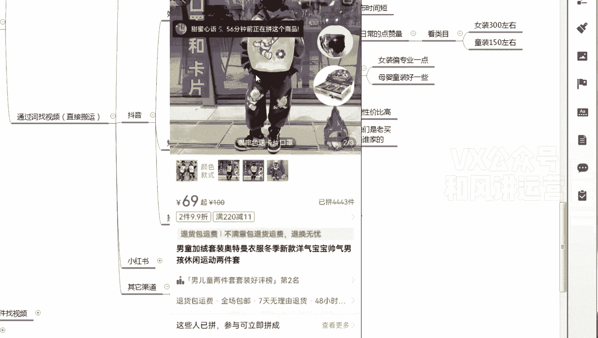

# 【小红书运营】B站最详细的小红书无货源电商实战全流程演示，必爆选品指南，多平台选爆款 - P18：17、小红书笔记流量运营-笔记发布全程实操课程 - 乜没sui意 - BV1F1421t75o

好这节课给大家讲那个我视频写完之后，我怎么样去复制，你看这个这个视频不是不错吗。

Tell me up me up ei，Ei，Waka waka eh，Esunnina，It work cause this is africa sunnana。

eh eh waka waka eh嗯，我先把我先把我这个链接保存一下，对不对，先保存一下，先这样保存一下。

然后我再把这个视频的。

都有功能键，你们自己看啊。

啊那我我我我这是直接提取文字啊，就是用各种方法，你们自己这个自己摸索一下好吧，然后是复制文字啊。

复制文字我也复制一下嗯，复制完之后，我我我我我现在是不是要那个嗯先复制链接。

复制他的文案，因为咱们要照搬嘛，抖音的话，按照我这种方式直接报单，报单效果非常非常好啊，复制链接，然后是复制文案，复制链接和文案，然后这个你们你们随便看有什么东西同步一下，同步到电脑啊。

找到时候如果有不同的款单视频，好的一样可以用这句话，怎么去理解，我先去我先取，我把文案也复制一下啊。

啊我看一下，复制上复制到表格里面，然后是嗯嗯然后然后是我要找这个款。

对不对，然后我要找款。

Tell me up me now，Eh ewalka waka，Eh eh sunnime up at work，Cause，This is africa，Tame up me now。

咱们直接点小红车。

如果没有的情况下，你去他主页啊，一般都有啊，进入橱窗就这个呃，就这个玩意，你看第一个都是一般销量或者新品，原新发布的新品，你看这是新品，你看新品刚发布的都卖了4300件，79块九，价格非常合适啊。

咱们在小红书里面，如果你们做短视频的话，再加一条小红书里面短视频的品啊，唉短视频的啊，背后的产品价格不要高不要高，因为这是走量的，这不像咱们铺货铺货可以扣短视频的产品，产品价格合情合理。

合情合理的基础上，尽量性价比高，因为你这要大批量，我们一天有可能要卖1万2万好几百件这种，你说你去坑一坑，一个是一个，你说这个肯定不合理啊，走不起来量呀，消费者也不是傻子呀。

咳还有一个原因就是嗯小红书里面很多啊，小红书里很多的买手就是顾客，他们是老卖家，咳他们看模特都知道是谁家的，因为有些模特是专属的，这个你对这个行业不了解，你不知道他们比你还要懂，知道吧，比你还要懂。

嗯所以这这个模特我觉得挺通用的，那童装的话会差异化比较多一些啊，女装会更专专业一点，所以露脸的话你们可以慎重一点，嗯所以价格不要太高，我觉得童装的话，童装的价格嘶就是所有的价格。

我尽量是如果是非外童装的价格，我建议是150以内吧，童装的，商品价格呃，我这个不是小弟，我说我说是普货走量，这种女装的话，女装也一样，女装可以稍微再高点，200以内都行，因为有些东西它的确比较贵啊。

都可以啊，这商品价格我额外去补充一下，那完了之后嗯，完了找找这个商品，这个商品我肯定要找一下。

对不对，这个商品我要把它截图下来，截图下来。

我到多多。

多多多多，然后我选这个商品，这么难搞啊，太难搞了。

呀啊你看我你看我找这个商品对吧，找这个商品，然后这个就跟咱们之前干其他平台的，无货源一样，你就是在多多里面选商品，你们应该会吧，然后销量排序看看69，刚刚那时候卖79是吧，79。

然后价格的话价格合情合理啊，价格不一定非要截流，能截流的基础上截流，截不了流就不要节流，无所谓的啊，因为他们平台平台是有信息差的，嗯当然如果如果高的情况下，比如说是能高的情况下，尽量还是七和六啊。

60 966 19应该正常价格啊，79哇。

价格一样呀，这这么狠，竟然价格一样。

抖音买多少钱。

这个有点太狠了啊，15天发货是个新款，这个有点狠，这个新款，这个应该是个厂家，68还真是多多的价格都一样啊，嗯那你说这个款选不选选一样选，因为有信息差啊，一样选。

只要视频能爆，一样卖的出去啊，尽量还是找一下有没有价格更便宜的，哎有有有看好了，有价格便宜的，对不对，39是不是可以翻倍卖，把这个链接复制下来，然我嘶啊都有录上啊，复制下来这个链接是不是要保存一下嗯。

对吧，其实这一套流程下来你们非常熟练的啊，就是我操作肯定是为了做细一点，很多东西都都是稍微稍微比较卡，但是我自己正儿八经测的时候，很快就这个流程就几分钟完事啊，嗯然后是第一个我我这个链接嗯。

嗯我这个链接先，我先把这个商品找这个商品链接，我先去在多多里面，不是在那个复制到我的店铺，对着咱们进店铺，我把它复制下来，不对不对，我要把它发到电脑上啊。

this is啊，水印的话直直接打开你们的微信，然后是有一个搜抖抖去水印工具，然后搜到这个抖抖去水印的小程序，然后打开小程序就可以了，打开小程序啊啊然后是你是链接，不是刚才不是粘了吗，粘贴上去了吗。

亲子你发大财了。

我上辈子欠你们的路上，This is africa up me up me now。

Eewalk out，然后去了橘红色的日落。

吞没在海平线，夜色慢慢摊开，露出星。

搜这个抖抖去使用工具，然后点这个小程序啊。

小程序之后，橘黄色的日落吞没在海平线，夜色慢慢摊开，露出星光点点，我听着一档可以用啊，而且清晰度还挺高的啊。

有了它根本不想连WIFI，然后管不了，因为它免费往前一点点，有了它根本不想连WIFI，这是中国电信推出的19元420G的电话卡，不限速不卡顿。

现在免费送给你，然后嗯看完广告之后，然后保存成功，保存成功。

不是在手机端了，那这个时候是不是可以发布了嗯，发布你发布有视频，有文案，有链接，是不是三样都要有吗，那你先把这个链接先复制了啊，把链接复制下来嗯，链接复制下来，然后该设置的东西设置好啊。

啊价格什么东西啊，两倍三倍都行啊，折扣价四额价格，三倍啊三倍啊都可以啊。

嗯这些设置的话之前已经讲过了啊，然后直接是上传提交就行了。

好上传提交的时候，咱们不要闲着啊，咱们继续去嗯操作，呃咱们打开小红书，然后是跟抖音一样，咱们要点击这个加号啊，嗯然后上传视频。

等下一步分蜂蜜非常重要啊。

这个封灭之后，我有一节课会单独讲蜂蜜，因为你的饰品决定了你的蜂蜜牛不牛逼啊，如果是你在这里面，你看你看你可以下拉啊，嗯我给大家讲的东西都全让我们实操的啊，我们能拿出来，结果你们也一定能拿到。

但是我说的细节一定要记住啊，封面非常重要，因为因为抖音，因为抖音是沉浸式的。

你一次只能刷到一个视频，对不对，但小红书不一样，小红书是呃。

他是像商品一样排列的，你视频再好，我你的封面对我没有吸引力，我我不会点进去看，没有任何意义，知道吧，所以说你要在这里面选一些蜂蜜比较好的，如果这里面蜂蜜没有，那你就做一个比较牛逼的蜂蜜吸引人的。

你从相册导入做好之后再导入进去，目前我们还是比较简单，直接在这在这里面选蜂蜜啊，这个蜂蜜的这种感觉啊，什么样的蜂蜜好，这个很难说的，这个全部靠靠经验啊，就跟咱们咱们之前其他平台抖店啊选品一样。

全凭经验啊，我基本上嗯好稍微帅气一点的啊，有些能展示衣服，而且这个眼这个眼还能亮的啊，就这个奥特曼这个这个眼睛能亮，这个这个嗯尽量选个能亮的啊，这个衣服的特点展现出来，嗯咋样，哎哎也算了，这样也行。

插口袋挺帅气的啊。

就这个就行了，然后居中啊，下一步对吧，然后完成啊，就这么简单嗯对就这么简单，然后我刚不是把文案文案直接照搬啊，我们就这么简单，文案照搬直接报单咳，呃刚才好像好像没没录上，咱们重新重新来一遍啊。

呃刚才讲到哪了，重新来一遍，是不是视频，我不知道视频有没有讲哈，这有没有录上啊，嗯咱们前一步吧，咱们是上一步重重新讲一遍。

是不是。

画好了之后再下一部封面，这个封面非常重要，封面非常重要，如果我刚才讲完一遍，你们你们就再多听一遍啊，我不知道讲了没讲嗯。

封面非常重要呃，这个封面你可以这样这样选。

修改封面啊，修改封面啊。

啊没有了，我重新演示一遍好吧，重新演示一遍，Cause this is afrcause，I'm me up me now，Hey，Eh，Waka waka eh，下一步是不是要添加封闭吗。

嗯添加封面就是给大家去讲一下，这个非常重要啊，操作第一步，复制链接文案，链链接文案，然后去通过视频多多多的商家啊，找到链接，找到链接之后，你也要去上传到店铺，上传店铺，如果呃这是这是找视频这一步啊。

找视频这一步嗯，豆豆去视频下载无需混剪，直接照搬啊，直接照搬，直接搬，搬完之后，然后是呃视频封面啊，视频封面，然后上传上传视频，上传视频的话，要做视频的封面，视频封面非常重要啊，我先操作完我再讲啊。

嗯嗯非常重要，嗯第一个他卡的一个指标嗯嗯有有，为什么重要，因为因为那个呃像抖音是沉浸式的，他一次只能看到一个视频啊，他一次只能看到一个视频，嗯所以说抖音卡的是前五秒嘛，前335秒卡，前五秒。

前五秒你能留住他，你这个视频都大概率会爆，那么小红书是它是货架尺的啊，它是货架是排列啊，就是我一页当中有很多个笔记，你这个笔记好好不好，我不知道，我只有点进去才知道，所以封面吸引力非常重要。

你这个视频再牛，但是你封面不行，我都不点，是不是我压根看不到你啊，所以这个非常重要，嗯这个大家应该能理解哦，然后是比如说我嗯我在这里面点了点了。

我尽量选一个比较有特色了嗯。

嗯衣服能展现衣服的特色，如果这个衣服的衣服的后背比较有特色。

咱们去展示后背啊，如果这个衣服前面没什么东西，后背有特色，咱们就直接展示后背，如果是前面有特色，比如说这个奥特曼的眼睛会亮，咱们尽量展展示这个，但这个不太好弄，那我就是搞一个帅气的手手搭手插口袋。

这个帅气的图片也行啊，啊比如这样这个也行啊，这个帅气一点啊，好就直接可以了，但是因为封面非常重要，后面我再特别精细化的时候，原创视频的时候就是混剪和原创视频的时候，我会教大家去嗯取我。

我在PS里面或者用其他的编辑软件，我先做出来一个比较好的主图，之后，我通过相册，你看我刚才可以导入这个这个封面里面啊，这个后面再去讲一些比较复杂的啊，咱们先做简单的，然后这个封面能做出来一个。

点击率比较高的封面，然后点击下一步。

然后完成，那完成完成之后还还需要啥标题，我一般不写，你们写一下也行，嗯如果不写的话，他会他会抽你们这个说说此刻的心情，就是这个文案里面的第一句话啊，如果不写，它直接抓取文案里面第一句话，如果是写的话。

它会直接显示那个标题，尽量大家都写啊，嗯写的话你进这个标题写的话，呃如果抖音里面有，我一般比较懒，我都是直接是搬抖音的啊，那这个的话我也直接搬抖音吧，嗯我直接搬抖，我直接搬抖音的文案。

这个文案是我抖音上直接复制的，嗯文案我建议抖音上直接复制就行了，没关系的啊，嗯就是这种纯搬货的，不做编辑的，直接搬后面后面如果是嗯大家要做二次编辑，各种方式的话，就是会编辑了会更好。

但是这个抖音里面我刚看了他连话题都没有，话题没有，没有的话，带你们自己啊，同装童装童装是吧，然后这个应该是童装卫衣啊，儿童，卫衣看有没有什么热的啊，比较热的儿童卫衣128万啊，这个挺好。

儿童他这个应该是套装，儿童套装，嗯儿童春秋套装，儿童卫衣套装啊，这个这个也不错是吧，就是你可以多选几个，几个比较匹配的这种话题话题，也能增加这个商品的一个权重，也非常重要啊，嗯如果我我我我是比较懒。

我一般是把抖音里面的话题也直接复制过来，但是抖音里面的话题有一些是艾特呃，抖家艾特抖音这个关键词你千万不要放啊，这个肯定你在人家平台上去去那个放抖音，这个有点不合适啊，艾特用户也不用添加地点也不用啊。

然后直接发布就直接发布了，标题的话，你自己，你看儿子天天喊着那个踢足球世界杯奥特曼嗯，这套穿出去别让小朋友羡慕坏了，你可以把这样啊，标题要是要非常有吸引力啊，你可以直接把他最吸引力这句话放到标题里面。

复制，因为标题也决定了点击率啊，然后这样啊对吧，然后直接发布就行了，就这么简单啊，非非常非常快速，但是效果又比较嗯，嗯立竿见影啊，你们就要你们这样做，我们我们那个报1万5，还每天报两三千。

这店就是这样做的，就是就这么简单，你养别的东西还没有后面的东西，我再给大家讲一些比较比较精细化，就是非常就是专业型做这个笔记的啊，就这个领域的东西，你们先拿这个已经够吃了啊，呃刚才我不方便展示啊。

你看啊是不是是不是在抖音里面，不是在小红书里面，咱们去那个看笔记。

它不是沉浸式的啊，只有在视频里面是成绩。

是咱们看笔记，一般人不会点视频，会点这个，你看这个就是它好不好，我看封面封面吸引力了，吸引我了，我才去点封封，封面不吸引力，你就点不了他，视频再好也没用，而且封面是不是跟商品一样，你看这个封面对不对。

第一个主图对不对啊，这个封面第一个主图，第二个标题，这个标题非常有吸引力，第三个账号，第四个点赞，点赞是不是相当于咱们商品的一个销量啊，是不是啊，所以说如果你的视，如果你的笔记要报的情况下。

第一个封面非常重要，第二个是标题，第三个是点赞量，这个账号其实无所谓啊，这商和物收尾子是不是啊啊，是不是跟商品逻辑一样，所以所以说小红书的笔记的逻辑是商品逻辑，这个后面会具体专业性的再给大家去讲。

你们先按部就班的按照我的照抄就行了，哦不对不对哦，搞错了搞错了啊，嘶额我刚才不是发布完了之后是吧，因为我这个账号有我自己的东西，我录的课程不太方便去去，那个不得不不太方便去去做啊。

我换一个账号给大家去演示，呃刚那个账号因为我没有实名啊，就是没有实名是没有这个关联商品的。

你看我这个可以挂小黄车，我也可以关联商品，关联商品我直接是哪个商品。

我直接一次选就行了，对不对，直接一次选啊，选这个商品就行了啊啊我刚那个没有啊，这多加了这一步啊，那么嗯做完之后咱们整个就上传完了，上传完你就等着他报就行了，这是整个呃所有的全是实操啊。

嗯虽然逻辑性比较简单，但是嗯但是效果肯定是有的，还有一个就是大家要坚持去上嗯，如果你要是让你的视频如果爆发性比较强的话，按照我的指标坚持去上，你基本上我觉得就是大多数人，一个星期基本上都能出效果啊。

嗯现在的市场还还是竞争没有那么大啊，目前的市场，大家大概一个星期基本上都能出效果，嗯细节的话大家有不懂的。

