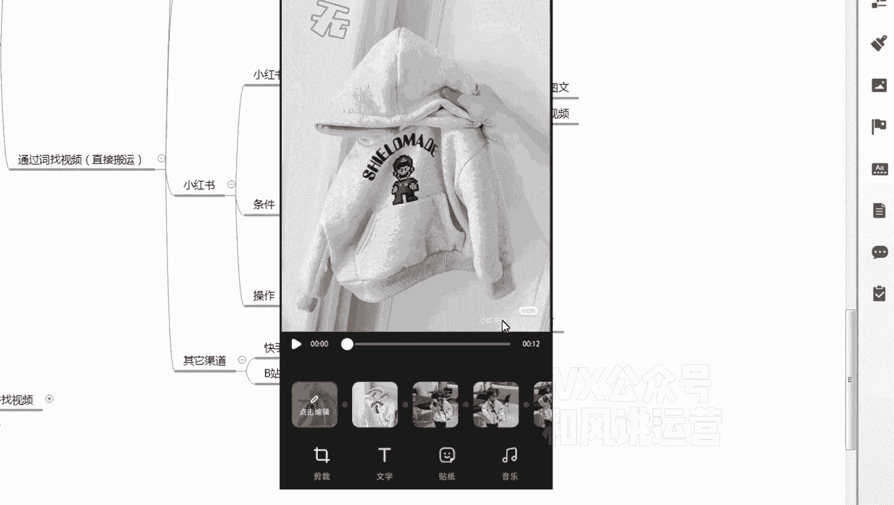

# 【小红书运营】B站最详细的小红书无货源电商实战全流程演示，必爆选品指南，多平台选爆款 - P19：18、小红书笔记流量运营-小红书站内图文转视频实操 - 乜没sui意 - BV1F1421t75o

嗯那么那个图文已经找完之后，我给大家实操一下，怎么样去通过图文去生成一个动态视频，然后去发布笔记啊，呃图文找完之后，咱们要去呃第一个找图文，找图文之后就是保存保存前两张主图，一般前两张是比较好看的啊。

然后再加啊，多多上家三张图嗯，三张图生成那个动态视频啊，就这样嗯然后多多的上家找多多上家啊，嗯选好啊，选好款嗯，然后加文案，加那个卖点文案文字，然后是嗯上选好款之后，然后去到你的小红书里面上架小红书咳。

剩下小红书，然后是编辑编辑笔记，标题文案啊，文案那个热点嗯对吧嘶，呃然后是接下来再关联笔记啊，不是关关联关联嗯，商品链接啊，然后直接发布就行了啊，所以大概就这个流程，跟我是跟我那个发布视频的流程一样。

只是我给大家去演示一下啊，啊啊首先这个选完之后我要保存前两张，一般前两张是比较好看的啊，前两张对保存一下，然后保存嗯，在小红书里面直接保存的话，它是有小红书的logo的啊。

嗯这个到时候咱们给他给他搞一下就行了。

然后这个咱们不是选出来之后，咱们找一个合适的商家啊。

应该第一个算吧，有评价啊，评价还是真实的啊。

那对第一个算价格还合理啊，就是这个啊。

嗯然后咱们保存保存那个三张，第一张主图是比较牛的。

咱们肯定要保存啊，这个保存一下啊，搜索饰品同款商品嘶。

嗯这个不让保存吗，哦不是这是第一章。

是一个饰品啊，那咱们这算是第一章，第一章。

第二章，第三章。

没有咱们可以多选一个，选个更好看的啊。

然后哪个是最好看的，就说不好啊，这个完全看网感啊。

嗯一般前三张都是比较好看的啊，写完之后。

然后打开小红书，咱们不保存完了，然后这个文案的话，待会改一改就行了，咱们先嘶行，我先把它收藏一下文案，你可以先扒出来吗，包括他这个热点都先扒出来，然后我点小红书或点点那个小红书或点加号。

不是上传吗，上传嗯，首先饰品的前两个我是要选的，对不对，然后这里面要选三个，我觉得这个不错，这个展示这个不错啊，选五个就行了，然后下一步，这这里面大家不要点这个智能成片啊。

因为你我我那个我水印要去一下。

所以我不想不想那个智能成片，如果你你水印提前去完之后，你可以智能成片，就是你的图片不用改了，你可以智能成片，我需要在这里面我再重新编辑一下。

所以我再下一步啊，下一步哎，不不不不对不对，搞错了啊。

搞错了，返回编辑嘶嗯，这个里面有一个，有一个调节啊。

一个视频模板嗯，视频模板你可以选一个比较好看的视频模板。

卡通的嘛，假如说选第一个，无论使用我几岁。

可爱蹦蹦蹦万岁。

我手中谁牵，Add，你选好视频模板之后会进入一个编辑界面嗯，间距编辑界界面啊，这个不是有水印吗，你看下角最右下角会有一个小红书的水印。

这个要去掉，不然你会重复的，然后点剪辑。

剪辑的话，然后是比例。

嗯重新说一下啊，咱们返回啊，就是你先把图片剪辑完，或者是图片保存完之后，你用你的手机本身自带的那个剪辑，你把它剪辑完，把它水印去了，然后你再去下一步啊，再去那个套模板，你像我你像我这个嗯。

我这个的就是你看下下方右下角有个水印，我先点击在图片段图片。

这这个时候我就点击一个剪辑，剪辑的话，我一般三比四。

我把这个尺寸调好，三比四三比四，然后把图片稍微放大一点啊，因为你在软件里面调是有局限性的啊，嗯条件可以的话，PS比较熟练的话，在PS里面调也行啊，大概能把这个水印能把它盖住啊。

对大家盖住，然后打个对号，这第一个第一个图也有水印吗，然后再剪辑。

然后放大放大，让他没有展示啊。

这样也挺好对吧，然后其他的是因为是多多保存的，基本上都没有水印啊。

好可以了，可以你再下一步嗯嗯嗯可以返回编辑啊。

这不是可以了可以了，你可以套视频模板，这里面有视频模板，如果套，如果有合适的，不是图文模板啊。

你可以套一个视频模板，这里面大家自己去看啊。

找到一个适合的，比如说这个用的人也比较多，诶，可爱蹦蹦蹦万岁，我手中水枪在BIUBIU。

小脑在啾啾，那个女孩路过，我脸羞羞啧呃如果声音调大。

如果不泡不泡模板的话，大家直接选个音乐就行了，这里面音乐库大家都可以选啊，我把这个音乐取消了啊，还想对，直接选择音乐就行了，选择音乐是直接是嗯，你选完之后，直接，我建议大家还是在手机端把这个图片改了吧。

因为在手机端改了之后，你不用二次编辑，这个编辑器不是太好。

然后直接下一步啊，这是这是但是这是图文啊，这是图文，你要生成智能生成图片也行。

嗯你就选一个图文的模板嗯。

这里给大家提醒一下啊，就是你下载的，下载的小红书图片啊，是有水印的啊，这个水印，这个水印你们不要在小红书那个编辑软件里面，他那个不太好用啊，你们在用手机软件或者电脑的编辑，把水印水印那个裁剪的啊。

然后这个如果你觉得小红书的编辑软件不好用，你可以你也可以用什么用啊，pr啊，我用用pr比较专业的pr啊，或者是用其他的比较简易的用，能直接通过视频，通过图片生成视频那种智能生成的这种啊。

这种软件都可以啊，弄完之后你直接当视频发布就行了，我是因为我们运营的话，他是自己会会这个pr这些软件标，还有一个剪影这些，然后他们是呃批量化的，他们在电脑端搞好的啊，你看这个视频的话。

就是直接你是你搞完之后嗯。

还是给大家演示一下。

搞完之后你直接视频生成模板，就直接选第一个，第一个一键使用。

无论几岁，可爱蹦蹦蹦万岁。

我手中谁，然后下一步，然后是这个模板。

这个可以选第一个啊，只是给大家演示啊，那前面我讲的所有注意事项，大家都可以去参考嗯，然后是文文案的情况下，你可以这个因为这个是小红书内部的，你文案尽量不要去照抄文案，你可以有两种方案。

第一个你在小红小红书的文案啊，小红书的基础上改一改啊，啊这第一个第一个是直接去抖音，找找类似的文案，类似嗯产品的文案直接复制这样，这反正这两种方式都可以，然后你的话题可以直接抄啊，直接抄就行了。

因为话题没有重复性吗，啊所以这个文案文案和标题大家自己解决啊，话题的话直接抄我刚才复制那个，然后然后商品的话，因为你已经找到这个商品了嘛，直接上架小红书，直接上架完之后直接关联就行了啊。

额然后额外说一下啊，额外说一下，就是小红书的图文转视频的效果嗯，我们测下来还是没有抖音，这个直接搬的好嗯，因为他毕竟是你二次在站内的二次编辑，但是一样会爆，但是这样的话会呃，在你在你抖音这个视频不够用。

嗯不是太充足的情况下，而且你的量比较大，那么你把小红书这个也去扩展了，就抖音是咱们最最最主要要做的，然后小红书是第一个也要做的啊，嗯然后小红书的视频转图文，这个更简单了，就是视频你找到嗯。

就是你视频找到你的那个多多的商家，多多商家直接把如果直接把这个视频，那直接把主图的前五章直接生成生成图文，直接发布就行了。

