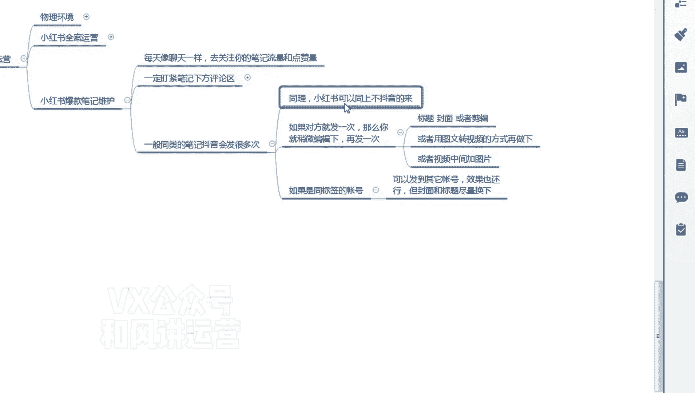
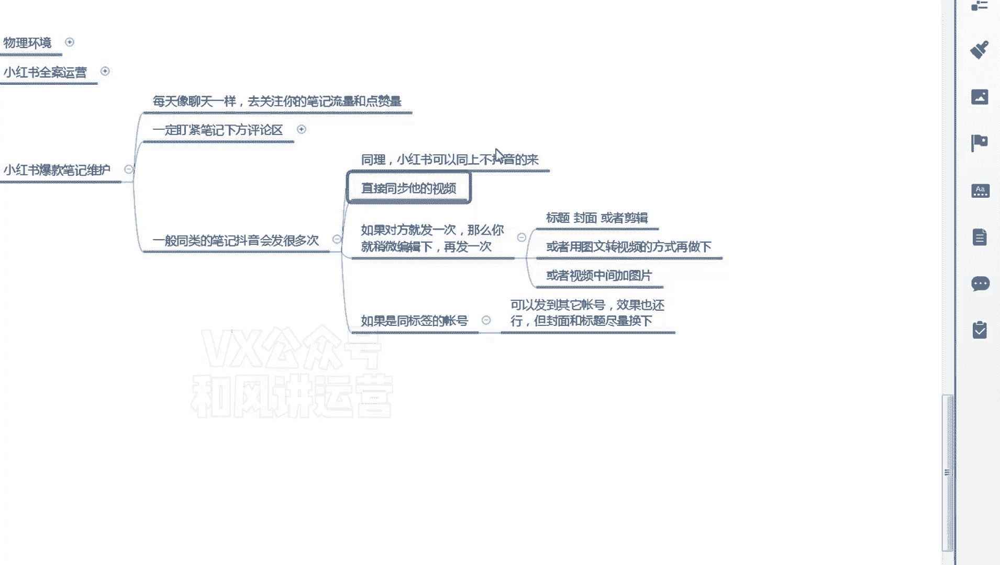
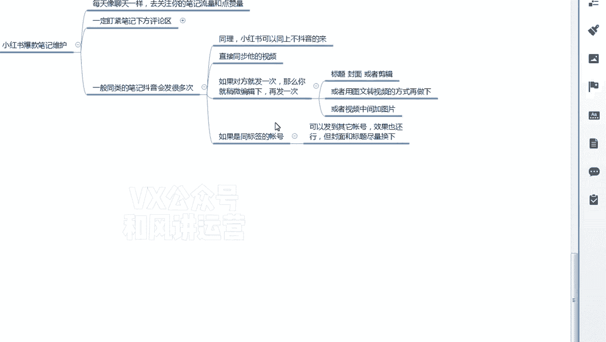
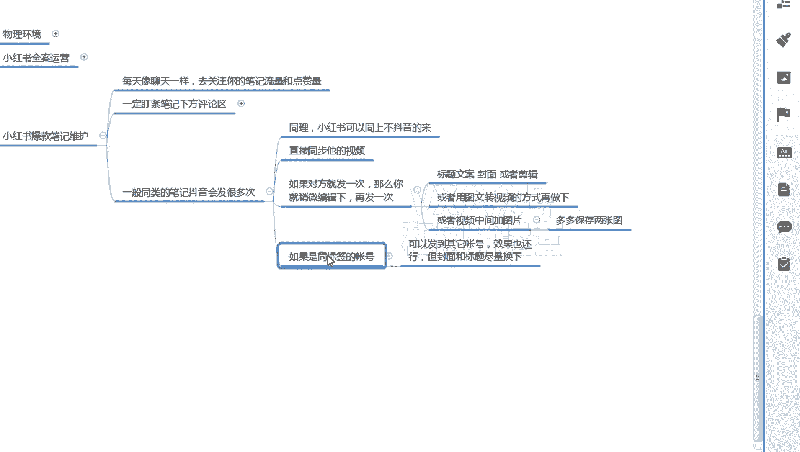
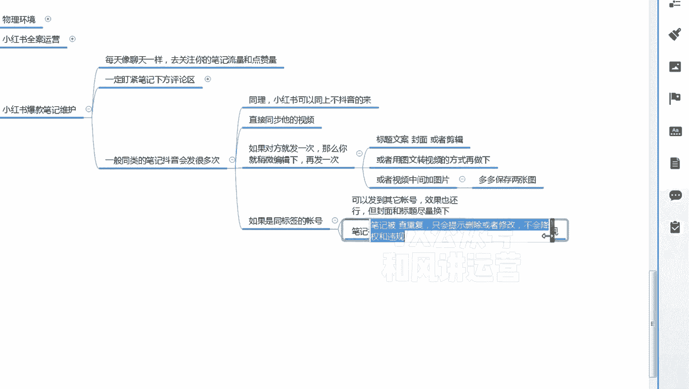
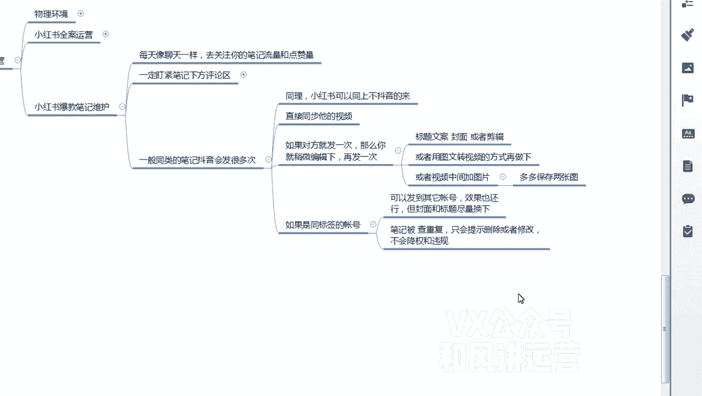

# 【小红书运营】B站最详细的小红书无货源电商实战全流程演示，必爆选品指南，多平台选爆款 - P20：19、小红书笔记流量运营-复制爆款笔记爆上加爆 - 乜没sui意 - BV1F1421t75o

还有一个还有一个很多嗯学员会问我啊，就是小红书的笔记可不可以重复发啊，这里面给大家去讲一下第一个啊，呃一般同类的比同类的爆款视频，抖音都不止发一次，这是抖音的逻辑，同样小红书的逻辑也一样的。

小红书也可以不止发一次，但是因为抖音，它如果如果那个你关注抖音那个达人，他报了一个视频，他基本上八成的人不会放过这个机会，他会把这个产品重新的啊，就这个方向，这个拍摄的方向，或者是重新再拍一遍。

然后再发，他大概率也能爆，如果对方发一次嗯，如如果如果对方去会发很多次，你就直接同步就行了啊，如果发很多次，直接同步啊。

直接同步，他的视频你不管报不报，直接同步，因为呃，抖音那个达人已经把他能报的概率都卡好了，对吧，所以说你不用考虑，只要只要他发，你就发啊，而且是你尽量时间间隔还是24小时之内。

只要跟着他来就行了，你你关注紧一点嘛，盯紧一点。

第一个，如果有些人不专业，他就发一次不发了，那么怎么办，你稍微编辑一下再发，比如说编辑和标题，标题改一改啊，封面改一改啊，这个标题也指的是文案啊，标题文案就一整套的，你都改一改，不要一模一样。

然后封面改一改，封面的话挑一些嗯，你挑一下，那个多多上家的那个主图的封面，因为点击率高呀，因为笔记是拿点击率的，不是前五秒播放啊，咳封面改一改，或者是甚至你可以稍微去做一些混剪剪辑，都可以啊。

嗯如果你是用图文方式，或或者你用图文转成视频，因为因为这个视频爆了呀，他也没发，但是我觉得这个品不错，嗯由于视频不好，其实也跟品有关系，那我找多多的商家，我把这个嗯视频的这个这个链接的主图嗯。

嗯把它保存五张，然后转换成视频啊，按照之前章章节讲的嘛，然后把它做成视频再发一下，看能不能报，然后文案其实改一改，然后是其他的东西照抄，或者是这样，或者是视频中间加图片，就是你报这个视频嗯。

我把我把前两张且我我报这个视频，我把那个多多的嗯嗯前后改一改嘛，啊多多保存，两张图两张图，然后和视频加在一起去混剪一下都可以啊，然后是这个两张图放到前面吗，嗯呃如果是同标签的账号。

什么同标签的账号可以发其他账号，或者是呃效果也还行，但是封面和标题经常换啊，这个怎么理解啊，就是很多人就跟咱们抄爆款一样，我一个店铺这个款爆了，我能不能复制到另外一个店铺，当然可以啊，当然可以。

因为是同平台嗯，你同平台不同店铺，他有一个判断重复这这样一个机制，所以说你还是要改一改啊，但是这个肥水不流不流万人田呀，你你先报那个，他肯定不会查你，他会查查你后报这个后报这个查都查了，他查了嗯。

再提一提一个啊，就是笔记被查重复啊，只会还是一样，只会提示删除或者修改，不会讲权和违规啊，嗯嗯嗯所以他查都查了呗。

然后是他嗯如果不查的话，你能报不是更好吗，如果查的情况下，你就删除就行了，就这么简单，删除的话，你再去改一改啊，然后把标题封面啊，文案什么东西改一改一样的啊，所以说啊如果一个爆款笔记爆了。

一定要抓住机会，不要让它只报一次，我们一个店铺连爆三次，一个视频连爆三次，每一个都是将近有有一个是两三万，其他的都是差不多将近1万的啊，现在还现在还在涨还在涨，它会大概一个视频的话嗯。

基本上报嗯一周到半个月嘛啊。

