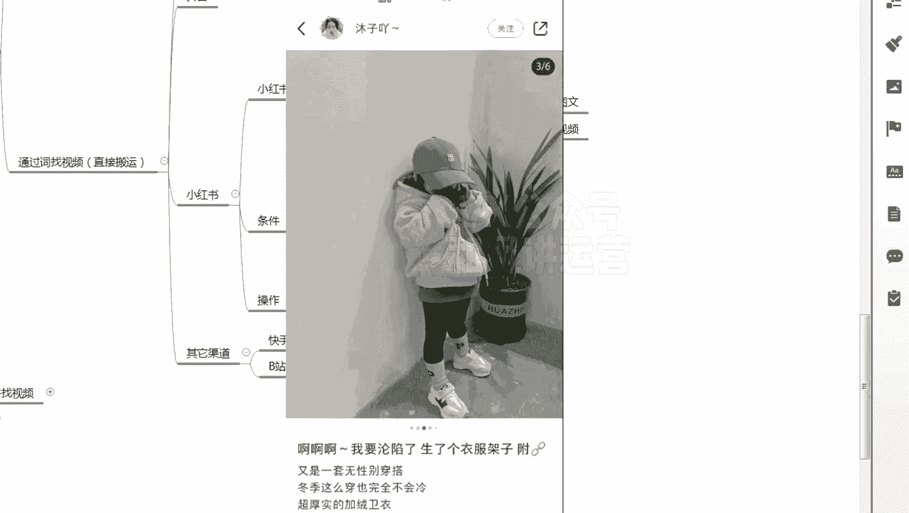

# 【小红书运营】B站最详细的小红书无货源电商实战全流程演示，必爆选品指南，多平台选爆款 - P21：20、小红书笔记流量运营-小红书站内怎么选图文 - 乜没sui意 - BV1F1421t75o

大家好，这节课给大家讲，小红书站内怎么去做一个搬运啊，嗯额因为小红书咱们是站内搬运的，咱们做小红书又在小红书里面去搬运，所以说它是有检测重复机制的，因为我自己的平台当然能检查，咱们在抖抖音搬到小红书。

是因为他们不是一个平台，他们是他们的数据库是不同步的，所以没办法查啊，所以他们有一个同步的信心差，但小红书是没有完全没有信息差的，因为服务器都是一个，你在人家站内，你去复制站内的东西，这个很快的检测到。

所以你要做到差异化嘛，所以不能照搬呃，不能照搬，那么咱们在小红书里面要做什么，要做那个呃，要做图文或视频都可以，那么咱们先去找这种图文和视频的笔记嗯，嗯打笔记，咱们一般情况下小红书里面我做啊。

图文会多一些饰品，饰品呃，效果可能没有图文那么好，就是咱们做额不能照搬，然后第二个做图文，图文为主啊，嗯视频为辅啊，嗯不是图文，就是那个视频为主，还是发布视频，图文为辅，因为图文的话你得原嗯。

图文的话你得把账号养起来养起来，而且尽量是偏原创的会比较好一些啊，嗯它的形式就是这样的吗，形式就是如果我找到了，如果我找到是视频，我就有个转成图文，如果我找我找到图文，我有个转成视频。

然后这节课教大家去嗯找到的是图文，然后转成视频，因为小红书是图文发家的，他的图文比较优质，我拿他的图文去转成视频，因为他视频嗯不是太多，我转成视频，刚好补充这个市场的空缺了，啊啊我先讲这个图文转视频。

那我是不是在小红书里面要去找这样的图文，对吧，那图文好的一个图文，第一个七天内发布的，这是一个时间节点啊，第二个呃给那个找视频的逻辑一样，就是他的在整个这个博主的账号当中，点赞量普遍较高，第三个嗯。

第三个如果有露脸的，尽量不要露脸啊，就是特别比较专业的那种女装啊，嗯然后找的时候如果有不同不同款，但饰品比较好，比你嗯点进去那个那个那个笔记好的话，你一样啊，不用你点进去那个用其他的用，用其他的视频。

用其他的那个笔记都可以啊，啊这个给大家去实操一下啊，嗯先实操就就怎么样找到合适的这个这个笔记，首先一样咱们打开小红书啊，打开小红书之后，然后点你肯定要搜嘛。

比如说我关键词选完了，我要搜那个儿童唯一女，儿童为一女呃。

然后我找嗯，我选个图文对吧，我要选图文，我都选，我要找图文，图文都选图文吗啊图文的话，他的嗯比如说我我要做童装的话。

童装基本上有个将近100个，基本上都算是好视频啊。

因为小红说的毕竟毕竟不能像抖音啊，嗯这个80一个其实也可以啊，看他发布时间11月18号，十八二十五刚好七天嗯。

有点纠结啊，刚刚刚好好七天嗯，可以可以看一下啊。

可以看一下，就是除了这个还有没有更好的80一个，没有更好的说明。

他是说明，刚才你看那个81，在他发布的里面算是比较优质的。

所以可以直接用啊，你看这个这个是多款的。

不太适合这个，这个是点赞是三个也不太适合嗯。

出现一个475个啊，这个475的呃。

这个什么时候发布的，11月4号时间太久了也不行，那我看他这个博主里面有没有更适合的啊。

刚才看的是这个时间比较久，这个啊看看他这个嗯。

最近的十七十三五十四十八五嗯。

没有太突出的。

哎，这个有478的，11月11号，这个是半个月了。

时间有点久，他这个pass吧，再选一个这个1000多的啊。

10月23也是比较久。

嗯216，216，它普遍是几十嘛。

对不对，平均是几十一百啊，100突然来个二百二百。

应该算是比较多的，你看这个都可以啊，11月21号，最近没多久啊，这个是啥棉服。

羽绒服啊，羽绒服感觉太贵了嘶嗯羽绒服也可以选啊。

我就暂时不选羽绒服啊，这个卫衣我看一下。

11月18号十八二十五嗯，差不多七天吧。

这个我看一下，嗯这个是不是也可以对吧，嗯这个可以，然后方式是一样的啊。

方式一样，你可以拿这个去截个图，在多多里面去找。

嗯你也可以去看他的主页啊，他有没有店铺，他没有店铺，他没有店铺啊，没开店啊。

然后我在多多里面去搜一下啊，嗯多多里面搜一下是有是有这个款的啊。

嗯啊那么这是一个了。

其实长的挺快的啊，其他的这个300多的也可以看什么时候。

11月20号哎这个也可以啊，10月20号300多，我看他的他你看日常都是几个十几个。

突然300多，那肯定是很优质的，这个品肯定是个爆品啊，这个都可以，大家直接抄呀对吧。

抽下来。

