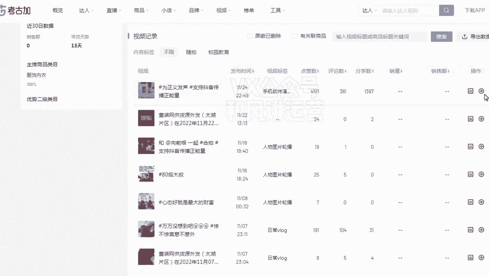
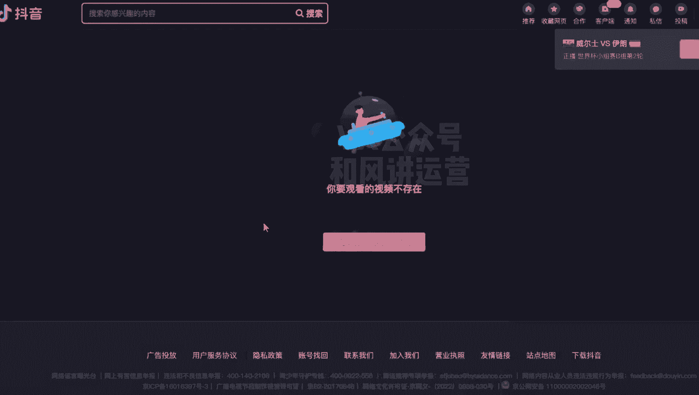
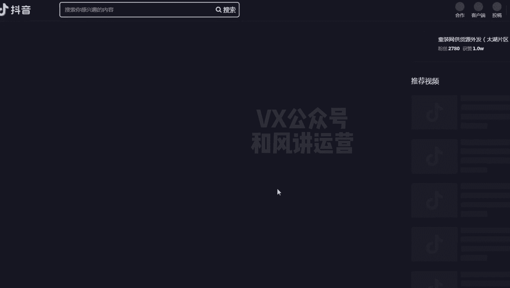
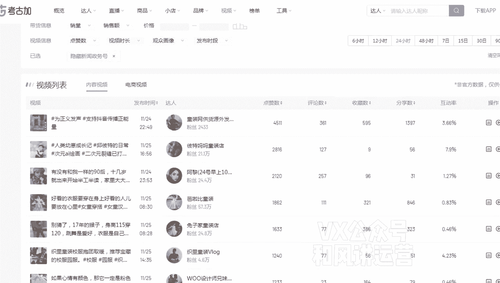

# 【小红书运营】B站最详细的小红书无货源电商实战全流程演示，必爆选品指南，多平台选爆款 - P22：21、小红书笔记流量运营-如何用数据平台选视频 - 乜没sui意 - BV1F1421t75o

嗯前面已经讲了，就是嗯找到词之后嗯通过词曲搬运饰品，这个直接搬运饰品，然后图文的话，图文图文生成视频，简单是做一个图文的一个合成啊，基本上咱们都属于不是原创，基本上都属于那种嗯偏向于无脑操作。

这种不需要原唱的啊，那么按顺序来说，抖音先用抖音的，抖音的数据不够用了，再用小红书的，小红书的再不够用，就是快手和B站的啊，嗯啊先做一个扩展，那么接下来这一节课讲什么。

讲抖音抖音短视频数据那个软件找视频，就咱们用咱们考古家或者是蝉妈妈，咳蝉妈妈或者是非瓜这一类的啊，你这个自己看啊，就是馋妈考古加，这个因为是相对来说比较实惠一点啊，如果他你们自己看。

我们是一直用的考古夹，那产妈妈它的它有效数据更好，或者有些功能你们也可以用的，道理都是一样的啊，我拿考古家为例吧，嗯呃给大家演示一下，额这是考古家的一个界面啊，考古家界面嗯，咱们选肯定选视频啊，视频库。

呃视频库你可以用你那个词，直接在视频库里面搜也行，这个都可以啊，比如说童装，你就搜个童装嘛，嗯童装，然后是这里面我尽量是不卡的，因为我就卡个24小时一样的卡24小时，然后点赞量，你看它自动排序吗。

这么多20小时这么多产品啊，嗯但是你也可以这样，就是搜关键词的量会大一点，你可以不搜词，直接我在母婴下面先童装也可以，但这个量小，因为它可能是童装，但是它归到其他类里面了，因为不是那么精准。

但是你你看这个数据是额55页啊，看哪个多一点啊，24小时，嗯这个都100亿啊，所以说大家是呃词找完之后可以直接用软件找，也可以直接在类目里面去去找，然后是简单去介绍一下，这个相对来说比较简单啊。

因为咱们之前如果用过这些软件比较简单，找视频嘛，啊大家基本上都会只是给大家看几个点点赞量，跟我刚刚说的一样，那童装的150左右，150以上嗯，然后是女装的话，尽量是300以上。

你比如说这个呃呃加时间卡24小时呃，其他的我都不看，嗯我先看下这个视频，第一个，嗯我先去点进去这个账号，因为我要判断这个视频在账号当中，他的他的热度吗，如果比如说1000，他普遍都是1000的话。

那这个视频也不优质啊，我看他视频作品啊普遍是几十，但他这个是1000，那我肯定要对不对，但是我而且我再看一下他视频的大概一个呃。

长什么样啊。

唉还不让看啊，嗯假如说这个啊随便点一下。

假如说这个视频的话。

嗯这个视频不是一个产品，视频也不行，换一个啊，童装童装这个啊，这个我看一下是1866个点赞，1862个点赞啊，有个这个，但平时的话你看都是几十几百，说明这个视频是好的，我大概看下这个视频长什么样。

嗯这个视频可以啊，是咱们要的视频啊，嗯那这可以啊，那这个是不是咱们在电脑端操作，是不是更方便啊，直接在电脑端直接复制，复制它的他的那个嗯那个热点啊，还有一个还有一个他这个文案都都有啊。

还有一个他这个商品的话，大家还可以在手机端去操作啊，所以说如果你用软件去找会更快捷一点啊，我觉得我们测实操下来会更快捷一点，而且数据各方面看着也比较比较方便一些，你看这个U小花，当然同理啊。

找视频的都是同理的，你看他这个498，但是他普遍的话2000多，所以495是25号的9。16，其实他今天刚发布的，其实这个视频视频也好，因为他今天刚刚发布时间并不长，但是他已经495了，所以这也不差。

所以这个视频也是好的，我的意思就是你除了看这个之外，你说这个是22号，如果如果这个视频也是24小时在这里面，那你除了他之外，这个也可以选，对不对，而且你还可以把这个账号去关注一下，做一个对标达人。

那后面会讲那个对标达人，所以这是额软件，就是数据软件找视频这样一个功能啊，所以相对来说比较简单啊，嗯那不同的词搜出来的结果都不一样，大家都在这里面找就行了啊，嗯价格我不建议大家去砍啊，不用卡价格。

因为饰品它可能没有带货，其他的粉丝数也不卡，这些都不卡啊，直接就是直接一搜就行了。

