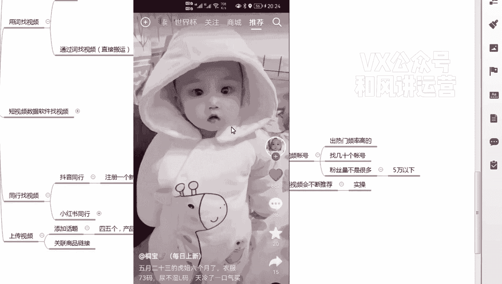
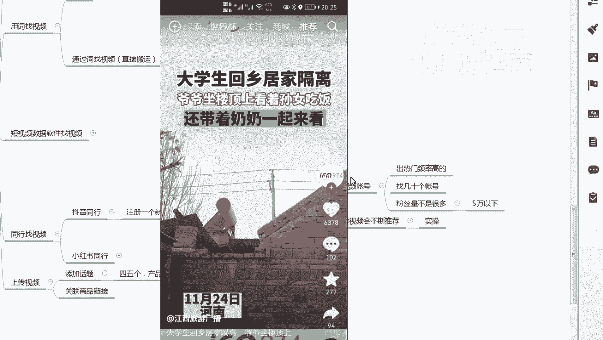

# 【小红书运营】B站最详细的小红书无货源电商实战全流程演示，必爆选品指南，多平台选爆款 - P23：22、小红书笔记流量运营-如何养选品抖音帐号及用帐号找视频 - 乜没sui意 - BV1F1421t75o

这节课给大家讲一下同行找视频，同行找视频，首先是我建议大家用抖音的同行啊，短视频的老大呃，那么首先我建议大家先注册一个呃，新的抖音账号啊，或者是你经常不用的抖音账号都行。

就是他你的这个抖音账号没有太多的粉丝，就自给自用的，或者是重新注册一个都行啊，啊这个账号就是专门用来选品，你不要去那个乱刷，就今天看看新闻，明天看看广告啊，等明明明明天看看那个呃，其他的就是不要刷乱了。

你这个就是比如说你做一个童装啊，给大家注册一个账号嗯，一个人群嗯注册一个账号嗯，嗯一个人群注册一个账号，然后是呃，嗯然后干嘛要养号，洋耗子洋耗怎么养，养号怎么养，就是你首先嗯。

首先那个用考古家或者茶妈妈这类软件去搜，你刚才讲的，去搜那个对标的产对标的这个这个视频吗，你比我搜童装，搜童装有这么多桶装的一些账号，比如第一个啊，第一个，芭比Q，比如他吧，然后我我把他在抖音上打开。

我关注一下啊，这是一个，然后我再选哦，就是大家选这个同行对标账号怎么选嗯，条件啊，第一个嗯粉丝量，粉丝量不是很多，尽量在5万以下啊，不是那种大的专业的啊，5万以下，啊第一个就是他出热门的频率高。

你你不可能是那个你发了100个，就出了一个热门，你要发几十个或者十来个都能出一个，几十个出一个热门，我觉得这种账号值得去关注，说明人家做得好，咱们去能经常他经常能出一些视频，他出了咱们的八。

出了咱们的八，咱们目的是这个做同行的，目的是这个出一个视频，咱们扒一个视频啊，这样就是以后就不不用天天嗯，你看我我那个账号就是我基本上没没怎么做，我做完之后对标完之后我都不管了，因为我找了有十几个对标。

这是要对标，我每天关注一下啊，他一发我就立马超过来，一发我就立马超过来啊，就是这个很爽的啊，谁要找对比账号，你们先去搞一个号，养养一个号，搞一个号，然后是考古家去先找一个呃，先找找啊，几十个啊，账号啊。

记这个账号，这个账号的第一个粉丝量不多，5万以下或者稍微10万以下都行，因为抖音现在的粉丝其实没有太多参考性，他粉丝他他100万的粉丝，可能还没有1万的粉丝的视频的曝光几率大啊。

这个粉丝其实都是一个参考嗯，所以说这个这个你们自己看吧，嗯这个卡不卡都行，粉丝量啊，着急这账，然后出热门的频率高嗯，你看这个你看你看2000啊，又一个1000就频率很高呀，像这种账号就关注啊。

直接关注在手机上，手机端用你的新号关注啊，然后再找，你看李宁这种品牌都不要关注了啊，你看这个卡尔达原创这个多少粉丝，115万粉。

粉丝量没有什么太多参考价值啊，看这个哎六百三六百五哎1000。

你看频率很高，这个都可以抄啊，可以关注关注的就是没事刷一下啊，刷关注他只要发布感觉那个稍微有点起色，就立马超过来啊，嗯关注完之后嗯这个给大家演示一下啊。

嗯关注完之后，你可以在关注列表当中每天去刷。

生二胎，每天就刷，不是因为有钱，也不是一定要个男。

大一下来到我直播间，每天刷，刷完之后都点赞啊点赞。

然后大家看一下，♪ 就这样 ♪，♪ 这叫养号 ♪，♪ 养你的号 ♪。

就是你喜欢就让系统知道你喜欢这样的视频，他会不断的给你推同类的视频。

除了有点可爱，我会让我当你当一阵风吹来。

♪ 风筝飞翔 ♪。

先刷一组啊，特别新号的话，新号也就教大家怎么去刷那个地图账号了啊。

这可以啊，多看一会啊，就是你该做什么工作，该上传产品铺货的时候，你就没事去刷一刷啊，刷完之后把这个把这个那个抖音。

然后刷个几个小时，把它强制性关了。

关了你再打开，打开它会推荐一部分。

他会推荐一部分，推荐一部分，你在正常刷，但是不多啊，因为我这个账号已经被刷出来了。

刷到很多，你看这个哎推荐的是你是不是你的对标的，怎么办，点点住之后，点住之后，然后是不感兴趣。

这绝对是女星红毯上最大胆的穿着了，韩国明星曲，这是我家司机室友，自从她来了之后，每天不停的剁手，钱包日渐的小在刷。

你看工装电合适，媳妇，你怎么把白菜给摘了呀，我看这几个长得蛮好的呀。

一直这下去就怕来不及耶，♪ 天气说变冷就变冷 ♪。

♪ 趁现在做几场甜梦 ♪，睁眼后别问待。

♪ 等下后别问 ♪，你看我这个，我这个账号基本上都刷出一个一个账号。

基本上80%刷成功的一个标准啊，♪ 成功的进攻是把账号刷去吃 ♪，♪ 也就是80% ♪，♪ 这个视频都是你样做的 ♪，♪ 对比视频 ♪，♪ 这是嘶 ♪，♪ 然后再继续啊 ♪。

♪ 你看我这个啊 ♪，♪ 基本上男 ♪，♪ 然后是不感兴趣 ♪，春风吹十里莺啼报新年。

爆竹声声起。

♪ 好运 ♪，什么什么都不做，别人都是遛狗散步，这个女孩却牵着宠物蝎子逛大街。

同学们觉得她是个怪胎，一拥而上，将女孩按在你看，这是完全童装。

而且是带货视频，是带货类型的视频，那我肯定要点赞呀，点赞加那个评论看。

然后看完完播，然后这个完全不搭边的话，真的不喜欢。

完全不搭边，不喜欢嗯嗯这个是同人群。

但是不是带货，我就什么都不做，划走不搭边。

然后是不喜欢你说这种生物啊，每天啥也不用干。

也不用挣钱，也不用哥已不再是当做不大。

♪ 他想念的歌 ♪，But what you see is，what you get屁。

累死我，有没有想打我的，有没有人想摘了几个肥皂果，倒入清水。

男孩子快乐的一天从拆快递开始，然后刷一会之后，你再去退出。

再打开啊，就是在你没有做到这做到这样的情况下，你就一直重复这个动作的时候啊，他会重新打开之后，它会重新再去把你刚才那个行李去偷。

男人被千亿富婆包养，每天都盼着富婆断气。

推那个童装的一个视频嗯，为什么伤了你的小心脏。

嗯拉稀这事走嗯这个大概流程啊。

那这样做的目的哈。

第一个嗯，如果你是馋妈妈里面出二山的姑娘。

♪ 美容头发飘啊 ♪，嗯做锤锤，嗯刷出来锤是账号的，谁知选品，账号的目的，所以你会发现啊，如果你用蝉妈妈关键词还好，因为大家用的是关键词还好，因为大家那个搜采出来的词可能不一样。

但是如果你要是用这个的话，大家所有的都一样，每天都一样，你们其实我我我一旦这个课程录完之后，你这样做，别人也这样做，就没有差异化，你们可能都上重复了，你包括在这里面搜关键词也是一样的呀。

你们都会重复呀，对不对。

比如说童装童装视频，就是因为我我不讲。

没关系，我一旦讲的话，这个行程课程之后大家都一样了呀。

你看所有的视频大家都是一样的，你打开给我打开界面一样，那大家都重复了。

那么互相竞争嘛啊所以说你这样刷，你会你会刷出来的视频。

你就会去看一下，因为你刷是千人千面，每个人展示的不一样。

看我明天怎么3000人千面展示不一样的情况下，就是你会你看这个数据不错的对决。

你看他主页啊，啊主页如果这个账号能当成你的对标。

你都关注，不能当当成对标，他只是一个某几个视频比较爆，你就直接抄视频。

看最近有没有好的视频啊，没有好的视频不考虑one two，你看这个可以当成你的对标，那你就当对标吗，你这个刷账号很重要啊。

你你一个账号管整个人群下面的所有账号哦。

买噶，所所有的那个那个，这个人群下面的店铺都可以做啊，嗯目的是避免避免竞争啊，避免同行竞争，因为我跟你们说的逻辑是一样的啊，就这样就没有差异化，大家选出来的产品一样没有意义啊，咳。

然后刷到不错的视频之后，在如果他的账号是对标的，那么你把账号就关注了，平时去看他有没有发布视频，有发布的视频直接抄，有发布好的视频直接抄，如果他的他没有，你直接把这个刷出来，这个视频直接抄下来就行了啊。

所以这个而且还有一个就是千千面嘛。

