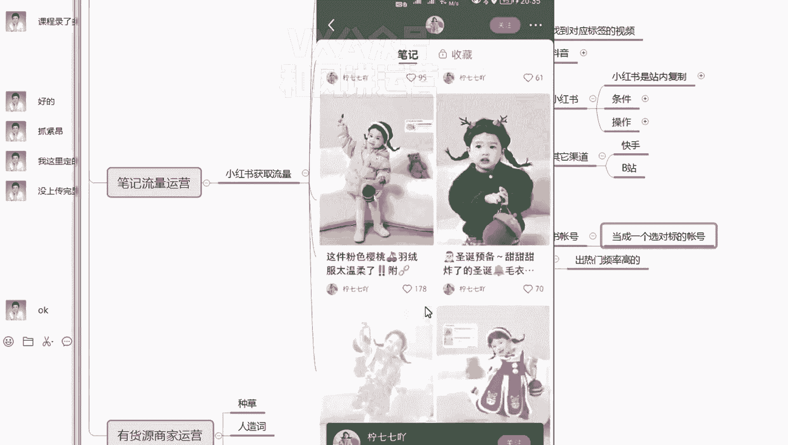
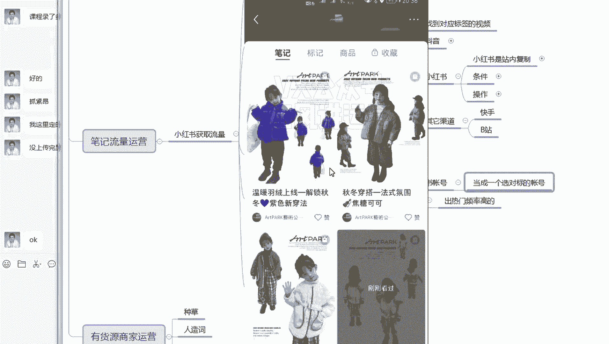

# 【小红书运营】B站最详细的小红书无货源电商实战全流程演示，必爆选品指南，多平台选爆款 - P24：23、小红书笔记流量运营-如何在小红书里找对标及养号 - 乜没sui意 - BV1F1421t75o

那么这节课还有你可以前节课讲了抖音的同行，那么小红书是不是也有同行，因为小红书里面咱们要找图文嘛，主要是做图文，找图文的达人为主图文，然后转成视频，这样效果比较好，那小红书额同理，第一个找账号同理啊。

嗯如果你们有后期出了一个小红书可以筛选的。

大家也可以在呃，在这个嗯在这数据软件去选选小红书的。

如果没有的话，大家直接在小红书里面直接关注就行了，然后小红书的话，我建议大家直接你们那个你们绑定店铺呢，小红书直接就当成你们的嗯，小红书同行，啊绑定店铺的小红书账号。

就是你们开店肯定有一个小红书账号对吧，这个是必须有的，不然开不了店，那么有了之后这个小红书这个绑定绑定店铺，这个这个官方这个小红书账号，你们去当成一个选，当成一个那个这叫啥，选，选对标的账号。

选对标的账号，你们就关注大量的就是这种对标的图文达人嗯，然后是然后是不断的去看这样的对标嗯，就是同比如说你做童装的，童装的这样的一个图文，那么他会一直给你推这样的一个图文。

你看我们这个已经刷成那个对标了吗，给大家演示一下啊。

啊比如说这这是我们那个绑定店铺的吧。

你就你就你一直刷，你看推荐团全是童装呀对吧，全是童装。

然后前期你肯定是养号的时候，你肯定先搜嘛。

搜了多关注一下，然后尽然后尽量是你看如果你关注图文多，他就给你推荐图文多。

带货多的，给你推荐那个带货多一些，你看这图文都很多呀。

这个应该是买家秀，这是买家秀啊，嗯你看这个是种草的。

种草到播出，咱们看一下，看他行不行。

粉丝量7万嗯，7万你看嗯爆赞的几率也挺大的。

这个都完全关注啊，而且很优质呀，你看很优质的啊。

这个是一个非常专业的注册账号，你看这个这个是这个做的是很专业的啊。

而且全是图文啊，关注就关注这种的啊。

这种直接关注就行了啊，直接关注他下面推荐的，你们也可以关注一下啊。

嗯推荐就是呃给这个达人基本上类似的这种啊。

都可以特别关注的时候，推荐你们尽量多点一点啊，因为他们的属性非常相似。

你看你关注完之后，你看他会一直给你推啊，那这个六个六个的我看行不行。

两三千的。

像这种视频的话也可以啊，这个也可以看爆赞的概率。

爆赞的概率不大不大啊。

嗯不大，这个这个账号可以不关注啊，你只是看看他的一个某几个视频就行了。

看这个什么时候童装一看就是专业做的。

爆赞的概率也不大。

也不大啊，再换一个。

哎这个589呃，这个七百九七百九十六，看他是不是主要做图文啊。

是主要做图文的，你看这个爆涨的概率都很大啊，这但是粉丝量高呀。

哦不是哦，粉丝量10万啊，你看这你不管粉丝量吧。

反正这个爆赞的概率大，你看嗯挺多的啊。

这个柠檬不贴这个短视频，不要。

嗯这个一只小企鹅6万。

哎这个你看也挺好啊。

都可以关注啊，关注后关注的时候，如果出来推荐出来推荐11万。

2。1万，大家都可以点一点啊，点点蓝铜的。

这个也可以啊，就大概是嗯理论性的东西都是相通的。

只是有一些平台的不一样，然后是主要他的一个点，第一个主要找图文的达人，如果不是图文，你就看看，如果达人不行的话，是出热门频率不高的话，你就只关注视频，不用关注达人，如果出事出这么个概率高。

你就直接把达人关注了，然后平时他发什么，你就平时多关注一下嘛，他发的东西你感觉能爆，这是有有种感觉的啊，你感觉能报一下，他有这个报的趋势，你大概能有一个判断力，你是你做的做的多了，肯定有这种判断。

你感觉嗯比如说他上午发的，上午都已经有50个赞了，你都你就觉得他一整天应该有百十个赞，没什么问题，那么这个时候你直接抄过来，在他没报之前都直接抄过来，你自己再去发布，再转成那个视频再发布一遍啊。

