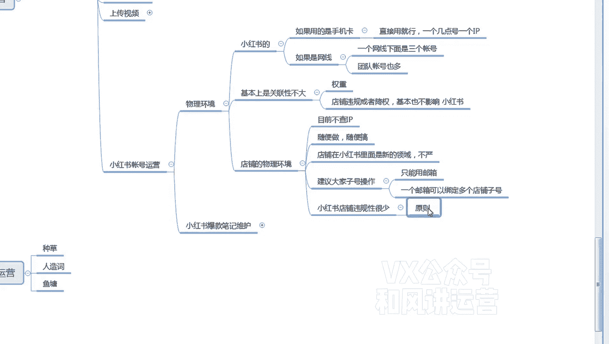
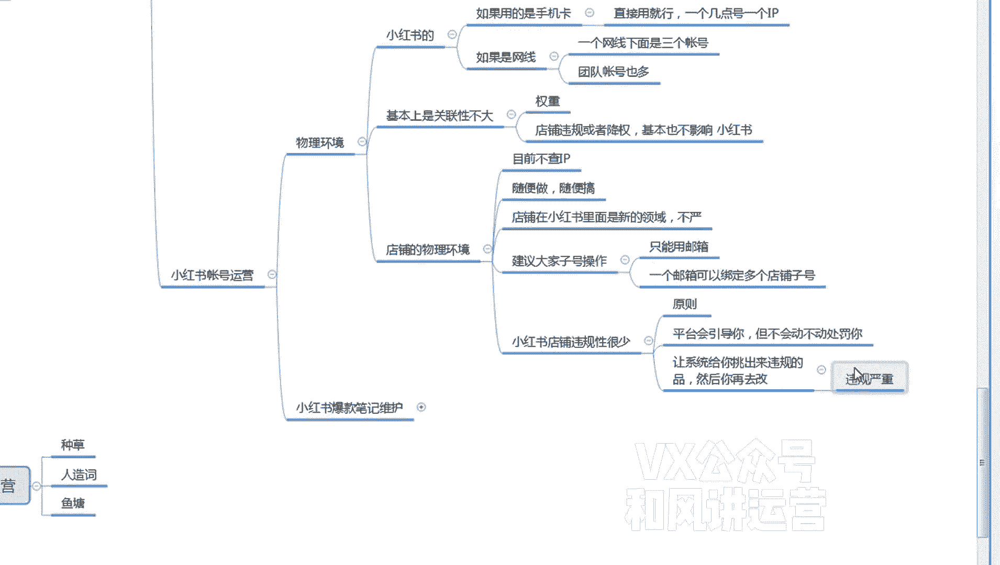

# 【小红书运营】B站最详细的小红书无货源电商实战全流程演示，必爆选品指南，多平台选爆款 - P25：24、小红书笔记流量运营-小红书帐号运营-物理环境 - 乜没sui意 - BV1F1421t75o

好，这节课给大家讲一下小红书这个账号，就是小红书和小红书店铺是分开的啊，小红书账号的一个账号的运营，账号的运营。

第一个大家先看一下物理环境啊，嗯小红书账号的物理环境就是小红书，如果嗯就是小红书的，小红书的物理环境就是如果你是用的网线，网线下面是有有交换机，交换机下面有连着一个一个的那个无线路由器。

这叫用的是WIFI，就是办公室的WIFI，如果WIFI的情况下，就是嗯你不要看一个WIFI连几个账号，因为一个WIIWIFI的他的主IP是一个就是一个网线，只代表一个IP，那一个IP下面是只能嗯。

建议大家不是说只能啊，因为现在我们其实也没有分那么细建设，但是如果你是团队的话，你账号比较多，账号也多，还是分开的，好怕被降权，一个IP下面是三个账号啊，如果个人的话，我觉得无所谓了。

大家大家基本上账号也不多嘛，基本上你手里面两三个够，你用就行了，嘶嗯嗯然后这个如果你网线满足不了，那么你用手机卡，手机卡其实也不费什么流量和抖音一样的，因为你又不直播嘛，只是发发短视频去刷一刷。

咳嗯然后是如果有手机卡的话，就一个手机卡就是连着你的一个IP就行了，就直接嗯用这个小红书，直接用那个呃手机卡的一个一个流量就行了啊，不需要直播，这个流量用的很少，我们测试下来流量用的很少。

然后店铺也有一个物理环境，店铺的物理环境，因为很多人会问我就会不会像淘宝呀，啊像那个抖电一样，有没有没有这种关联和什么东西，我直接告诉大家随便做啊，啊随便做随随便随便搞，目前呃因为小红书的店铺和小红书。

他们是基本上啊是关联性不大啊，就是权重的就在权重方面的关联性不大，你比如说我一个小红书，我非常非常爆啊，但是这个小红书报的权重跟我店铺没什么关系，我不报了，我填店铺该怎么出单还是怎么出单，但是我报了。

如果我带的带的货是我店铺的，那我店铺肯定会好一点，但是小红书本身给我这个店铺的权重加权，没什么加权，而且店铺违规啊，给大家说一下啊，违规或者降权基本基本也不影响小红书嗯，这个嗯这个就是一个逻辑。

就是跟咱们抖店逻辑一样，你看抖店，我的店铺违规了，其实也不会影响到我的绑定的官方的抖音账号，官方抖音账号偶偶尔违规或者是权重比较低，也不会影响我的店铺，所以他们是完全分开的。

是是两个可以说是两个不同的平台啊，嗯所以说店铺是你看店铺的规则，店铺的规则目前就是不查IP，你可以随便搞，而且现在是鼓励商家去多开店啊啊好，所以说这个没关系啊，就多就是几十家店铺。

在一个网线上都没什么关系，嗯建议大家啊，因为你们是团队的话，还是子账号，子账号操作啊，嗯嗯就是没有把你们的员工客服呀分开，然后运营啊，然后是开个子账号子账号呃，目前小红书的子账号是只能用邮箱嗯。

好像手机是用不了的，用邮箱一个邮箱可以，一个邮箱可以绑定啊，多个店铺字号啊。

嗯还要再给大家去同步一个喜讯啊，去小红书店铺违规性很少，再重重申一遍，不是说没有，但是很少就是明摆的，所有的平台都会违规的东西，在小红书里面肯定也不允许啊，像黑五类啊，什么什么大牌的一些售假呀什么东西。

但是比平台其他平台会稍微好一点啊，就是他会他会一个原则啊，它会嗯平台会引导。

引引导你，但不会动，动不动处罚你，嗯这什么意思啊，嗯就是你很多商品，比如说是有一些极限词，有违规词，或者是或者是详情上，或者主图上放了其他平台的logo，它都仅仅提示提示，然后给你下架了，让你去改。

改完之后商家继续卖啊，没有任何事情啊，就是你只要改了就行了，我就是给你引导到正道行，然后你也你不违规，他他也不会说是你今天违规了很多，啪给你来个扣分，也没有这一说，你违规多就违规多呗。

所以说你们去你们前前面讲那个铺货玩法，如果你们铺的情况下呃，尽量还是前期看，那么如果你们真的比较无脑的话，后期看也行，因为现在并没有说我违规多了，我提醒多了，然后他给你来个处罚，目前没有。

它仅仅都是提示啊，所以说你后面的话让系统帮你去看有没有违规。

然后你回过头来再去改啊，这个是不是有点损啊，让系统，给你看嗯，给给你挑出来微微微的品，然后你再去改啊，比你所有的商品看一遍，然后这张看一遍啊，这个要强一点，但是但是这个风险肯定会高一些。

因为这个风险万一你不审查这个，他的违规比较严重。

违规严重，那这个就不合适了啊，这个有可能会扣分啊。

