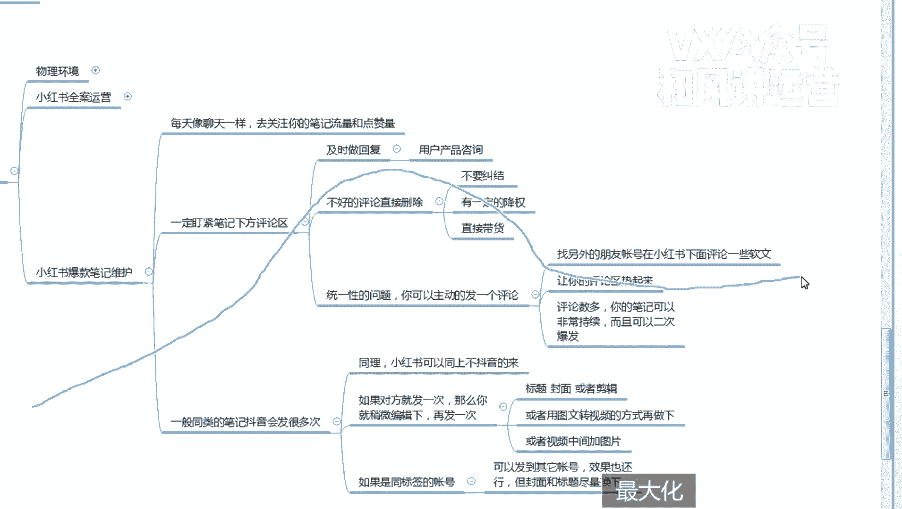

# 【小红书运营】B站最详细的小红书无货源电商实战全流程演示，必爆选品指南，多平台选爆款 - P26：25、小红书笔记流量运营-爆款笔记维护-评论区 - 乜没sui意 - BV1F1421t75o

这节课给大家讲一下小红书爆款笔记的维护嗯，就是如果你一个你一个笔记已经爆了。

爆流量了，怎么怎么样去维护它啊，首先一个原则就是你每天要像聊天一样，要克服聊天一样盯着这个笔记啊，去关注你这个笔记的流量和点赞量嗯，但是也不能说真的像聊天一样啊，我就一天24小时，我就是盯着他。

随时你都没事去刷一下啊，看有没有没事刷一下啊，特别是特别爆的，你要去关注频率高点那种，一般般的一般般的也报就报个一两万这种，那么你就是你就一天就是刷个几次就行了啊，大概看看有没有什么东西嗯。

然后一定盯紧笔记下方的评论区，一定盯紧了，及时做回复，因为我我们的视频报了，会发现他们都在视频里面问什么颜色有没有嗯，然后是哪个哪个码，有没有问身高，什么身高体重，他们直接把这个东西当成一个咨询的。

他们不去给你找你聊天，你知道吧，他们习惯性直接在评论区问问题，所以说小红书这个人们习惯了，他们就喜欢看评评论区，评论区非常重要啊，在不问问题，也只在在评论区呃，然后是因为因为很多人是不习惯在小红书的啊。

店铺里面下单，咱们小红书的店铺基本上在左下角嘛，所以很多人还在问啊，那我在哪去下单，你这直接直接回复说我在左下嗯，就是就是那个笔记下方左下角直接下单即可，然后你再顺带顺带再宣传一下。

你说我们已经加入云飞险啊，可以放心拍就行了，咳嗯就是只及时做做那个用户的回复啊，用户产品的咨询回复啊，然后是不好的评论呃，因为我们报过一个视频嗯，他会他知道这个视频，而且他还说双11直接五折啊。

他说嗯某某店铺，然后是比这个便宜，像这种比对咱们有影响的，直接删除啊，不要纠结啊，因为他对你有嗯。

因为删除笔记下面的评论，其实是有一定的降权啊，你们听好了，因为咱们这个视频不是种草的。

咱们的视频是直接带货的，跟他们不一样，小红书八成的视频是种草的，因为咱们是做无货源，咱们做电商，做电商肯定是我视频要带货呀，待会这个视频直接是个引流工具，你你现在评论是对我有影响的，我可以。

那我商品都没得卖了呀，那我肯定是要去把你删除了，所以这个有一定的降权，降权也没办法，你要把它删了，知道吧，嗯所以这个也一定要注意啊，你直接把评论删了，没关系啊，他因为他要他就明知道你不行。

你这个价格低了，因为肯定会有很多在这个圈呃，这些买家都是比较忠诚的嘛，而且是比较专业，他们都知道哪个店铺卖多少钱，然后这个模特用的谁家的，像这种客户就不是咱们的客户吗，那没关系。

直接删除就行了咳但是如果你不删除的话，你的销量肯定会受受一些影响啊，嗯还有一个就是统一性的问题啊。

这，你可以主动的发一条评论啊，就是你自己也可以给。

在自己的笔记下面发条评论，你甚至可以嗯像咱们刷单一样。

就是刷一个假的，就找你另外的账号啊，找另外的朋友，朋友或者办公室的办公室不能用的多，朋友账号在小红书下面评论一些软文，嗯你比如说是嗯。

你比如说这这这这件衣服好好看呀，嗯就是那个啊想想问一下什么时候发货呀，有没有运费险呀，对就是以提问的口口气让你的评论区火起来啊，去热起来啊，他就像一个微博一样，其实我发现小红书其实有点像微微博。

就是大家嗯嗯你笔记是一个话题啊，带起来一个话题，然后评论区只要有人把这个热度带起来诶，他会他会很多人都愿意评论，因为因为小红书的啊，评论区的那个嗯翻看率是最高的嘛，所以这个这个权重大家还有一个权重啊。

嗯笔记的权重，笔记权重后面后面我们这边也得慢慢去去，那个才在一直去那个探索笔记笔记的权重，其实这其实主图呀，嗯评论评论评论的权重其实变占的比较高的，所以说你让评论区呃。

评论区那个热起来之后，评论数多，你的嗯笔记可以非常持续，而而而且可以二次爆发。

嘶我们有一个童装的笔记，就是这样的，开始没什么评论。

大家都不评，偶尔有些人评了之后，我发现后面的爆发力甚至比前面的多，它不是一下爆发，然后降它是慢慢升起来之后又爆发了啊，这是知道吧，就是呃一般的视频，你看我之前让大家看那个女装的是这样的是吧，啪降了。

对不对，然后是我那个视频是这样的，这样的这样的这样这样的A爆发了，爆发了，然后然后是这样嗯啊就是就这样一个曲线吗，啊然后是这样，因为在这一波在这一波中间这个飙升。

这个这个阶段是因为他出了一些评论。

啊给大家去，因为他出了一些评论嘛，所以这个大家要理解哈。

