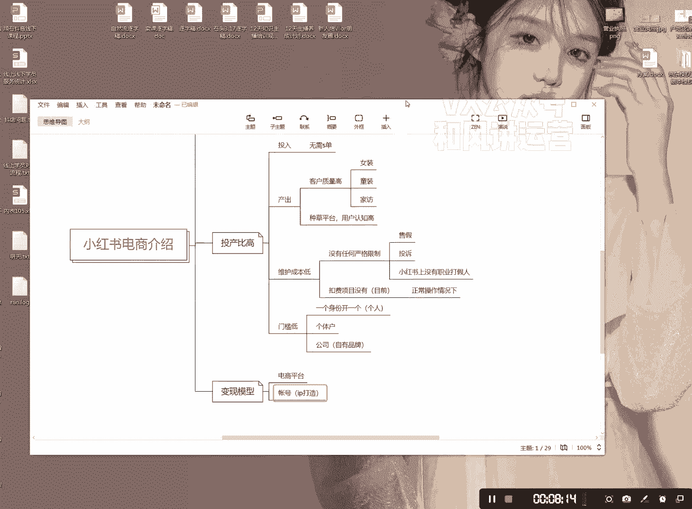
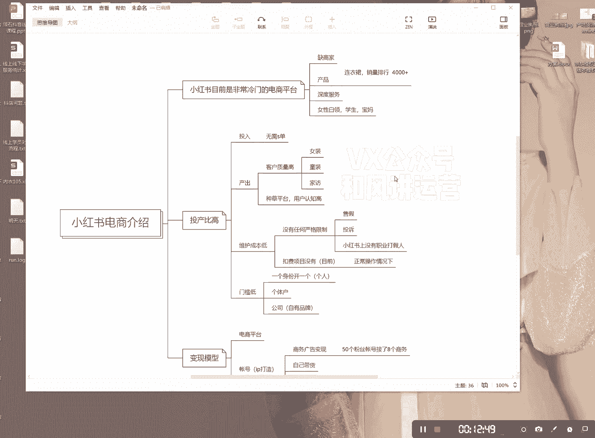

# 【小红书运营】B站最详细的小红书无货源电商实战全流程演示，必爆选品指南，多平台选爆款 - P2：1、小红书电商变现项目介绍 - 乜没sui意 - BV1F1421t75o

大家好，今天给大家分享一下，就是小红书电商啊，以及小红书电商的现在啊，为比如说啊我们为什么会要选择这个项目，好先给大家介绍一下，目前就是小红书啊，小红书目前目前是非常冷门的，啊非常冷门的电商平台。

但是它的流量在流量虽然说是呃，从这个电商的一个角度来说，它是一个冷门的，但是对在于流量平台流量的这个层面上说，它绝对是一线平台，所以呀啊我们这也是我们一个在关注小红书，这个路上。

就是一直比较关注这个点啊，好我先跟他说一下，就是小红书电商目前的一个情况啊，小红书店仓目前来说是有三个特别缺的，缺什么呢，一个是缺商家啊，缺商家还缺什么缺产品啊，然后呢还有一个缺什么呢。

缺深度服务服务啊，你们可以去看一下，小红书商家是特别特别少的，产品也很少啊，这个你们可以去打开小红书首页，然后那里有个产品，比如说你搜索啊，你你们去可以搜索连衣裙好了，然后你们再去看看啊，连询之后。

然后你按那个销量排行，参量排行啊，你们可以去看，你们会发现最多的好像就4000加销量吧，4000加这么大的一个关键词，他最多也就三四千的一个销量，但是你反观一下呃，抖店也好啊，或者是淘宝也好呃。

量完全是不一样的，拼多多更不用说好吧，所以它在流量层面上它是一线电商，但是从产品的角度，从商家的角度，他会他又属于冷门一点，属于二类啊，好这是第一个，第二个是什么呢，小红书目前的投产非常高啊，投产比高。

投产比投产比是什么意思呢，就是两个层面上嘛，一个是投入对吧，一个是产出，他两个一个比啊，并不是说哎我小红书就是嘶呃，比如说你你投入1万块，你挣个2万啊，你这个投产是一比二，如果说你投入十块钱。

你挣了100，这个投产是一比十啊，懂我意思吧，所以这个是投产比的意思啊，好，为什么我说投入这个小红书的投入是非常少的，第一个就是，啊这个是人工操作是不需要的，人工操作是不需要的啊。

然后为什么说这个额产出高呢，它的产出有有几个层面上呢，第一个就是什么呢，就是客户质量非常高，这个是核心啊，这个是这个是这个平台，这个是这个平台的，这个嗯产出高的核心就是在小红书上。

我们我们操作小红书什么的，我们没有卖低价的，我们没有卖低价的，我们服装，比如说像我们有操作了服装，还有目前我给你，我给大家说一下，目前我们操作了有服装呃，就是女装嘛，还有一个就童装啊。

还有一个就是加法啊，因为这三个我们是有供应链的，我们是有自己合作的供应链的啊啊啊，然后我我发现就是比如说女装在在在那个呃，像淘宝抖店的话，我可能只卖几十，但是在小红书上我能卖一两百啊，一两百整整。

他是其就是小红书，他的客单价是其他电商平台的，可以高出一倍，一样卖的出去啊，一样卖的出去啊，因为它本身核心是什么呢，兄弟们核心就是一个啊，就是种草平台啊，额就是用户，这里是用户，我指的是平台。

用户认知高啊，认知高，好这是一个这是一个啊，就是一个产出一个产出，还有什么呢，兄弟们，还有还有吗，还有的就是你们可能不知道啊，因为我们自己是自己在做了很多店的，我们自己做了几十家店，好。

目前来说就是第三个，还有就是什么呢，维护成本极低，维护成本非常低，因为什么呢，他没有没有任何严格的限制，就比如说你要上什么品，你的品合不合格，他会在直接上架的时候，就会直接跟你说。

你这个产品合不合不合格，就就会不让你上，能只要合格上了这个产品就不会出现任何问题，什么，比如说呃什么这个不知道能不能说啊，一个是这个啊，这个是不会的，第二个是什么头，投诉投诉也不会有，投诉也不会有啊。

很少，当然投诉的话呢，只如果说你不是什么呃品牌的话呢，那基本上就不会有任何投诉，而且，小红书上是没有这个的啊，小红书上是没有这个的啊，这第一个第二个是什么呢，就是目前啊在小红书上啊，是没有这个项目的。

就是明确规则里面是没有这个的啊，就是我们比如说在做其他平台，像诶想着诶我上这个品会不会被投诉啊，会不会被打假，会不会怎么怎么样的，这个如果说店铺被封了，会不会怎么样啊，小红书上面目前是没有了。

我们这边啊，就是如果你只当然哈你不要恶意去上啊，比如说你这个是耐不是耐克的，你非要提前跟耐克上去啊，你你你不要恶意，这样的，我是说大家在正常操作情况下，这个有个前提啊，就是在正常操作情况下。

基本上是没有的，基本上是没有啦啊，所以大家这个一定要弄，一定要弄好好，第三个还有什么呢啊门槛低啊，目前来说啊，目前就是以一个身份证拍一个啊，这个是个人的啊，很多人说哎我我我做个兼职。

我个人开个店行不行行啊，行可以的，那还有人说哎，我本身就是之前就是做无货源开店的，或者说我我这边呃团队比较大啊，我多开店行不行，可以啊，个体户公司，个体户公司的话呢，公司就是你自己有品牌的自有品牌。

啊自有品牌兄弟们，如果说你们自有品牌，你们在小红书上种草是超级牛逼的啊，超级厉害的啊，很多就是你们你们其实可以看到很多产品，很多品牌都是在小红书上种草打包的啊，啊这个我就不多说了，这个我就不多说了。

然后额违规这一块的话呢，就基本上是没有的啊，这这这个说实话，很多人在担心这个会不会出现什么问题，不会啊，然后第三个是什么呢，就是变现模型，啊边界模型，边界模型，一个就是我们上上面的一个电商平台嘛。

就是我们做第二个就是什么呢，账号IP打造好啊，还有人就说哎我我在小红书上做这个，我跟你讲啊，小红书上做这个，绝对是要比在抖音上要简单的啊，因为抖音上有太多就是抖音。

当然抖为什么很多人在抖音上在抖音上呢，因为抖音的它的放量非常大，小红书的放量会小一些，但是它会稳步增长，小红书是一个比较稳的平台啊，抖音是快打快收的，就是你很可能一夜爆红额涨了几百万，粉丝。

上千万粉丝迅速变现，但是呃过一段时间又没落，小红书不一样啊，你你你你很有可能一你在小红书上的爆红，就可能就是涨了几万粉丝，然后呢每天涨每天涨每天涨，你的账号收益会不断的增，不会不断的增加，不断的增加。

这属于一个复利比较好的一个平台啊，我跟你讲，目前我们IP上也有做啊，我们IP上一个就是商务广告，商务广告变现，我跟你讲这个我们做了一个啊50个粉丝，50个粉丝的账号，50个粉丝的账号接了八个啊。

接了八个商务，这个是我们做我们自己做的啊，我们自己做的，这个到时候我会跟大家分享一下，我们那个是怎么做的啊，大概是挣了有400块钱吧，当然这个商务比较小啊，我们只是测试诶。

发现50个粉丝就能就是就能接商务啊，确实是啊，呃在抖音上是不可能的这种事儿啊，这是第一个，第二个就是什么呢，自己带货啊，因为我们也有自己的主播嘛，但是小红书上的自己带货，他会比抖音啊会弱很多。

因为他他的直播间可能在线就五六个人啊，五六个人会比较少，人会比较少，但是我我可以跟大家说啊，如果说你能够坚持你你能够坚持，你能够自己做的话呢，自己带货是非常OK的，他跟小红书上的五六个人在线。

跟抖音上五六个人在线是完全不同的概念，你呃我们自己用自己的主播带了两场啊，一场的话是卖了2000，一场卖了4000把啊，卖了两场只卖了两场，直直播间旧啊，二三十个人在线，最多的时候就二三十个人。

峰值就二三十个人，然后也不用去什么大喊大叫的，就很平常的给大家介绍，就我这个产品怎么怎么样的，就坐着主播就坐着播一个小时啊，但是这个的话呢可能对你的这个嗯，产品的话会有一些要求啊，产品的话就有要求。

这个我到时候也会讲啊，还有一个就是什么呢，就是呃知识付费啊，知识付费你们可以去看一下，目前小红书上有很多呃，围绕着它本身的人群去做知识付费，比如说我说一个修图的啊，修图培训是最多最多的。

还有一个叫什么副业啊，比如说像我们这个也算是一个副业吧，啊副业培训也是最多最多的，就他其实是他其实啊那个他不会去呃，有很大的那个呃特别是呃修图啊，这这这种都是很稀松平常的很稀松平常的呃。

慢慢发慢慢积累啊，因为为什么这种东西是能做，但是不能做大的啊，你说呃你说做那种，比如说我要开个什么加盟店，但在小红书上有点有点啊，因为什么呢，就是小红跟人群有关系，小红书他的人群本身啊。

小红书他的人群是什么样的呢，兄弟们，第一个女性为主，就准确来说是女性白领，啊学生这类人群为主啊，还有什么宝妈啊，这类人群人群为主啊，他不是什么诶，我在里面创业的深度创业的那种很少啊很少。

所以我们要围绕着这个平台的人群啊，做好再给大家说一个很有意思的事，两个事，一个就是我有个朋友啊，他房子装修他真的是看小红书，装的是一个，他是一个他跟我讲，他是一个非常呃深度的用户啊。

沉迷用户就是小红书上会，比如说你看了一个绿植，小红书上他会给你推送很多，就是你这个人群相关的东西，绿植啊，然后啊我看我去他家看了一下，装的还可以啊，还有一个就是什么呢，就是我经常刷小红书啊。

看到很多美女就我经常会关注，然后我发现很多美女，就很多博主就他就直接把我拉黑了。

为什么呢，他在他在首页上就写了啊，男粉不要关注关注，直接拉黑啊。

