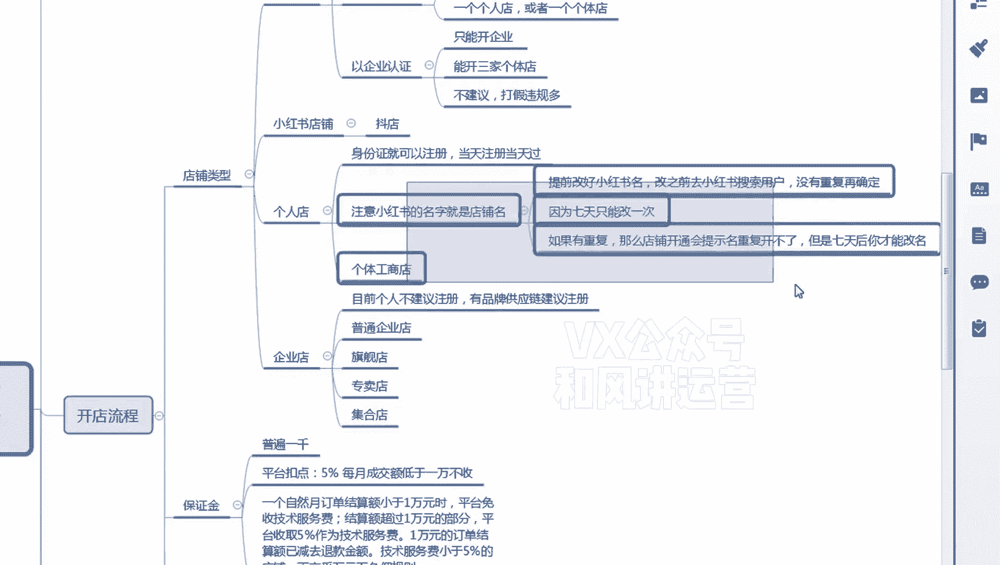
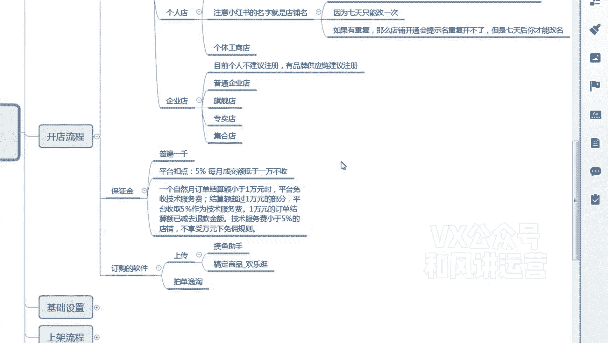
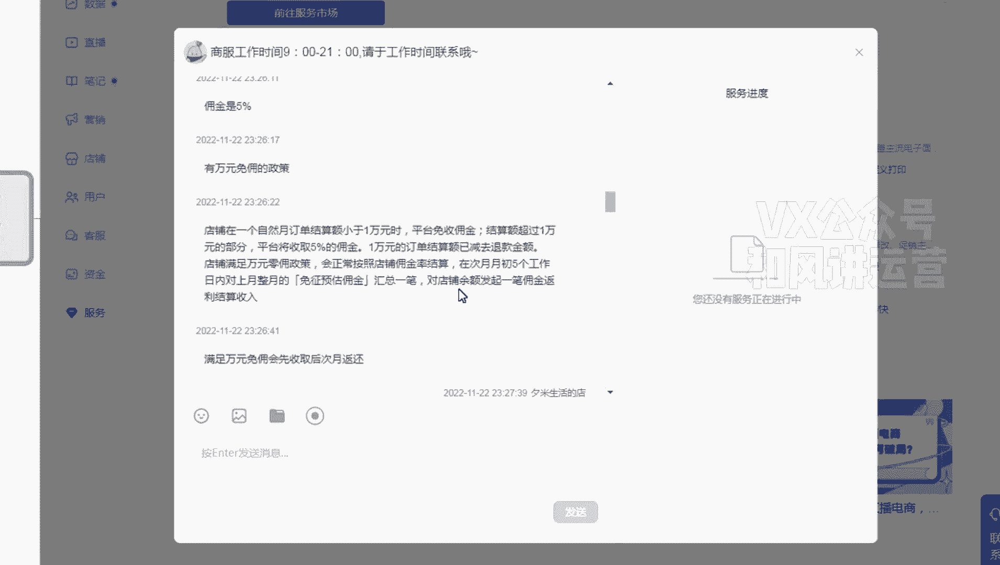
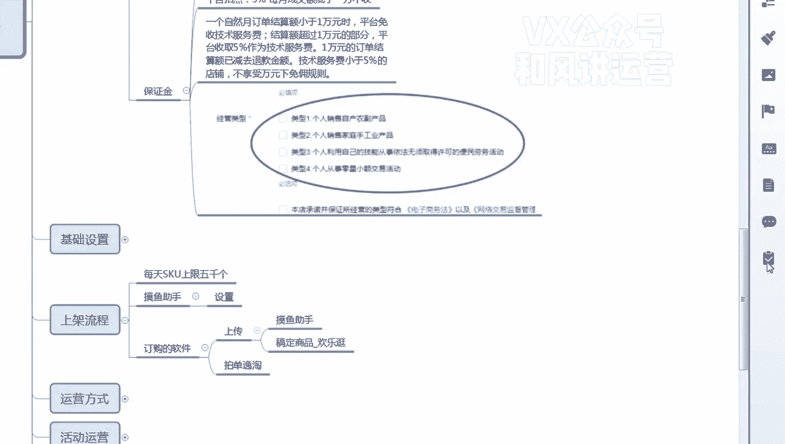

# 【小红书运营】B站最详细的小红书无货源电商实战全流程演示，必爆选品指南，多平台选爆款 - P3：2、小红书入驻流程和注意事项 - 乜没sui意 - BV1F1421t75o

大家好，这节课给大家讲那个小红书的一个开店流程啊，呃首先讲之前给大家去捋一下，捋一下两个名词，第一个是专业号啊，第一个小红书店铺啊，专业号和小红书店铺嗯，嗯小红书店铺相当于相当于额咱们知道的抖店。

对不对，那专业号相当于抖音的是蓝V认证啊，抖音的蓝V认证，嗯嗯这是这是两个类比嘛，类比就是咱们在注册之前要去呃，如果你是以你，如果你是用你的小红书去直接注册店铺的话，你要把你小红书做一个认证对吧。

他可以是以个人的身份证为主体去认证，也可以是企业的主体去认证，如果你是以个人的主体去认证的话，只能开一家店铺，那么个人分2222种嘛，第一个是个人店，第一个是个体工商户，企业制造的个体店。

但是你不管是个人还是个体，你只能开一家，只能选择一种啊啊这而且只能开一家，但是如果你是你企业认证的话，比如说你是呃个体工商户呃，不比，比如说你的小红书的认证主体是个体工商户，那么你只能开三家店。

而且这三家店呃，而且你开了这三家店，你就不能开个人店，因为你的小红书的认证主体，已经升级为呃企业认证了，因为个体工商户他也属于企业嘛，所以说只能开三家啊，嗯但是目前的话。

嗯目前的话你们呃如果是个人操作哈，不是不是工厂品牌这一类的，我建议大家都先开个人店，因为现在个人店的额管控不是太严啊，后面研了之后，大家再升级嘛，再开个体，但是现在能开个人还是先开个人。

而且个人和个体嗯基本上没什么区别啊，没有什么流量的和权重的一些的一些清闲啊，因为个人店他主体是个人，没什么那些天天什么打假的什么东西啊，这种都不存在了啊，嗯额那么给大家说一下个人店。

个人店的认证主体就是身份证就可以注册了，当天对我们现在是当天注册，当天过啊，就很快的秒过嗯，然后是这里面注册的时候有一个注意事项，就是你注册小红书的名字，就是店铺名，比如说你小红书的名字是张三。

那么你通过小红书注册下来店铺之后，他就叫张三的店铺，这里面主要给大家说一下啊，嗯就是如果你们在注册玩小红书，在通过小红书注册店铺的时候，小红书的全称的名的全称就是店铺名。

然后后面加的店铺张三就是张三的店铺，小红书是张三，那么变店铺名就是张三的店铺呃，而且这个小红书的名是七天只能改一次，对不对，所以说你嗯但是店铺名又是唯一的是吧，因为是因为都是什么什么的店铺。

那所以说如果你店铺名重复，在你最后一步确认的时候，它会提示你店铺名重复让你去改，但是你又改不了呀，因为店铺名是跟着小红书来的，所以这个时候建议大家嗯在改小红书名的时候。

你去搜一下小红书的用户有没有重复的，跟你名一模一样的，如果有，你把它改过来，如果没有，你就用，那么改完确认完之后，你再去店铺那里面，因为店铺是自动抓取小红书的名啊，所以这个大家要注意一下啊。

要不然的话你当天开不了，你要等到七天才能开啊，这个就是比较浪费时间啊，这是一个坑啊，大家避避一下啊。

啊个体工商户是同理啊，然后企业店的话，目前是个人不建议注册啊，因为呃个人的话，因为他背后是就是一个身份证嘛，所以说他没有动不动或是那些职业打假去打，去打假啊或者干嘛的，所以这个不建议大家去注册啊。

但是如果你是品牌供应链，我建议还是注册那个旗舰店或者专卖店啊，那个普通企业和集客电池都可以啊，咳额保证金方面就是普遍80%都是1000，而且是呃他不看你的，目前是不看你的那个执照的经营范围啊。

就是不是不是太卡啊，大多数都不卡的，是个别会卡你那个执照的经营范围，基本上你稍微提一下，都基本上这是八八成的类目都能过，现在注册属于开放阶段啊，然后平台的扣点是五个点。

五个点就是每个月的成交额低于1万嗯，低于1万不收，然后超过1万，然后才是超过1万才。

然后才收呃，然后是大家看一下这个啊，就店铺在一个资源月订单结算额小于1万，是平台免收佣金，这个免收佣金呃，你们在卖的时候可能会比较纠结啊，因为我没没卖到1万，为什么也收了，他是先收后退啊，大家听好了。

结算额超过1万元的部分，平台收取5%的佣金，比如说今你这个月卖了1万5，你只需要付这5000块钱，这一部分的5%的佣金就可以了，不是付1万5的5%的佣金，所以说这个呃就代表平台其实现在急需要。

就是非常希望咱们去入驻店铺啊，所以现在是一个开放开放阶段，咳，嗯然后是你看这个啊是先收收完之后我再退啊。

这个大家去看一下，具体的那个具体小红书的一个入驻的一个网址，还有电脑端的一个入驻网址呃，在咱们那个呃课程那个云盘里面都有啊，这个我就不具体演示了，因为比较简单嗯在这个入住的里面有一个选项。

可能官方是没有提的，我这个给大家去讲一下啊，嗯就是你们在注册完之后，有那个店铺要公示信息，你才能上传产品吗，会会有这样一个提示呃，当那个经营类型的时候，我这个是12344个选项，大家都要去勾选。

这个很多人不知道啊。

