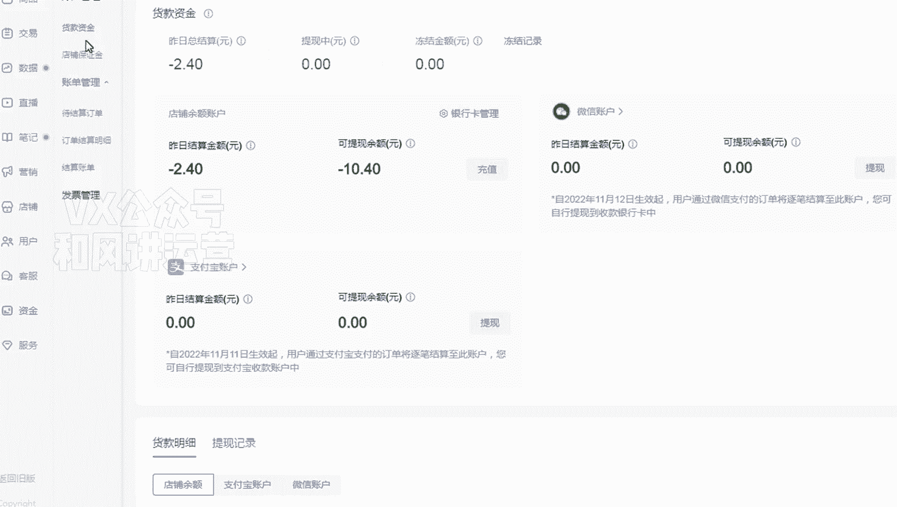

# 【小红书运营】B站最详细的小红书无货源电商实战全流程演示，必爆选品指南，多平台选爆款 - P4：3、店铺后台基础设置 - 乜没sui意 - BV1F1421t75o

嗯大家好，这节课给大家讲那个小红书开完店之后，店铺后台的一个基础的一个设置啊，首先是保证金嗯，店铺开完之后，你必须要是交保证金的啊。

额保证金的一个路径，就是咱们在店铺的一个首页呃，店铺商家管理的一个首页点资金，资金有一个呃。

有一个店铺保证金，点这个就可以了啊，然后点充值啊，充值基本上80%的类目都是呃。

1000块钱啊，这个大家可以自己去看一下啊，嗯一般个体店和工商店的话。

基本上都是1000块钱嗯。

看基本上个体和个体个体工商都是1000块钱啊。

大部分啊有个别的是1万2万的还是比较少啊，80%都是1000。

所以说这个还是比较低的啊，而且大多数类目都是不需要就直接发布。

是不需要开通的，直接发布就行了。

呃第一步是咱们要做支付方式啊，啊支付方式是在这个呃。

嗯咱们点那个货还资金，货款资金里面这里面有一些支付方式，有一个微信和一个支付宝的呃，这个跟斗电非常相似相似啊，呃那么如果你的你开店的主体啊，是你的，就是你开店主体和你的嗯。

就是你你的支付宝账户和微信账户的主体，就必须给你的开店主体是一一对应的啊，那支付宝的话当天你直接去呃认证就行了，微信的话呃，它是要隔一天，你当天可以去认证，然后是第一天认证，他要审核，审核完之后。

一般是在第二天隔天的，隔天你要签约，这个时候微信才正式生效啊，就是我这个大家容易犯错啊，就是我这边就是我们我们公司一个运营，也是就是他店铺都卖了好几千了，突然发现微信还没开通。

这个很影响顾客的一个付款啊，所以这个这个大家注意一下呃。

第三个运费险，而且是运费险，我建议大家要开通。

因为呃咱们基本上小红书的非标的那个嗯，产品比较多，非标的产品的话，大家其实都是比较纠结运费险这个东西的，我们卖的过程当中，很多人就会在评论区直接问啊，如果你个笔记报的话，他就直接问你有没有运费险。

然后直接评论优惠运费险，他们的转化率会很高啊，所以运费险建议大家开起来咳，嗯后台的一个设置啊，我一个地址的设置和运费模板的一个设置。

给大家演示一下，额大家点击这个呃交易有一个物流工具，物流工具大家可以那个这这是电话吗，啊联系人，然后电话，我建议大家把发货地址和退货地址分开啊，啊发货地址，比如说是张三，然后是电话，然后是详细地址。

大家看好，可以是你当地的，没关系啊，就是一个国内的一个地址啊，然后是呃退货地址，退货地址。

因为有一个细节大家注意一下啊，就是因为嗯咱们的产品肯定是要，肯定是那个有一个条件是7。5理由啊，七天无理由就是顾客可以七天无理由退换货嘛，对不对，但是你一旦就七天无理由之后。

就是他只要顾客申请申请的理由，也是七天无理由退换货，它会自动同意，而且自动用你的默认退货地址，去同意顾客的一个退换货，那这个时候很坑了，如果你留的地址是真实的，他直接退你这。

但是咱们如果是做无货源的情况下啊，其实你是要发给厂家的。

所以这个不合理，那么建议就是退货地址，你看我这样写啊，具体地址一定联系客服发你正确地址，你看我怎么编辑的啊，我是这样嗯，我写一个中国台湾，具体地址一定联系客服发你正确地址啊，就这样确定就可以了啊。

然后是发货地址是国内的，然后是这个是如果是台湾后面会出现问题的话，那么你就离你就用那个新疆西藏呀，就这些比较偏远的，然后就在这个目前呃这个嗯，这个这个默认选择七天无理由默认退货地址，这个无法解决啊。

我们跟客服沟通过，目前只能是这种方案啊。

大家注意一下嗯，然后运费模板额运费模板。

运费模板大家是在这里面选择啊，然后是基本上选择一个，非偏远地区包邮模板就可以了，这些这个大家可以建很多个，当你咱们在复制商品上架的时候，会选择你默认的选择你这个编辑的一个模板，这个大家自己去选就行了啊。

嗯然后还有一个刚说的一个运费险。

运费险是在这里面，他的名不叫运费险。

叫运费保，然后是小红书的一个运费的一个规则，这第一个就是大家看一下啊，他跟其他平台有点不一样，他是如果上门取件的话，可以最高最高是二十二十元吗，如果你自行寄回，就他线下自己寄回的话。

嗯小红书这边有一个纠纷纠纷一个避免啊，就是他所有的就只给你补七元哦，我我我不管你是什么快递，顺丰什么东西，我就给你补七元啊，这是这个运费保的一个费用问题啊，额那么当这些全部做完之后。

你的店铺就是正式开通了。

就可以是可以上传产品。

