# 【小红书运营】B站最详细的小红书无货源电商实战全流程演示，必爆选品指南，多平台选爆款 - P5：4、小红书上架流程实操 - 乜没sui意 - BV1F1421t75o

呃大家好，这节课给大家讲那个小红书的一个上架流程啊，啊就咱们怎么样把其他平台的商品，然后是搬到自己的一个平台啊，呃这个要用到一些一键搬家的一个软件，然后小红书里面也有这种成熟的软件啊。

嗯首先先给大家提一个醒，小红书嗯提个名词啊，名词，第一个是SPU和SQU啊，呃SPU你可以理解成呃理解成一个款，一一个款就一个链接一个款嘛啊，Squ，你可以理解成一个款里面。

不同的颜色属性组成的最小单位啊，比如说一个颜色啊，一个一件衣服有红有有白色，有黑色啊，那么每一个颜色有三个尺码，那么它的SKU是两个，二三得六，是六个SKU，但是这个款只是只有一个款，对不对。

他是一个款，大家理解SPU和SQU啊，那么小红书每天啊，它限制店铺上传的SQU上限是5000个，这个大家理解一下，如果你们玩铺货的情况下，这个可能一天也就是上个额两三百个吧，一天上两三百个。

如果你是做那个非标类比较多，就是他SKU比较多的情况下，一天也就两三百个款啊，这个大家注意一下，然后咱们用的软件目前是呃两个嗯，目前是两个两个软件，第一个是摸鱼助手，第一个是欢乐挂，我就是挑一个软件。

这这这些软件都大同小异啊，我挑一个软件给大家演示一下，看后台怎么去设置啊，额首先咱们咱们进入后台有一个服务服务，有一个服务市场，咱们点服务市场有点击前往服务市场，咱们先去有一个一键搬家嘛，点一键搬家先。

嗯我们我们用的比较顺手的第一个欢乐矿啊，嗯欢乐矿咱们去去注册一下啊，点击它都有一个免费的周期啊。

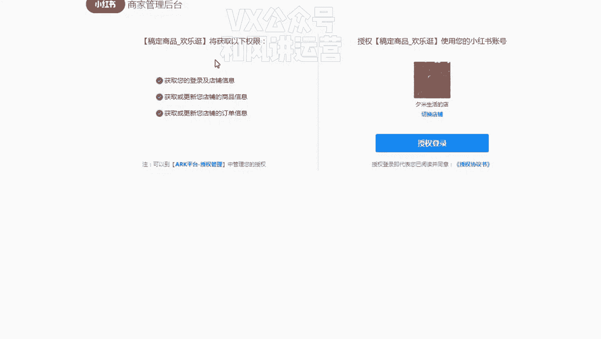

这个是欢乐冠，好像是免费的啊，是免费试用一周啊。

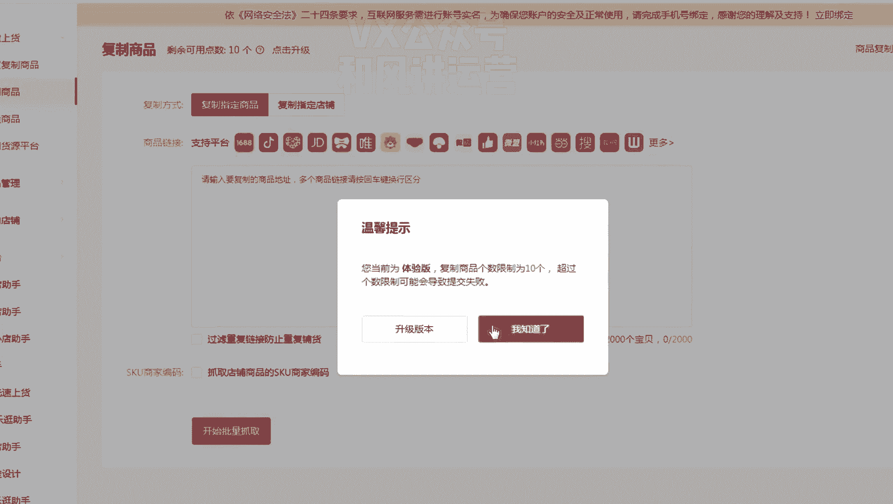

嗯啊免费试用之后只能复制十个，咱们去试一下啊，嗯然后是嗯你已经订购的是在我的服务里边啊，咱们直接点击试用去使用就行了啊，然后这里面如果复制的会有复制结果啊，咱们去选一些复制的结果。

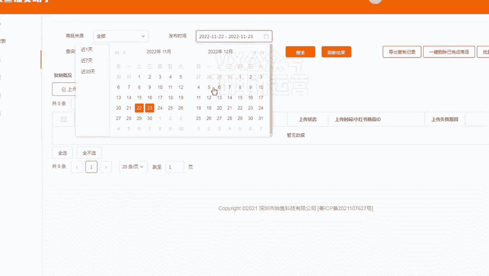

额我复制了一个多多的一个商品哦。

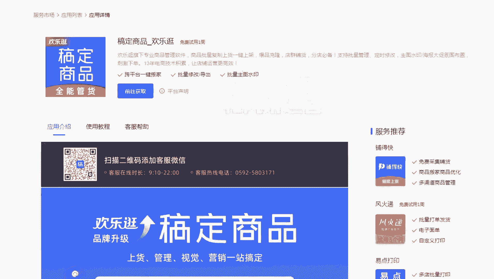

复制进去复制进去之后嗯，专用通道啊，抓取sq，这个都选上，嗯额使用原标题就可以了，使用那个商品的额商品的那个呃商家编码啊，后面的话我会给大家提供一个黑名单，你们再去过滤啊，嗯第一章主图不处理。

然后这些所有的东西都不建议大家处理，但是那个详情图嗯，详情图过滤啊，因为多多里面一般会多一个多多的一个广告啊，广告介绍呃，我我建议大家不过滤第一章啊，你们自己去上传完之后，软件复制完之后再回到编辑里面。

看他有没有这个广告，如果有你在删除，因为你去嗯搬运多多的话，你带多多的这个肯定会违规的啊，所以说这个大家人工审核不要用软件了，因为软件你一旦过滤之后，你第一张海报是没有的。

有时候第一张海报能增加你的商品的一个，转化率啊，然后价格我们一般是两倍上传啊，如果你是低客单的话，因为我们目前做的都是嗯，都是那个大几十或者上百的啊，基本上都是大几十块钱的，所以说我们直接是200啊。

如果你是做的是呃十几块钱的，几十块钱的这种东西，你尽量加个三回，加个五，不然的话就是你的利润太低了啊，如果你是大几十，就是四十三五十块钱的这种，你直接两倍或者是加个三也行啊。

这个看大家一个怎么去算这个账，咳啧嗯这些都不变啊，这些都不变，运费模板就选你那个非偏远包邮就行了，物流物流方案就是就是你选那个，也也选你刚才建立的啊，然后这个发货时间啊，就是我们会选相对时间。

也我因为这个小红书来说还是比较友好的，呃他嗯他可以选择相互相相对时间，但其他平台比如说抖店，他只有24小时，48小时，其他都预售了，所以这个三天内发货，我觉得我我我们目前都是三天内发货啊。

这样就是即便你觉得多多的呃，多多的的那个你嗯产品比较差，你想去淘系那边去发货也没关系，因为淘系那边发货不是有时候嗯反应比较慢嘛，那因为你是三天内发货，所以这个也也不受什么影响啊，然后这个否先不要上架。

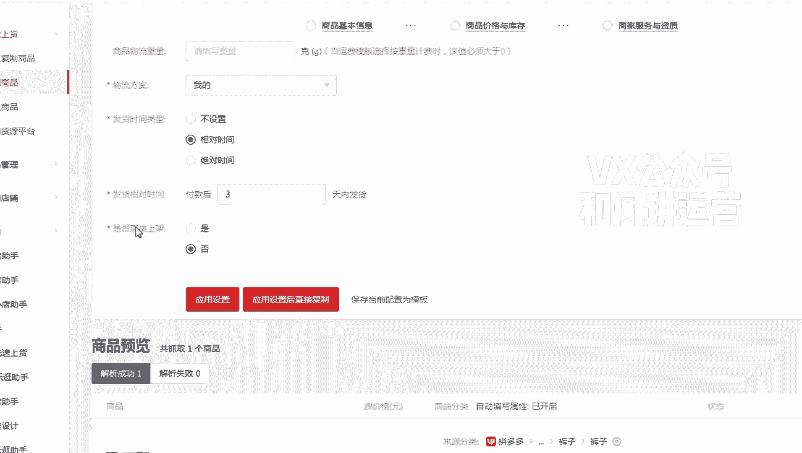

你先审核完之后再上架，然后保存当前配置模板，可以配置一个日期嘛，嗯配置完之后嗯应用设置啊。

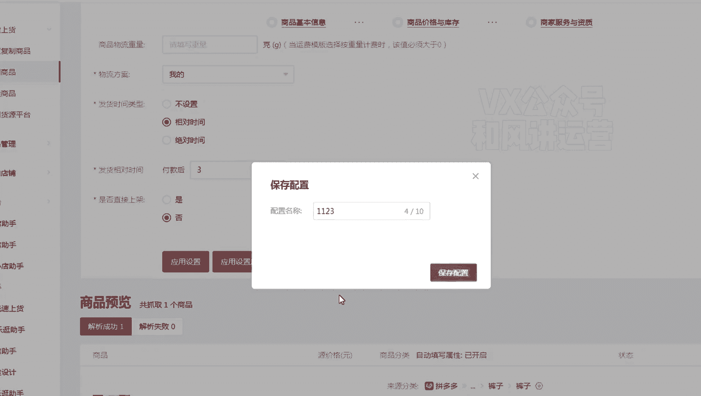

应用设置你都可以直接去啊，开始上货了啊，嗯然后是嗯当复制完之后啊。

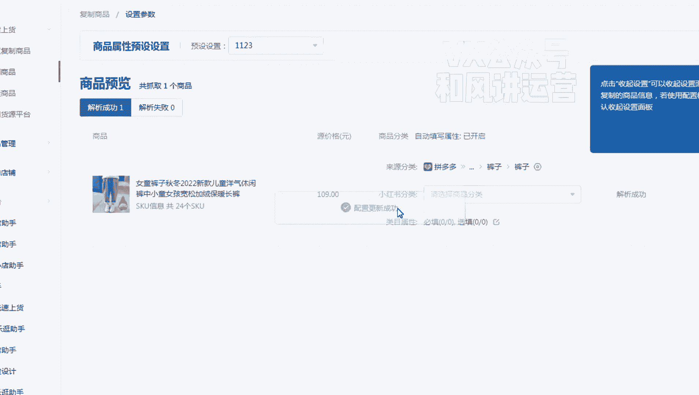

你去看这是裤子嘛，你先把类目去去看好吗，这不裤子是裤子，这这是个裤子吗，来源分类是啊，多多里面是裤子，那么小红书里面分类，你也去选一条裤子，服饰鞋包呃呃不是腐蚀细胞母婴啊，这是个童装，童装有一个。

儿童裤子啊，儿童裤子啊，当你这样选择之后以后，只要是拼多多里面的裤子，儿童裤子它会自动的就分类到额，分类到这个里面了，这个所以说对大家比较方便啊，我也建议大家去先用这个软件比较好。

然后这里面的分类啊就直接保存大概看一下啊，嗯比较打星号的，大家必须自己去看一下啊，春秋春秋呃，这个选个冬季吧，冬季嗯这样比较经济一点，图案格子袖长嗯，儿童裤子裤子没有没有修长嗯这个不选啊。

菱形不选休闲嗯，就休闲吧啊记住并应用到相应分类啊。

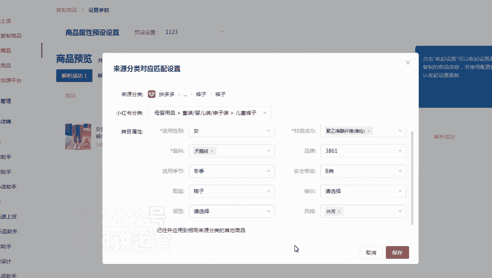

然后保存这个，下一次如果多多是这个类目，它会自动分类啊，就是方便大家去以后上货比较方便，然后直接开始上货，嗯上完货之后大家去看一下啊，看一下之后可以编辑一下，到后台编辑啊，啊编辑去看一下标题有没有违规。

有没有极限词，这第一个啊，第一个就是啊看一下主图。

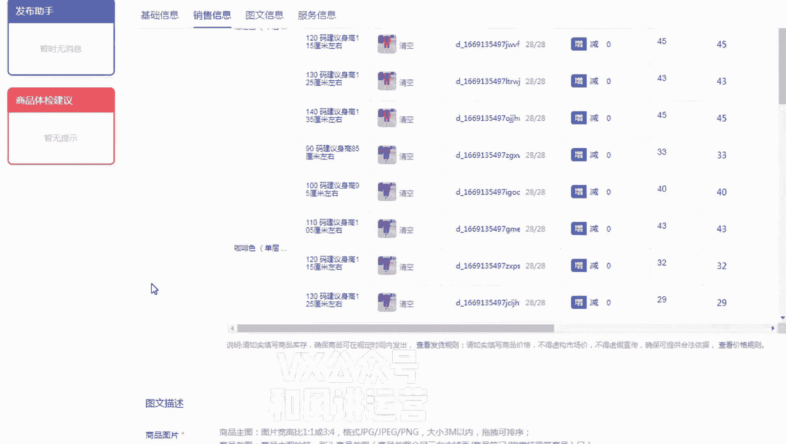

主图有没有什么logo什么东西的啊，然后看一下详情。

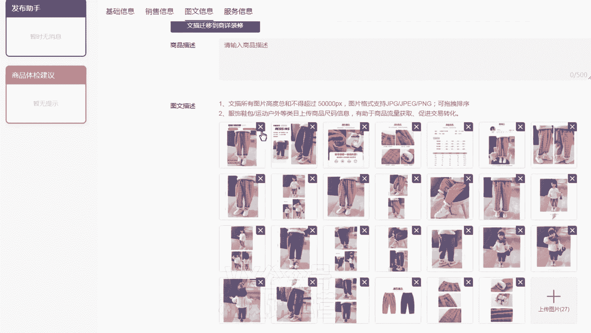

特别看一下详情，可以点开，如果有多多或者品牌的任何东西或者有网址，大家一定要删除或者P掉啊，这个大家注意一下啊，然后没有问题就提交，额提交完之后你要上架嗯，你要上架，然后选中这个商品。

然后批量上架就可以了啊，啊上架成功，这个所有的流程已经成功了啊，嗯这里面需要注意的就是，第一个你们上架的时候要看那个标题，极限词和品牌词，嗯第一个你们要看那个主图和详情的广告。

这种图片不行就删除或者PS，还有一个就是属性属性大概看一下嘛，属性尽量匹配，因为软件匹配的并不是非常正确，你人工也要看一下啊，不合适，你们改过来吗，就像刚刚那个啊，如果现在应季的话，因为它是加绒的。

我觉得冬季会更合适一点啊。

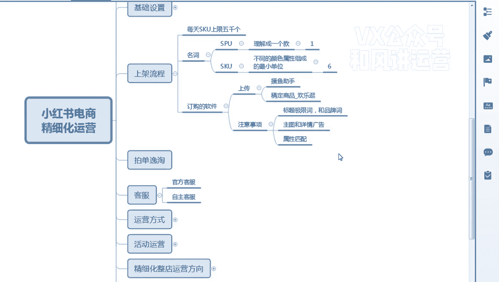