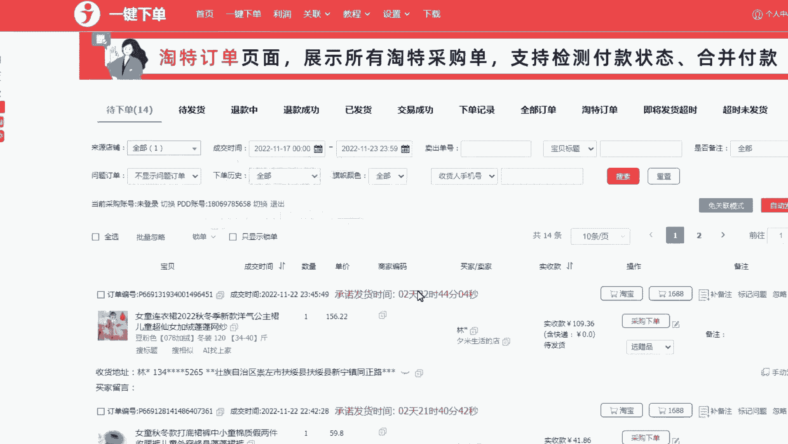

# 【小红书运营】B站最详细的小红书无货源电商实战全流程演示，必爆选品指南，多平台选爆款 - P6：5、小红书拍单软件实操 - 乜没sui意 - BV1F1421t75o

大家好啊，这节课给大家讲那个拍单软件的一个使用啊，拍单软件我目前是就是用的服务市场的一淘啊，后面的话我们会再同步一些，我们自己合作开发的一些软件，因为一淘的话它有些功能可能也不是很完善。

如果咱们单量比较大的情况下啊，呃暂时的大家先用一淘啊，我目前就是我接下来给大家实操一下，一淘是怎么样去使用的啊，嗯咱们先打开咱们店铺店服务呃，但是开始我这已经定了啊，如果没订的话。

你们还是去服务市场去前往服务市场去订购，订购完了之后就在我的服务里面去找，然后找到一淘去使用，授权嗯，我这个是已经设置和订购了的，如果没有的话，建议大家去点这个菜单栏，就最顶头这个点教程有一个图文教程。

图文教程呃，就是就是订购和安装插件，这个我不再演示了，因为非常简单，这个他们教程说的很详细，把这个所有的流程一步一步手把手，几乎是手把手来全部给你们教一遍啊，所以这个嗯比如说怎么下载插件，怎么安装啊。

怎么登录，怎么店铺登录，怎么小号登录，怎么多店铺管理，什么利润统计啊，什么东西所单呀，这些东西全部有啊，非常非常相信这个，我没必要再给大家说一遍啊，你们直接去啊看这个官方的一个教程就行了。

而且官方的教程有不懂的，直接问这个软件的客服，他们会嗯很专业的给你们做一个回答啊，我只是给大家去呃演示，加上大家拍单日常的一个注意事项啊，你比如说这是我们今天的一个店铺啊。

嗯啊刷新一下啊，今天啊嘘嗯排单之前。

你账号所有的都要登登录成功啊，比如说我点击这个采购下单啊。

当然这个上家的地址，你看这个商家地址，我是多多的，多多的话，你就直接在复制多多的链接。

然后打上勾，打上对号，这也要保存啊，然后就保存成功了，然后去下单去下单啊。

然后是花灰色加绒，130。

嗯这个地址没有同步过来啊，呃地址没有同步过来，额这这个我我这个多多号。

那个可能是受受限了啊，地址没有自动同步，然后是正常，大家的都会自动同步啊，嗯没有自动同步，我就自己去复制一下。

广西。

啊手动改完之后，那个大家看一下利润啊，就这个利润是百分之将近30%啊，大家点支付就可以了，额然后拍单这个流程比较简单啊，如果大家之前做过其他的一些电商平台的话啊，这个就是很熟练的，因为软件都是通用的啊。

嗯然后你卖出卖出去订单的话，嗯如果你想你拍完的单，你的标的旗不一样，一般我们习惯使用性的是标红旗，有时候有些人是标那个绿旗都可以啊，就是你拍过之后，它会自动标一个旗，然后你你们订单备注的内容里面。

采购金额呀，利润呀，显示上架啊，这个看到看你们自己的一个需求，有时候你们想显示利润就显示利润啊，啊然后是备注在软件内和店铺后台，这个也是看大家的一个啊一个一个选择啊，嗯然后是选完之后。

然后在后台就会直接显示，你们你们这些备注的内容啊，啊就比如说我刚才拍的一单，拍的一单，你看在这里面就会备注，我拍的一单的一个标个红旗，然后是这一单的账号，派单账号，还有一个订单号，方便大家去查询啊。

嗯这里面需要注意一下，因为现在啊现在多多啊，拍单会自动给顾客发那个羊毛短信啊，嗯嗯所以说目前因为是嗯，小红书是一个新的平台，目前软件其实其实商家不多啊，现在是一个空缺市场，就咱们现在做其实机会也挺多的。

但是软件因为商家不多，软件嗯他没没没太重视这个平台，它优化不完善，现在软件比如说一淘呀这类软件，它还没有出那个屏蔽多多短信，但是比如说咱们淘系呀，然后是抖电都出了这个功能了，那么我们正在给软件方去交涉。

然后是我们会合作开发一下，能自动屏蔽多多那个养猫的短信，所以大家现在先去拍，单量不多，先去拍后面的话，嗯或者是直接让商家给你打单，如果你报单的话啊，让商家把那个多多那个用线下打单。

就是就没有多多什么事了啊，就让是让商家线下打单，然后是现在的话我们到时候会开发这个软件，到时候给你们去整体上去同步，就会派单的时候自动去同步，但是如果你特别纠结啊，那你就手动同步，手动呃。

手动那个改单号，改那个手机号码，这个这个怎么不改。

给大家演示一下啊，就你们拍的时候啊，啊比如说我采购下单。

嗯灰花灰色130，啊比如说这个地址啊，地址咱们在改的时候啊，直接把这个地址复制下来啊。

添加咱们直接把他的嗯收件地址，手机号，这个这个比较麻烦啊，等后后面的话软件是自动的啊，咱们先这样给大家演示一下演示逻辑，这个手机号改成你自己的手机号啊，你自己的能打通，第二个就是他的地址这一栏。

安徽合肥，安徽合肥，安徽合肥市蜀山区，啊蜀山区啊，嗯啊这是真实的地址，但是你说呃你可以后面再加一个联系额，到货联系联系顾客手机。

你得把再把顾客的真实手机再填上啊。

就这个真实手机，嗯到货务必啊，嗯嗯去见，啊你可以这样先手动的去改啊，后面同步软件的话啊，大家比较方便啊，这是避免多多，因为他要发短信，他肯定发到这，你你的手机上，如果他需要那个呃取件码。

你可以在你可以在那个多多的后台看到那订单，后台看到取件码嗯，你也可以把你收到的取件码发给顾客，当然快递员一般都会给顾客去沟通这个啊。

所以说点击保存就可以了，那咱们去拍单的话，就直接直接用用这个地址啊，嗯安徽合肥啊，对没什么问题，然后直接支付就可以了啊。

