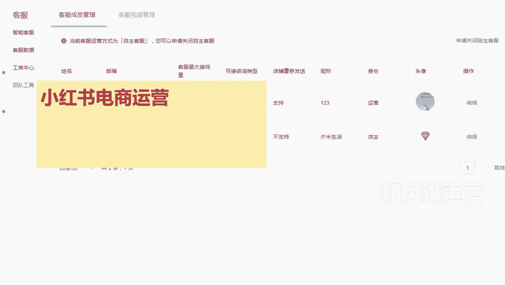
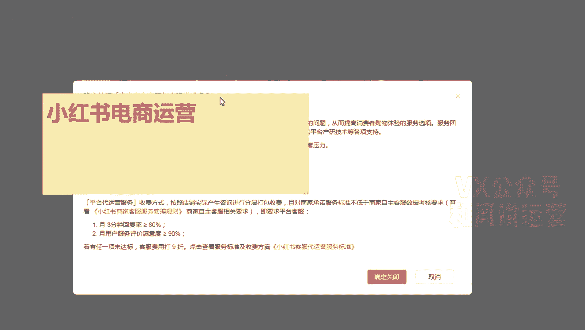
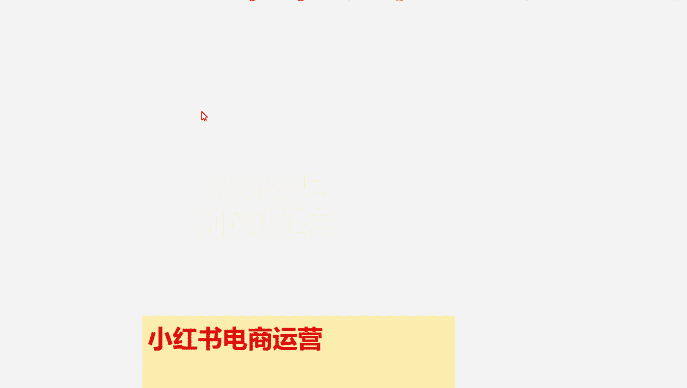
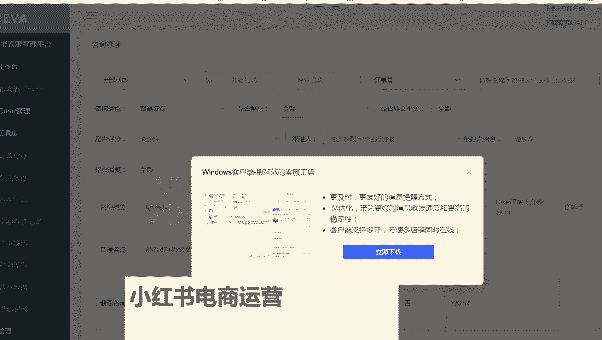
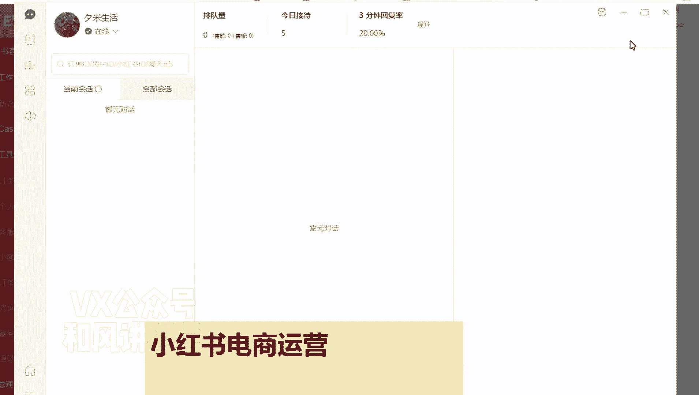

# 【小红书运营】B站最详细的小红书无货源电商实战全流程演示，必爆选品指南，多平台选爆款 - P7：6、客服聊天实操流程 - 乜没sui意 - BV1F1421t75o

大家好，这节课给大家讲那个小红书，那个店铺的客服的一些注意事项啊，啊首先小红书的客服分为自主客服和官方客服，官方客服待会给大家解释啊，先讲那个自助客服，自助客服就咱们商家自己的人工的客服啊。

嗯这里面有几个注意事项，第一个，自主克服的一个计算时间是0~24点，就是一天24小时，他都算，这个是不是很变态啊，但是大家不要慌哦，一切以实操为主，我们实操下来没关系，为什么呢。

第一个其实呃小红书的用户群体嗯，不是下沉市场，就是他们是老是老的一些呃，互联网用户就跟淘系那一波人的重叠度比较高，所以他们嗯会购物，懂购物，他们知道怎么下单，怎么去看尺码表，很多人不问的。

包括我们很多服装都不问嗯，然后是嗯不说百货了，百货更不问谁，咨询量不大，谁二十四二零到24点，他比如说你没上班啊，你比如说你九点到23点，你们客服在，但是你说你九点之前你没上班，其实咨询量本来也不大。

所以说影响不大啊，因为他要求的是大于80%嘛，所以用户会回复回复率啊，大于80%，但是基本上都能达到的啊，这个是人工回复啊，机器人的不算啊，而且还有一个小红书的用户，其实嗯嗯优质度挺高的。

它不是下沉市场，不像那个多多一样，动不动给你扯皮一下，去骗你个运费险，去搞一个紧退款，这这个我们实操下来，这个用户其实都挺好的，就是很很少有特别特别扯皮的那种，然后是你像机器人回复的话，就自动回复嘛。

自动回复的话，大家自己设置就行了，自动欢迎语啊什么东西的，然后卡片还有一个跟单助手啊，大家根据自己运营过程当中的一些呃，你们自己去选择这东西，自己去开，你觉得对你有用，你就开着，因为这个是促转化的啊。

然后客服里面第一个板块是工单，工单的话就是嗯一般消费者对嗯，比如说我收到一个消费者投诉啊，投诉到平台，平台会给你出一个工单，你只需要在工单的额，要求的时间内把它处理就行了，比如说你去呃。

你把它处理的流程啊，什么东西呃，然后是把处理的结果，然后写上去，基本上没什么问题啊，这个给呃，如果操作如果做过抖电的，跟抖电的流程是一样的，只要在规定时间内做一个合理的回复，和处理的一个结果就可以啊。

额那么如果大家是招的客服吗，客服不可能都是登录主账号，所以这个时候你们要登录子账号嗯，建一个子账号，子账号大家自己去建就行了啊，然后然后是子账号的话，这个是不是手机啊，都是邮箱邮箱建的啊，写一个名称。

然后邮箱账号邮箱那个这个验证码，然后是额选上这个账号的一些功能啊，开通的功能就可以了，然后如果你客服，你就单单去那个选中客服，然后是啊，如果你选中客服之后啊，你一定去调一下那个你看这个客服聊不聊天。

如果不聊天，你不要给他分配流量啊，不然的话那边会分配一些客户，这个到时候你又不知道，嗯然后这个邮箱可以，如果你是多电操作的情况下，有一个邮箱可以多店铺绑定都可以的啊，多店铺绑定那个子账号嗯。

接下来给大家讲一下那个官方的客服，官方客服我不建议大家用嗯，嗯不建议额有条件的用啊，但是呃因为小红书是鼓励呃商家去开店，去在小红书里面去做电商嗯，群卖货，所以说他出了一个官方客服。

因为他考虑到小红书的人群，他流量比较分散，他有很多的散户，对不对，他跟抖音不一样，抖音是那个呃，我要有一个大网红，大家可能就是体量比较大，小红书是体量都不大，但是我会很分散。

就是嗯就给每个人都有一定的机会，所以说这种宝妈和兼职人群比较多，他们可能没有团队都做不到，0。0到24小时，全天24小时的客服的一个一个值班，所以这个时候官方自己有客服哈。

你看这个条件已经已经那个非常优越啊，官方自己给你提供客服，但是他们是收费的啊，收费的话呃，看怎么怎么想啊，还好啊，不算太贵啊，但是我们没用，因为我们是团队的，这个看个人情况，如果你真是兼职。

你做不到客服的话，那么你可以考虑用啊，啧额那具体开通的话，大家是点客服，点团队工具，有个这个地方，左上角有一个额团队工具，里面有一个申请关闭客服啊，这里面有个开通，大家可以去注意一下啊。

可以在这里面有个开通，开通完之后呃。

你们去看一下啊，这是一个自费标准啊，就是小于额月咨询量是小于14~60元，120的啊，有600的，1200的，2400的啊，还有一个你咨询的一个转化金额的3%，这样一个提成，其实这个提成算下来蛮高的。

所以我们基基本上不用，如果你真的是一个人忙不过来呃，某一个月你用一下也是可以的啊，但是他这个里面是有一个，就是你如果你他没有达到，就是官方的代运营客服没有达到这个标准，或者任何一个指标，如果不符合条件。

他都给你那个费用打九折啊，啊但是九折的话我觉得也没优惠多好呀，所以这个大家自己看啊，想用啊，你们真没调解，可以去用一下，然后第一个啊建议大家去啊，自助客服的话，手机上都下载一个啊。

嗯下载一个小红书商家版啊，这个自己在app里面下载都行了，而且商家版的话，他有客服聊天，他会你把它设置成强提醒啊，手机强提醒嗯，电脑端的话也有啊，电脑端一般是咱们在后台的主页点击客服。

有一个下载PC客户端啊，上上家嗯，下载那个商家是下载PC客户端。

点这个啊，然后立即下载，下载完之后它的一个界面是这样的啊。

啊大家都可以在这里面聊天了啊，这3分钟回复率啊，这些东西排队啊，就是跟其他电商基本上是一样的啊，所有的后台的设置，然后数据统计这些都有啊，还有一个设置这个强提醒啊，嗯这啊这这是那个官方的一些消息。

我建议大家呃电脑端的话，大家都是默认登录上，自动登录手机端的话也登录。

然后你出去之后，手机也能聊。