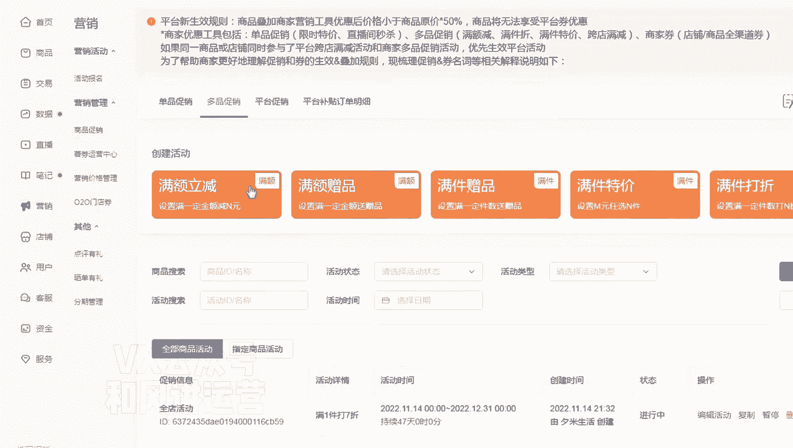
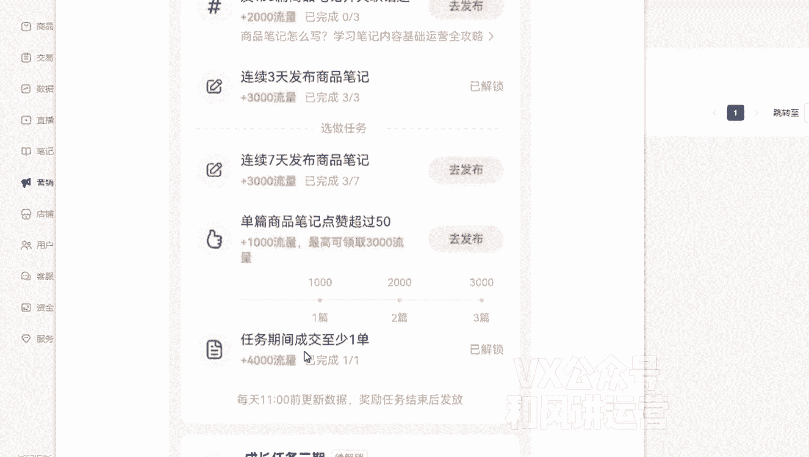

# 【小红书运营】B站最详细的小红书无货源电商实战全流程演示，必爆选品指南，多平台选爆款 - P8：7、店铺营销工具的使用和活动任务 - 乜没sui意 - BV1F1421t75o

嗯这节课给大家讲那个小红书的营销工具啊，营销工具给大家去走一下流程，嗯小红书这里有营销工具，是在后台大家看一下啊。

嗯后天大家点击营销啊。

有一个活动报名不用说了，这个大家用的不多啊，嗯主要是营销管理。

营销管理有一个商品刺销，还有一个嗯。

属卷运营中心啊，书卷运营中心，书卷运营中心。

其他是个券，就是优惠券的意思啊，所以说小红书那个没有那么多嗯，那个花花绿绿的东西就两个，最基本的打折工具，就是打折或者优惠券两种方式啊。

咳那么优惠券的话，如果你们的商品上完之后。

建议单品的话，就是这个比较繁琐，我建议大家选多品。

你看我们这多品全店嘛啊权利我们是两倍，上传的时候一键打七折啊。

啊这是一个选择好时间啊，大家去看一下我这个编辑啊。

嗯全店活动对，然后是选择好时间，然后全部用户全部商品，然后是我是选满件打折啊，然后这个你们自己看，满满额立减或者满减打折都行啊，满一件打七折啊，就这样一个情况。

然后点击保存就可以了，咳然后第一个这些都不用管啊。

这没什么用，然后第一个属卷运营中心，就是咱们说的优惠券呃，优惠券的话，你们比如说你们可以呃两倍加五，对不对，那么你再再选一个满10-5的券也行。

因为优惠券可以提高转换啊，我这个店是没有设置的，但是你们可以设置，那设置优惠券会更好，他的页面上的刺绣促销的这个工具越多，顾客那个下单欲望越大嘛。

嗯可以设置一个满减的啊，但这个减的话额。

因为优惠券本身可以提高客单嘛，对不对，因为你比如说你这个一个产品是50块钱啊，但是他领完券之后是40，他会认为这个产品真的就是50，是因为你减了他十块钱，所以他的购买欲望会大，能增加转化做一个满减。

满减的话，你们直接是批量性的嗯，比如说你嗯两倍加五，你就设一个10-5就行了，全电性质的都可以啊，嗯这是我这是我们之前建一个就满19-10啊。

当然这个力度也是比较高的啊，这个自己大家自己去看啊，看你们那个你们一些选择，还有一个东西，就是你们那个我建了一个晒单有礼啊。

啊这就在这个晒单游里面。

晒单游里面我感觉没什么用，因为他是他送给布克的，是一个卷呃，这个券的话一般顾客没有多大吸引力，他不是送的钱啊，这所以这个大家我们就试了一下，没效果，一般般啊。

也不是很大额，这个是点评有理，就是鼓励商家去给你评价，评价的话，这个跟那个晒单有礼一个意思啊，嗯但是这个是直接是无门槛的一个券，这个门槛更低了，这个对商家的吸引力会更大一些，大家可以选择五元啊。

看自己客单十元，然后发行多少张，然后哪些商品可以可以有这个可以使用这个啊，平台的一个无门槛优惠券啊，这当然这个钱肯定是商家出的啊，你们这个可以适当用一用测试测试一下，效果怎么样啊。

额另外就是对于新店来说。

官方有一个扶持啊，这个扶持的话就是在你手机端那个app端啊，电脑端没有手机端的app，它的一个主页就是小红。

就是小红书商家版那个主页有一个成长任务，这个成长任务对你店铺，新店会有一个流量的一个扶持，嗯我建议大家嗯第一波上完屏之后，我建议大家都去参加这个任务，因为他的确有流量复试，大家达到什么级别。

他给你这样一个流量，而且给你解锁嘛，然后点这个位置，你看我这个是已经到任务第位期了，然后他会给你安排很多任务。

看这个啊啊比如说发布三篇四三篇，那个商品笔记连续发布多少，然后连续七天发布多少，然后是笔记流量超过1000，你会有什么样的一个一个流量复试，然后是成交，又有什么样的流量扶持，这个对于新店来说比较友好。

我建议大家都参加一下。

其他的就是抖店的整个营销工具啊，包括活动，还有一个手机端嗯。

