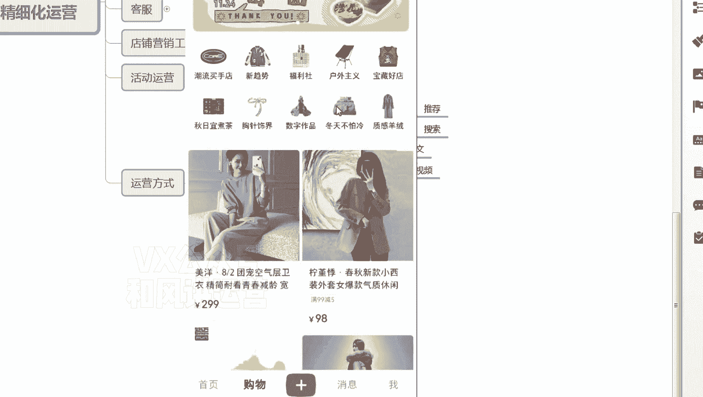
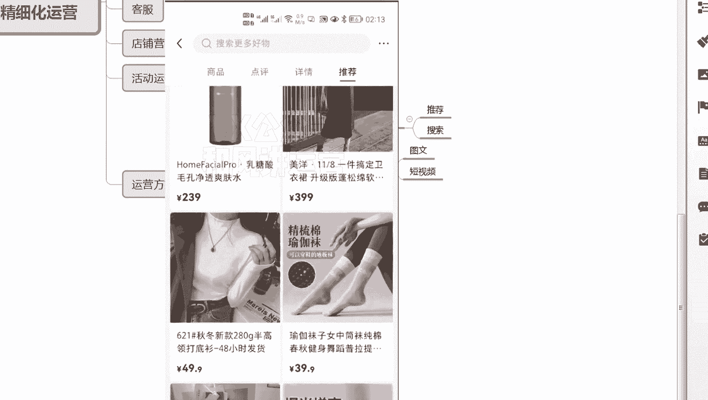
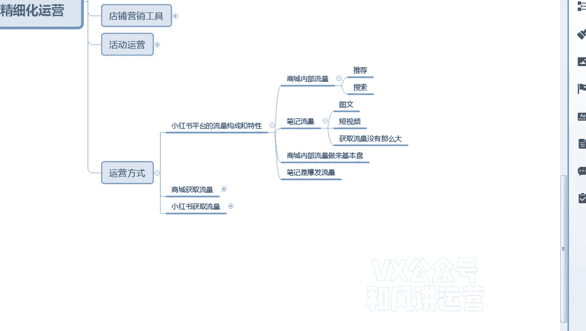

# 【小红书运营】B站最详细的小红书无货源电商实战全流程演示，必爆选品指南，多平台选爆款 - P9：8、小红书商城流量运营-小红书流量结构和特性 - 乜没sui意 - BV1F1421t75o

嗯这节课是运营的一个课程，给大家讲一下，这个小红书的一个额流量的一个构成，和平台的一个用户特性啊，嗯嗯第一个小红书的流量分两块啊，跟抖音一样，跟抖音和抖店一样，它是第一个是一个种草平台。

小红书是种草平台起家的，所以说小红书的流量创造者是小红书本身，但是他电商并没有流量，因为电商没有app，知道吧，电商的app还是在小红书内部的啊。

大家可以看一下，这是大家打开那个小红书啊，打开打开小红书是这样一个界面，嗯首先上面是关注，发现还有一个本地啊，然后是最下面是一个购物购物，就是咱们经常呃经常说的，就是小红书的一个电商啊。

这个就是小红书的一个电商平台呃，那么购物里面大家看一下，第一个有搜索嗯，有搜索，第一个。

嗯说明小红是有搜索流量，第一个我点进去一个商品之后呃。

点击商品之后，你看我往下拉啊。

啊我界面放小一点，大家看一下啊，往下拉啊。

往下拉，这个里面有个推荐，说明小红书有推荐流量啊，大家看一下有推荐流量啊。

点推荐。

好点，这个推荐你看下面有推荐流量，而且推荐的逻辑是跟着商品来的，就是商品的推荐，这个猜你喜欢这个商品是什么样的呃类型。

比如说这个是个V1，那接下来是下面推的V1比较多一些啊。

当然也有些那个呃喜欢卫衣的人。

同样也喜欢喜欢此类商品，还有平时一些浏览记录给你的一些推荐。

但是我们看下来这个推荐没有呃，不是太精准啊。

没有抖电精准一些啊，额但是大家确定一下商城是有流量的啊。

商城有流量的，大家点这个购物就可以了啊，这个是直接小红书。

所以说商城的流量，其实还是小红书分发出来的啊，他自己没有一个独立独立引流的能力啊。

额那么第二个部分流量就是，我可以通过小红书去给我的商城店铺去引流，这是小红书引流，只有这个里面啊，这是呃这是大家主要操作的一个地方啊，嗯那么这个小红书你看啊，我随便比如说这个啊。

你看在小红书的右上角这个位置啊。

嗯右上角有一个，如果他是一个带货视频的话，就这个视频上挂了小黄车，挂挂了这个带货的一个链接。

它会显示这个购物的一个标志，大家点进去，Even when i'm moving you know。

How to see through me，You're so good to me，Yeah，Yeah。

Yeah，哦对你看我往下拉。

你看在他的左下角这个位置嗯，是他的一个挂的一个链接，然后是如果消费者被这个视频种草之后。

他有购买的欲望，他会点左下角，然后直接点击购买，这叫带货嗯，然后接下来咱们发布视频的时候，咱们肯定是都做这种带货的视频啊。

但是带货的视频可能他的那个呃就是获取流量。

流量没有那么大啊，但是他的成交转化比较高，因为他的视频下方直接就看到了，你的这个带货的一个商品，这是给大家去呃分析一下那个嗯，分析下小红书的一个流量结构和一些特性啊，大家对大家后面的运营嗯会有帮助。

大家知道是这个平台一个特性，在哪些地方能拿到流量，但是还有一个比如商城的猜你喜欢，其实推荐的渠道挺多的，比如说咱们点击我的，点击我的嗯，在你的店铺里面啊，如果如果小红书有店铺。

大家看一下，如果是这不是你在小红书里面买东西了吗。

很多人也不会购物，你点购物购物，这里面有个购物车，对不对，你看购物车里面下面也有，猜你喜欢啊，我界面再放小一点，大家看一下啊。

啊购物车下面也有采集习惯嗯，然后是订单界面也有采集习惯。

大家看一下嗯，你看订单界面也有层级喜欢，所以前期喜欢也能拿到一部分流量，所以说我如果做小红书电商，大家一定要做两个流量，第一个商城内部的推荐和搜索流量，第一个商小红书的笔记流量，这两个流量是额。

建议大家商城内部啊流量作为基本盘啊，呃就是你店铺要铺一部分货，铺完货之后，你店铺会如果这个货嗯，会定期更新吗，如果是季节性产品，你定期去更新你的货品，如果是呃，如果是那个一年四季都能卖的。

那所以说这个产品会流量会比较稳定，它会一直拿到一些搜索流量，会推荐流量，所以这第一个流量，第一个流量就是大家要做笔记，笔记是爆发流量嗯，因为他毕竟小红书毕竟是一个二类电商平台。

它的用户的购买的呃意识还是不是很强，嗯就主动去商城去购买的意识还是不是很强，所以说很多都是推荐进来去购买的，所以笔记一定是爆发性的，就是我每天能通过啊，嗯商城内部的流量每天能卖个几十单。

那么偶尔再爆发一些笔记，那么我能让我爆发一波，所以整体平均下来，你的整个店铺的收益才会变大。

