# 【小红书运营实操教程】最详细完整的小红书运营实操教程，适合所有新手学习小红书起号丨小红书笔记丨小红书开店，全程纯干货，通俗易懂！ - P10：3.小红书的优势 - cqrl4632 - BV1J4421S7GE

那么很多同学可能会问老师，我今天作为一个新手，哎，作为一个小白，我去做小红书，真的可以赚到钱吗？老师，我今天我为什么说建议小白去做小红书呢？来听清了，他有这样的一个极点优势。

首先第一个我们说作为小白而言啊，咱们做小红书平台，你是非常容易去上手的。而且来讲它的发展空间真的是非常的大。咱们可以看到啊，这个小红书平台是在23年的2月份去刚刚上线的。

到现在为止发展了还不到一年的时间啊，从它开始上架呀，开始后期去测评啊，同学们还不到一年的时间。所以说所有行业咱们要做要干嘛，我们要做第一批吃螃蟹的人抢占它的红利期。

那如果说同学们大家有玩过这个国内的抖音淘宝拼多多，你会发现一个问题啊。😡。

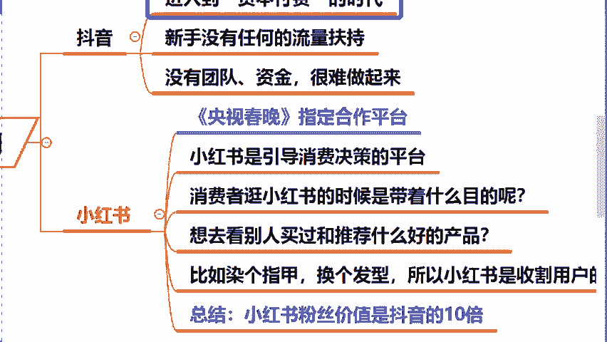

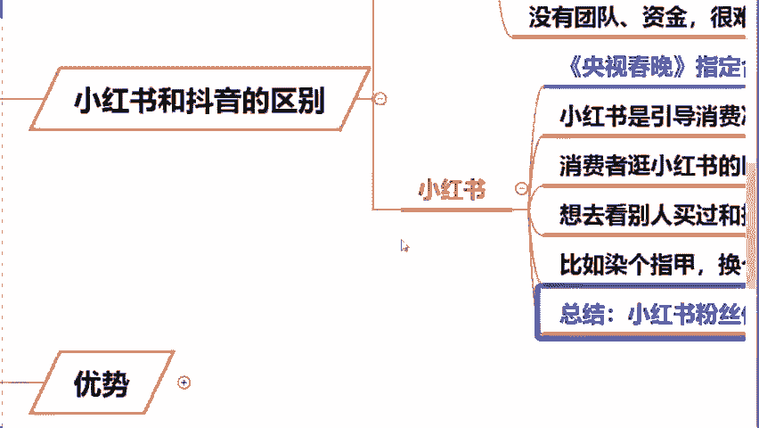

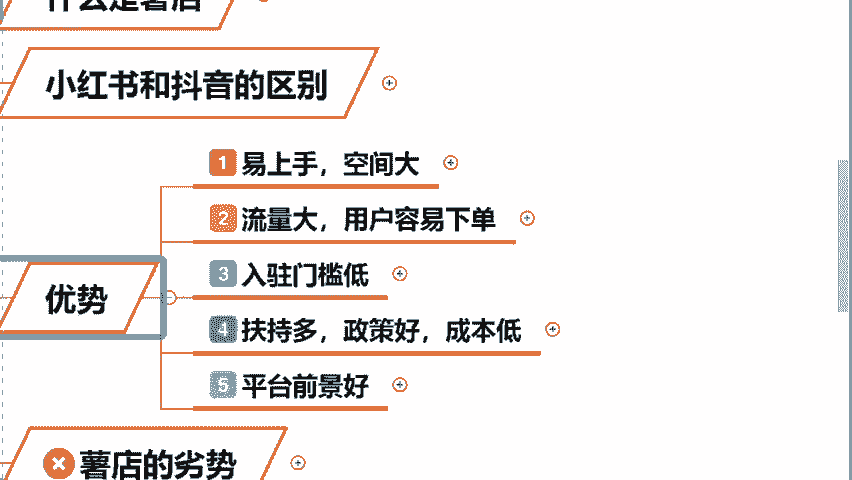

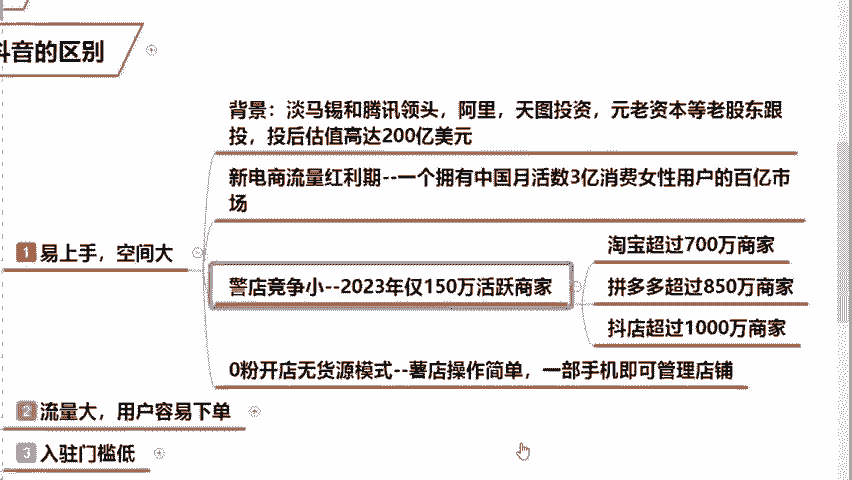

咱们任何一个电商平台，它在发展初期都属于是在干嘛爆发式增长。而且来讲，在这个发展初期，我们作为新手卖家是非常容易做起来的，而且也是非常容易去出单，容易去赚到钱的。那么这些平台的话都属于是叫做国内电商。

我今天为什么不再推荐大家去做淘宝和拼多多了呢？来，在这儿我们通过一组数据去看一下啊。😡。

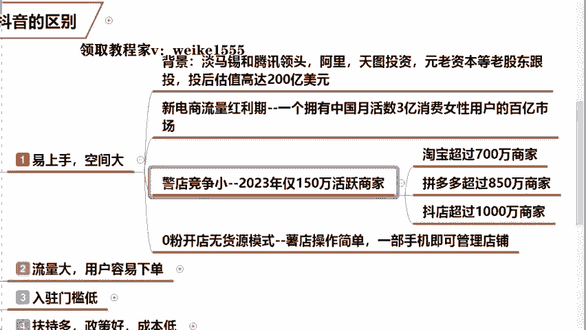

这个呢是我们从这个15年到21年统计的国内的主流电商平台的活跃数。咱们可以发现啊，包括淘宝啊、拼多多的话呢，你会发现这个数据从2015年哎，到17年，它是在增长的对吧？那么是从这个19年开始。

它出现了一个叫做不生反向的趋势。那么因为说这个时候啊能够留在淘宝天猫的人他已经是经历了一个几十年的沉淀了。所以今天我说句特别现实不太好听的话啊，呃，就如果我们现在你还去做这个国内的淘宝拼多多的话。

对不起，你今天只能是去当炮灰了，明白了吗？你包括来讲同学们在问的老师国内抖音这么火霸屏这么多年，我为啥依然做不起来呢？同学们那么那我我们说啊国内抖音它火他的跟咱有啥关系啊。因为说人家做的早点竞争不过呀。

很多的明星网红在做这个带货的时候，他第一个选择的平台，就是抖音，他是带着团队去的。而且来讲他也是自带流量的那我们今天。😡。

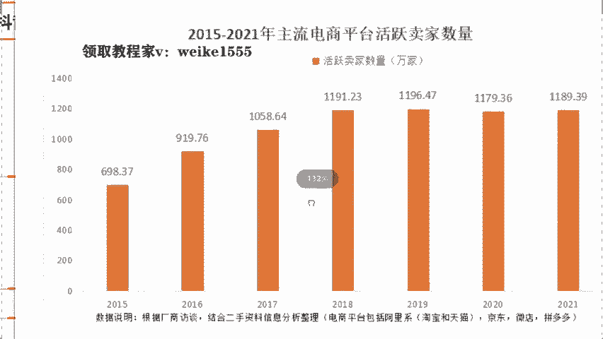

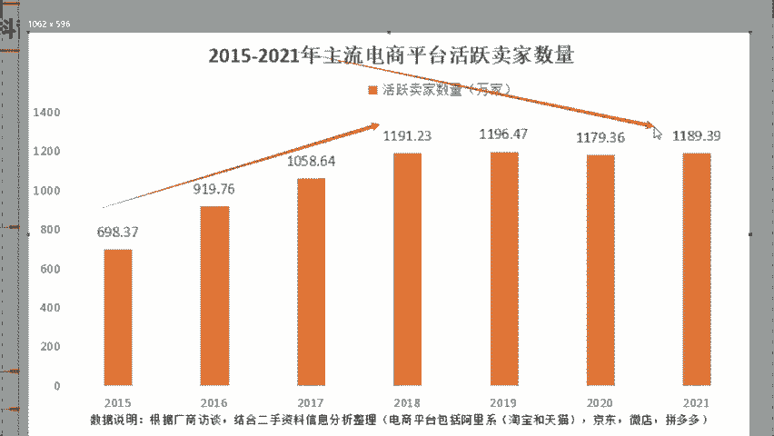

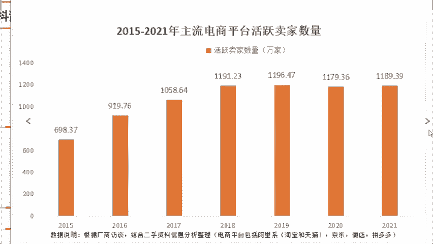

你一没有背景，你二没有这个我们说自带流量，咱就是一个普通人，你跟他们去竞争，咱们是没有任何的优势的。😡，但是作为小红书我们就不一样了。我们的新手做小红书，你优势在哪儿呢？首先作为小红书啊。

它是我们今年刚刚上线的玩法，做的人非常少啊。你竞争上操作非常的简单。哪怕今天咱们只有一部手机都能够把小红书电商平台直接做起来的。明白了吗？这个是小红书第一个优势叫做门槛低，哎，竞争少，我们的机会大。

那么第二个，我们说小红书平台啊，他在整个官方平台，她的调研数据上去显示了一下，目前来讲，它有一个3亿多的活跃用户，而且其中你可以发现她以80%是于你女性为主的。

那么其中的人群比如说啊咱们的一个都市白领啊都市中产精职妈妈还有说我们大大学生这些女性群体消费能力都是特别的强。因为他们对自己的形象要求啊，品牌要求啊都会比较高一点。那么你比如说啊咱们今天。😡。

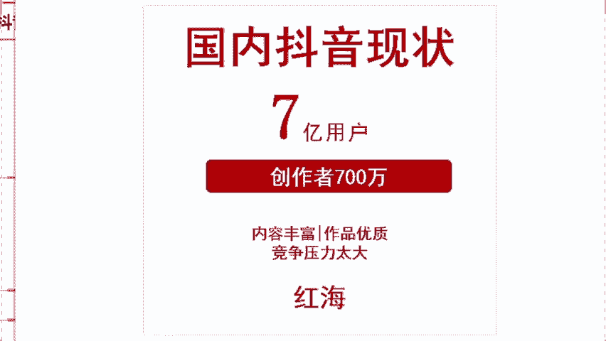

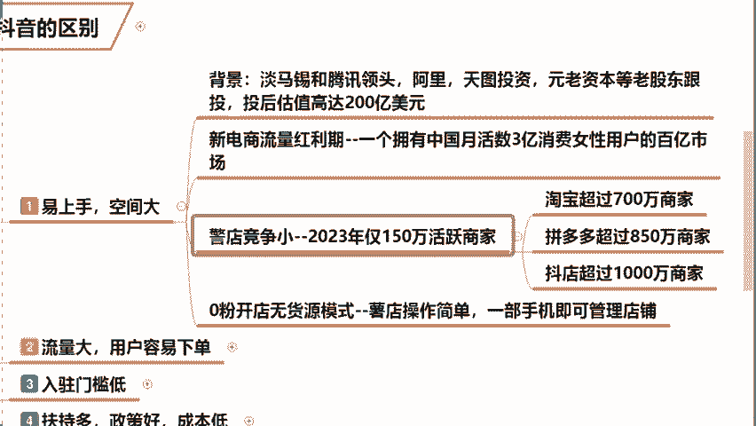

直播间女孩子包括我在内啊，我想去买一个口红，想看一下买哪个色号，我不方便去线下店是吧？我不可能说买完之后，你说你试着你买是不买线下店对不对？我们会选择在小红书搜索一下别人是这个口红什么颜色，对不对？

所以说小红书上面啊，它购物的人，这个信任度都是非常的高。你包括来讲女性群体它的留存率转化率也是特别的高。包括来讲，据这个大数据统计，我们现在啊我们在互联网上价值的流量排序，女性啊，它直接是排在了第二位。

什么意思？咱们女生她的消费能力非常的强，仅仅次徐退休在家的一些拿着钱的退休老人能够去理解吗？因为说在中国国内来讲啊，我们的家庭财政大权，80%都是在这个女性手里去掌握着家里面一些琐碎物品呢。

柴米油盐酱醋茶，这些生活用品基本上都是女性进行去掌握的，他们去购买，对不对？所以说啊这个小红书平台它会有80%以上都是。😡。

一个中高端女性，那么她今天就是要利用这些女性来进行一个变现。所以说小红书平台她的吸金能力绝对是不容小觑的。😡，我们今天去做小红书，就是把他的用户引流到店铺里边啊，你今天流量越大，那你今天出单就越多。

你赚的钱就越多。这个是小红书第二个的流量优势。那么第三个，我们今天啊去做小红书店铺，它的入住门槛也是特别低的。第一个啊强调一下，你看一看是不是贴合你们自己。第一个不限制年龄，不限制学历。

也不限制你的经验，咱今天强调一下啊，老师我不是去考试去了，咱不是中考高考去了，不要你研究什么火箭大炮，只要你现在作为中国的合法公民，有一张身份证，对吧？你有一张营业执照能把店铺直接开起来。

把商品卖出去就能赚到钱。那么包括来讲这个开店的问题啊，包括来养师老师，这个营业执照怎么去搞的话，不要着急，待会儿的话，我来帮你们去解决这些问题啊，先来去听课，教你们如何去掌握我们今天开店的更多的流量。

😡。

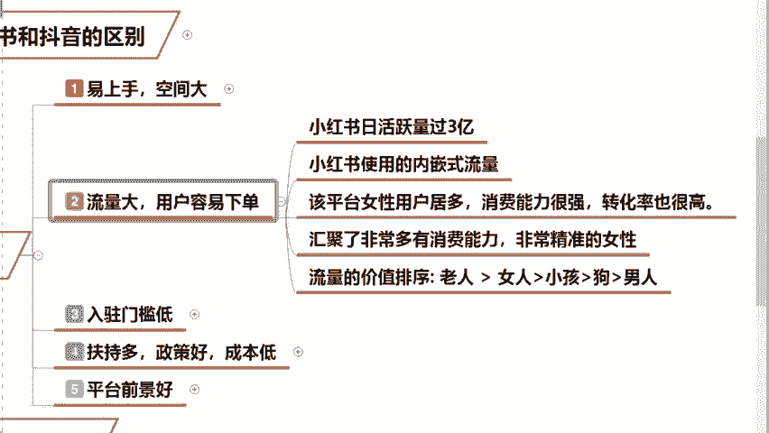

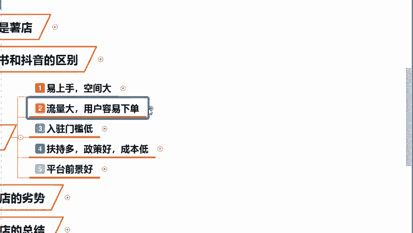

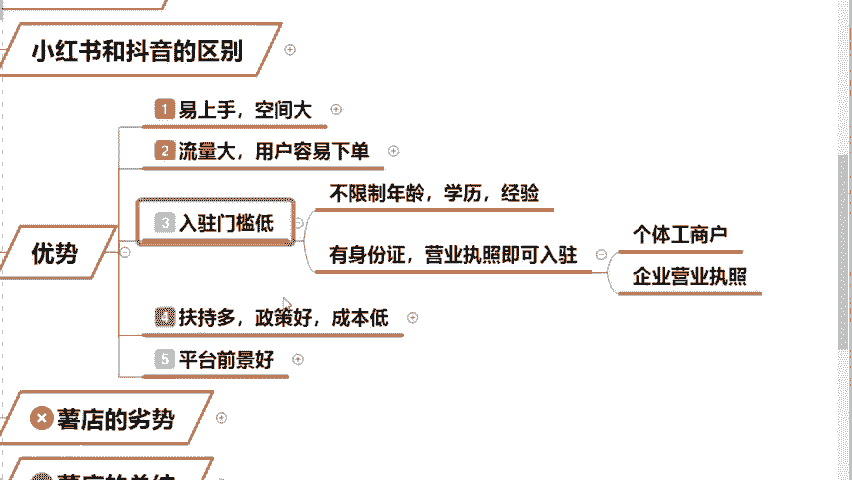

那么第四个啊，同学们可以看到这个小红书的官方平台，目前给到咱们这个新手卖家扶持政策是非常好的。而且来讲小红书，在我们今年的话，它才开始刚刚走向商业化。

所以说他会去重点扶持咱们这个新手小白给到最高的哎50万的一个流量扶持。那么这50万的流量扶持什么样的概念呢？意思说我们今天你把店铺开起来之后，你只要开它开开你的大门。同学们。

至少有50万人进到你的店铺里边，所以我们今天啊入驻时间越早，你成为商家的时间就越早，你今天是不是就能够去赚到钱。换句话来讲，小红书这个肥肉，它现在属于是一个狼少肉多的情况。包括同学们在问到老师的，老师。

我今天啊我想做开店，但是我没有货源，哎，我没有启动资金，怎么做小红书呢？不要着急，一会儿的话，我会手把手来教给同学们，我们今天零启动资金，怎么把店铺给他去开起来。那我看到说同学们在问说老师。😡。

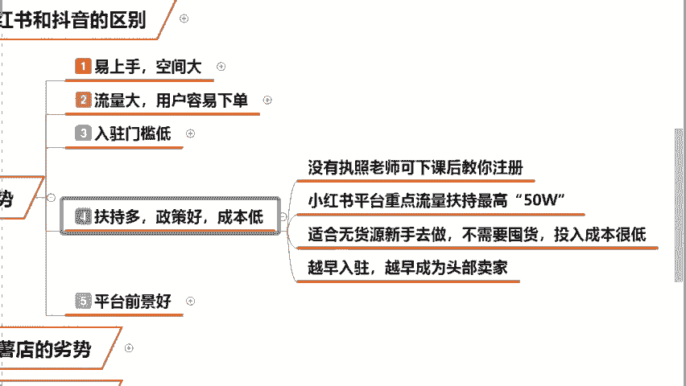

交保证金吗？所以我是为什么说推荐小白去做这个小红书的？听清了啊，他今天平台规定的是你赚到钱过后，你想提现了。这个时候你交保证金就可以了。同学们能够去理解吗？那么你想一想你赚1万。

你给他交1个51000的保证金，你说这个买卖划不划算，对不对？前期的话所还那句话啊，小红书是来帮助小白去赚钱的，明白了吗？他不需要你前期去花费多少钱？😡。

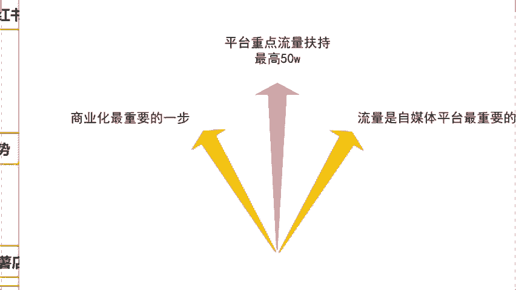

所以同学们，我们今天它的第五个优势也是最重要的。就是说咱们今天这个小红书平台，它的发展空间真的是非常大的。因为电商和我们这个传统平台它是不一样的，它属于是叫做一个内容种草平台。什么叫内容种草呢？啊。

咱们直播间我问一下啊，呃，有没有说愿意熬夜的同学呀？如果有的话，公屏飘花，我去看一下，对吧？经常熬夜的，晚上拿着手机睡不着觉的，是不是啊？白晚上不睡白天不洗的，对不对？很多同学对不对？😡。

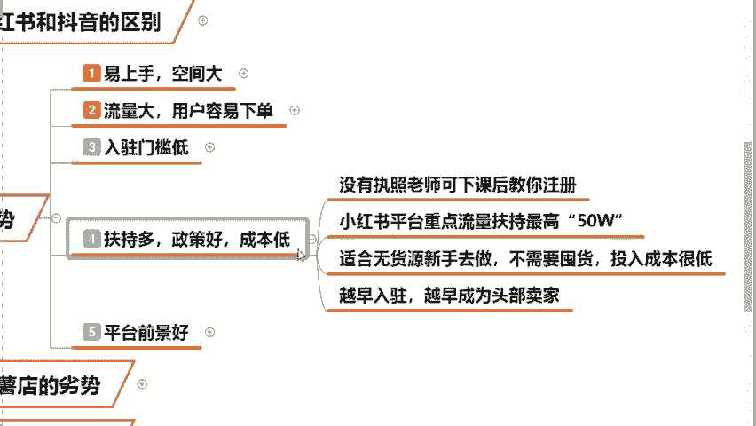

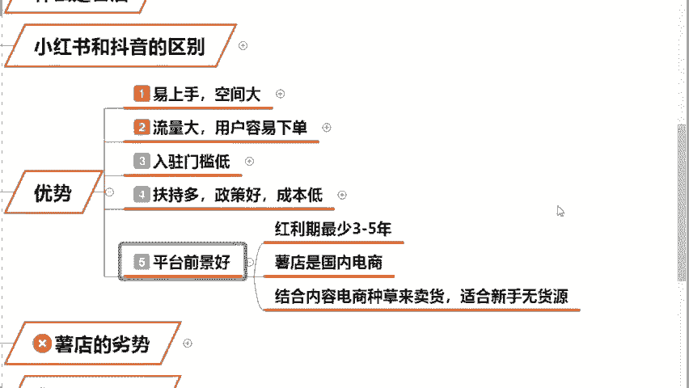

那我们今天如果说你熬夜的话，哎，你熬夜过后会有一个后遗症干嘛？脱发，对吧？当我们今天脱发过后，你会第一时间打开小红书搜索两个字脱发，对吧？我经常就干这个事儿，所以你会发现它会直接出现非常多的一些案例啦。

哎，视频啦图文啦，我们点击这些图片进入桌后，你可能会发现这些人跟你情况都是一样的。当我们今天你进入到这个图文之后，他会在这个视频的下方给你挂上一个叫做防脱洗发水的链接。

那么当我们今天啊你看到这篇文章过后，哎，你惊奇的发现，哎，他也是有这个熬夜掉头发，对不对？他用案例够证明了，他用完长头发了，是不是？我今天会毫不犹豫的购买同款的防脱洗发水。那么当你购完买之后。

这篇图文笔记的人就能够去赚到钱了。所以说啊我们今天这个小红书它不像是百度。😡。

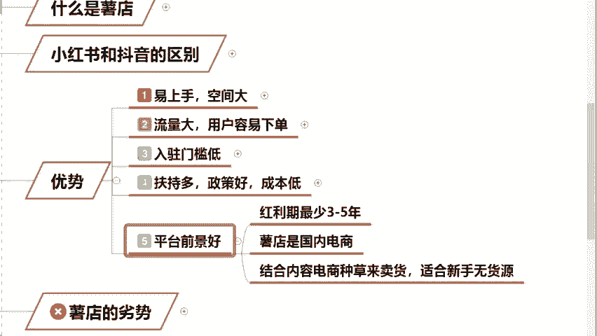

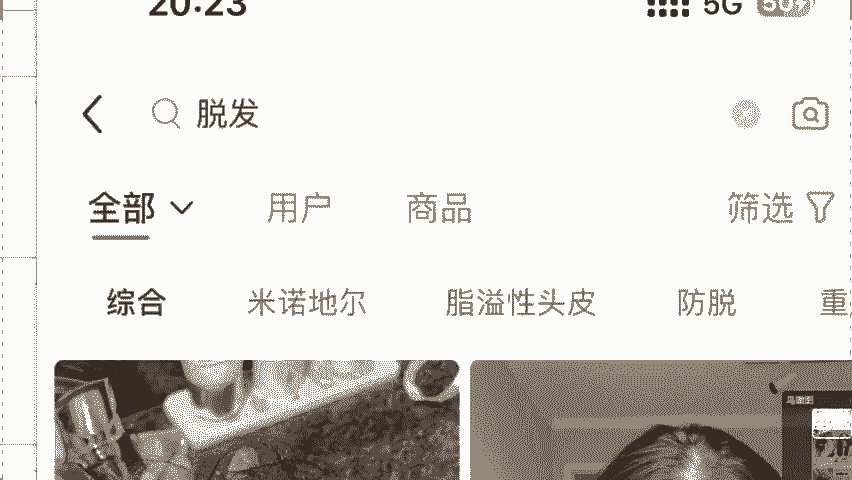

你在百度上搜索一下这个原因的话，他给你推的广告你是非常反感的。为什么他没有任何的信任感。你没有说像小红书这么具体的给我说明了一下，你这个洗发水是有效的呀，对不对？小红书真实有说服力，它有对比图。

这样的呈现形式，更容易让用户去接受，这个就叫做软广。来，同学们在这个位置上能够去听懂的啊，能够去跟住我节奏的，把软广两个字打在公屏上面。😡，那么你这个产后脱发的话，你就得打上磁条叫做产后括号脱发啊。

你不能只打脱发，对吧？你这个要不然给你推错了呢，是不是啊？😡，能够去理解，对不对？😡，所以说啊我们在这个购买之前，小红书用户就是带着这些购买欲望来的。他们是有消费欲望的。我今天读了这篇文章。

是不是发现案例特别相似，哎，对吧？它长头发了，我也愿意花钱去购买，就是这样的，所以说小红书平台它能够去更加精准的把推送广告给到咱们的一个目标用户，是不是？因为当我今天去搜索脱发两个字的时候。

我对这个产品就是有需求的，只不过平台在帮助我去选择一些更加适合我的商品，这个就叫做引导消费者来做决策，也就是说在引导咱们去消费。这个是小红书平台，它最大的优势。那么对于目前来讲，我们的国内传统电商而言。

小红书，它就是要利用现在3亿用户来进行去变现。所以今天各位你们是不是能够通过这样的方式来去变现赚钱呢？我们是不是能赚到更多的钱。来，同学们，这个点能够去听懂理解同学，你在直播间飘个小花，我去看一下啊。

😡，我再强调一下呃，本堂课的话不支持咱们这一个课堂提问啊，因为课堂上的人特别的多啊，我们今天是一个纯干货的分享课堂。如果说今天我回答这个同学，那个同学的话，对吧？刚获讲不完怎么办呢？是不是啊？

如果你有任何问题的话，课后添加我的一个微信啊，我来解给你解答所有关于小红书的问题啊，你想赚钱，我就来告诉你，是不是？😡，这是我们所讲到的叫做小红书平台的一个优势。😡。

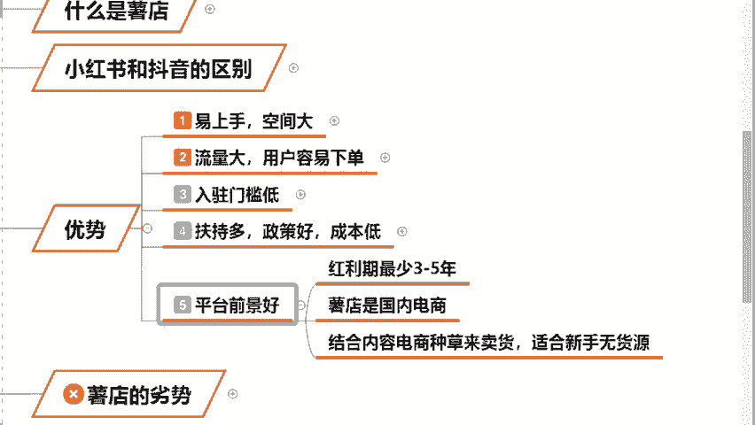