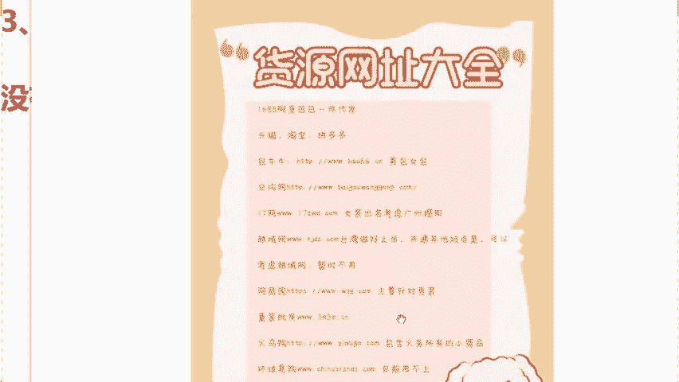

# 【小红书运营实操教程】最详细完整的小红书运营实操教程，适合所有新手学习小红书起号丨小红书笔记丨小红书开店，全程纯干货，通俗易懂！ - P13：6.新手无货源怎么办 - cqrl4632 - BV1J4421S7GE

那么来我们今天的话呢，同学们说老师啊，我作为一个小白，作为一个新手，我想做小红书店铺，我今天没有货源，没有产品该怎么来做呢？来，同学们啊，我们说到咱们这个货源问题的话，我来问一下呃，咱们直播间同学们。

如果今天你是有货源的话呢，你在直播间啊把类目给我敲在公屏上。那么如果说老师我今天是没有货源的，你在直播间打上没有两个字，我来看一下同学们大概是一个什么样的情况。😡。

很多人都说没有是不是啊？那我来简单的去说一下，如果说你是自己有货源的话呢，你的货源供应链啊，是有价格有优势的话，我待会儿会教给你如何用咱们的产品来进行去定价，包括来讲去打造爆款商品。

那么我看到更多的是没有货源的，是不是？那么这样同学的话，今天你没有怎么办呢？难不成老师我没有货源的话，我就不能通过小红书去开店去赚钱了吗？当然不是了，来，同学们，如果说没有货源的，拿本记好了。

咱今天直接从代发去做起。那我解释一下什么叫代发。比如说今天我们去这个卖货，对吧？首先第一步咱们得干嘛呀？得找货源，那么货源从哪来呢？同学们，你想找货源，首先得找厂家。

那同学们肯定绝对有会士老师厂家我也找不到啊，对不对？同学们啊，今天我们来去对接一些，我来帮你对接一些叫做线上厂家，我们通过线上厂家去拿货的话，这同学叫什么呢？统称为叫做代发。😡，はい。我解释一下啊。

说白了咱们今天的话用别人的产品来赚我们自己的钱。我们作为中间商，直接来赚一个差价。来，同学们，这个地方大家能不能够去理解？如果说能够听懂理解的话，公屏扣1，我去看一下。😡，都能去理解。

是不是我强调一下啊，这堂课的话都是干货啊，一定要听懂学会了。包括来讲我们今天这个货源同学了，问老师我去哪里找呢，对吧？我这个哪里找货源呢？这个时候我也没有不要去低调了啊。大老师，我的话做电商这么多年了。

手里边的话，各种品类的话，我都有，包括来讲，无论你想卖这个鞋子呀，卖包包啊，卖建材卖百货呀，任何你想去卖的产品，我在这儿能够去帮你对接到最优质的商家，我常年同学们我是来帮助我学生进行去选品的。而且来讲。

在这个今年我也是带着我的团队到目前为止，一共是测评了10万多家的爆款。所以后期不管你们店铺有多少流量啊，出了多少单，我能够保证咱们今天同学们商家百分百准时的来给咱们去发货。这个问题我来给你去兜底。

那么最重要的一个点在哪里？就是说我们今天能够保证所有货品达到利润，40%到60%以上。同学们你记住了啊，就目前来讲，在平台上面，我们能做到40%。😡。

到60利润的话，只有小红书可以达到。为什么前面说到过小红书平台，它的用户80%是中高端女性，所以更加容易让我们去打造爆款商品，销量高，咱们赚的就多。因为说这些女性她们购买能力本来都特别的强。

同学们非常强，利润非常高，变现的话是非常暴利的，只要你能卖出去，咱们可以直接赚到钱，不需要你有资金，也不需要你有货源又代发，可以直接变现赚钱。包括刚才我看到说老师啊。😡，这个利润真的有这么高吗？

同学们呃，那么我在这儿咱们用我的学生去举个例子，好吧，我们来算一下啊，这个商品能不能达到40%的利润。你看我这个学生他卖的是什么啊？他卖的叫做儿童拼图。😡。

这个拼图在小红书售卖价格，同学们58块钱。那么咱们今天同学们可能会有疑问了。老师，我去卖这一单，我能赚多少钱呢？那我们说想知道赚多少，首先要知道拿货成本是多少钱，对吧？才能算出利润。那今天怎么来进货呢。

来跟上我的一个思路。😡，首先第一步把商品进行截图。截图保存过后，同学们第二步打开叫做1688的一个平台。同学们点击里边的小相机标识，在这个位置，把刚才截图的图片进行上传，点击旁边的搜索。

那么你就会发现这个里边啊有我们今天一样的拼图，一模一样的。那么成本价啊，高低不一，有20的，有10块的，有18的，有27的这些各种各样的价格都是有的。我在这儿啊，我拿一个最高的。

我们的成本价就算它是27块钱来。😡，咱们用这个58的卖价减去27的1个进价，我今天毛利剩了31，对不对？我还没有减掉运费。我在这儿给大家去减掉1个8元钱的运费，是不是我们今天的一个纯利润就是23块钱。

你今天的话你卖一个拼图，我们说用这个拼图可以去直接出二卖这个降到23，对吧？你再除以1个58，就是咱们的一个利润了。那么他今天大概是在37。6%左右。我想问一下，咱们今天直播间各位同学啊。

就如果说你去做产品的话，你的一个产品利润可以高达40%的话，你们觉得满意吗？来，如果说啊你们觉得满意的话，你在直播间把满意两个字给我打在公屏上。😡，那如果说能够去听懂理解的话，对这个利润是满意的话。

来公屏上打上满意两个字。包括我看到说同学们在问的，老师，我今天我满意是满意啊，但是我不知道说这个58能不能卖得出去呀，对吧？我们关键重点在于老师我能卖多少单才是关键。所以在这儿啊给大家去看一下他的店铺。

他这个店铺呢在今年夏天，儿童拼图到目前为止一共是卖了，我们来看一下。😡，多少个订单来，我们去看一下这个店铺啊。嗯，我还是找一下他这个店铺在这儿。

到现在为止是卖了1个4529订单，我们直接用这个4529去乘以一下咱们今天多少23块钱的一个我们成本是多少钱？同学们，这一个单品让他在今年夏天直接赚到了10万块钱。所以同学们啊，作为小白同学我告诉大家。

只要说产品选好了利润空间真的非常大。而且来讲，他今天只是一个单品的利润。如果后期同学们20个单品30个单品呢？所以说啊小红中平台现在非常好做。只要今天你选对了产品。

咱们就能够去出单就能够去赚钱的数据就是一个最好的证明。所以说讲到这儿的话啊，我们解决了小白同学货源问题，选品问题，当解决完问题过后。😡。

