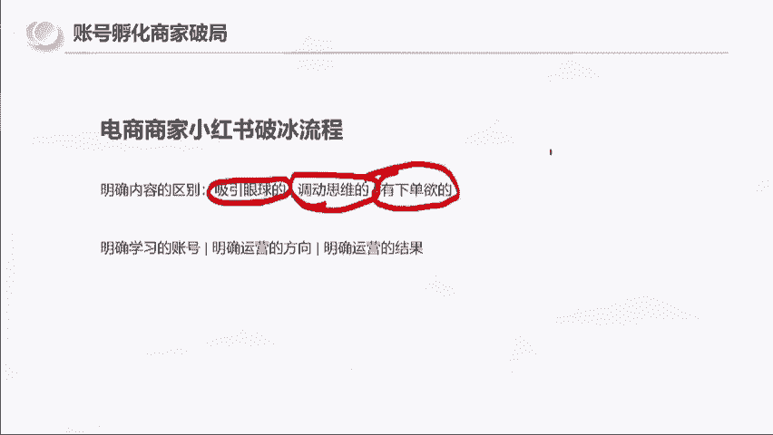
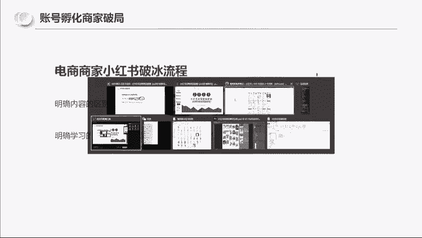
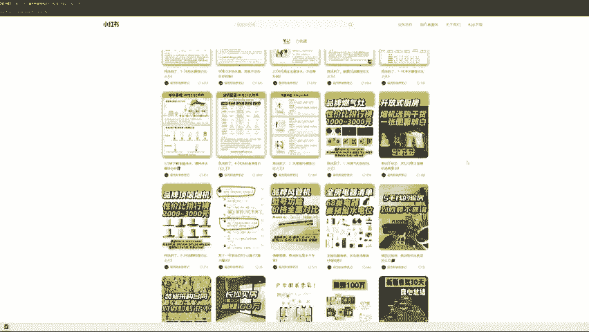
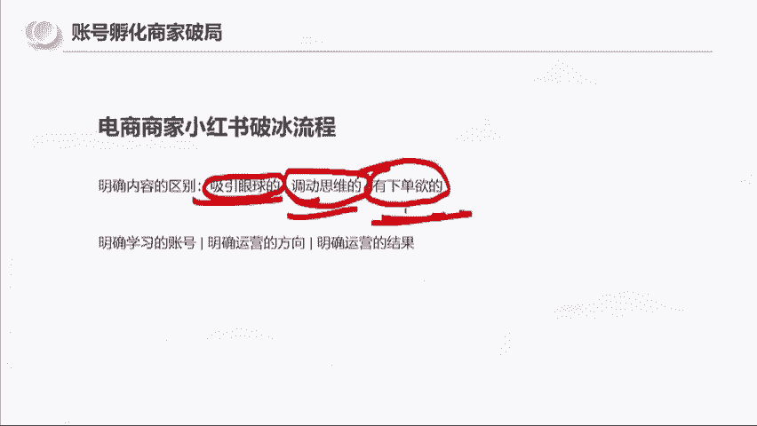
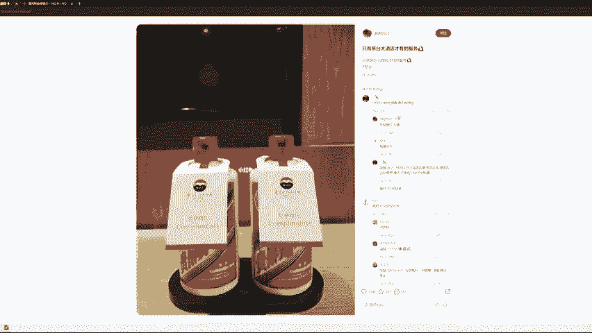
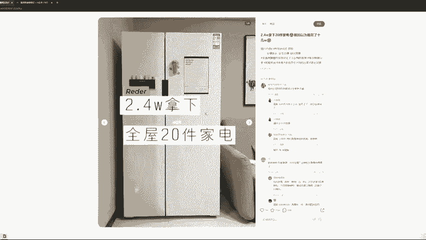
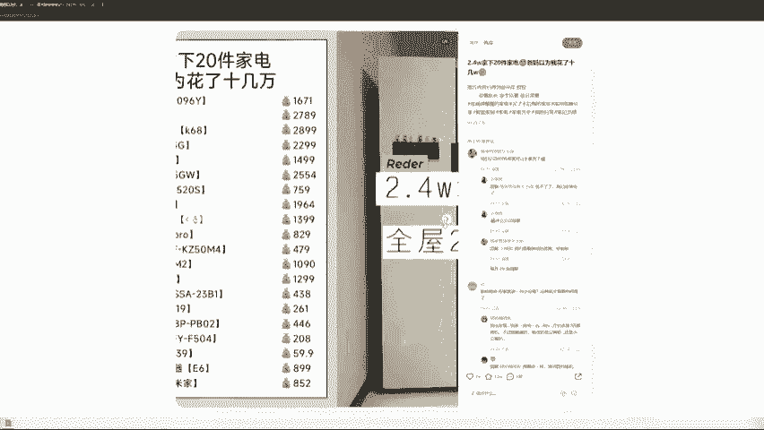
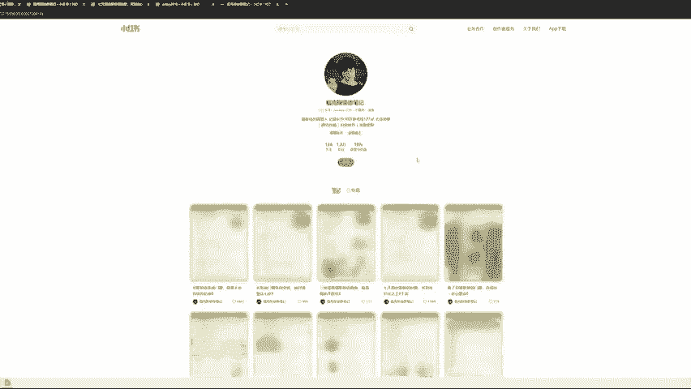
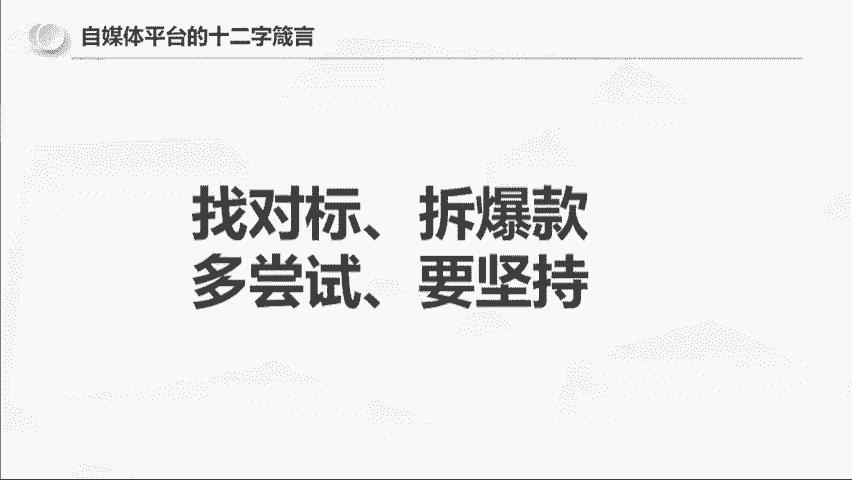

# 【小红书运营实操教程】最详细完整的小红书运营实操教程，适合所有新手学习小红书起号丨小红书笔记丨小红书开店，全程纯干货，通俗易懂！ - P13：9.账号孵化商家破局 - 不知名的代码M - BV1yw4m1k78C

那么最后总结一下啊，就是我觉得作为电商商家，一个小红书的一个破冰流程呢，你们要明确内容是有区别的，有的内容是吸引眼球的，有的内容是调动思维的，有的内容是有下单欲望的。

这是三种不同的内容，我们到网页上看一下。

好吧。

给大家看一下啊，客户怎么来的，给大家展开一下好不好，这篇笔记这篇笔记就加了200号人，来给你们看一下，怎么带你们看一下，记得啊，内容的三种形式，内容是有吸引眼球的，调动思维的和有下单欲的。

如果说你的目标是去卖货。

那你就要做有下单欲的内容，来我们看一下啊，来问你们吧，像这种是吸引眼球，这个茅台是吸引眼球的，还是调动思维的，还是下单欲的，这个茅台他就两瓶茅台是吧，啥也没写，然后有互互动，有数据。

这种所谓吸引眼球下单欲还是调动思维啊。

眼球是吧，眼球思维下单，这个吸引眼球的好，这个呢2。4万拿下20件家具。

这个是眼球思维还是下单月。

下单吗，我想问一下大家，这个地方哪里有下单，哪里有下单，你假设你是一个读者，你从他的评论区看，哪有别人想找他下单的这个欲望，没有的，有思维，就是人家会去看它里面的东西，有字啊。

比如说618双11的一个购买时间，但是没有找他下单的，是不是他的评论区，你们可以看嘛，没有没有人找他买，这个是思维，这个是没有下单的，就是用户对于这个作者来说是没有下单的，这个啥眼球思维下单欲。

给他找一个找一个这个有下单欲的，啊啊这种这种这个这个是啥，眼球思维下单域，这个啊第一次退茶位费成功结算，这个是眼球思维，下单月，这个是思维啊，思维就是如果你们看了这篇笔记之后。

你们会去思考他的这个东西做法对不对，然后这个做法你有没有必要学，你学了有没有用，这个是思维，来我们要找到有下单欲的东西，因为你们要卖东西，你们要知道什么叫下单玉，如果这个东西都没有下单预。

你做了之后他没有成交，那太太正常了，看我吧，告诉你们什么叫下单欲，随便看，眼球思维下单月能看见这个小字吗，我只想知道结论，长沙买哪家，我只想知道哪里可以安装，同长沙，求推荐，求推荐，求推荐。

求推荐求推荐，已关注，求推荐，求推荐，求推荐，求分享，求推荐，求推荐，求推荐，再看这一篇，我只想知道结论，长沙买哪家啊，这是同一篇，看这一篇好吧，我主同长沙，麻烦拉我进群，你选好了吗，选哪一家。

我看吐了，拿不定主意，同长沙，想进群求笔记，再给你们看一下啊。

这一篇求推荐求推荐求推荐啊，所以你们要有意识的去区分吸引眼球，调动思维和下单欲，如果说你们赚的钱，你们是要赚陌生人的钱，那你们就是下单欲，如果说你们想赚粉丝的钱，那么你们需要有调动思维能力和有下单欲。

然后接下来你们还要干嘛，你们还要明确学习的账号，明确运营的方向和明确运营的结果，还记得我给你们看的三个卖衣服的吧，如果不管你们自己要做什么，其实就是四句话，找对标，拆爆款，多尝试，要坚持这12句话。

我做任何一个平台，其实就是靠这12个字，先找对标装修就研究装修水果，研究水果，衣服，研究衣服饰品，研究饰品，拆爆款，你要去去猜到别人的这个东西为什么会爆啊，这个东西，反正后面还会有老师去分享具体的东西。

但是你知道就这四个是，第三个是多尝试，第四个是要坚持，然后我想问一下，大家告诉我你们这一次的目标是什么好吗，做出一篇100点赞的笔记，是你们这次的目标，你是小白，你就评论100点赞。

如果是1000点赞就评论1000点赞啊，你们的目标就是，只要做出一篇这样数据的笔记就行了，如果你们的目标是做出100粉丝的账号，就打100粉丝，1000粉丝就打1000粉丝，做100成交就打100成交。

1000成交就做一，1000成交，100利润就打100利润，1000利润就打1000利润，大家定一下自己的目标好吧，看一下大家的目标啊，大家都给自己定一下目标，我看一下你们的目标。

然后也给后面的这个分享啊，来确定大家的一个，翻下嗯，好的好的，你们打着啊，因为我到时候会去把这个数据啊，我会去分析一下，这个尽量啊去帮助大家达到自己的一个目标，好吧好吧。

然后希望大家知道龟兔赛跑赢的不是兔子，是龟，有的人他很聪明，但是他可能觉得说这个事情对他来讲太简单了，他不愿意去做，反而真正出结果的人是坚持不断迭代，往后走的人好，接下来问答环节，大家有问题就提问啊。

我讲了75分钟，稍微差了点时，大家有问题都会提问啊，有人问啊，怎么让人关注涨粉啊，这个问题就是说，当你的内容是对别人有价值的时候，其实这么理解吧，这么理解我这个问题，我这么回答你啊。

你的问题是怎么让人关注涨粉，你打开你的小红书，打开你的小红书，打开你的关注列表，你扪心自问，你问你自己，你为什么要关注他，再看第二个人，你为什么要关注他，再看第三个人，你为什么要关注他，你把列表分析完。

分析你自己，你心里会有答案，第二个是一天几篇笔记发布，这个看你自己，看你自己就是内容的发布数量啊，我觉得这个没有固定的一个要求的，你像我如果去写这种原创内容，我基本上我真的三四篇。

三四天我才能干一篇出来，这个自己把控就好了，啊有人说做了一个多月，出了三单全退了，又暂停了，这就是我后面说的嘛，要尝试，其实很多时候你能够出三单，其实就已经代表说你对产品，对内容是比不撤单的人要强的。

这个时候那你要去找这个问题在哪，出三单，退三单是什么原因造成的，就我你可以看到我做这个事情全流程的过程中，我问了自己很多的问题，每个问题我心里都有答案，啊黑梦问怎么让人产生互动性，互动性。

我刚刚你你如果后面来的，你看一下回放吧，我大概在五六十分钟的时候，我拿我的账号说了，怎么样去调动收藏，调动评论，互动是什么，互动就是点赞收藏评论转发收藏和评论，我都已经给你们看了，实际我是怎么做的。

啊有人说我开店一周，现在每天还有十几20个的赞，浏览量也是有个几百个，但是一直不出单，不知道该不该换品，这个你就是你要去看具体的东西啊，你这个我没有看到具体的笔记，具体的商品我没办法判断。

你也要去查你的这个类目，你不出单，究竟是你的价格比别人卖的都高，还是说就是说你先确定你的产品有没有问题，如果你看了小红书，同样的产品，你觉得你的质量比他好，或者说相同质量你的价格比它就是合适一点。

或者说价格也差不多，你觉得你的产品没问题的情况下，那你再把你的这个报关和笔记内容放大一点，啊有人问做人设带的产品必须是一个行业吗，我这么回答你这个问题，对于这个东西啊，我这么回答。

你看你这个人的销售能力有多强，销售的最高境界是别人相信他这个人，不管他卖什么产品都会去买，你就想一个道理啦，不管是罗永浩也好，还是董宇辉也好，没有说他只能卖一种产品的，销售的最高境界是卖人。

卖产品是前期，啊有人说我们卖水果怎么有那么多内容找对标，你在小红书，你去搜产品也好，搜水果也好，收这个方式也好，其实你们去他是有无限种方法的，包括助理今天在群里也买了，你卖水果，你只能去发水果吗。

可不可以，假设我是一个开水果店的，我可不可以发我的就是说创业日记啊，我开了一个店啊，今天卖了多少单，明天卖了多少单，可不可以发创业日记，我可不可以用另外一种形式，一种心态啊，就是不要把思维局限在啊。

我是卖香蕉的，我就天天拍香蕉，天天拍香蕉，你去小红书搜一下香蕉，你看下什么样的东西有下单欲，只要是有下单欲的内容，都是你可以研究的内容，刚开始小眼睛数多少是正常的，个人理解啊，个人理解小眼睛。

我觉得你新发一篇内容，200左右的小眼睛是正常的，如果说你的东西你一发只有100个小眼睛，然后你接着发几篇都只有100个甚至40个，50个，我的经验啊，是这个账号的权重是比普通账号要低的。

我会建议你直接注销，重新注册，因为我曾经有一个后面有一个账号，就是这样的，搞了搞了两次，就是一发就是100个，50个，60个，我注销重发，注销重发，我第三次我发一篇，就在就拍了个窗户。

200个小眼睛之后，我再发同样的内容，那篇笔记点赞加收藏就过百了，好有人说怎样找到适合自己的对标账号，我觉得你们去思考对标账号啊，第一个是要思考几个问题，第一个是这个账号它是否能够达到你的目标。

你的目标，如果我就是100个点赞或者说100个粉丝，那只要他能够内容能够吸粉，能够有人互动，那就已经是属于你能够借鉴的对标账号了，如果你的内容是希望卖掉东西的，那你就一定要找有下单欲的账号。

下单预可以从评论区可以看出来，有下单预的账号里找到之后，比如说你找一十个20个里面，再从这一二十个账号里面找它的内容，你也能够创作出来的，然后第三个是这个内容它可以持续更新的，再然后你不是说那再。

然后你可以持续去找你这个赛道的东西，你可以去继续去迭代你的内容，它不是说你一定是固定的一个东西，怎样才能输出更高质量的内容和优化，我觉得啊你能够输出更高质量的内容和优化。

一定是你对用户要看什么更加更加理解，又或者说嗯你可以去看，比如说你要去讲一个知识点吧，嗯举个例子啊，FEBIN这个单词FAMILY，那我们同样是英语老师，同样是英语老师，我们去讲单词FLFAMILY。

那我不管别的老师怎么讲，我会告诉你怎么去记住这个单词，FEBLING是家庭的意思，F代表father，爸爸and mother妈妈，I love you，所以爸爸妈妈我爱你，就是family家庭。

那么我用这样的一种方式去讲解family这个单词，是不是一下就比那种纯讲单词的高级多了，那这种内容就会比纯简单词略好，那我会我是怎么来的呢，是因为我看到了这一条，我当时就觉得这个老师真牛逼。

我记得很清楚，我相信我今天告诉你们，family等于father and mother，I love you，你们这一辈子都会记住，所以好的内容就是多刷多看，多借鉴啊，更高质量的内容啊。

如果你没有原创高质量内容的能力，你就多看看了，你就有灵感，好有人说小红书开店红利能有多久，嗯其实红利这个词呢它是一个大盘数据，真正你能够赚到钱的人，其实红利一直存在，因为消费需求是没有改变的。

因为人永远有需求，那平台红利的话，我觉得就是到他这个日活月活见顶的时候，我自己啊个人判断，我估摸着小红书这个app，我爸妈还是不会去用的，他们虽然会用抖音，会用微信还是不会去用的。

所以13亿人减去老老一辈的，我估计到67亿的这个用户没问题，还有两倍的增长，没啥问题吧，两到三倍，有人说权重是经验吗，还能在哪里看到，而账号权重是这样的，不用过于神话。

我简单跟你们说一下账号权重什么逻辑啊，就是，我们大家去发内容都是正常权重，但是如果说我的粉丝，我的账号有1万粉丝，也只意味着说，我的起始报关比你们多给一点而已，但后面大家还是公平的。

但是如果说你的账号数据异常，比如说人家发的都有两三百个小奖金，你一发就只有100个几十个，这个就属于账号异常，就这三种情况，一种是大账号有一点点基础的加成，第二个是正常账号，大家其实都没啥区别。

第三个就是异常账号，没有其他的更多的悬念了，啊有人说听完我的接下来怎么做，接下来大一老师还会再去给你们讲，详细的定位的内容啊，我们今天讲的主题是，小红书平台运营的底层逻辑。

和我是怎么样从0~1把账号做到1万粉丝的，啊有人说小眼睛正常200浏览情况下，是发布笔记后24小时吗，对就你发完一天有个200眼镜，你这个账号就是正常的，然后有人说需要养号吗。

养号这个东西呢严格意义上来讲是个伪命题，但是你可以养一养，养号的作用在什么啊，在告诉平台，你要看什么和不看什么，就是比如说我们你像我我做装修，那我就会去看一些装修相关的东西，比如说设计师。

比如说设计方案，而不是去看那个这个小姐姐是吧，你越看的越多，小姐姐她越给你推，小姐姐，就是还是要让自己在使用这个平台的过程中，自己做的这个类目，还是要占据25%到30的阅读量吧，我觉得其他的你想看什么。

还是可以照照常看的，好吧，那我看大家没有什么太多的问题了，那今天的分享就到这里，感谢大家啊，接下来还会有大一老师去给大家分享账号定位，以及更多的实战干货，这一次所有的三位老师全是实战派，没有一个理论派。

好吧。