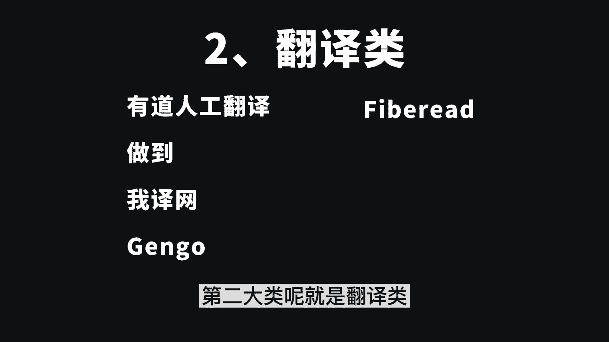

# 【小红书运营实操教程】最详细完整的小红书运营实操教程，适合所有新手学习小红书起号丨小红书笔记丨小红书开店，全程纯干货，通俗易懂！ - P14：副业平台 - 不知名的代码M - BV1yw4m1k78C

首先来问你一个问题，你知道有哪些兼职的网站或者平台吗，可以打在屏幕上跟大家一起分享一下。

我最近啊花了两天的时间，总结了60个可以兼职的网站，今天呢全部打包好了，你可以一并拿走，那下面呢我会分为两大板块来讲。

第一个板块呢就是非技能类的，说白了就是下苦力气的，不用动什么脑子，另一个板块呢就是技能类的需要动脑子，但是呢会有一些税后的收入，那甲方可以根据自己的一个情况来进行选择了，那先来具体讲到非技能类的。

它还可以分为任务类，就是做任务类的副业呢比较简单。

没什么难度，适合于所有人群，不过呢收益是有限的。

每天能赚个十多块钱吧，但是对于一些学生党做零用钱来说还是很美的，第二类呢就是跑腿类，跑腿类的兼职，工作的性质呢就是出卖劳动力了，只要你愿意干就行，多劳多得，第三大类呢就是问卷调查类。

做问卷调查获取积分，积分可以兑换礼品或者现金奖励。

人人都可以做，第四大类呢二手类买卖二手商品赚钱。

或者是倒卖商品赚钱，那以上的这些呢就是你干一份活，就会有一份活的收益了哦，还有一些就是给别人做推广的，比如说淘宝联盟，京东联盟，多多进宝，天眼查推广。

大江联盟，再来讲到基本类的，比如有摄影类，就是出售你自己拍摄的图片，或者自己制作的图片上传到平台上，只要有人购买了就能赚钱，而且是长期有效的，第二大类呢就是翻译类。

这个呢是对外语有一定的要求，入住之前呢会进行一些考试，通过后才能接单。

那这类型的兼职呢难度系数稍微会高一些，那第三大类呢是写作投稿类了。

对于一些文笔比较好的，又想赚钱赚生活费的大学生，可以去试一试，第四大类摄影类，适合会PS做PPT之类的人。

比如说设计一个logo，表情包等等，那第五大类声音类，用自己的声音赚钱，比如配音电台主播有声小说，现在有声小说特别的火啊，大家可以去尝试一波，第六个自媒体，这个呢也是我自己正在做的。

那自媒体平台赚钱的方式是有很多的。

平台呢也是特别多的，你可以先去了解各个平台，然后选择一到两个适合自己的去做，开始做之前呢要把平台的规则熟悉好，然后呢再去创作了，像这类型的兼职呢，我也非常推荐你们去做。

因为我上个月呢也做了一个影视剪辑的账号，收益呢是有1万多的。

你的视频呢只要有播放量就会产生收益，简书我见到一个8万粉丝的作者。

每篇文章的打赏都在2000左右，知乎上万的粉丝给别人点个赞，报价都是200。

YOUTUBE上面上传视频的收益是最高的，1万的播放量可以达到上百元。

像这种兼职是不是很香，想要开始，但不知道怎么做的，小可爱们不要慌哦，给up3连，并在下方评论区评论一，我会给你准备一节自媒体新手的直播课程，来教你怎么做，那最后总结一下，有人在哪里花钱。

就有人在哪里挣钱。

