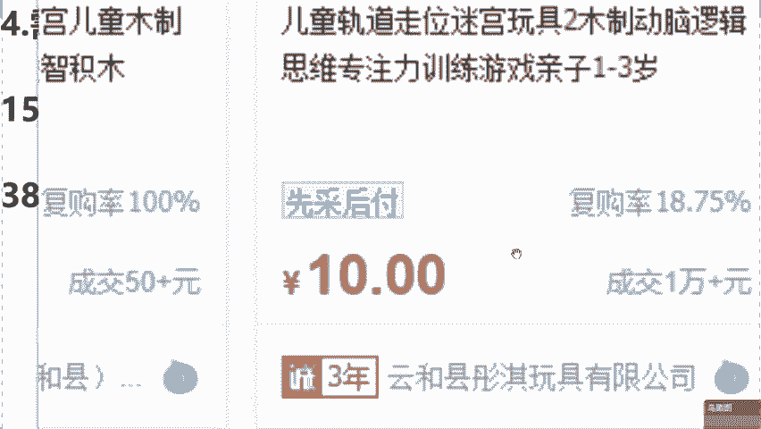
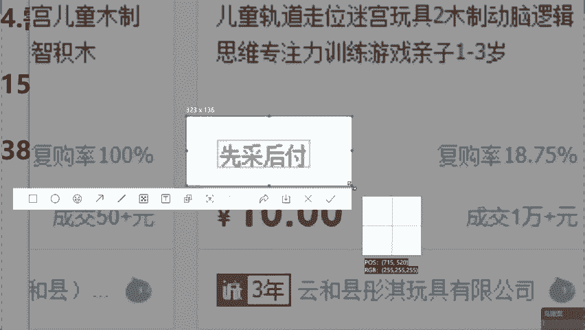
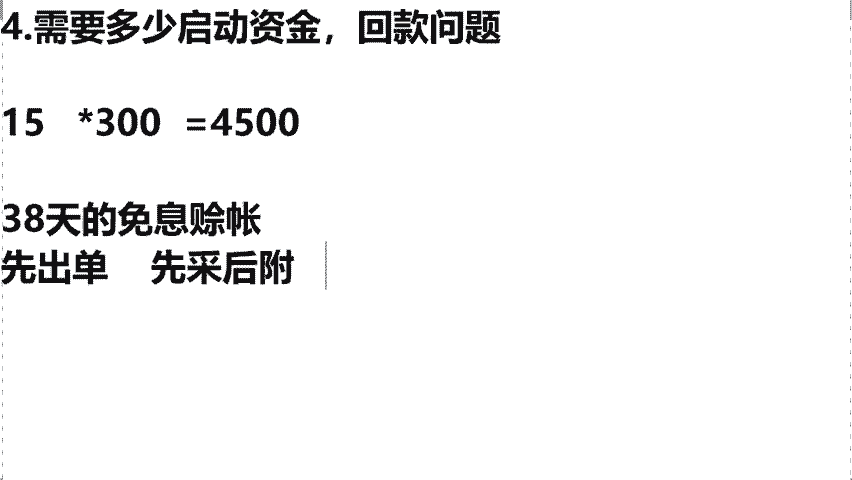

# 【小红书运营实操教程】最详细完整的小红书运营实操教程，适合所有新手学习小红书起号丨小红书笔记丨小红书开店，全程纯干货，通俗易懂！ - P15：8.新手需要多少启动资金 - cqrl4632 - BV1J4421S7GE

那么在这儿的话呢，我打开我的一个后台数据，咱们也去看一下怎么去提现，好吧，来。这是我的一个后台，你们可以看到，这是我的一个叫做云朵内衣的，后台，是卖内衣的。这个里边提现金额都在这个上面啊。

它上面是有三个板块，一个叫做银行卡板块，还有我们的微信和支付宝，你就是想提现的时候，输入金额啊，把你这个密码输入过后，提现到你的银行卡里边，那么在这儿我说一下。

我刚才反复强调小红书是在鼓励新手去卖货赚钱，所以他给我们的扶持是非常高的。你作为新手，你在提现的时候，它不会收取你任何一分钱的佣金，明白了吗？你今天咱赚多少钱，这个钱直接到咱们的口袋里，明白了吧？

这就是我们今天虚讲到的小红书店铺啊，我们今天客服问题，售后问题回款问题。来各位这三个点，大家听明白没有？明白的话，把明白两个字给老师，我打在公屏上面。😡，袁文硕老师，我今天做你的3分之1就行了。

我今天教给你们玩法是完全拷配了我自己1比1复刻的玩法，你能做我3分之1吗？你怎么得做我一半啊，是不是啊？😡，那么如果说这个位置大家都听懂理解的话呢，接下来来讲到今天的第四个问题，就是我们说这个小红书啊。

很多人很能去担心老师，我作为这个小白同学啊，就担心今天做店铺需要这个拿出多少启动资金呢，对吧？包括回款的问题啊，我没有钱该怎么来做呢？同学们，前面我也说到过了啊。呃，你今天哪怕你是零启动资金。

我能让你们去照样的去开店，照样去拿货，你照样去赚钱。来，同学们，我问一下这个方法想不想学零启动资金怎么去开店，怎么去赚钱。如果说来想学的话，公平飘花，我去看一下，我来告诉各位。

这个方法到底应该来如何去学习，到底应该来如何去做，对不对？😡，都想学是不是啊？对呀，那你就认真听课，不要走神，竖起耳朵给我好好的听啊。嗯，我在这儿去举个例子。你比如说我们今天啊咱们这个爱在同学是吧？

你今天去拿货了，你的拿货成本价是15元1元单啊？如果今天你去店铺里去卖了一单，你是不是要拿出15元去垫付货款？同学们，你要知道小红书官方给我们的流量扶持是非常多的，你是非常容易去爆单的，什么叫爆单。

你比如说咱今天我们这个无奈同学，你今天可能说只有一单。但对不起，明天流量激增直接100单，后天直接1000单，你突然爆单了，把这个流量增长了怎么办呢？我直接可以去拿一个同学的后台去看一下啊。

什么叫做爆发是中的。😡，来，我给你们去点开去看一下这个学生，他的第一个月啊，同学们店铺数据只有一个单子，你看到了没有？那么第二个月直接去报了多少个订单，报了5000多个订单啊。

同学们直接是做了1个87000的一个销售额，那这个时候怎么办呢？你比如说你今天你跟他一样，对吧？你也报单了，你拿货成本价，同学们15元钱。咱们今天这个你就算少一点，你就报了300个单子，对不对？

你是不是需要这个时候让你拿出4500去垫付货款呀。所以同学们我想问一问大家，就如果说你去做小红书的时候，你去报单了，需要你拿出4500去垫付货款的话，大家能拿得出来吗？如果说你能够拿得出来的话。

你在这儿给我打上个能字。如果老师啊，我今天我拿不出来的，来，你在直播间把不能两个字给我敲好了，我去看一下。😡，有说能的啊有说不能的是不是啊，我看到了啊。😡，很多人都说不能是不是啊？

那么同学们我来告诉大家，有敲能有敲不能的这两个方式分别应该来如何去做呢？其实同学们我知道啊，对于我们今天普通人来讲的话，肯定四五千块钱是有的。那如果说你现在连四五千都拿不出来的话。

我们就需要你静天来想一想了，在做小红书之前，你当下的这个行业做的到底对不对呀，能不能够让大家去赚到钱呀，对不对？所以如果说你今天能够去拿出货款的时候，你这个时候拿着自己的一个流量的启动资金。

你去垫付货款就可以了。我们在小红书赚钱呀，它是最晚10天啊去到账的。老师我是从小白去过来的。所以说今天公屏上打不想同学啊，我真的没想的是什么？老师我不是拿不是拿不出来，我是不想拿出来，我非常懂你们。

那么像这样同学怎么办呢？听好了，如果说你不想拿的话，我们今天直接选择选择平台的叫做38天的免息赊账。意思就是说我们去先拿货啊，你不要付钱，😡，到这个货你卖出去之后，把钱还上就可以了。

零启动资金就可ok不需要你去压货，咱们就卖的出去，你卖了你就赚钱，你没卖ok咱没有任何的损耗啊，包括这个商户的成本呢，这跟咱们没关系，这是商家的事，明白了吗？那今天具起来怎么去做呢？

我在这儿现场的啊去演示一遍，跟住了我。😡，你比如说我们今天还是老师啊，我想去卖这个拼图，对不对？那我今天去找厂家去拿货了，我现在拿不出来这么多钱怎么办呢？来，你会发现在拼图下方它有四个字。

同学们先采后付来，同学们啊能够看到这四个字，先采后付，同学公屏上打上看到两个字。😡。

能看到是不是？其实的话同学们这个先采后付不用我去讲，对吧？自愿意思啊啊都能够去理解，这个是1688给到我们的一个新手卖家的扶持。最开始叫什么叫38天的免息赊账，意思就是说先拿货啊，不要付钱。

等你这个回款过后把钱还给平台就OK了。这是1688再鼓励新手来做生意给的一个政策，明白了吗？😡，那么在这儿同学们先采后付的流程听好了，我来去捋一捋啊。首先啊咱们今天第一步的话，你得干嘛，你得先出单。

同学们，你出单过后，为什么？这个时候省掉了咱们的一个你压货的一个钱啊，包括来讲老师，我这个囤完货之后，这个商品损耗的问题。第一个点，不用你去压货了，明白没有？你先去卖掉它。第二个一定记住了。

当你去卖完过后啊，选择先采后付。😡，不要先把那个钱去，我们先赊他的货，把厂家给他发出去，你赚钱过后，他是最晚10天去结算的。我们只需要在38天之内把这个钱给他还掉就OK了。像你借花呗是一样的，对吧？

你比如说你设置的是20号还啊，你在15号发工资了。这个时间对于咱们来讲是绰绰有余，完全足够的，明白了吗？所以不管说今天你是不想拿出来的对吧？还是说你现在是没有钱同学都可以选择这个免息赊账，来。

我问一下大家呃，就如果说你们接下来用这个方法去来做小红书平台的话，你们觉得可以吗？这个模式如果说能够去接受同学，你在直播间啊把可以两个字给我打在公屏上。😡，能接受是不是？这我们是去讲到的。

就是如果说你一下子出单太多啊，怎么办？是不是我讲的很清晰了，选择我们的一个先采后付。那么如果说都听清学会的话，同学们来讲一下今天的第五个问题。😡，我看到说老师这个非常可以，是不是？

这对于新手来讲真的太好了，不用担心这个稳启动资金的问题了。😡。

