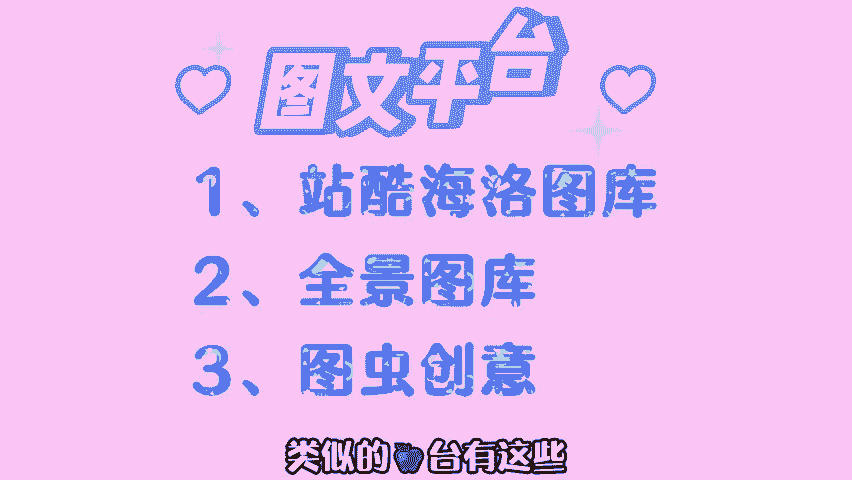

# 【小红书运营实操教程】最详细完整的小红书运营实操教程，适合所有新手学习小红书起号丨小红书笔记丨小红书开店，全程纯干货，通俗易懂！ - P16：副业兼职 - cqrl4632 - BV1J4421S7GE

在某户上看到一个问题，兼职选线上还是线下，当然是线上了，在家吹着空调，拿着电脑就能赚钱。为什么要选线下呢？风吹日晒又雨淋的线上兼职也是我一直在做的那这期呢将会盘点15个免费靠谱的线上兼职。

适合学生脑婆妈上班族和各种有业余时间的你第一个，阿里巴巴云客服在家工作有电脑即可，工作内容呢就是回答客户的问题，后台都有话束直接复制粘贴，没有什么难度。实薪15到221月1结。第二。

美团拍店拍摄外卖店铺照片，一单任务4到5元，逛街就把钱赚了。不同的地区任务难度和价格略有不同。第三，众人帮兼职任务平台任务难度不同，价格不同，几块钱的任务几分钟就能搞定，不费很大力气，还能赚个早餐钱。

第四，每屋清单自买省钱分享赚钱，邀请用户注册，还能得到40%的佣金。类似的平台呢还有高佣联盟。第五，卖资料，有人靠一套6月的资料就能赚到3万块钱。如果你的手上有有价值的资料。

比如考研四6级真题面试经验等。😊。

可以将他们打包放在这些平台售卖。第六，投稿文笔不好的，可以在多半稿费银行找任务5到10元。一篇文章没有什么难度，10分钟就搞定。有文笔的可以在这些平台上投稿。单片价格根据质量在50到2000左右。

第七等音小项目，搜索爆料进入热点爆料，通过的视频一条200到300。第八，饿了么外卖赏金一单3到15，外卖是刚需推广容易，对消费者来说，偶尔能领到大红包，比如20减18，别人点外卖省钱，你赚钱一举多得。

很多商家都在做第九云监督帮助拖延症早起或者完成目标，可以开一个店铺或者做社群，比如说早起打卡群或者监督群，赚钱的同时呢，还可以积累用户做后续变现，第十翻译签字80到200，通过平台接单。

我有个朋友全职做翻译一个月8000左右。翻译赚钱的平台有这些第十一，做平台讲师卖课。前期辛苦后期躺赚我的两套课程呢至少为我带来了几千块的收益。依靠平台流量无需推广售后，平台选择和录克细节给大家。

出来了，赶紧截图保存。第12个自媒体分为图文自媒体和视频自媒体，常见的平台呢有头条号、大于号、百家号、企鹅号等等，这也是我正在做的。自媒体平台赚钱方式有很多，平台也有很多。

你可以先去了解各个平台选择1到2个适合自己的去做开始之前呢要把平台规则熟悉好，然后再创作像这类兼职呢我也是非常推荐你们去做的。因为我上个月做了个影视剪辑的账号收益就有1万多。

你的视频只要有播放量就会有收益。简述我看到一个8万粉丝的作者，每篇文章的打赏都在2000左右。直呼上万粉丝给别人点个赞报价是200元 YouTubetube上传视频收益最高1万播放可以达到上百元。

这种兼职是不是很香想要开始，但不知道怎么做的小可爱们不要慌给 up三连并在下方评论一，我呢会给你们上一节自媒体的新手直播课来教你们怎么做。第十三卖照片拍的好的照片一张就能卖几百。

有的平台采用版全买断的形式。每张照片根据质量在50到200左右。类似的平。

还有这些第14PPT代做做兼职设计师自由接单4六分成一套200的PPT，你能拿80块，对设计水平要求不高，还有不少找资料套模板，这种价格不高，但是几分钟就能完成的单子。如果本期视频内容对你有帮助。

记得点赞、收藏加关注。本期视频呢就到这里了，我们下期视频再见。

