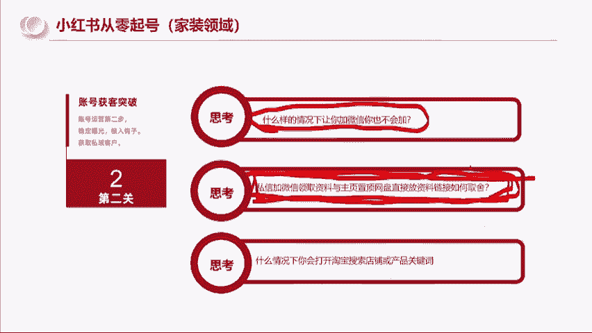

# 【小红书运营实操教程】最详细完整的小红书运营实操教程，适合所有新手学习小红书起号丨小红书笔记丨小红书开店，全程纯干货，通俗易懂！ - P5：6.小红书从零起号第二步 - cqrl4632 - BV1J4421S7GE

所以到第二步啊，就是。第二步是啥了？就是我们通过我们的内容，是不是获得了报关，我们怎么样去获取这个客户啊，第一步是获得笔记和获取报关。第二步是获取我们的目标用户去添加我们的微信啊，因为我是思域玩法。

我下面讲的私域玩法，但是同样的原理是一样的。比如说我做私域的玩法，我思考的就是。

当被一篇笔记被人家被吸引了之后啊，他什么情况会进入主页场更多。然后什么样的内容跟账号，人家会认为不可信不靠谱啊，什么样的情况，你会希望和作者取得联系啊，这些问题都是在我做的过程中，我就会反推的。

我会我会自己带入。

就比如说我看了十0篇笔记，有谁是我想关注的，有谁是我一看这个账号，我就觉得这个人靠谱可信。有谁的账号是我一看，我就觉得这个人有可能是个骗子，不能信。像刚刚那个我问一下大家啊。

你们觉得刚刚那个卖鸭脖的。😡。

还记得吧？前面那个搞家加盟的，在别家评论区说自己从负债500万到赚了500万的。你们觉得那个人是好人还是马扁，告诉我好不好？前面那个卖鸭脖的，你们觉得他是好人还是马扁，他说他自己负债500万一年赚回来。

他是好人还是马扁。😊。

啊，你们说的是马扁是吧，为啥呢？因为。

因为第一这个数据太浮夸了。第二它的主页内容就是搞加盟的。

加盟这个东西码点的概率很大。

是不是？所以你们就会感觉说你是会想看，但是他这种东西吧，其实对。

对一些有过认知的人，或者说清楚加盟套路的人，是会让他觉得不可靠的。

好，那我们再往后思考，就是什么样的情况让你加微信，你也不会加。

以及私信加微信领取资料和主页网盘置顶饭资料，你们会如何取舍？

哎，其实这个其实这个问题啊和这个和这个。

啊，这个戴老师他的操作是一样的。如果你们当时你们有没有想过啊，如果当时你们通过他的抖音账号进了他的粉丝群，他说你们要加个人微信才能发资料。

你们一定是有一些人不会去加他的。

那戴老师是怎么做的？他是你们进群。

他把链接二维码对吧？发到群里面了，然后只相当于直接把资料给你们了。

所以有的时候你会发现说强制别人加微信，再给资料和你只要进去，我就给你。我没有说我要强制链接你的意思，是不是后者更加让人家能够看到真诚。

是不是同样的，你们又可以带着这个思维往后面去思考什么样的情况，你去看小红书笔记的时候。

你看着看着，你会打开淘宝店去搜索店铺或者关键词。

是不是是吧？你有人有有人说他说真不想加人，是不是？所以就是。

我们要思考的轨迹是什么？我们要思考的轨迹是人心，要思考的轨迹是人心。

而不是套路。因为戴老师是真心对你们的，他压根就没想加你们。他就是觉得说我知道小红书怎么做了，我想分享他分享了。哎，我有一些资料我可以整理给你们，我给你们了，对吧？我想去带一群人去尝试做小红书这个事情。

那么谁愿意来谁就来。

所以他是真心的，所以我们今天会相遇在这里。所以那到我这后面你知道做思域的话，你还会遇到什么问题？就是那你加了人之后，你怎么做好友管理，对不对？你要不要建群，群里面的人谁是值得帮助的。

每个人的想法都是不一样的。就即便是。咱们的100多个人群对不对？你会发现啊。有人有不同的价值观的。同样的一个群，它的利和弊是什么？啊。

微信群邀请好友拒绝还是通过这些就是我在做这件事做这个事情的过程中会经常思考的问题。我之所以能思考出答案，能做出答案，是因为我先把这些逻辑想明白，想明白之后再决定我要怎么去做。

