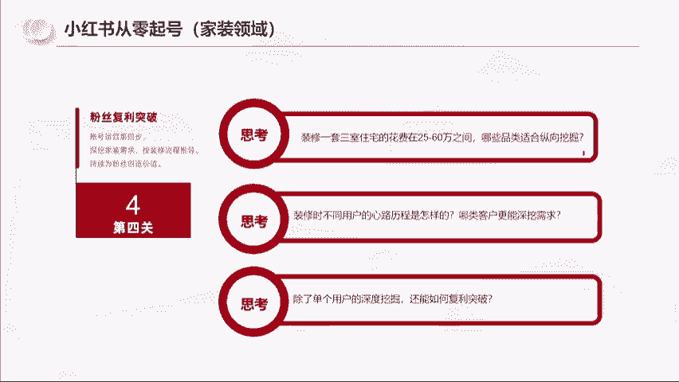

# 【小红书运营实操教程】最详细完整的小红书运营实操教程，适合所有新手学习小红书起号丨小红书笔记丨小红书开店，全程纯干货，通俗易懂！ - P7：8.小红书从零起号第四步 - cqrl4632 - BV1J4421S7GE

而且这个事情我能做成，其实我还是完成了小红书的这个调性，就是真诚分享。我是真诚的在做事情。我没有说我是因为谁给的佣金高，所以我去帮谁卖，我一定是找到好的东西。

然后去告诉他们。

啊，这个包括这个成交也是一样的啊，这里啊跟大家讲一个细节，就是当我在21年10月份启动账号的时候，到22年4月份啊，我整个这个这张图这个PPT是去年4月份那个。

年年审过的下个月呃呃5月18号要去杭州是第三年了。那个讲示的认证。我在2月份的时候成交了20万，我在3月份的时候成交了170万，4月份成交118万。这个数价我觉得不重要，重要的我觉得是这个玩意。

这个玩意。为什么我要在4月份的时候去开我前面的成交证明，你们能想到吗？就是当我有了成交之后，我为什么要在4月份的时候去开成交证明，你们能明白能理解吗？嗯。大家思考一下。

为什么我会在4月份的时候去开一个成交证明？因为我要借力打力。这个其实跟你们做小红书也好，跟你们以后做任何东西都是有关联的。什么意思？其实真正的山寨不是说你拿很多的钱，你拿很好的资源去跟别人去拼。

真正的三战是什么？我们作为小白起家的，我们作为小白起家的人，包括你们你们要在这个互联网上去赚到钱，你们往往是是以小博大，你们是田忌赛马，要在局部劣势中去战去产生战争的一个赢家。

讲人话就是你要在你没有就三家是什么？他可能是你一万单，我给你多少价，你5000单，我给你多少价，对吧？比如说我们去。辛巴买榴莲是吧？你能拿100吨，我给你多少钱一斤？比如说给你251斤。

你只有11000单，那我给你28，你只有100单，我给你31斤，是不是这样的？那真正的山寨，你们要掌握到我如何只有100单的情况下，我要争取到他给我一万单的价格。为什么要这样子？因为你只有把价格压低了。

你有利润空间了，像你们做电商，你有利润空间了，你人做钱人做事的动力是跟你赚多少钱有关系的。你你一个月下来。你上班赚3000，你做小红书赚1000，你第二个也没动力了。你一个月赚3000，你做小红书。

一个月赚500你这个月嗷嗷的。所以说真正的山站是你在用小资源的情况下去撬动商家的。好政策。所以说我去开这个证明是要给后面的商家看的。我已经做到这个成绩，你的这个东西我预估我能做几百万，你干不干？

所以说我这个门窗的价格是怎么谈的？我上来我就跟他说，我1000个平方，你能做什么价？😡，我说我家有几套别墅，1000平方，你给我什么价？😡，好，他就给我一个价格，我说我告诉你，我没有两套别墅。

我只有30个平方，但是我有一个小红书账号，你相信我按这个价格给我，我给你再找啊970个平方，然后给他做到了。所以这其实是跟大家穿插了一个真正的你在落地过程中的一个商业经验。

那你们去做这个小红书是不是一样的。是不是可以拿到自己的一个基础的成交，再去网上去做？那包括思域的复购怎么去做，是不是怎么去做复利真诚？我去看工地对吧？两款瓷砖一和2就是大家会在一和二之间抉择。

你可以理解为两个口红的颜色，我会去拍两个照片去分享给别人。所以人家会把我的内容分享给他妈妈看啊，把他的同事啊，分享分享给，包括我看的东西我都会做很多的东西去分享给他们，就是真诚分享，友好互动。

