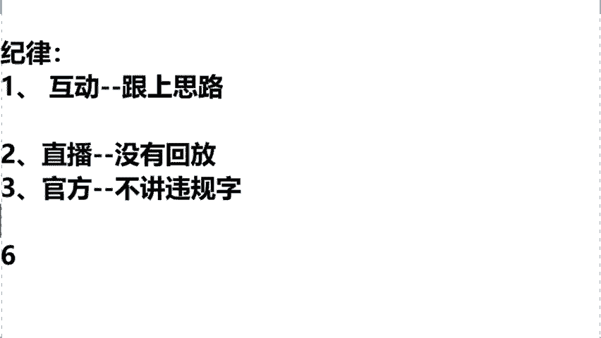

# 【小红书运营实操教程】最详细完整的小红书运营实操教程，适合所有新手学习小红书起号丨小红书笔记丨小红书开店，全程纯干货，通俗易懂！ - P8：1.新手为什么在薯店能赚钱 - cqrl4632 - BV1J4421S7GE

本堂课的内容主要是围绕着我们说零会员的新手小白如何去打造一家我们年收益不低于30万的小红书店铺。那么在这个这课程正式开始之前，我先来了解一下同学们的一个基础情况，对吧？我了解一下啊。

如果说大家之前有去了解过我们什么叫做属店同学，你在直播间给大一老师，我打上一个一字。如果你说老师啊，我今天我啥也不了解啊，我是第一次听说的。那么你在直播间给我打上一个零字，我来去看一下。😡。

同学们今天大概是一个什么样的情况呢？嗯，包括我们这个AR同学呀，X同学呀，是不是包括我们这个什么GO同学呀啊都在说是零基础是吧？还有一部分说是听过的啊，那么我了解了，同学们没有关系。

不管说你是清楚还是不清楚的，老师我今天会从零去教给大家如何去开一家属于你的小红书店铺。那么你包括在今天的听课过程当中，可能同学们会有一些问题啊，没有关系，这堂课的疑问的话。

大姨老师我都会去全部的去讲到的。那么首先我们要强调一下，第一个什么叫做小红书店铺呢？到底什么是属店呀。😡。

即使属店特别好理解，就是今天同学们，我们在小红书上，你去开一家属于你自己的店铺，这个就叫做鼠店了。那么在这个小红书平台，我们到底应该怎么去做呢？我们才能够去赚到钱呢？哎，针对这个问题。

大姨老师我给大家去整理了7个知识点。本堂课的话，我会围绕着7个点来进行逐一的讲解，包括来讲在上课前同学们去问到的。哎，老师啊，我今天作为小白同学，我该该怎么去开店呢？对吧？我开店需要哪些资料啊？

作为小白老师，我今天我没有产品没有货源怎么办呢？开始的话，小白同学需要多少这个启动资金呀，回款的问题，流量的问题啊，选什么品可以直接去报单呢？那么以上这些干货内容啊，本堂课的话，全部都会去讲到的。

那么首先我们先按照顺序啊，一个个来进行讲解。😡。

就是第一个问题。同学们经常去问的老师啊，我今天作为一个新手啊，作为一个小白，我在小红书平台去做，我今天为啥能够去赚到钱？老师，我今天我什么都不懂，我什么都不会的。我在小红书平台能够达到一个月入过万吗？

那来同学们给你去看一下，你像我的一个学生叫李娜啊，李娜同学的话可能跟教室里边大多数同学们情况是差不太多的嗯，甚至是情况比咱们还要差一些。因为这个李娜的话，他就是一个初中的文凭啊，之前跟我讲过。

说老师我相当于是这个初中都没有去毕业，老家是云南那边的啊，就是山区那块的，不太重视学习，刚刚在二0出头的时候，已经是两个孩子的妈妈了。所以说她在前几个月来跟我去学习小红书店铺的话，啊。

我的学生每个人是要你把这个个人情况去发给我，然后我去给你做一个个人的专属计划，所以当时我问了一下她的情况啊，李娜怎么说的啊。老师我说实话我是一个四无人员。今天我一没有货源啊，二没有。😡。

金三没有基础，四没有学历，真的是要什么没什么。但是老师风口摆在这，我确实想做想抓住销售风口的，希望大一老师你来帮我一下。所以说当时这个整个店铺啊算是我去帮他去代运营了，我去辅导他来开的这个店铺。

那么各位可以看到这个店铺在开起来的第一个月啊，同学们所有的店铺数据几乎都是零。因为当时的话这个店铺还没有开始运营，所以说一单都没有出。那么在这个第二个月啊，我帮他去做的时候。

你看在第二个月正式开始上架了，店铺已经开始出单了，第二个月直接是做了一个18684%的一个销售额，那么我强调一下啊，这堂课当中，我们所强调的所有的销售额，他不是咱们的一个利润。我们在做小红书的时候。

利润大概可以做到40%到60%左右。所以说大一老师的话呢，我在这儿啊，咱们今天拿出计算器，给咱们呢去算一笔账。我们看他这个销售额是18684块钱，对吧？那么我们乘以。😡。

像你最低的啊，按照40%利润去计算的话啊，他的店铺在第一个月就可以达到纯利润大概是赚到1个7473块钱了。而且同学们我们在做店铺的时候，你记住了，咱们是这个月往后做，你的店铺的数据一定是稳定。

持续在增长的。像你滚雪球是一样的，能够去理解吗？所以说你可以看到他这个店铺在第三个月的话，直接通过三个单品直接去报单了，销售额翻了个几十倍，做了1个18万的销售额。那么你在这儿同学们。

我们再用这个18万啊，我们算一个整数啊，用18万1个整数去乘以一下最低的按照40%利润去计算的话，什么概念？也就是说在这个我们说前几个月，李娜这同学一个月就做了1个72000的纯利润。

所以同学们我想问一问大家啊，就今天你作为一个新手小白，我今天如果说能带着你跟她一样做到我们今天第一个月纯利润7000多，第二个月直接翻倍干到7万来各位。😡，这样的一个变现速度，那么你们觉得满意吗？

如果说你们是觉得满意的话啊，你在直播间给大老师，我打上满意两个字。😡，那么包括今天课堂上面，如果你满意的话，所有的选品问题、上架问题我都会讲到啊，这个点不要着急，咱们今天一步步去来。那么今天公屏上啊。

所有说敲了满意的李娜同学的店铺怎么去运营的。后面的所有实操干实实操干货，本堂课的话都会去讲到的啊。😡。

