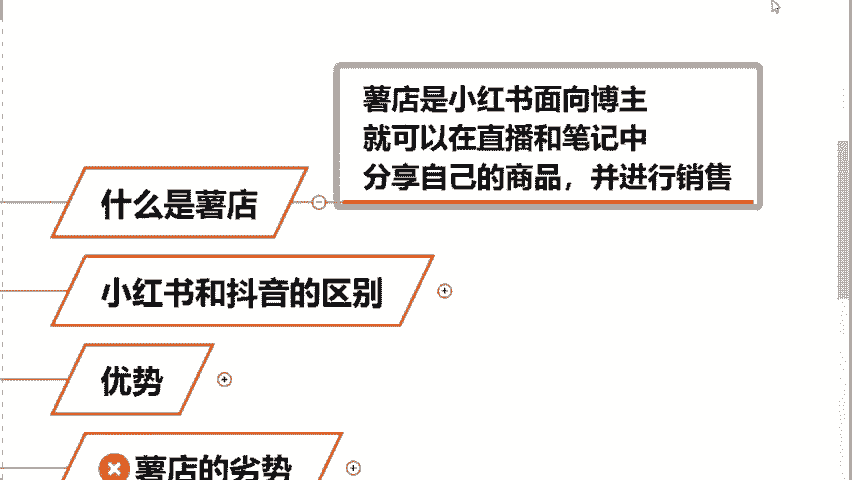
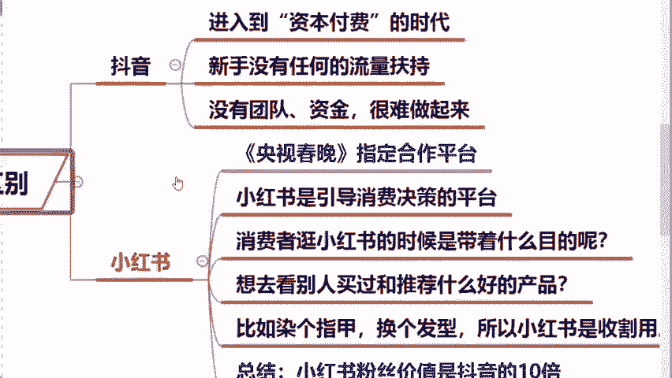
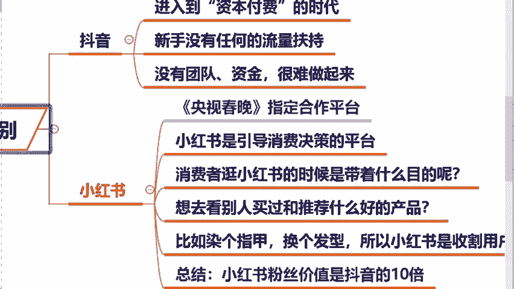
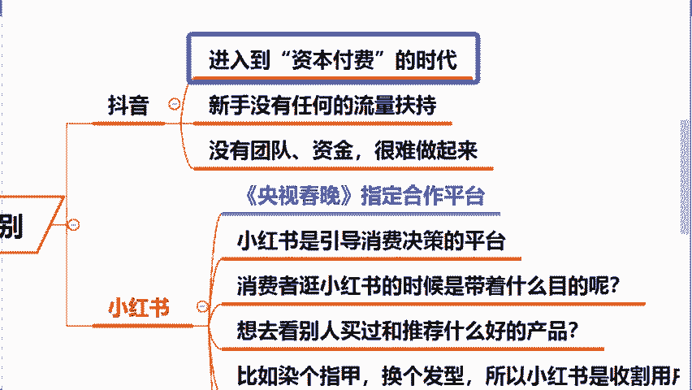
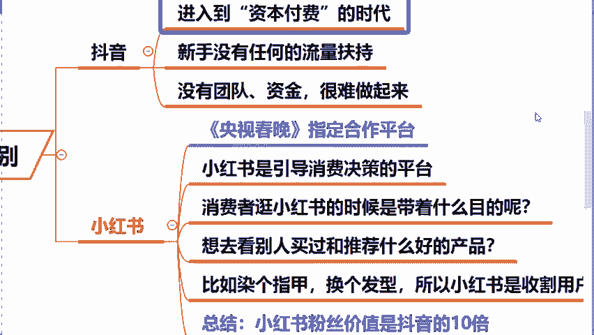
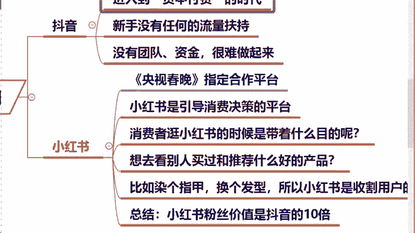

# 【小红书运营实操教程】最详细完整的小红书运营实操教程，适合所有新手学习小红书起号丨小红书笔记丨小红书开店，全程纯干货，通俗易懂！ - P9：2.小红书和抖音的区别 - cqrl4632 - BV1J4421S7GE

那么包括同学们可能会有疑问啊，说老师啊，我现在这个国内抖音它这么火，我今天为啥要去选择小红书呢？对吧？包括刚才直播间同学们在问到的，说他老师啊，我现在做抖音，我为啥做不起来呢，是不是啊？

很多同学都很熟知的是这个抖音这个平台呀，对吧？那么今天我强调一下，如果说直播间同学们，你之前去玩过抖音的话，如果说你了解过你应该知道咱们这个国内抖音，他现在已经进到一个叫做资本付费的时代了。

你会发现你现在作品，如果你不去投钱的话，对不起？你几乎是没有任何的流量了。因为同学们嗯在国内抖音上来讲，他个人做账号的红利期早就结束了。如果你现在你今天你没有团队，你没有启动资金。

你想在国内抖音上去站稳脚跟，那我只能说真的是太难了。包括来讲我今天啊为什么说建议大家做小红书呢？来在这里大家去看一张图片啊，😡。

在我们今年1月19号的时候，央视郑重宣布小红书成为了央视指定的合作平台。从19号我们央视发布这条消息之后，从后台上可以看到小红书用户的数量和流量已经激增翻了3倍多。那么预计这个流量会在春晚播出之后。

24年属于小红书的时代将全面开启。能够做到说和央视合作的话，我你想一想，也代表着说小红书未来的潜力和它资本背后的能力，它都绝对是不容小觑的。那么包括来讲啊。

我们说区别于这个国内抖音和这个快手这些娱乐平台，我们的小红书它的官方定义什么叫做购物分享的一个社区APP。也就是说我们小红书的用户，它基本上都是咱们的一个意向客户，他们都有极强的消费意志。而且来讲。

小红书这个平台，它目前就是处在我们的一个红利期。哪怕今天你是一个零粉丝，你可以照样的去开店，你可以照样的去卖货赚钱。因为平台。😡。

给我们的流量扶持是非常高的。所以说我们今天做这事儿啊，就是让你去在小红书平台去开一家属于你的店铺。然后你把这个商品给它卖出去就可以了。包括来讲今天怎么去选品呀，怎么去上架这些问题。

老师我今天全部都教给你。那么第二个，我们说这个它跟传统电商区别是什么呢？小红书啊，她会引导咱们消费者来做一个决策，小红书，她叫做种草平台，什么叫种草，我在这儿去举个例子啊，啊。

你比如说咱今天直播间很多同学平时也会逛小红书，对吧？那么你逛小红书的时候，我们是不是都带着目的去逛的呀？你比如说直播间女孩子天气一凉是吧？我想换一个发色，是不是我想去买个大衣，我第一时间干嘛？哎。

打开小红书，我搜索一下，我看一下这个别的女孩子今天染了什么样的发色显白呀，是不是看一下今年冬天到底流行什么样的这个大衣呢？对吧？比如说今年的这个刚刚流行的美拉德风，她就是从小红书活起来。😡。

这不就棕色大衣嘛？是不是棕色系啊，之前就火过，换个名，重新火起来了。那么当我们今天在翻阅小红书的时候，我们就会被上面的内容给他去种草。所以在整个的过程当中。

我们会被小红书上的内容去引导O引导你最终的一个决策。所以说小红书这个平台，它说白了，就是在收割咱们一个用户的心智，成为咱们生活中的意见领袖，然后在不知不觉的潜移默化的把这个商品去卖给咱们的一个客户。来。

各位这个点大家能不能够去理解，就是说小红书平台它的一个变现模式。来，如果说对这个变现模式能够去听懂理解同学，你在公屏上给我打上一个能字。😡，那么这个就是说抖音跟小红书最大的一个区别是啊。

很多测评类的这个东西啊，我在这强调一个点，就很多你看到的一些测评类博主，他的一些货品都是我们的这个厂家给他的。你第一个不用他买，你自己也可以进行使用。第二个，你测评完之后还给你钱，明白了吗？😡。

所以说啊小红书的粉丝它相当于就是说会比其他平台价值更高，那么就意味着它的转化会更高，我们就更容易的通过它去赚到钱。😡。

