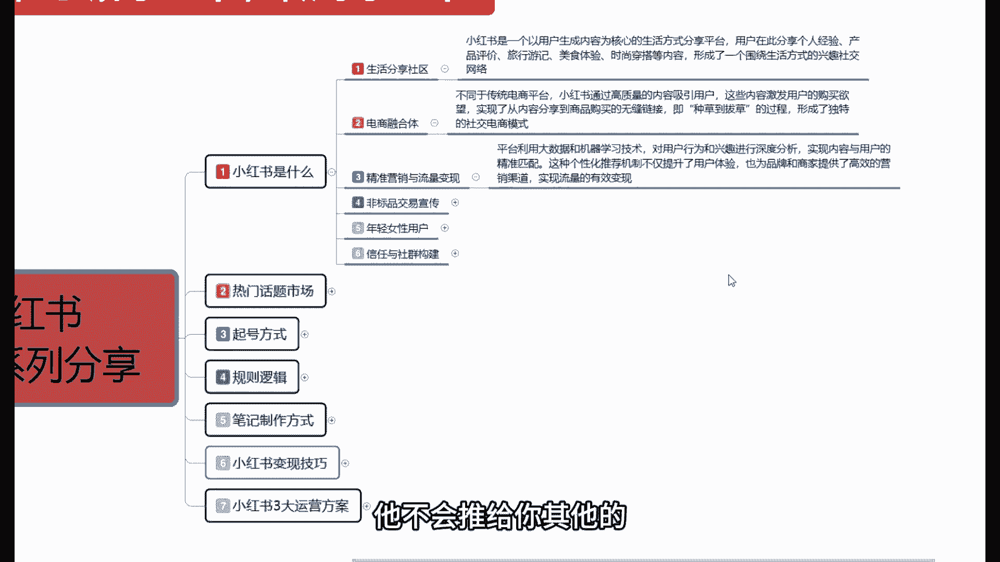
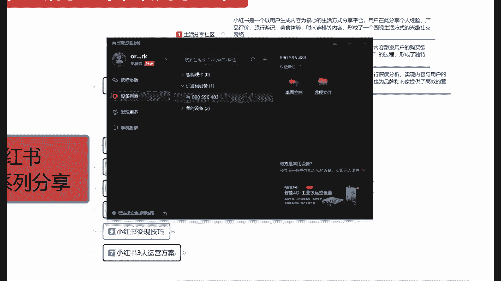
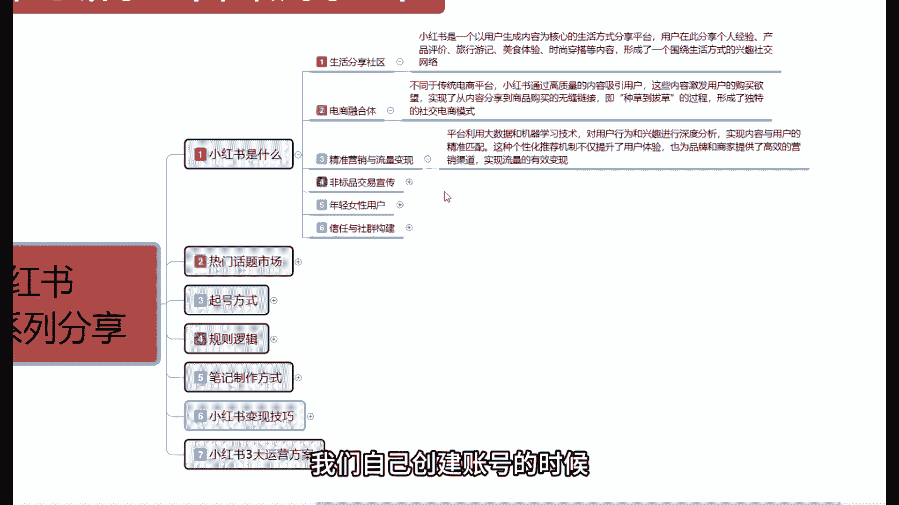
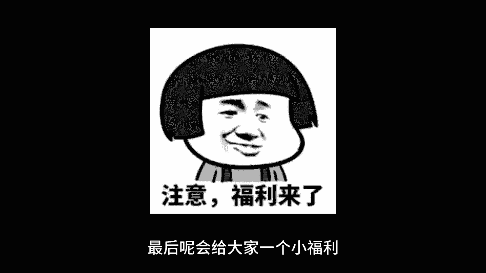
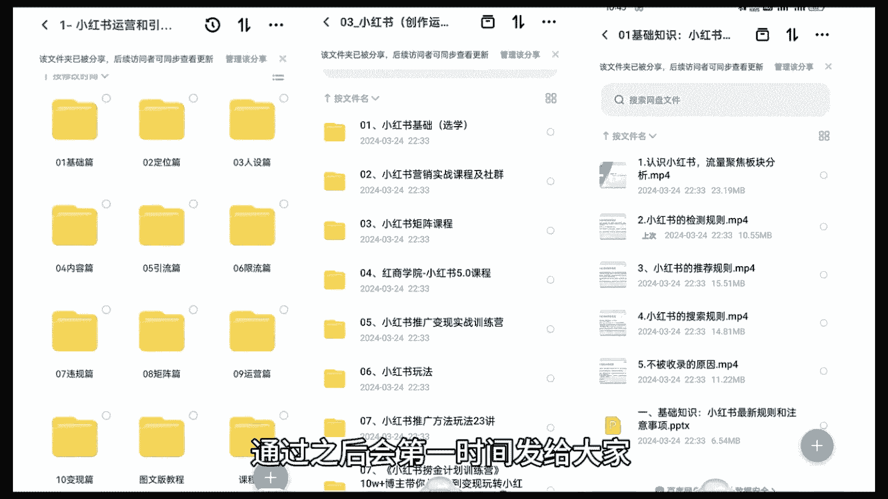
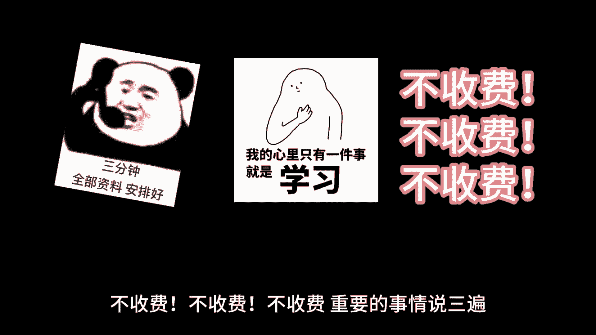

# 【小红书运营教程】B站最良心的小红书运营2025全套新手实操教程（适合零基础小白学习小红书起号／小红书笔记／小红书开店） - P1 - 红书运营 - BV1kE421P7W3

你要相信你自己，你要坚持，只有学习才能让你不断前进，要坚持一直学下去坚持，这就是我所理解的青年精神的，大家好，从今天开始呢，往后面呢我会给大家整体讲一期，小红书全系列的一个整体分享。

这一个记忆列呢我给大家分为了七个大课时啊，从第一个课时到七个第七个课时，他整体讲解的内容呢，就是首先我们了解什么是小红书，就是知道小红书，第二个呢是了解小红书，到最后一点呢是做好小红书。

因为我们如果说对小红书啊不清楚的话，我们后续的一些额怎么说呢，就是我们小红书你想去做网红啊，做博主啊，做店啊等等，你都做不了，所以说我们首先要明白啊，第一个节点是什么，知道小红书，第二个节点是什么呢。

了解小红书，第三个节点才是我们最重要的，做好小红书呃，本系列的一个全集课程呢，我会给大家把它分成几十节课啊，给大家进行一个整体的一个分享，第一节课呢，首先呢就是了解一下我们什么是小红书是什么。

第二个呢是给大家讲解一下啊，小红书它整个市场里面它的一个热门话题，包括它的一个产品话题啊，在里面是什么样的产品，它才属于热门，第三个呢是小红书起号的一个方式，小红书和其他的一些啊电商平台也好。

网络网主播的一个平台也好啊，他整个方式它是不一样的，他的起号方式是非常重要的，因为你前期账号起号不好的话，你要想在小红书上面打开四层的话啊，是非常困难的，第四个课时呢准备给大家讲解一下啊。

小红书整个规则以及它的一个底层逻辑，什么意思呢，就是说小红书它是按照什么样的一个，规则方式去运行的，他的这个规程，规则方式的一个运行模式里面，有什么样的一个逻辑啊，我们怎么通过操作我们账号的一个数据。

来提升我们的一个整体权重，第五个呢是最重要的一个点，小红书的一个笔记制作方式，为什么说是第五个是最重要的一个点啊，我们如果说把小红书你起账号，其实的话把方式方法掌握以后的话，其实都差不多。

但是你的笔记做的方式，他关心到你后续发送笔记获得的一个展示，曝光和流量，这个点如果说我们把握不好的话，我们在后期整个店铺的话，你想把它做起来，是非常困难的，所以说我们一定要了解好啊，小红书笔记制作方式。

它分为哪些种类啊，通过什么样的方式去创作一个笔记，才是完美的一个笔记，第六个呢就是小红书变现的一个技巧啊，怎么从小红书上面啊赚钱，最后一节课给大家讲解的呢，就是小红书三大运营模式的一个整体方案。

这个呢就是我准备给大家本期啊进行分享的，一整套系列的课程，这套课程的话包括啊第一节到最后一节的话，预计的话是给大家讲40节到50节课啊，进行一个整体的一个分享，今天呢只是给大家讲解一下。

我们整个系列的一个大纲，从下一节开始呢，我们首先了解一下是什么，是小红书啊，就开始我们正式的一个课程内容进行分享，这里呢我会把那个后续课时的一个内容的话，给大家啊进行观看一下。

我们整个课程的一个实际内容，它是非常多的，所以说我们在操作店铺数据的时候，或者说你是新手，你想了解小红书啊，想知道小红书是做什么的，想了解小红书怎么做的和怎么去做好，小红书的朋友可以往后面去听一听。

看一看，废话不多说，直接进入我们的一个正题，首先呢我们了解一下什么是小红书，小红书的话，他说实话他是一个嗯整体都来算的话，他骑出来是这一个电商综合体，如果说我们往小类目分的话，就是说它可以分为这六个点。

第一个就是生活分享的一个社区，第二个就是电商的一个融合体，第三个就是精准营销与流量变现的一个嗯，怎么说呢，推广渠道，第四个就是非标品交易宣传专区，第五个是年轻，年轻女性用户为主导的一个平台啊。

第六个他的整体目标的话是，建立信任与社会的一个整体结构，在这个里面的话，其实这六点的话，我们把它分拆分来看啊，他其实是六个大点，如果说我们把它结合来看，它其实是六个小点，为什么这么说啊。

他其实整个小红书他不管是做什么啊，我们只需要了解到小红书它对我们有什么作用，那首先在这里呢，给大家介绍一下，小红书目前的一个形势和最一个状态，小红书截止到目前的话已经运行了好几年。

他现在目前整体的一个用户在3亿左右，那这3亿个用户的话，他不可能同时去上线，那它里面的一个人群结构划分又是怎么样的，3亿用户里面85%是女性，15%是男性，这85%的女性里面呢。

18~35岁之间的一个女性，又占比70%以上，就说整体的话，小红书他的一个主要构成是，18岁到35岁的时尚女性，而且它整体的话呃，他的一个人群分布基本上都是在一线城市，二线城市和三线城市，一线二线偏多。

三线的话往下面就越来越少了，到四线或者五线城市的话，对小红书不了解的人一大把，但是整体对小红书比较了解的话，就是一线城市和二线城市的女性，她们在里面交流他们的一个生活啊方式，一个美妆方式，一个食品等等。

就说生活分享的一个社区，我自己最近过得怎么样啊，就是在小红书上面进行显摆，或者说是在小红书上面找到自己，适合的一个团队，所以说它叫生活分享社区，那首先我们来了解一下啊，生活分享社区呃。

我们怎么去判定和和观察它，首先呢小红书它是以一个用户生成内容，为核心的一个生活方式分享平台，用户的话在此就说我们注册小红书账号，你就算小红书的一个用户，用户在此的话他是分享个人的一个经验啊。

产品的一个评价，旅游旅行，美食体验，时尚穿搭等内容啊，形成了一个以围绕生活方式的一个兴趣，社交网络平台，意思就是说我在里面的话，我可以分享什么地方的美食好吃啊，什么地方的衣服穿着好看。

什么场合穿什么样的衣服，去哪里旅游比较好玩，旅游资金旅游的时候有什么样的一个方式，拿你的小吃好吃，拿你的酒店比较好，拿你的人文事物啊等等，它就是一个生活分享社区的一个平台，这个是小红书最开始的一个嗯。

怎么说呢，他只能说是最开始啊，他和现在不一样，他只能说是最开始的一个呃，小红书运营体系，往后面他第二个点他融入了什么呢，融入了电商融合体，什么意思呢，就是说小红书现在他开始卖货了，我们在小红书上面的话。

以前的话你做小红书他也有开店，但是开店的时候那个时候基本上没有产品，而且是所有人瞎玩，基本上都是发图文发文字，对不对，宣传一下什么地方好吃啊，什么地方旅游有没有组队的等等。

现在的话它变成了一个电商融合体，为什么说是电商融合体呢，它不同于传统的一个电商平台，小红书的话，它是通过高质量的一个整体内容来吸引用户啊，说实话他的高质量是体现在什么地方呢，体现在图文和文字描述。

它和抖音又不一样啊，它和淘宝和拼多多又不一样，抖音的话它是纯视频的一个文文案描述，你就算是把那个文字文案做完以后，你发到抖音上面去，它也是以视频播放的形式啊，以多个视频连衔接来去给你播放，那种的话。

他对内容的一个要求特别高，而且它的一个整体流量形式的话，和小红书又不一样，你我们在刷抖音的时候，一下只能看到一个屏幕，但是在小红书上面的话，一个手机上面四个屏幕有显示，所以说它整个电商融合体的话。

是更加适合我们新人去操作的啊，他整个电商融合体的一个体系，你不管是做网红也好，做博主也好也好，做引流也好，做店铺也好，它在电商融合体系里面的话，都是比较适合我们去操作的一种方式。

这个就是整个他的一个电商融合体，它整体的话就是说实现了，从内容分享到商品购买的一个无缝连接，为什么，因为他是从生活社区开始的啊，生活社区开始分享的一个人文人文事物，以后的话，他因为那个时候刚开始的话。

吸引了几千万上亿的一个访客，以后的话，他就把它做成了一个社区色序，做完以后的话，她知道小红书的一个女性，在里面了解某些产品好用，某些产品不好用对吧，踩有些坑不用踩，节约了很多方式。

所以说导致他的一个整体人群的话越来越大，越来越大，尤其是女性方面啊，我们正常来算的话，小红书做的话，他是阴阳比例严重失调，为什么女性在85%以上，男性的话只占15%，他银领养比例的话啊，严重偏移。

就说他是一个女性用户平台，男性用户的话，说实话你在上面你去啊扯扯淡可以，你要真上真去上面的话，你什么找朋友啊找之类的，你只能去找女朋友，你找你男朋友打牌啊是吧，去哪旅游啊，去哪好玩啊，哪有什么不现实。

这基本上都是就是一个女性平台，就看我们自己怎么去了解，那他通过这种女性平台的话，她发展发展融合呃，抖音和拼多多，还有淘宝三个方向，它把它组成了什么电商融合体在里面的话，他可结额结合现在的情况的话。

那就是做到了种草到拔草的一个整个过程，什么叫种草，从生活社区开始，一直到电商融合体，他就开始了进行拔草，因为电商融合体的话，你要去做电，你要做交保证金，你保证金交了以后，你要上传产品，上传产品。

你要做宣传，宣传的话，你要做小红书，要流量，对不对，那小红书就通过这一整个无缝链接，做到了现在的整个一个电商融合体，然后他结合淘宝和拼多多两个啊，网络产品销售平台，做到了第三点，精准营销与流量变现。

为什么说他利用前面两个点啊，做到了第三个点精准营销与流量变现呢，首先他整个小红书的平台，利用大数据和机器学习技术，对用户的一个行为和兴趣进行深度的一个分析，实现内容与用户的一个精准匹配。

他的这一个匹配系统的话，比淘宝的一个千人千面都还要厉害，就说你观看的是什么样的一个内容，笔记观看的是什么样的一个内容，他都会通过后台数据对你进行匹配，匹配以后的话，你在小红书上面。

除非你去用那个搜小红书上面的一个搜索按钮，去做搜索，不然的话他基本上都是你之前看过什么，之后刷到的，整体内容都是这个样子，这里的话我给大家看一下啊，他你除了通过这个搜索的话。

你其实没办法改变小红书的它整体的一个，怎么说呢，就是我们所观察的一个内容，你没办法去改变，你除了从搜索里面去改变以外，你其他地方做不到，目前的话就说小红书他整个系统的话，就是通过这三个点来精准的话啊。

展示他整个小红书的一个呃，平台的一个运行系统，保证它运行系统不崩溃啊，就是通过这三个方式，第一个是吸取他的一个生活社区，分享的一个人群，就是3亿的一个用户，第二个通过3亿个用户的话发展电商融合体啊。

达到他小红书盈利的一个目的，第三个通过电商融合体吸收的一个资料，达到精准营销与流量变现啊，就是说整个小红书的话，他平台利用大数据的和机械，机器学习的一个技术啊，把小把抖音淘宝拼多多三方融合了。

融合了以后的话，他推给的又是女性用户，然后通过这种女性用户，我们去搜索小红书的一些产品也好啊，内容也好，他在这个四个界面里面，四篇笔记里面去进行选择，它的一个多样化的一个推广的话。

是非常适合新手去操作的，然后他整个实现内容与用户的一个精准匹配，是什么呢，我们账号前期进去设定的一个定位，就在这个地方，就是我刚跟大家说的啊，我们不管他怎么去做，你去创建账号，你就是小红书的用户。

创建账号完成以后，你账号里面的话有三个选项，有旅行啊，游记美食美妆时尚穿搭，电脑旅游游戏等等，一大片的那个兴趣爱好，你选三个，选三个以后的话，你去小红书里面，只要说是你去看。

那他基本上推给你的都是这三个，633个内容的一个笔记，他不会推给你其他的。

除非你去用那个搜索啊，就是我们把小红书打开以后，用搜索。

稍等一下啊，额本来是想给大家做个投屏示范的，刚刚的话没有调整好嗯，那后续我再给大家进行一个投屏示范啊，在这里的话就是给大家啊详细的讲解一下，就是我们在搜索的时候，你不通过搜索的话。

你是没办法改变你账号的一个状态的，那小红书他通过这种方式的话，确定它整体的一个一个用户以后的话，他就可以达到下面的一个，精准营销与流量变现啊，因为他把所有的内容都都是，按照你自己的喜好进行推广的。

你喜好这个东西，你才会去做搜索，才会去了解，那么他就会把其他的内容屏蔽，减少他自己的一个嗯，怎么说呢，就是数据流量的一个输入，他不会把其他废物，你不喜欢的东西推送给你，他就达到了一个精准营销与流量。

的一个变现方式，因为你喜欢这个东西，你才会去搜搜这个东西的话，那你就需要去搜电商融合体里面的一个产品，那你了解这个产品的话，就是通过笔记的一个方式，然后进行转化成交，他从中再赚取利润。

那我们如果说你想把小红书做好，了解小红书，那你首先要了解其整个小红书，它的一个运行系统到底是什么样的啊，这一节呢因为时间关系的一个原因，就给大家讲解到这啊，给大家讲了前面三个点啊。

生活分享社区电商的一个融合体，精准营销与流量变现，后面一节课给大家讲解一下啊，小红书他的一个非标品交易宣传是怎么来的，他年轻于你去用用户，我们应该怎么去分辨，然后就是信任与社会的一个结构。

我们自己创建账号的时候应该怎么去操作。

最后呢会给大家一个小福利，整理了小红书运营实操资料。

可以评论区私信的方式领取，通过之后会第一时间发给大家。

注意领取资料，不收费不收费不收费。

