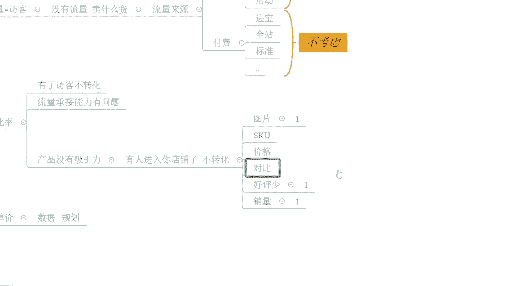
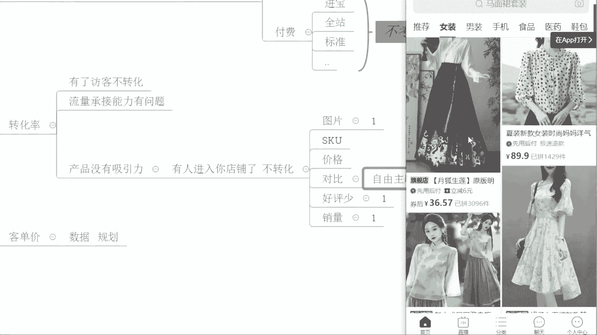
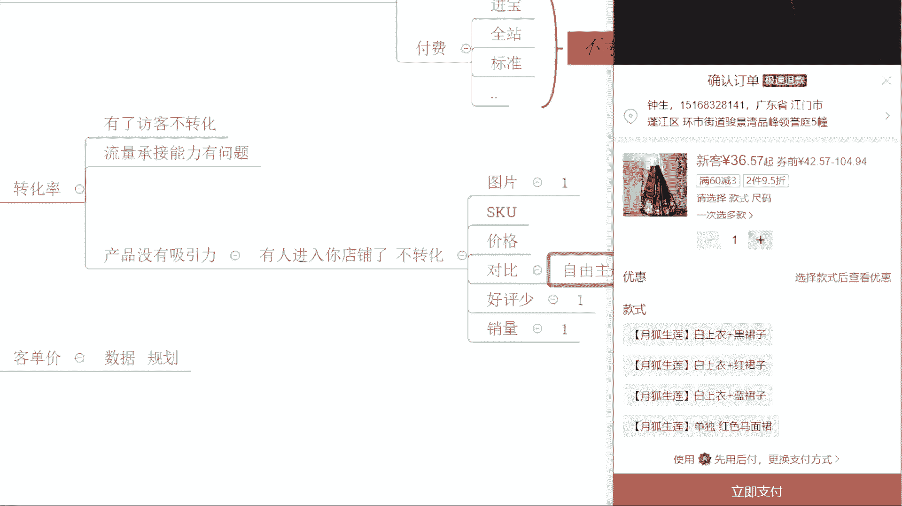
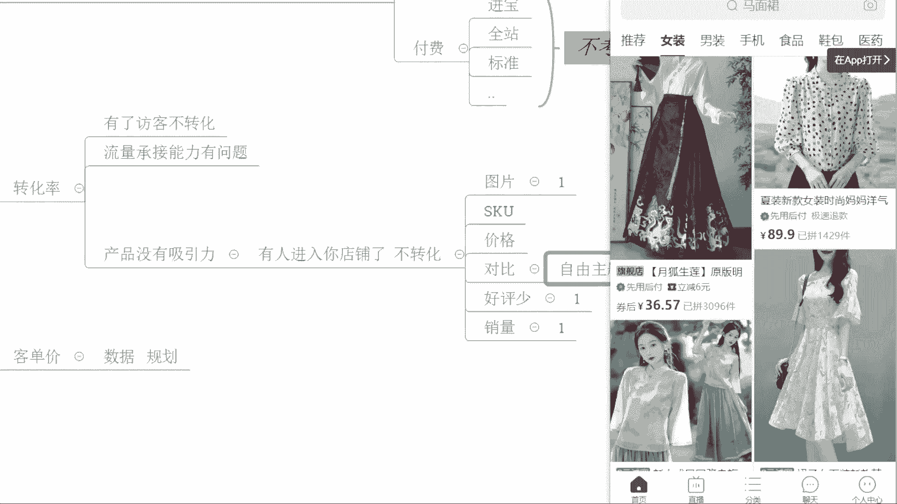
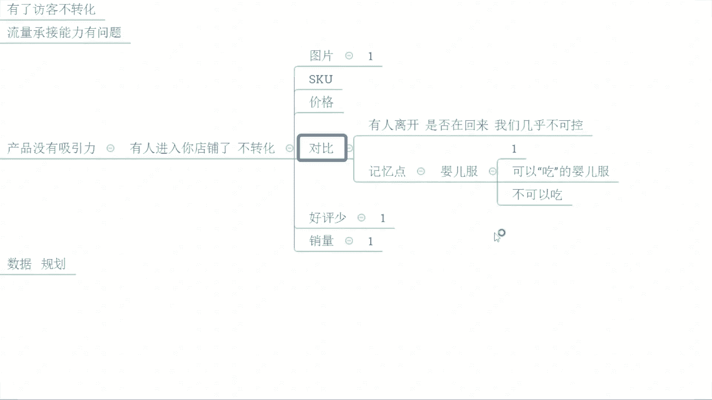
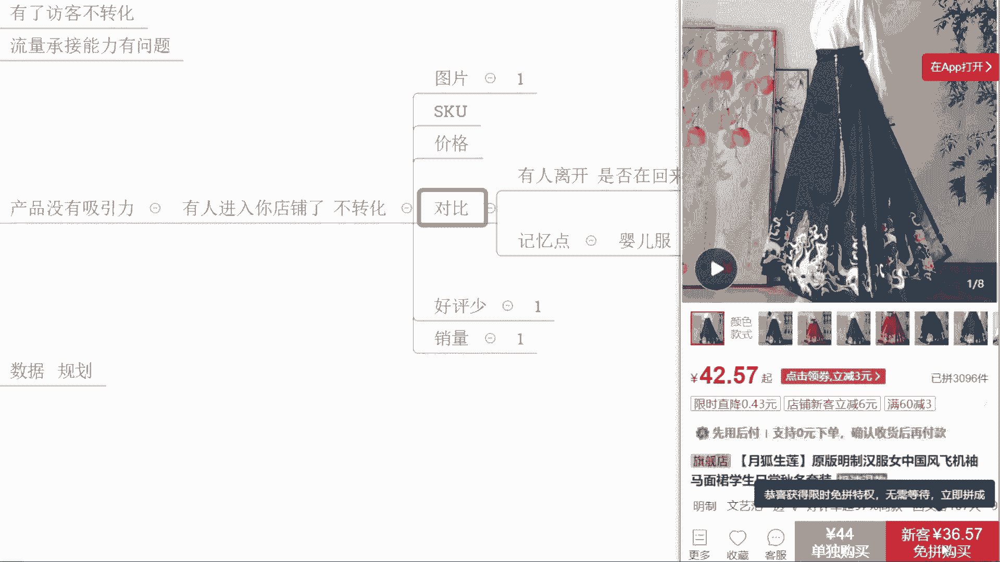
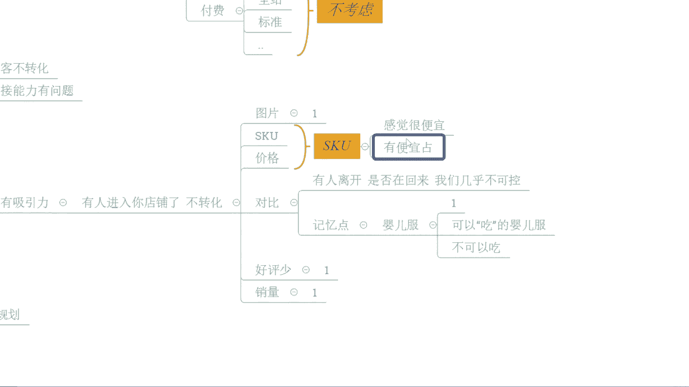
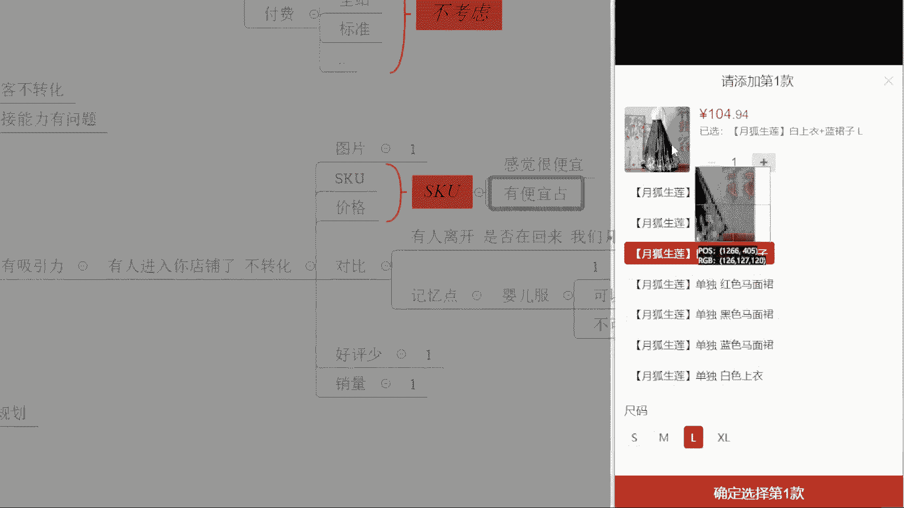
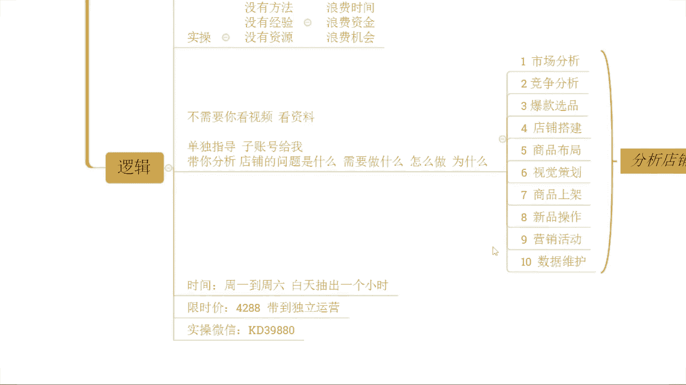

# 【小红书运营教程】B站最良心的小红书运营2025全套新手实操教程（适合零基础小白学习小红书起号／小红书笔记／小红书开店） - P39：39、运营核心三要素 细节出发快速引爆流量 - 红书运营 - BV1kE421P7W3

OK啊呃测下麦啊，这边所有的小伙伴，现在能够清楚的听到我声音的，能够看到我这边电脑桌面的声音，画面没有问题的话，公屏上呢扣一个一好不好，来动作快啊，声音方面都没问题吧，OKOK那就好那就行啊，那就行啊。

额本来呢今天这个临时有点有点事情啊，比较忙啊，我说这个干脆取消了啊，但是想想你们这个对不对，又预约了啊，还是咬咬牙给你们这个时间抽出来，给大家直播啊，所以今天我希望大家能够去更加认真一点啊。

不要辜负我这个辛辛苦苦给你们挤出来的时间，好不好，那么呃对于整个店铺操作来讲的话，其实还是那句话，对不对，更多时候呢我们需要去多一点用心啊，花费在自己的店铺上，花费在自己产品上，只有这样才能走得更稳啊。

呃在正式分享之前呢，啊这几分钟时间呢我还是老规矩啊，把直播间的一些规矩呢先说一说，好不按照这个国际惯例啊，讲一讲我们直播间的一些规矩啊，首先第一个点好吧，在整个直播过程中呢，我希望大家能够积极互动。

啊能够积极互动啊，那很简单一点啊，最起码在我分享完某一个知识点之后呢，我问大家是不是能够听明白，能够听懂的时候，你要给我反馈，确实能够理解，能够听明白的话，记得扣一回复，我如果说没有听懂，没有听明白。

你也要跟我讲啊，起码让我知道你的一个吸收情况，如果说我不知道你们不反馈，我只能默认你们都懂了，都明白了，那么这种情况的话，后面你跟我讲说，哎齐老师，你讲的这个东西我没有搞明白，没有听懂。

你能不能再讲一次，那抱歉啊，好不好，我是不会搭理你的啊，听清楚啊，那另外一点呢就是说在直播过程中的话，我们每个人可能都会有自己的一些问题出现，对不对，那么这些问题的话，如果是跟当前内容相关的问题。

马上提出，马上解决，啊如果是跟当前内容不相关的问题，没关系，你先做一下记录，你自己记下来，对不对，等我正式内容分享完之后，你单独提问，或者等我下播之后，你单独找我都是可以的好吧，两个点啊，这两个点啊。

然后另外一个最重要的一个点呢，是提醒大家一件事情，如果说店铺操作过程中，你自己确实有很多地方没有做到位，而刚好我分享的内容是你自己缺少的部分，没有做到位的部分，那么一定是下播之后记得啊去操作好吧。

如果说你不去做，再好的方法都等于零的啊，这个东西很现实对吧，这个东西很现实，那么店铺这个访客呢，他不可能平白无故来的对吧，你想要有访客，你就一定要去有到更多的努力去操作它，对不对。

天上不可能掉馅饼的嘛对吧，OK啊呃三个点如果说确实OK都没问题，都能听清楚，都能记住的话，现在可以公屏上呢再一次扣一个一好不好，时间呢，还有这个几分钟时间啊，那顺便呢我先说一个。

这两天问我比较多的一个问题吧，我不知道你们目前的一个情况啊，因为有很多小伙伴呢其实是老熟人了啊，啊不太认识啊，新新那个这个加我的一些一些这个小伙伴哈，不是很了解啊，那么，哦你用的别的这方法对不对。

那很OK，那你可以多用用嘛对吧，这个没关系啊，这个没关系，对不对，额你怀疑是用到别的方法，OK的，那你好好去分析一下，复盘一下对吧，你操作的是什么东西，那哪些东西导致你反而上升的嘛，对吧。

嗯啊啊呃废话不多说啊，废话不多说，那我说一说这几天遇到的一个比较多的问题啊，好吧，那有很多的小伙伴呢会有到一些疑惑对吧，诶七楼你一直在讲这个店铺操作呢，一定要去报名活动，一定要去上活动，对不对。

但是呢这个活动操作的时候呢，我都会发现一个问题啊，那我的价格就特别特别低啊，最近有没有人去做这个事情的上活动，然后价格很低的，有没有有的话公屏打一啊，有的话公屏打一，有多少公屏打一啊，来，OK啊。

又是辉航啊，就除了灰行，其他就没有吗，咳好新旺达还有吗，OK啊这个刘杰也是这样子的好OKOK啊，嗯这个东西的话其实很正常啊，这里我要说一下原因先啊，好不好，在我们正常进行活动提报的时候，这里我说一下啊。

那么平台呢会进行价格的一个考核，对不对，这个价格考核的话是多个维度的啊，那首先呢它会进行一个商品的比价，对吧啊，如果说我们会有到一些竞争对手，跟我们是同样的商品，系统识别为是同款。

那么他们在做活动的时候价格又比较低的话啊，那我们自己的商品啊，在提包活动的时候呢，就会受到价格的一个影响，平台呢就会要求我们的价格会比较低一点啊，这是第一种情况对比价啊，那还有一种情况是什么呢。

就是说我们的商品呢在日常销售过程中啊，有历史最低价对吧，我自己在销售过程中呢，因为我们自己发布的价格或者是设置的价格，或者是参加了某一些活动，或者是优惠券等等这些形式，导致我的历史最低价比较低。

报名活动的时候呢，就会要求我们的价格呢不能高于历史最低价啊，会导致价格很低啊，那么还有一种情况呢是最常见的，就是日常的销售数据，如果说我们的产品，平时你会有到一个相对高的销量，比较稳定的转化的话。

那么你在报名活动的时候，其实你会发现啊，价格不会有太大波动，但是如果说你去哎报名活动的时候，因为你平时没有什么销量，没有什么转化的话，OK那么这个时候呢你的价格就会差别特别多，为什么呢。

因为你日常销售数据差，平台会判定呢你的价格竞争力，啊价格竞争力，啊比较弱啊，那平台呢为了让我们商品在销售过程中，在活动过程中能够有到一个比较好的数据，就会去卡我们的价格，那么这几种情况都会面临着。

我们刚刚讲的这种情况，说哎我在报名回的时候呢，价格很低啊，那么这些东西呢是非常常见的一个问题啊，我也反复强调过很多次的，对不对，但是这几天特别多的人问我啊，我也不知道什么情况啊。

那今天我就着重的再正式的给大家讲一次啊，遇到这种情况的话，OK的不要慌啊，这个是一个很正常的事情，但是我们要懂得去处理，所以这个时候呢我告诉大家一个方法，你以后报名活动的时候，不要直接去报名活动。

啊听清楚不要直接报名活动，但凡你报名活动，你进去这个页面平台就会进行一个价格的考核，对不对，如果你没有报名活动，你只是进去看一看，你退出之后再进去之后，那么价格会更低啊，价格会更低啊。

这个我相信你们应该也有人去了解到了对吧，有体验过了，对不对，有踩过这个坑的对吧，那怎么办呢，各位你在上活动之前呢，先去做一个事情，什么事情呢，首先发布新的SQU好不好，先去发布一套新的SSKU。

那么这一个SQU呢你发布的时候呢，你的价格呀就直接用到你的活动的目标售价，好吧，再加上你的优惠券，然后呢去除以一个活动折扣啊，用这样的方式来计算出你的拼单价，然后用这个拼单价呢。

去去发布我们这个新的SQU来，能够记住的扣一啊，能够记住的扣一，那么这个时候我们去发布这个新的HQ呢，在正常提报活动的时候呢，就可以去做到我们所谓的原价上活动，那么它的逻辑其实也比较简单啊。

因为不管是比价也好，还是历史最低价也好，又或者是日常销售数据也好，它都是一个历史数据所带来的对吧，而我们发布新的sq的时候呢，首先发布的这个sq名称呢，我们需要去做好防比价的一个措施，这是第一步。

同时呢我们发布新的sq呢，你上架之后呢，你是没有历史销售价格的，也没有历史销售数据，所以说平台他也不知道你这个产品，历史价格是多少，他也不知道你这个商品，这个sq的价格是否有竞争力。

然后你就可以正常的去通过我们的这个活动，去报名，那么这里呢也顺便给大家提一嘴啊，这个活动折扣啊，活动折扣一般建议5~7折啊，一般建议是5~7折啊，打五折或者打七折啊，这样的话活动通过率比较高一点哈。

OK啊这个是近期的一个问题啊，就讲到这里啊，开始我们今天的正式分享啊，时间超了几分钟，但是问题不大啊，来现在所有人啊有在认真听的啊，有认真听的啊，有在这个注意力集中在认真听的啊，公屏上六走一波好不好。

来来来来来来来，动作快啊，呃辉航啊，你的问题到时候下播之后单独问我吧，好吧，这里就不做回答了啊，OK有人认真听就可以了啊，那今天要分享的正式内容是什么呢，是我们拼多多运营的核心三要素啊。

然后呢从细节出发引爆流量啊，怎么个玩法呢，OK的现在呢就注意了啊，开始我们的问答时间啊，啊老规矩啊，我呢直播分享呢还是以这个提问的方式进行，大家可以跟着问题去思考一下了啊。

那么这个时候呢我问大家第一个问题啊，第一个问题，那么这个问题是什么呢，就是运营是什么，各位来，可以把你们自己认为正确答案呢发在公屏上，好吧，可以把你们自己认为正确的答案啊，发在公屏上啊，好不好，动作快。

运营是什么，OK刘杰说是营销啊，营销，还有不同答案吗，啊小太阳说拿到更多访客，然后惠阳说打造店铺，让店铺属于自动化哈，OK然后亚森说将店铺盘起来啊，然后自评说盈利，然后句号说是商家操作啊。

OK啊OK然后野生说赚钱啊，赚钱好，OK啊，大家都有自己的想法啊，非常不错啊，我觉得今天这一个状态是很好的啊，小说是卖东西啊，OK好行行行好，那呃这里我说一下啊，我的理解好不好。

这里我说一下我的理解好不好，其实运营呢在我的理解啊，如果只是单纯的指我们这个拼多多的运营，或者电商的运营的话，其实呃它没有什么特别复杂的东西，对不对啊，无非就是说针对到我们产品的上架啊。

针对到我们店铺的一些数据维护啊，去打造好排名，去做好我们的流量，能够让我们产品进行转化啊，啊能够去达到卖货赚钱的目的，是不是，其实你们也说到的啊，前面也说到的啊，那么但是啊在某种意义上来说。

它其实运营是一个非常非常复杂的事情，运营呢它运营的目标，运营的对象不仅仅是产品啊，啊运营的目标，运营的对象不仅仅是产品啊，其实运营的目标更多的还是人，各位这句话，可能你们现在理解起来会比较困难一点啊。

可能你们现在理解起来会比较困难一点，我给大家讲一个故事吧，好不好，我最早的时候做电商比较早嘛，当时是08年开始做电商的啊，然后13年的时候，自己就开始这个正式独立运营了啊，到14年的时候咳。

受邀呢在陶大去做了一些分享啊对吧，你说那会儿作为一个年轻人啊，小年轻来的啦对吧，虽然说店铺做的还不错啊，赚了点小钱，对不对，但是接触到的这个人啊，接触到的这个圈子确实确实很小啊，至少来说眼界不够开阔啊。

当时呢就会遇到一个一个这个大牛啊，一个上市公司的这个呃运营策划的，这么一个角色的一个一个一个一个人啊，很厉害的一个人，那当时呢呃就跟他聊天嘛啊就跟他聊天，然后就问到他说诶那这个啊这个陈老板啊。

陈老板这个嗯就在你看来的话，这个运营就电商运营这个板块的话，到底是什么是吧，他当时给我回复了一句话啊，他是分管线上板块的啊，但是也监管这个品牌运营啊，那么他跟我讲了一句什么话呢，他说嗯在店这个店铺端啊。

在这个产品端，在这个线上板块的运营来讲的话，你是专业的，我不如你啊，我不如你，但是呢嗯我我认为运营啊，他不是单纯的把产品卖出去，去维护好一个数据而已，他说我认为运营是要做心智上的一个侵入。

他就给我举了一个例子啊，当时不是这个IPHONE已经很火了嘛对吧，他就问我，他说那你觉得苹果怎么样，他问了我，我这么一个问题，各位我当时瞬间脑袋就懵掉了，我有犹豫，知道吧，我不知道他就是他还没有问我啊。

他没有明确告诉我是手机这个事情的时候呢，我当时这个脑袋是懵的，我不确定他说的是手机还是可以吃这个水果，各位能懂我意思的话，公屏扣一能懂我意思的，公屏扣一，可能你们现在还不明白我要表达什么意思，对不对。

OK没关系啊，那么他想说的是什么呢，能够让一个产品去代表一个行业，各位能懂吗，然后把这个信息呢直接深耕，种植在用户的心里面，他认为这个是他在做的运营哇，瞬间我就觉得档次不一样了啊是吧。

当因为当时我也确实还很年轻啊，很年轻啊，那会儿啊14年的时候啊，10年前了，10年前了啊，所以说我一直以来到后期呢，我也就真正意义上去了解说运营的话，不仅仅只是做产品，更多的运营对象呢是针对人啊。

我希望这句话呢能够分享给大家，让大家能够具有到一个更多的认知好不好，那么在针对到店铺操作上呢，其实很多时候你们做店铺做不好，或者是每天处于一个迷茫的状态的时候呢，其实就是因为这些问题导致的。

你们在运营的时候呢，只是盯着产品，或者只是盯着你自己的某一些数据，你的眼光没有放开，你的视野不够开阔，所以这就会带来很多很多问题好吧，那么呃这个只是一个题外话啊，只是只是一个题外话而已啊。

只是我今天想表达的一个东西而已啊，跟我们今天正式分享的这个三要素也好啊，细节也好啊，不搭嘎啊不搭嘎啊，但是呢这一点呢，我希望你们能够去有到这么一个认知的提高吧，好吧，那么呃我问一下这个大家爱听吗。

我我我知道可能有的小伙已经开始打瞌睡了，对不对，爱听吗，爱听吗，爱听是吧，哦哦爱听就好，爱听爱听就好啊，爱听就好，爱听就好啊，我就害怕你们觉得这个东西呢，对你们来说可能有点远啊。

这个确实这个东西可能对你们来说有点远啊，啊所以说我就比较担心啊，比较担心啊，OK的啊，爱听就行了啊，喜欢哲学是吧啊可以的可以的可以的啊，我从哪里来，我到哪里去是吧，我是谁谁是五啊。

OK那么额对于我们整个的店铺运营来讲的话，其实更多的呢是，问题的发现以及问题的解决好不好，希希哥喜欢生物学对吧，呃这个这个问题呢我们私下讨论啊好吧，今天直播你们就不要提了，好不好，咳，我喜欢研究生啊。

学问高对吧，OK来啊啊，我为什么说，我们针对到店铺的U运营的过程中呢，其实是一个问题的发现和问题解决的过程呢，各位额，你们在做店铺的时候呢，经常会去问到一些问题，哎西楼这个怎么办，西楼那个怎么办对吧。

那当我问到说，那你真正的问题是什么的时候呢，可能大部分人呢都会跟我讲，哎我店铺怎么怎么样了，对不对，比如说我现在问大家这个问题吧，各位你们认为你们自己店铺，目前经营最大的问题是什么。

你们可以把你们的问题发出来啊，你认为目前你店铺经营的最大的问题是什么，可以发出来啊，可以发出来啊，发出来，我们一起探讨一下这个问题啊，好不好，这个问题也是我一直以来，喜欢去讨论的一个问题。

OK啊OKOK，好你看啊，这个问题一问出来之后呢，就会发现有很多千奇百怪的答案，对不对，那有人呢回答了一个问题呢，这个这个就很很难搞啊，比如像风啊，像这个WEIN对不对，他们回答的这个问题的话。

哎我觉得我店铺最大的问题就是没有流量啊，然后呢有些人们说哎我店铺是没有转化的啊，我店铺呢是这个这个这个呃访客上不去的，是吧啊，就有这种问题，各位现在问题来了啊，如果说你说哎。

我店铺最大的问题是没有流量的话，那么造成你没有流量的原因是什么，对吧，我认为没有流量不是问题，没有流量是结果，各位同意吗，这个不是问题啊，这个不是问题，这个是结果，真正的问题是什么，是原因。

各位同意的话，公屏扣一，如果这个逻辑大家同意的话，公屏扣一，所以说这个才是你们的问题啊，你们很多时候自己的问题是什么，你都搞不懂，啊对不对，你如果连你的真正的问题的根本是什么，对吧，你都不知道。

那你说你去运营店铺，你不蒙谁蒙，是不是，OK那我们现在就开始啊正式的分享了啊，那对于整个店铺操作来讲的话，首先我们说一说核心三要素是什么好吧，核心三要素在我们整个的店铺运营里面。

在我们电商运营里面是通的，以后不管你们做别的其他的平台，也都是这三个核心要素，哪三个要素呢，首先第一个流量啊，我们也可以称它为访客好吧，其次呢是我们产品的转化率啊，然后最后一个呢是我们的客单价。

这三个在各个电商平台它是互通的，听清楚了，记住了好吧，以后你们讲运营的核心三要素是什么，你就直接讲啊，流量转化客单价，那为什么这样说呢，原因很简单，我们做电商的目的是卖货，是赚钱，对不对，我想要卖货。

我想要赚钱，我就必须前提条件能够有流量，你没有流量，你卖什么货，是不是你卖给谁啊，打错字了，不好意思啊，没错吧，那当我们有了流量之后，我们如果说进店的访客不转化OK的，那你这个流量不就浪费掉了吗。

那你同样不是赚不到钱吗，是不是，所以说转化是我们对我们静电流量的一个什么，承接问题，一个消耗问题，你是否能够去承接它，是否能够去把它给吃掉，这个很关键，而同样的在针对到客单价板块里面来。

只要进入我店铺的这些人，我都希望他能够去买更多东西，能够去给我带来更高的销售额，对不对，能够给我带来更大的流量价值，带来更好的这个产出，所以说他们三个，最终呢可以去把我们所有的数据，所有东西串联起来。

它们是我们的核心三要素，而分析问题，找到问题的根本就是我们运营的这个工作，并且针对到这个问题找出解决方案，就是我们明运营的工作好吧，所以这是我们需要去做的一个事情，而且在我们整个前期的操作过程中。

我们也需要针对到我们的数据呀，有道一个规划好吧，这个也是我们要做的事情，那么比如说今天你们讲到的哎，我们店铺呢最大的问题是没有流量好，那么我们就来分析下是什么原因，导致你的产品没有流量来。

流量的来源有哪些啊，嗯流量来源有哪些啊，我们把这几个点全部通通的给它拆分一下啊，流量的来源有哪些啊，来说一说好吧，大家可以说一说，畅所欲言啊，不用怕答错好吧，不用怕答错，李佳说点击率啊。

还标有不同答案的好，小太阳说免费还有付费，然后然后呃辉煌说点击率访客搜索啊，是平台给予的啊，OK然后野生树活动好啊，非常不错啊，大家再认真思考这个问题，我觉得OK的啊，然后刘杰说是需求量好，OK啊。

那行了啊行了行了啊啊最后说是推广活动好，OK各位以后啊，思考归思考，但是好歹得省省题啊，兄弟们好不好，我说的是流量来源来源，兄弟们啊，啊你们说的这个点击率这些东西啊，这是这是一些数据参数啊。

它不是来源啊，好不好啊，目前回答正确答案的啊，呃可能更加贴近的呢，像我们的小太阳啊，野生啊，对不对啊，包括句号啊，可能更加的接近一点啊，流量来源是指我们访客从哪些渠道来的啊。

我们可能大的分类的话就是啊免费的对吧，还有付费的，是不是，那细分的话可能免费里面呢会有到搜索板块的，可能会有到啊，首页的推荐的啊，推荐吧，这样写吧是吧啊，然后呢首页啊，然后这个额付费板块呢。

我们讲我们有这个进宝对吧，我们有这个全站啊，我们有这个标准，对不对啊，等等啊等等啊，那这是我们的流量入口好吧，流量来源啊，这是来源啊，那今天我们如果店铺没有访客，我店铺没有数据，那么我们就要去分析呀。

是哪些入口，我还没有数据，是哪些入口我没有打开对吧，付费推广这个很简单，但是我一直强调啊，前期我们不要做付费推广，知道吧，这个板块前期我们是不考虑的啊，那么它只能在后期，我们能够有到一定的免费流量。

并且能够具有到一个流量执行能力的时候，我们通过付费去撬动更大的一个人群范围，和推荐权重可以去做，所以前期我们是不考虑的，那换句话说呢，这一个板块我们不考虑的时候呢，OK那我们剩下的流量来源是什么。

我们能够去经营去运作的流量来源是什么，是不是就剩下免费的端口了，免费端口的话就搜索了推荐了首页咯，就直接入口啦，当然还有一些活动板块啊，当然有的有的活动是付费的啊，有的活动是付费的。

这个点大家注意一下啊，那么啊自己区分一下就好了啊，好吧，所以这种情况之下呢，我们再还回过头来看一看啊，OK那如果说今天我没有访客，我的访客很少，我是不是就可以去考虑一下哪些入口，我是没有做的。

哪些入口是我做了的，可不可以，如果可以的话，公屏上打个一好不好，像这个风啊，像我们的这个呃还有谁来着呃，是是说没有这个访客的啊，是说没有访客的，是谁来着啊，除了风还有谁，我忘了啊，这个这个最近老了啊。

感觉明显记忆力下降啊，怎么回事啊，可能是最近没有睡好啊，好吧来啊，额是谁说自己店铺最大的问题是没有访客的，没有流量的啊，那么现在可以去认真思考一下，对不对，那你是哪些入口没有打开，哪些入口，你是做掉了。

是没哪些地方是没有做到位的，或者你觉得我都没做到位，那么我应该去怎么去针对到这些入口去操作，对不对，我们再反推回去，把每个入口的这个数据把他的权重做出来，那么如果说我都做到位了，他还是没有访客。

那我们是不是可以想象一下，那这个时候是不是我的产品的这个品类有问题，我的商品本身有问题，是不是，如果说确实产品本身有问题的话，你做再再多可能也没有什么太好的数据，这是很现实的问题对吧。

所以这一个情况的啊，那针对到这边的话，流量来源我们找到之后呢，像我们去做搜索的话，可以去通过关键词卡位去做对吧，像我们做这个推荐权重的话，可以去做截流啊，包括说我们这首页一样的，对不对。

而活动端口的话OK的，那么做好这一个仿品价报就完了，对不对，没有特别的复杂，其实拼多多之所以这么多人选择做，这么多人去做，就是因为拼多多体量大，出单快，对不对，而且的话它其实运营难度来说。

对于我们其他所有平台来讲的话，相对是最低的好吧，你看你们可以看一下，像这个店铺来，各位有看到这个店铺数据的，现在公屏打个一好不好，有看到这个店铺数据的，现在公屏打个一，有看到这个店铺数据的，公屏打个一。

现在啊这么快是吧，可能我单纯用嘴巴说我的拼多多没有那么难做，你们可能还不信，但是你们有看到的，像这个店铺纯新店起来的一个店铺啊，零访客的新店来的对不对，从操作到起电数出来数据啊，也就一个多月时间。

一个月不到啊，鲁迅得讲，对不对，那干掉了1万多访客，一天一天1800单，15块多的客单价啊，17。88的转化率是不是，所以整个操作并不是说，像我们很多小伙伴想象的那么难对吧，更多的时候呢。

我们也需要找找到更多的细节去优化，去去去做好它，那么前期访客的获取的话其实很简单啊，没有特别复杂，我相信你们应该有小伙伴是有娱乐这种情况的，对不对，哎我店铺现在呢唉我就是上传的产品啊，我就上传的产品。

对不对，哎我其他的我也没做，我也没有去做什么，做什么销量做什么这个评价啊，我做什么破零，这个我都没看，但是呢我多多少少有那么几十个到几百个访客，有没有，有没有这种情况的啊，有没有这种情况，如果有的话。

现在公屏上打个六好不好，如果今天直播间的小伙伴是有人是这种情况的，公屏上打个六，我见过最多的一个啊，就是上传产品之后什么都没做啊，他单链接的访客呢有到400啊，巅峰的时候有400啊。

一开始的时候可能只有几个几十个，后来慢慢的到一百两百四百啊，然后后面是没什么数据直接调回去了啊，调回去了是这么个情况的啊，我是有见过最巅峰的这种的链接是这样子的啊。

那么我不知道你们今天的小伙伴是什么样的情，况对吧，像小太阳是有遇到这种情况的，OK的，所以说前期我们去把产品数据分析好，找到一个优质的潜力爆款去做好上架，对不对，把该做的这些优化设置给他做好，做到位。

访客其实不难啊，访客其实不难，那么其实真正意义上难的是什么呢，你们大多数人真的困难的是什么呢，有了访客之后不转化对吧，有了访客之后不转化，这个是你们很多小伙伴真正的难点，真正的痛点啊，为什么这样讲呢。

因为如果真的我想要去有访客的话，我大不了我就真的舍近求远，我先去做付费嘛，对不对，钱花出去，访客就来了对吧，这个是最简单最直接最干脆的方式，但是一旦你真的有了访客不转化，这个就麻烦了。

平台呢会判定什么呢，判定你的流量承接能力，有问题判定你的产品呢没有吸引力，那么整个商品呢就会呈现出一个什么呢，限制或者是降低推荐的一个状态，那么后期你想去做它难如登天，因为机会给你了呀，你抓不住。

你不珍惜呀，是不是没错吧，就像我之前打个比方一样的，对不对，哎呃你谈女朋友了对吧，人家女孩子跟你出来玩都跟你讲，哎今天我出来的晚了一点，对不对啊，刚好呢钥匙也没带，我回不去了。

可不可以跟你将就一晚上挤一挤对吧，你跟我说一句，哎，我给你开了一个宾馆，你去住宾馆吧对吧，给了你机会，你不中用啊，兄弟们是不是，所以这个情况的话就很麻烦了呀，那么你后期你再想说。

哎那我们去把这个店铺做起来，你机会只有一次对吧，是不是对，给你机会，你不中用啊，就这个意思啊，那你说怎么办，你只能说是再次等待机会的到来，但是机会这个东西可遇不可求啊，是不是兄弟们来觉得说的没错的。

现在公屏打个一好不好，那么话又说回来了啊，对不对，既然说会有到这种机会给到你，那我们怎么去抓住这个机会，怎么让这个机会能够真正意义上帮到我，这个是一个关键的点是吧，来各位你们是你们是做什么产品的呀。

我先问一下啊，你们做什么产品的，来这个，哎我我看一下，有没有谁是这个比较熟悉一点的啊，啊感觉你们好多人都是很熟悉很熟悉的了啊，这种太熟悉了，我又不好意思叫你们了啊啊小天鹅说女装啊。

张峰说是这个情趣用品啊，啊说的太大了，说的太大了，你们说的都是大类啊，能不能说的具体一点，能不能说的具体一点，文具啊，嗯这样子吧，这样子吧，我们随便去找一个吧，我们随便去找一个吧，啊。

因为有的东西呢确实不方便在这个直播间展示，对不对，你像这个张峰啊对吧，你这个产品呢确实有点尴尬，有点小尴尬啊，啊不太好展示啊，咳咳来啊，这个是拼多多啊，这个是拼多多对吧，有看到吧，这是拼多多啊。

那么我们现在呢就刚刚呢，你们不是讲做这个服装吗，需要吗，给你安排一个大礼包，真的你开什么玩笑，对不对，就像我这种对吧，散发着成熟男性荷尔蒙的这个英俊的中青年，对不对，还需要说你给我安排这种吗。

而且真的是啊，我跟你讲的啊，算啊嗯扯远了扯远了啊，不能不能不能说这些东西啊，扯远了啊啊回过头来差点暴露了什么啊，啊回过头来我们看一下啊，这个是我们的拼多多对吧，这个是我们的拼多多。

那我们把这个拼多多打开之后呢，我们可以看到上面有这个分类嘛，对不对，我们把内呢往后划一划啊，刚刚你们不是讲到说是这个女装吗，我们就说女装好了啊，好吧，我们就说女装好了啊，那我们进入到女装这边去啊。

其实这边都会遇到很多产品，对不对，包括说现有我们的这个什么这个各种的分类啊，各种的这个啊榜单啊，或者推荐的一些这个产品啊，对不对，包括说我们这个呃内物里面的一个推荐商品啊，都会有很多很多很多啊。

那现在我们先不管它啊，我们现在说一个事情啊，那么就是说关于我们这个流量承接的问题，那如果说有人进入到你店铺之后，它不转化啊，各位你们认为是什么问题，我先我先跟大家确认一下吧，啊有人进入你店铺了。

不转化啊，这种情况你认为是什么问题，如果说作为消费者，你自己去买东西，对不对，哎我今天我打开了拼多多，哎，我看到哎这个东西好像还不错呀，我点进去看了啊，我进去之后，我看来看去之后呢，我跑掉去了。

我不我不买它，我走了，那你认为这是什么问题，各位认真思考一下啊，把答案发到公屏上，当然啊，如果说你自己真的是完全没有这个额概念的，那么也可以直接打问号啊，但是我相信这个应该不至于对吧。

因为你们就算是没有去经历过，这种运营方面的东西，你也买过东西嘛对吧，OK咳好，现在呢大家给我给到了很多答案啊，小太阳说图片不吸引人啊，图片，然后呢这个你说哎SKU和价格，然后小说详情也没有吸引力。

那也就是图片问题嘛，对不对，放到上面来啊，然后这个大道自然说哎，我要去跟别的产品来进行对比对吧，我要去多对比几个，我要看一看啊，然后这个句号说价格问题，还有就是评价少啊，好评少好。

那么目前呢你们给出的答案呢是这些啊，目前呢你们给到的答案是这些啊，那现在呢我们就来模拟一下这个过程，好评少，这个可不可以解决，我们把这些所有的问题解决掉啊，我们把这些所有的问题解决掉。

最终那是不是就能够给到我们转化，有到更大的帮助呢，绝对没问题，对不对，这个逻辑肯定是通的嘛，啊那好评少这个问题能不能解决，觉得能的扣一，觉得不能的扣二啊，莫斯平说销量和评价问题啊，销量。

好好评少可以解决，对不对啊，OK我们去做评价就完事了嘛，那销量数据太少的话，这种情况也可以去解决对吧，甚至说销量少跟评价少的话，我们直接去报一些竞价活动，可以直接继承同行同款的爆款商品的好评。

跟这个这个销量啊可以直接继承，所以这个问题都好解决对吧，那么再往前去导一导，有人说哎那是我们这个图片问题，我们详情页不够吸引人，我们这个产品的图片呢不够吸引人啊，没有去这个刺激到消费者，让他去购买。

这个能不能解决，这个能解决的话扣一，这个不能解决的话扣二啊，还是那句话啊，还是那句话，OK你加句号是觉得OK能解决的，对不对，其他人是觉得解决不了吗，能解决是不是好能解决啊，能解决啊，都动起来了啊。

可以的啊，可以的啊，能解决啊，所以这个问题我们也能解决，对不对，你说图片不好看，我们找一些专业的设计师，去帮我们做的好看一点，可不可以，可以你说我们卖点不够突出，那我针对他咳咳。

那我针对到我们产品呢进行分析，找出用户的痛点，找出我们产品的一些特性和特点来分析之后呢，重新去把我们的卖点梳理一遍之后进行设计，去进行我们的产品图片的一个一个制作，可不可以没问题啊，没问题。

所以这个问题也可以解决对吧，那么再往下呢，OKSKU的问一个问题，价格问题还有对比，那么我们现在说对比的问题啊。

有人进来买东西啊，今天我看到了这个这个这个裙子啊，这个马面裙我看到了这个裙子啊，OK我进去看了。

看完之后呢，我觉得这个还不错啊，我觉得这个还不错啊，我看看它的价格哎我觉得也还好，对不对，哎这个价格呢它会有到额单个的这个裙子的，他也会有到一个这个套装的一个价格，对不对啊，选一个尺码嘛对吧啊。

套装呢100多对吧，单个的这个裙子呢70多哎，单个的上衣呢40多，哎，我也看到了，哎我觉得还不错呀，但是我会觉得我是不是应该去找一找，看有没有更便宜的对吧，哎我就退出去了，我就看了别人的产品。

是不是这个动作没错吧，那么这个时候各位我想问大家一个问题，当这个人跑出去再找回来，我们的概率有多少，大家觉得有多少啊，53%分之一，30%，10%，OK啊，这个是我们自身的一个理解对吧。

这是我们自认为的一个数据。

其实我们几乎没有办法去衡量它，各位没错吧，这个如果有人离开，是否再回来，我们几乎不能衡量，或者我们几乎是不可控的，这个东西，没错吧啊多多又不能加购物车，但多多有收藏啊，对不但不管怎么样，他有没有购物车。

有没有收藏都不重要，重要的是，只要他离开之后，我们可能很难去真正意义上抓住他了，我们丧失了主动权，各位没错吧，所以这个问题就很麻烦了呀，那怎么办呢，嗯那怎么办呢，好那么今天的话认真听一下啊。

这个部分是一个非常非常小的细节点啊，这个部分是一个非常非常小的细节点啊，听清楚几个啊，几个地方都可以去做到位啊，是不是SGO出了问题，sq有问题啊，SGO有问题肯定有问题啊，肯定有问题。

那么sq的问题呢，其实在目前来看，他还不是主要的，主要的是我们要让用户停留在我们店铺，而不是到别人别的地方去，不管你sq怎么去设置，你都不能避免说有人会去说，去看看别的产品来做对比对吧。

那么这个地方呢就需要我们让我们的用户呢，有到我们产品一个非常好的记忆点，各位明白什么叫记忆点吗，就是让人看到这个东西之后呢，哪怕他对这个产品不感兴趣，哪怕他后续可能会去买别的东西，他也仍然可以记得你啊。

能够让他记住我的东西，能懂吧，那么这个地方就需要我们去做一个事情啊，我们在进行产品图片的输出的时候，在进行视觉上的传达的时候啊，要去下功夫啊，那么对于这一个产品啊，马面群啊，对于这么一个产品马面群。

我想问大家，你们认为啊，你们认为用户真正关心的是什么，或者你们认为用户有没有什么痛点，额，今天过后希哥记得我说送你来野生啊，虽然说啊虽然说你这个这个比方呢是这么回事，但是我很不喜欢，你知道吧。

你不要说出来啊，偷偷的偷偷的跟我讲就行了对吧，你要说出来，大家都知道这个很尴尬嘛，对不对，是不是啊，讨厌啊讨厌啊，但是啊各位野生说了啊，送我一整套玩具啊，他要不送的话，以后你们记得见他一次，骂他一次啊。

好不好，他欺骗我的感情了啊，他今天要送的啊，今天要送的啊，好吧，兄弟们，给我做个证，没问题，打个六好不好，所有人在直播间的小伙伴啊，有在直播间的小伙伴，所有人都在听的啊，公屏打个六啊，给我做个证啊。

好不好，啊野生啊，你自己挖的坑自己填啊，好吧OK啊，行行行行行啊，差不多这个意思吧啊反正你们知道就可以了啊，然后刚刚这个我也说了，那么这个产品的这个额痛点是什么，对不对，那我们要去分析它。

我们要去找到一些一些一些点，来留住我们的用户，对不对，比如说我们产品的话，呃衣服板块来讲的话，可能我们很多人会关心它掉不掉色呀，对不对，耐不耐穿啊，防不防刮呀，对不对，起不起球啊，对不对等等这些东西。

那么这些东西的话，我们也可以告诉我们消费者是吧，比如说给大家举个例子吧，可能这个成年人的衣服呢，举这种例子还会比较牵强一点啊，但是之前我是有做过一个婴儿服的，啊之前是有做过一个婴儿服的。

那么婴儿服这个产品呢，当时呢会有到一个特性啊，这个特性是什么呢，就是大家都知道嘛，小孩子婴儿嘛都喜欢咬，都喜欢吃这个衣服，咬这个衣服，各位没毛病吧，没毛病的话扣个一，没毛病的话扣个一啊，有知道的。

没毛病的，公屏扣个一啊，小孩子都喜欢咬，喜欢吃这个衣服对吧，尤其是这个衣领这一块啊，经常都是放在嘴里咬衣袖这一块也是一样的啊，那么这个时候呢就会导致一个问题啊，那这个衣服你觉得它干净吗，它卫生吗。

它这样咬，那肯定不干净，肯定不卫生，对不对啊，不管你什么衣服，他肯定都不干净，不卫生的啊，那这个东西呢当时我们策划的时候呢，是16年还是哪年，我忘了啊，这个这个这个这个策划案。

当时是16年还是哪年哪年做的，我忘了啊，时间比较长了啊，那就做了这么一个一个一个创意的一个设计啊，叫做可以吃的婴儿服啊，这个如果说你们早期在淘系买过东西，买过婴儿服的话，应该有看到过这样一个创意。

啊当然了，这个吃这边呢会达到一个引号，对不对，有没有见过的啊，今天我们直播间有没有见过的，有没有见过这个东西的，见过这么一个文案的，那么这个文案是干嘛呢，就是针对到我们用户在购买过程中。

使用人群的一些细节展开的啊，没有是吧，没有没关系，那我现在展开说一说啊，我展开说一说，当你去买婴儿服的时候，你看到这样的一个文案，你就会联想啊，你就会联想联想到这个小孩子会吃这个婴儿服，各位没毛病吧。

没毛病的话，公屏上打个六好不好，没毛病的话，公屏打个六啊，你看到这个文案的时候，你就会联想，你就会联想小孩子他会吃衣服，会咬衣服，但是这个时候呢注意既然是可以吃，就有不可以吃，对不对，既然是可以吃。

就会有不可以吃，那么当用户进来我店铺之后，他觉得这个产品有意思的时候，他会点击进入我在产品的详情里面，在我主图的后面几张里面，我会重点的去把不可以吃的衣服描述一遍，啊什么是不可以吃的衣服。

它的危害是什么，比如说有一些这个呃衣服，他的一个呃印染的技术，或者是它的一这个染料，对不对，它会有到一些危害，那么这种情况之下，如果小孩子咬了吃了啊，可能就会吃进嘴里面去。

就会导致它有一些化学成分被它吸收掉，我们也不说它中毒吧，但是肯定不健康，对不对，我们把这种信息透露出去，把我们用户的这个恐惧的一个一个一个心理，调出来，知道吧，同样的还有的一个这个面料呢。

它虽然说也是一些纯棉面料，但是它可能会有到很多的一些这个呃纤维啊，它不够紧密，会有哦这个散出来对不对，它一吃的话可能会吃进嘴里面，吃进喉管里面，甚至吃进气管里面对吧，我们把这种东西给他放出来。

那么告诉消费者诶，这种东西它对小孩子都是有伤害的，那么这个时候各位记忆点有没有，不仅有记忆点，还有痛点，还自己制造了一个痛点，制造了一个恐惧，那么消费者看到这个产品之后，只要他见过他以后，他就会忘不掉。

那么买衣服要注意这个东西，各位能懂的话，现在公屏打一，你去对比的话，OK来现在你说没事啊，我点了你的产品之后，我要去对比啊，你只要对比，你都会想到这个问题，当你想到这个问题的时候。

别人没有把这个东西讲出来的话，你就会觉得他就是low的，他就是低他一等的，各位能理解吧，嗯来风大道自然刘杰李家阿比，句号111WEIN，各位都没问题吧，那么这个时候自然而然我们的商品呢，他不惧怕对比。

哪怕我的价格可能比别人高，我仍然不惧怕对比，啊这个说实话啊，对于你们来说，可能之前没有去了解到接触到，但对我来说，这种东西其实都是基础来的啊，我说实话啊，我说实话好不好，当然了啊。

可能让你们自己去针对的产品，去做这么一套的一个策划呢，可能会比较麻烦一点，对不对，没关系啊，没关系，那么如果说你们后期真的是自己操作店铺呢，啊没有一个好的思路，没有一个好的方法的话。

你可以跟着我实操好吧，我是有带实操的啊，OK那么再继续往下走哈，再继续往下走好不好，那么我们再来说一说关于我们产品的SKU，还有我们的价格，刚刚我们说的这个对比呢，它能够解决我们用户流失的问题。

那重点还是要我们的用户在我们店铺进行转化，对不对。

那怎么转化呢，来各位看一看啊，这个是我们刚刚看到这个产品嘛对吧。

这个产品呢我们刚刚有看到它是有套装的，有单件裙子的，有单件上衣的，单件上衣的这一个呢他做了一个低价引流，是不是他做了一个低价引流，然后呢裙子呢它是以这个高价的，70多的一个一个价格去去进行这个销售的。

套装呢利润可能会更大一点啊，可能会更大一点，那么这个时候这样的方式，在我们大多数人的经营过程中呢，应该都是这种方式去做的，没错吧，哎我用到一个呃产品A去做低价引流，然后产品B呢正常的销售啊。

A加B进行组合呢，来进行一个更好的这个额利润的一个获取，对不对，大多数情况之下呢，我们可能去做用这个方式去做，这个没有毛病啊，这个没有毛病，但是这种方式去做的话，其实我一直强调啊。

你们很多人可能链接发给我看了之后，我都会给你们讲一个一句话，当前呢你这个产品的sq布局呢，只是一个简单的展示而已，没有办法去进行转化的引导，各位我有说过你们产品是这个情况的，小伙伴，公屏上打个一好不好。

来动作快啊，我有说过你们产品目前是处于这个sq布局，有问题的是处于一个展示阶段的公民，打个一，OK啊很多我都说过对吧，包括我们后续应该怎么去做这个调整，其实我也有讲到过。

但是可能大部分的小伙伴呢对于怎么去解决它，怎么去调整优化它呢，并没有很好的理解，很好的吸收，其实我跟你们讲过的这些东西的话，我希望你们能够去真正意义上，用心去给他搞懂它啊。

对你们店铺帮助一定是非常非常大的，对不对，就像这些小伙伴跟着我实操的小伙伴一样，对不对，他们之所以店铺能够有到一个非常快速的提升，我说实话，不是单纯运气好，你说一个店铺运气好，那两个店铺呢，三个店铺呢。

四个店铺呢都是运气好吗，不至于对吧，真正意义上做店铺的话，不是靠运气去做的一个事情，而是要有的更好的，更加专业的方法去做，那么这些方法的话一定是要你能够吃透它，并且去落地执行好啊，这个才是很关键的啊。

那sq的一个操作怎么去做呢，这里认真听了啊，好不好，那么在我们整个操作的时候呢，SKU我们一定是要让消费者感觉很便宜，啊感觉很便宜，然后呢感觉有便宜占，这个是关键啊，这个是关键。

那么就像我们刚看到的这个这个产品一样了，对不对，哎我们把它截个图过来吧。

啊假如说今天我们做的就是这个产品啊，我不管你们做哎，等下我放到另外的位置吧，放到下面来吧，放到下面了，因为那太太太碍事了啊，几个几个几个这个东西叠到一起了来，假如说今天我们做的是这么一个产品啊。

套装104啊，我就写整数了啊，我就写整数小数点我就不细写了啊，然后呢裙子，啊裙子72对不对，然后呢上衣42对吧，我们现在就就把这个写写过来啊，假如说现在我们做的是这个产品啊，那我们正常去发布的时候呢。

我还是可以按照这个结构去发布，对不对，哎我用一个套装的，用一个这个啊单个裙子的，再用一个上衣的啊，上衣的做DI引流，这个没有毛病啊，这个没有毛病，但是这样的方式去做的话，往往就像我讲的，用户进来之后呢。

他也会去针对到我自己需要的，我想要套装，我就去看套装对吧，但是这些套装对我来说有什么区别吗，除了颜色的差别，没有任何区别，对不对，哎，就是104我能看到什么样的一个优惠信息吗，我看不到。

我能看到我这个产品，我去买这个套装，对我来说在别人店铺买有什么差别吗，没有任何差别，是不是，所以这个问题是我们要克服的一个问题，那怎么做呢，好针对到每一个规格，你是套装也好，你是裙子也好，你是上衣也好。

通通的去发布两套，一套呢就是我们正常的去啊，发布的这么一个价格，但是这个价格呢，一定要去做一个营销的一个部分，比如说现在我们这一个104的套装，对不对好，我去设置的时候呢，我还是104的套装。

但是套装前面呢我要加上营销池，比如限时促销啊，限量促销啊，新品特惠啊等等，各种乱七八糟的一些营销信息啊，我要加上去啊，加上去让消费者知道这个产品这个价格，现在是在做活动的同时呢。

我需要去发布另外一个套装，这个套装呢，就是在我们这一个产品的套装的下面，或者旁边每一个规格都对应着的，或者说是我把我们这个整个产品呢，把尺码和颜色这些信息图案这个信息合并起来，单独去做一个啊。

促销的跟一个这个正常价格的，一个一个一个规格啊，等于说尺码这个部分呢我们做成两个规格，一个是促销的，一个是正常价格的啊，那么也可以啊，让我们的用户呢去选择，选择的时候呢，就会发现一个问题，哎。

104的套装是这个是优惠信息的，然后正常套装呢比如说158，各位能理解吗，能理解吗，那么这个时候只要我们这一个104的价格，它不是贵的那么离谱，它不是贵的那么离谱，那我觉得158的这个价格进行对比的话。

都能够去很好的销售，各位现在我问大家这个问题吧，好吧，假如说是你，你进到这个店铺，你看到今天有一个套装，白色黑色裙子104，那这个是做活动的，另外一个白色加黑色裙子套装158，你会不会买104的。

会买的话，公民扣一，你会买的话，公屏扣一，当然有人说哎我也不会买，我我还得去对比，对不对，好，你如果要对比的话，我们回过头来看一看，有有你对比的机会吗，我先把这些东西做到位的。

在图片上我已经把这些东西打好铺垫了啊，我已经打好铺垫了，当你离开我店铺之后，你会觉得啊它的价格跟别人也差不多，贵也贵不了多少，但是它的价他的这个产品呢我更放心啊，我会回去买它，各位能懂吗。

也正是因为这样的原因，你可以看到跟我实操的小伙伴，他们店铺数据好吧，像这一个啊17。88的转化率，对不对，从一个新店什么都不是的，一个店铺零访客的店铺干到了一天访客1万多，1800多单，17。

88转化率啊，像这个店铺来100多客单价的啊，做定制的啊，做定制的啊，这个纱窗的啊，纱窗的可以看到12。37的转化率啊，12。37的转化率，兄弟们，定制类啊，定制类好吧，这不是开玩笑啊，这不是开玩笑啊。

来21。19的转化率好吧，这个店是做这个手机钢化膜的标品来的啊，标品来的，为什么说从他店铺流失对比对他造不成影响，而且转化率还这么高，各位怎么样想过吗，就是我刚刚跟大家分享的这些思路。

我们去把它做到位了之后，我不惧用户流失，我也不惧用户的一个什么，这个呃整体的一个这个这个属性差，对不对，用户匹配不精准怎么了，自然而然会留下沉淀出来一些精准的访客，是不是，当然了，这些东西呢。

我只能把逻辑搬到直播间里面给你们讲清楚，但是具体操作的话，一定是结合到我们的产品来的，对不对，这个我先说我先说清楚啊，我在直播间呢我会把逻辑给你们讲清楚对吧，但是涉及到具体的产品。

一定是不同产品不同操作方法的，结合的产品实际情况来的啊，而这些店铺是跟着我实操的店铺啊，这个店铺是跟着我实操店吗，像这个店铺17。2G的转化率，对不对啊，做这个咸鸭蛋的啊，这个店铺做冰粉的啊。

都是跟着实操的啊，这是跟着实操的，那如果说啊我说一下，你们现在自己店铺操作呢是没有思路的，缺少方法的，没有经验的，对不对，OK的想要去好好做店的，那么可以跟着实操好吧，我也有带实操的啊，小太阳啊。

有带实操的啊，那么呃对于整个小天，你这话说的我就我就有点尴尬了，这个跟着我呢是实操坐垫啊，这个肯定是要收费的啊，好不好，这个肯定是要收费的啊，那我在直播间里面去免费分享啊，这个东西你们可以免费去呃。

去听一听，去了解一下啊，这个东西我觉得正常对不对，但是你说啊你自己不会操作，我带着你去做啊，那这个肯定是要收费的啊，OK也是野生啊，这么简单粗暴对吧，哎你这个不是废话吗，啊不要这样子啊，不要这样子啊。

我们可以稍微温和一点啊，很正常啊，很正常，那有的小伙伴他可能不了解啊，也很正常的，那这样子啊，我问一下啊，我问一下呃，有多少小伙伴呢，目前是处于一个比较迷茫的状态的，确实说也是想去好好做垫子。

但自己没有方法的，如果是的话，公屏上打个一啊，如果是的话，公屏打个一好不好呃，大道自然说这个是按月还是按年收费啊，OK大道自然啊，不着急啊，不着急啊，那么稍后呢我会把这个整体的费用呢。

包括说方式呢给大家详细介绍一下，没关系啊，你听一听啊，大到自然好吧，那么这个，好OK啊，太阳野生都是属于这种情况的，那么我说一下吧，啊我说一下吧，那既然说是这种情况的话，其实道理很简单了啊。

啊其实道理很简单了啊，那么对于我们整个的呃操作来说的话，其实你们可能缺少方法，对不对啊，你们你们没有方法，然后呢没有这个经验啊，同样的你们可能也没有资源对吧，那么这种情况你去坐垫的话。

肯定就会陷入你们所所所认为的这种呢，这个被动对吧，哎感觉比较迷茫，对不对，其实这很正常啊，那整个过程呢你们自己去做的时候，就会发现一个问题，就是浪费时间，然后同时呢还会浪费资金，啊而且呢浪费机会啊。

那么这样的一个过程的话，其实说实话大多数新手来说坚持不了多久的啊，那如果真的是想好好做电的话，OK直接跟着实操就好了啊，直接跟着实操就好了，对啊对对对，那么额实操的方式我也说一下啊。

我先说一下方式合适啊，刚好呢也满足条件的话，OK的，那么可以听一听费用，然后直接跟着来这个东西我觉得很正常啊，那实操的方式呢可以听一下啊，注意跟着实操的话，不需要你看视频，看资料好吧，那么针对到店铺呢。

我是单独指导的，啊那么你呢把子账号开给我，我会针对到店铺去分析对吧，带着你一起分析啊，店铺的问题是什么，然后需要做什么怎么做，为什么做，那么这个过程呢你就可以快速提升运营能力。

包括说我们店铺的整体操作呢，也能够有到更加高效的一个，一个操作的一个方法，好不好，那么整个过程中，如果说你是纯新手的，那首先呢我就带着你干嘛呢，做市场分析，做完市场分析之后，我们搞清楚这个产品。

这个市场能不能做，然后呢我们再去干嘛呢，我们再去做好我们的竞争分析，我们要知道我的竞争对手是谁，他们通过什么样的方式在操作，那我自己去做的话，是不是有竞争优势，如果是的话好。

那么我们去做好我们产品的什么爆款选品，选完品，产品确定好之后，我们就可以开始我们正常的店铺搭建啊，做好我们店铺的一个什么商品布局，商品布局做完之后呢，我们做好，我们视觉策划完了之后呢。

我们再去什么商品上架，再到我们的什么姓名操作，一步一步的，每一个操作细节都由我带着你去实操啊，包括后面我们还会有到一些这个呃营销活动啊，啊包括说我们还要遇到数据维护啊，对不对，这些通通的所有的细节。

那么我带着去实操啊，如果是新手的话，就这么来，如果说你是有经验的，有自己的一些这个店铺数据的，有一些这个呃自己的一些心得的，OK那我们就直接分析店铺，然后针对店铺展开刚刚讲到的问题的一个查找。

然后去找到解决方案，是这么来的啊，这个是方式啊，这是方式，各位方式没有问题的话，公屏打个一啊，方式没有问题的话，公屏打个一，那么这个过程的话，是直接跟我进行单独沟通的啊。

不需要你去做一些其他的额外的操作，但是有一点啊，方式没问题的话，我会有到一个要求啊，我会有那一个要求啊，那么呃不是说所有人都适合着跟着实操的啊，那如果说你是那种呃心里想着一夜暴富的，对吧啊。

想着这个这个呃今天这个花了这个呃实操的钱，明天就能做起来的，有这种想法的不要来啊啊对不是代运营啊，代孕都割韭菜的兄弟啊，我不做代运营的啊，那么在整个过程中，那你们还需要满足我的一个条件啊，什么条件呢。

就是时间，那我们去操作店铺呢，一定是能够去认认真真的去操作店铺的啊，所以说这个板块的话，我希望的是你们周一到周六能够在白天时间啊，抽出一个小时以上啊，这是一个小时啊，跟着我去实操的啊。

那么我们需要沟通我们的店铺操作，我们需要去沟通好我们店铺的一些细节，然后去落地执行，但如果说真的你就是白天没有时间去操作，那我们也要去把店铺的操作沟通清楚，或者是我把店铺操作方案能给到你之后呢。

你晚上去落地执行啊，有问题再跟我进行沟通也都是可以的，这是最起码的一个要求，因为我讲了店铺数据不是听课听来的，也不是看视频看来的，而是做出来的，好不好，像这些店铺一样呢，也都是跟着去实操的。

那么他们店铺数据呢也不是说啊天天听视频，听直播听出来的，对不对，也是做出来的啊，OK啊像这个呃大道自然啊，包括出小太阳啊，包括说墨子平啊，对不对，如果说啊，那么这个方式方面呢都没问题。

时间方面要求也都可以满足好，OK那么我说一下费用啊，那么额目前呢跟着实操好不好，现实价啊，现实相4288啊，4288，那么这个费用的话是直接什么呢，带到独立运营的，什么叫独立运营呢。

就是说你自己能够去脱离我的帮助，清楚的知道店铺有什么问题，需要做什么，怎么去做，并且能够正常的去打造店铺爆款好不好，是这么一个过程，咳而且另外一点，你独立运营之后，不是说我就不管你了。

后期如果说有店铺操作方面的问题啊，或者平台有更新呢，都可以随时找我，相当于呢我就是你的店铺顾问，只不过呢这个没有额外的收费好不好，这个是没有没有二次收费的啊，费用一次性的啊，没有二次收费好不好。

那么如果说这个方式方面，费用方面，时间方面都能满足的，那么可以直接微信跟我讲，确定跟着我实操好不好，来，包括说公屏上也可以直接说啊，那么直接讲，然后我把分布方式发给你们就可以了啊，当然了。

如果有什么其他方面的疑问，有什么其他方面的问题不清楚的，也可以直接讲啊，然后像这个风，那像你自己呢这边呃，我不知道你之前之前跟这个老板呢，是有没有沟通好啊，如果说呃沟通的话，我建议呢你可以抓紧时间沟通。

对不对啊，包括像你自己呢，也可以直接在微信上跟他聊一聊嘛，哈沟通清楚嘛，那其实店铺操作呢一定是要啊抓紧时间的啊，呃时间待多久，我说一下啊，时间方面的话啊，听清楚了，因为我们每个人的这个吸收情况不一样。

包括说平台内也是更新的，所以说这个时间是灵活的啊，那只有一个目的，目标带到你可以独立运营，视频没问题，公屏打一啊，是没有这个啊限制的，你能够去完成店铺操作，以这个为目标的啊，以这个为目标的。

当然呢我也希望是以最快的方式去做到，这个事情，其实你们有看到的啊，像跟我实操的小伙伴呢，他们其实店铺数据啊，呃快的啊，可能一个一个把月就起来，慢的可能也就呃两个月左右，对不对。

因为他店铺操作这个板块的话，他跟你们自己去摸索不一样啊，那么你们跟着实操的话，我会给到你们更加好的方式方法你去做是不是，所以这种情况之下的话，就会有到一个好处是什么呢，你可以少走弯路。

而且你们在做的时候呢，哪里不清楚的地方，或者是操作的数据有问题的地方呢，我也会尽可能的第一时间给大家讲去纠正它，这样呢我们整个操作效率会比较高一点，所以说你只要能够去呃认真的去落地执行，做好这个操作。

吸收理解到位的话，OK的，其实店铺起来的话比较快的，其实拼多多特性就是这样子的，对不对，那么呃所以这方面的话大家不用去担心的啊，不用非说是说啊浪费特别久的时间啊，这个不至于啊，那么OK啊呃时间方面呢。

包括说方式方面，包括说我们这个要求呢，大家都清楚了，对不对，呃刚刚这一个大道自然跟这个自评的是扣一，是确定跟的实操吗，是确定跟的时尚吗，确定的话，我把这个付款方式发给你哦，好不好，这个自评。

然后还有这个大道自然啊，然后然有我微信的啊，可以直接微信找我啊，有我微信的可以直接微信找我，如果说没有我微信的啊，没有我微信的啊，可以直接加我的这个实操微信啊，加我的实操微信好不好，Kd39880。

啊OK的OK的OK的啊，呃反正大道自然呢，你确实啊确实也比较比较这个比较这个啊，麻烦啊，D那么多对吧，D那么多对吧，这个时间那方面是不允许的，目前来讲呃OK的啊，OK的啊，反正尽可能的快速去落实吧。

其实呃我个人的建议啊，你可以听一下啊，其实我个人的建议你可以听一下，就是说呃目前来讲你时间再怎么不允许，我相信啊，我相信啊，一天一个小时应该是能够挤出来，能够抽出来的啊，是不是没错吧，没错吧。

那所以这种情况之下的话啊，我们操作店铺呢本身就是拼时间，拼效率的对吧，一步快步步快，那等你到时候这个麦子真的收完了，你再去做店，再去实操的话，这个东西呢也会比较麻烦一点啊，因为你在做的时候呢。

别人已经起步了，已经做了很长时间了，那你是一个啊在一个黄金阶段，跟别人从零开始去竞争的一个状态，对不对，别人已经开始卖疯了，你才起步，那差距呢就可想而知，所以这种情况呢。

我们整个的操作啊就会陷入一个被动，我们投入的成本呢，包括说操作的难度呢，它其实会几何倍数的增长啊，所以我个人建议的话，如果说你确定说后面是要跟着实操的话，想要去好好长期做电的话，OK的啊。

现在可以直接来啊，现在可以直接来啊，包括我们现在前期做好我们这个市场分析呀，竞争分析呀，包括说我们爆款选品呢，其实它也是一个需要一个呃实践的过程，不是说我们到时候马上开店，马上就可以去做好这个事情的啊。

呃没哪些地方没有准备好呢，你可以说一下，没关系的啊，然后这个自评啊啊我已经发你这个付款方式了，你可以安排一下，搞定之后截图给我啊，呃这个小太阳说店铺比较具体，差不多做两个月没有访客，没有OK的啊。

小太阳，其实其实像你目前这个情况呢，呃店铺本身你自己操作的一个水平，我说实话确实有点有点小差劲啊，但是没有关系啊，但是没有关系啊，那么操作方面之前的短板，之前的一些细节方面没有抓到位的地方呢，K的啊。

跟着实操，这些所有的细节我都会带着你去把它给补回来，这个不用担心，而店铺方面的话，其实新店和老店就关键看你会做还是不会做，如果你会做新店，老店其实影响不大，店铺只要没有这个违规，没有扣分。

其实在我这里都一样的，如果是新店来说，你不会做，其实等于零一样的，对不对，所以方式方法很重要，像你这边的话，我觉得OK的啊，之前那个店铺呢我们去直接操作就可以的，没问题啊，没问题啊。

然后这个大道自然讲这个电脑也没准备好，其实大道自然啊，这方面你不用担心的啊，这方面你不用担心的，其实你所认为的这个没有准备好，严格意义上来讲呢，其实是不知道准备，不不知道准备去准备什么，你知道吧。

其实前期呢本身你是零基础呢，至于所有的东西呢，我都是带着你去做的，一步一步去指导你准备的，知道吧，靠你自己的话，说实话就像一个无头苍蝇一样的，是不是这样的话事倍功半，得不偿失咯对吧。

这也是为什么说很多人选择更懂我，实操的原因啊，然后这个呃小太阳讲啊，费用呢也是可以接受的，支付费没问题，OK的啊，那就可以直接来嘛，对不对，呃小太阳，那这样子的话，我直接把把这一个副本方式呢啊发给你啊。

安排好之后呢，截图给我就可以了好吧，结果就就这么干脆对吧，也没有什么特别复杂，对不对，像这些店铺是不是呃，大道自然你可以看到的对吧，你那么也都是跟着实操的，那他们坐垫的话也不是说一蹴而就的。

也是需要过程的，而你现在零基础的状态的话，其实我们的准备工作是需要我带着你去做的，如果你自己去做你所谓的准备工作，你其实很多时候呢做的都是些无用功，可以这样说好吧，没有意义啊，没有意义嗯。

啊直接再加入微信就可以了啊，直接之前微信就可以了，没关系啊没关系，一样的啊，OK啊呃恭喜一下志平啊，恭喜一下志平好吧，成功拿下一个名额啊，恭喜一下志平成功拿下一个名额，然后加入泄露实操啊。

志平这边呢我把这个呃信息登记表发给你啊，你填写一下回传给我，然后下播之后呢，我们就直接开干，好不好啊，就这么干脆啊，额自评后面的话有一个点我说一下啊，但凡在我跟你讲的这些东西里面啊，有不清楚的地方。

有不确定的地方，一定不要自己乱操作啊，要跟我确认好好不好啊，很多时候呢，你们有的人就是喜欢想当然的去做店铺啊，就会走弯路，对不对，就像我们这个前进时操作一样的，对不对，哎我现在上来呢去做一些什么评价。

做一销量，做些什么这个层级的一个操作啊，浪费时间浪费钱不说是吧，没有任何意义啊，OK的啊，好了啊，然后像这个，额好干脆啊，这个老啊，必须的，其实其实说实话就很现实的一个问题，对不对。

像你们很多人呢也想去做店铺，包括像小太阳啊，包括像大道自然啊，对不对，像你们想去做店铺，那么呃目前的话可能有各种各样的，自己认为的一些一些困难，但是我说实话做店铺的话，你说你没困难可能吗，不可能对不对。

但是这些困难如果说我们要做一个事情，想要去做好它的话，一定要去克服的，是不是，而你们自己目前的一个状态就是什么呢，就是没有一个好的方法，没有明确的方向，没有清晰的目标。

那么你们希望能够找到一个比较靠谱的人，有能力的人，像我这里，其实我说实话我有没有货，不用我说你们自己都很清楚的，对不对，来各位啊，你们有很多人的话已经是呃听了我很多次直播，包括说也看了我很多视频。

各位我有没有货呃，你们可以说一说哈，你们觉得我有货的话对吧，C罗还是有点东西的啊，那么可以公屏上打个六好不好啊，来兄弟们啊，所有在直播间的小伙伴啊，可以动一动啊，可以动一动好吧。

觉得西楼确实有点东西的啊，后面可以打个六，OK的啊，OK的啊，那么感谢各位的认可啊，至少在这一点上我觉得还是可以的，还是比较满意的啊，那既然说你们觉得我有点东西有货的话，那我相信你们也是有所提高的对吧。

在我直播间里面肯定也是有帮助的啊，那我觉得我直播没有白做，那这种情况之下的话，你们想要去找到一个靠谱的，一个有有本事的人去带你们做店铺的话，OK的，那么我就在这个地方，所以直接如果说是想要去好好做店的。

确实想找人带的，OK直接来就完了对吧，就这么简单，就这么干脆的，其实有的时候我们做事情呢就需要一些呃，这个果断一点啊，不要自己给自己制造太多的障碍，对不对，所有的这种纠结徘徊等待，对我们的能力提升也好。

对我们的店铺提升也好，其实没有任何的帮助，各位是不是一样的道理，觉得同意的话公屏打一啊，同意的话公屏打一好不好，所以就这么情况嘛，其实呃很多时候呢我们就需要去果决一点，果断一点对吧。

包括像我们的这个呃大道自然一样的对吧，大道自然像你自己目前的话额，想要去做这些准备，首先啊你跟着去把思路理顺之后，对吧，每一个操作的准备的这些阶段，我带着你去做的话。

一定会比你现在自己所谓的去准备效率要高，你自己去做的话，可能说一天下来花了半天时间去做准备，你可能还没想清楚要干嘛，但是跟着我的话，OK的所有的这些东西呢，我都会直接给你讲清楚，那么你的思路是通顺的。

知道吧，你整个的一个流程是连贯的，所以你整个的效率是高的，而不至于说做了之后呢，发现很多做了无用功，对不对啊，所以是这么个情况啊，呃然后像这个，呃能不能确定干和时间问题，呃是这样子。

因为你自己本身是想去做这个事情嘛，对吧嗯你你是你是哪方面，还没有没有想清楚，没有确定好呢，你那你之前想要去做这个事情是为什么呢，对吧，我们又把把这个话往往说回来，往回推一推，对不对。

那你最早为什么想着要去做这个电商这个事情，想着要去了解电商这个事情呢，对不对，那那你的初衷是什么呢，对不对，时间方面我觉得问题不大啊，那再怎么地我们去沟通，我们去交流店铺操作，这个时间肯定是有的对吧。

OK的好，目前工作太辛苦了，也想要去有到一个啊更加好的这个选择机会，那么做电商我讲真的啊，在众多的行业里面，在众多的能够去有机会得到更高薪资的，一个一个环，一个一个一个工作里面的。

我觉得是最适合我们去做的一个事情，首先他起步阶段不会耗费我们太多精力，对不对，那么其次他整个的投入成本不是特别多，另外一点，我们操作的这一个额成本也不会太高对吧，那么风险又低，那何乐而不为呢。

他不会说是像我们线下开开这个店铺一样的啊，OK的啊，这个小太阳我看一下啊，我看一下啊，我看一下啊，OKOKOK啊，有看到有看到有看到啊，是我账户，是我账户啊，啊都把你吓坏了，估计啊啊怎么呃。

恭喜一下小太阳啊，恭喜一下小太阳好，然后成功拿下一个名额好不好，然后加入西罗实操，然后小亮啊，我把这个信息登记表发给你啊，我把信息登记表发给你，然后你填写一下回传给我好不好，然后呢，还是那句话啊。

啊后期整个实操过程中有任何不确定的地方，不要自己乱操作，一定跟我确认好好不好，OK恭喜小太阳哈，恭喜小太阳，然后这个大道自然啊，我们继续啊，我们继续大道自然，那就像我刚刚讲到的。

既然说我们想要去改变我们的现状，那我们一定要去克服一些事情的时间方面的话，这一点我觉得不成问题，那你像你平时跟我沟通这个过程对不对，或者是像我们今天这个直播，这个过程其实完全可以用来实操的，是不是。

如果说你是在已经开始实操的话，那么这个时间我们完全可以用来操作店铺，就不至于说在这里呃，讲一些有的没的明白的话，扣个一，所以时间方面一定是不成问题的，因为你自己去做可能会浪费时间，可能会很耗费时间啊。

但是呢跟着我去实操的话，OK的，那么更多时候呢会有到更加高效的方法，所以这种情况之下呢，整个操作的一个呃时间不会太多，户外不影响的，那我们沟通店铺，操店铺操作问题，我们就不能在户外沟通吗，是不是。

所以这个不成问题，就像我讲的，退1万步说，你就是白天没有时间去操作店铺，那么一样的，我能够在白天时间，我们去把店铺的问题沟通清楚，操作方法沟通清楚，然后进网上落地执行嘛，是不是，所以这方面不成问题。

你说呢你觉得呢觉得没问题的话，扣个一啊，这个时间方面你觉得没问题，扣个一，因为我们想要去改变我们现状，我们想要去有到更好的发展，我们一定要有舍才有得嘛，对不对，我们要去做一些牺牲。

那我们可能要牺牲一些更多的闲暇的时间出来，顺便花的时间出来来，用在我们的这个发展上面去，对不对，那当店铺操作起来之后呢，我们能够具有到更好的选择机会，得到更多的一个收入嘛是吧，是不是。

OK这个韩文说唉内容确实很优质啊，还好啦还好啦，其实说白了啊，这个东西不是我自夸啊，这个信息我是有的，对不对，像我分享的视频也好，我做的直播分享也好，你们在别的地方花钱不一定就能听到啊，好不好。

这个东西这点自信我是有的啊，好吧，然后这个道德自然啊，刚刚这个时间方面的问题，如果说你觉得OK没问题的话，可以扣个一啊，所以说这方面，我觉得是完全完全不是不是问题的啊，完全不是问题的。

那问题的关键是你现在要决定做还是不做，对不对，而做还是不做，你也说了，你想要去有到一个机会，换一个环境能够去干嘛呢，脱离现在一个比较辛苦的一个一个状态，那么直接可以来啊，对不对，直接可以来啊。

电商我觉得是我们大多数普通人选择的一个，非常好的一个机会啊，是不是你你主要是等哪方面，你可以说啊，这个没关系，你主要是等哪方面，你可以说一下啊，这个没关系啊，可以直接说，呃不确定，二是合不合适。

三是目前的活太多，哎我的天，大道自然是这样的啊，就像我刚刚讲的啊，就像我刚刚讲的那，首先第一个你想要去改变你的现状对吧，你想要脱离现在这种比较辛苦，比较忙碌的一个状态，有了更多的发展机会。

有着更好的机会，所以你一定会踏出这一步的选择，电商也好，选择别的也好，你都需要去选择这一点，你觉得OK吗，你觉得对吗，对的话，扣一，不然的话你就你就只能是安于现状，或者是就在你现在这个这个环环境里面。

一直去压抑着自己是吧，没有办法去得到一个更好的一个发展机会，也没有办法去释放自己，这样这样子做事也好，生活也好，做人也好，其实都不对的，这个状态就不对，理解吧，所以你肯定会走出这一步的。

至于你讲的这个适不适合，说真的啊，在我看来，电商这个行业，适合我们绝大部分人，哪些人不适合呢，就是我刚刚说的那些想着一夜暴富的，不切实际的这种想法的，对不对，这种人不适合，没有正确认知的话，不适合。

那你真正意义上想要去做事情，想要去把这个事情做好，想要去赚钱的人，我觉得都适合，啊而你所说的这个活太多，就像我们现在沟通一样的，那你一样能够抽出这个闲暇时间来跟我沟通呢，那我们把这个时间利用起来。

沟通店铺操作方面的问题，去找到一些更好的方案，然后去啊有空的时候就把店铺这个方案去落实，效落地到店铺操作里面去，这不挺好的吗，是不是，大多数人啊，这个我我讲真的啊，也都会有你这种想法啊是吧。

就是说哎我我觉得我再看一看，我再等一等啊，我再观望一下啊，大多数人都有这种想法，其实我们大多数普通人，创业或者是干嘛的时候死，就死在这个梗上啊，然后这个就是说的一样啊，没有这个合不合适，只有愿不愿意对。

确实是这个样子的啊，确实这个样子的，如果说我们什么事情都是在观望，在等在想停留在想这一步的话，不去做的话，永远就只是想想是改变不了任何问题的，哎呦喂，怎么会耗费太长的时间呢，电商目前对你来说耗费时间多。

是因为你不懂，就像你今天可能耗费了一个多小时，两个小时听我直播分享，那真正在我们店铺操作的时候，可能我给到你方案去做，去跟你讲清楚这个问题是什么，怎么做，怎么玩，那么几分钟的事情理解吧，明白什么意思吧。

所以更多时候你自己觉得浪费时间，是因为你不懂，你不会，你会了之后有了完整的操作方式，有了好的操作方法，店铺操作效率会高很多，时间也不会太多浪费掉，知道吧，你目前多的时间是浪费掉的。

而不是我们真正在做事情的时候消耗掉的，是不是能理解吧，所以这个板块来讲的话，我觉得你完全想多了啊，你完全想多了啊，你像我们白天时间对不对，你说哎我要我要工作，我店铺没有时间去打理。

没有时间去做这个客服接待，有机器人，有智能回复的话术去设置好就可以了，对不对，而且现在我们大多数人购物都是静默下单，知道吧，包括你们自己店铺去买东西一样的，是不是也是一模下单啊，是不是也是吧，OK了。

那我们收到订单之后呢，去直接发货就可以了，发货方面，前期做一代发，对不对，像这些跟着我实操的小伙伴，也都是一件代发起来的，不需要我们去耗费太多的精力跟时间去说，我要慢慢去打包，慢慢去发货。

慢慢去找快递去过来，跟我把货拉走，不需要的一件代发的话，我们把订单导出去，给到商家，帮我们发完货就可以了啊，就可以了啊，OK的，没问题啊，没问题啊啊机器人这个东西不清楚，可以请教。

可以直接找我就可以了啊，没问题啊，小事情啊小事情是吧，那这种情况之下呢，我们真正意义上耗费店铺时间的，就是我们整个的呃，这个这个这个操作方面的一些，这个具体的一个运营的工作，对不对，我们如何去上架产品。

如何去做好我们的营销策划，如何去做好我们产品的一个布局，而这些东西我直接给你讲，讲到位之后，那么去操作的话，OK的，自然而然效率也有，速度也快，对不对，本身像你自己不懂的话，什么东西你都不知道不清楚。

你肯定会觉得这个东西哇好害怕，好恐怖，对不对，人们对未知的事物都是恐怖的，你就会觉得万事开头难，起步很难受，对不对，做不起来很麻烦，就这样子的啊，那如果你想要改变现状的话，OK的把这一步迈出来去做。

不要一直在想了，想没有意义，是不是大大自然啊，话呢我就说到这里了，反正道理其实都懂的，对不对，大家都是成年人嘛是吧，说那么多大道理，其实也没有什么太多意义是吧，你觉得我说的对，你可以扣个一是吧。

可以扣个一，你可以直接跟着实操是吧，你觉得哎呃我还是转不出这个弯，没关系啊，你也可以去认真思考一下我说的这个问题，对不对，呃看到这个数据就心喜洋洋的，换个页面看看，换个页面看看是吧，来给你换另外一个吧。

好吧，我给你，我给你换这个换换这个啊好吧，从从零起步的新店来的啊，给你换这个好吧，OK啊行了行了行了，不跟你玩了啊，不跟你玩野生啊，不跟你玩了啊，额这里呢我就不多说了啊啊时间也不早了。

今天呢我们就先到这里吧，好不好，那如果说是有这个店铺操作方面的问题啊，呃有不清楚的可以直接问我啊，那么同样的想跟着实操的小伙伴呢，也可以直接加到我的实操微信，或者直接微信找我啊。

呃如果说还有什么其他地方不清楚的，那么也可以直接说好不好，OK啊，那么今天的这一个这个这个这个直播呢，就先到这里好不好啊。

然后呢我们下次再见。