# 【小红书运营教程】B站最良心的小红书运营2025全套新手实操教程（适合零基础小白学习小红书起号／小红书笔记／小红书开店） - P40：40、排名规则解析 4天引爆商品流量 - 红书运营 - BV1kE421P7W3

哈喽哈喽哈喽嗯呃测下麦啊，我的天啊，这个缓城下小雨啊，有人吗有人啊，有人来呃，能够清楚听到我声音的话啊，兄弟们能够看到我这边电脑桌面的话，声音方面没问题呢，下现在呢可以公屏上呢扣一个小一好不好。

来动作快啊，确认一下好不好，OK啊，没问题，对不对，好好那就行啊，那就行啊，呃时间呢还有10分钟时间啊，那么我们呢可以一起先等一等，那些还在路上的小伙伴们，喂青岛小杨哥又来了啊，喂小杨哥。

你这边什么情况啊，对不对，完全没必要啊，这样浪费时间对吧，你要觉得OK的话，直接跟着干啊，跟实操就好了，好不好，浪费，那时间干嘛呢，呃还是老规矩啊，在开播之前呢。

先把我们直播间的一些小规矩呢先说一说好吧，让你们能够清楚知道，在直播间里面应该遵守哪些规则啊，避免我们在一会儿直播的时候呢，产生一些不必要的麻烦啊，当然呢这些规则不是为了去限制你们啊，其实更多时候呢。

是为了让你们能够有个更好的吸收，好吧咳那么哪些规则呢，首先第一个点啊，在整个直播中的话，我希望大家能够做到一个事情，就是积极互动好吧，当我在分享完某一个知识点之后呢，我会跟大家确认对吧。

你是不是能够听懂，你们能不能听明白，如果可以的话，到时候记得扣一回复我好不好，那么这个东西很重要啊，因为如果说你不回复我的话，说白了我是不清楚你们的状态的，对不对，我也不知道你们到底能不能听明白。

那如果我以为你懂了，但是你没有听明白好，我继续往下去分享，可能更多东西你是没有办法理解的，那么整个的直播呢对你来说可能就会啊，造成很大一个时间的浪费对吧，就失去了直播的一个意义了啊。

所以希望大家能够明白这一点啊，同样的当我在提出某一些问题的时候呢，也希望大家能够去积极互动啊，那么认真的去思考，并且给出你的答案啊，让我能够知道你们的一些想法，或者你们的一个状态，对不对。

以便于呢进行一个知识的分享好不好，那么这是第一个点啊，然后第二个点呢就是在整个直播中呢，会有到一个非常非常重要的事情，那我知道啊，包括像我们今天在直播间的小伙伴们啊，也有很多小伙伴是老熟人对吧。

有很多小伙伴呢可能是第一次来，那么你们可能在店铺操作的时候呢，会面临着很多的困难啊，会有很多很多的问题，那么这个东西呢啊没有关系啊，有问题咱们可以去沟通去解决，这个都好好说的啊。

但是呢在直播过程中的话啊，那么这里有一个点希望大家能够注意，就是啊可以提问，但是啊问题仅限当前啊，仅限当前内容，相关的好吧，如果说是一些其他你自己个人的，跟我们当前内容不相关的问题呢。

可以等到正式内容分享完之后单独提问，或者等我下播之后单独找我都是可以的好吧，因为在直播过程中的话，其实大家也看到了对吧，咱们直播间人不少的啊，那么如果说你一个问题，我一个问题我来回答你们问题的话。

可能整个的分享就没有办法正常进行了，而且呢还有的很多小伙伴呢，他们可能基础会比较薄弱一点对吧，那么刚开始接触电商，刚开始接触拼多多还没有开始操作，那更需要的是一个完整的操作体系，以及一个连贯的思路对吧。

那如果东一个问题西一个问题的话，他们可能是没有办法吸收理解的，所以这方面呢大家也理解一下啊，因为毕竟呢这个直播呢，我希望的是能够照顾到更多的人啊，而不是单独为了某一个人啊。

所以这点的话也希望大家能够理解一下，那还有的一个最重要的一个点啊，第三点就是在我们整个直播中呢啊，我分享的内容对不对，但凡是听过我直播的，看过我视频的应该都清楚啊，那么我这里干货是不缺的啊。

那么这么多的干货分享出来之后呢，如果说你不去做，不去用，其实都没有任何意义的啊，其实没有这个意义，对不对，所以说如果说你自己啊是目前我分享的内容呢，是你没有做到位的对吧，那么一定要去实操啊。

那你不去操作，不去落地执行的话，那么你听再多看再多都等于零，没有任何意义是吧，包括有很多小伙伴跟着我一起实操坐垫，那么他们店铺之所以能够提升，也是因为去做啊，而不是说听了某一个操作，看了某一个操作。

仅此而已，对不对，店铺数据是做出来的啊，不是看出来的，各位三个点都没问题啊，能够理解能够明白的话啊，目前的话也能够去正常听到我声音的话，现在呢再次确认一次啊，可以公屏上来来小樱走一波啊，我来再看一看啊。

那么如果说是有什么其他的方面的一些，店铺操作的问题呀，对不对，现在也可以提问啊，还有5分钟时间，我们看能不能这个争取一下啊，解决一些问题啊，好不好，你可以直接说OK的啊，非常不错啊。

今天我感觉到你们的一个热情呢，还是蛮不错的啊，非常的这个活跃啊，可以的，可以的啊，本来我说这个最近天气慢慢变热了，对吧，直播的时候你们会不会这个对不对，死气沉沉的没有激情啊，但是我发现我错了啊。

我低估你们的一个这个坐垫的热情了啊，兄弟们啊，这个是我错了啊，低估你们了，可以啊，然后呢时间还有这个呃几分钟时间对吧，我们一起呢，顺便呢先等一等那些呃在路上的小伙伴们啊，然后我顺便再问大家一个问题啊。

我顺便再问大家一个问题，天天下雨是吧啊好了，我上次看到说是要连续下一个月的雨吧，冒雨前进，对不对，上次看你直播图片都改了一下啊，做什么，下一步做什么更好啊，额店铺操作呢不是说想当然的说，你下一步做什么。

这个我实话实说啊，那一定是结合了店铺情况来的，对不对，像我们操作店铺的话，呃，图片的优化它只是其中一个环节，那么图片优化完之后呢，我们产品的布局，SKU的一个设计，包括我们后期的营销活动。

这些东西你都策划好，那么你就可以开始去做你的排名卡位了啊，都是一步一步来的啊，我因为我不清楚你现在到底一个状态，什么样子是吧，你的选品情况怎么样，所以我不好去给到你一个非常直接的判断。

但如果说你的产品没问题的话，你的这个呃图片都OK的，你的这个sq布局做好优化好不好，然后呢就可以直接去对标竞品去做卡位啊，做完这一步之后引流进来转化，如果能跟上的话啊。

那么基本上呢再把活动去往上推一推的话，OK的啊，问题不大啊，基本上就可以把它打起来的，而且现在这个节点的话，其实马上就要进入到一个，这个转化的高峰期了啊，所以大家可以去尝试操作操作呃。

我今天想问大家一个问题啊，就是有没有人目前是已经开店的，那已经开店的小伙伴，有没有感受到从昨天啊对吧，昨天流量有大幅度的下跌啊，嗯有没有有没有感受到的呀，有没有已经开店了啊，店铺本来是有一定访客数据的。

但是发现哎昨天这个访客掉了很多呀，有没有有啊，OK你家有的还有其他人吗，OK还有其他人有这种情况吗，有有这个ELE说哎从上周开始啊，欧罗拉说这个有啊，大卫随手说有好OK好，那么其实这个东西呢。

我早在一个多月之前就说了对吧，我早在一个多月前就说了，我说部分内幕的话啊，在5月20号会出现大幅度的流量下跌啊，然后呢部分类目到21号，22号，23号啊啊也会完成这个过渡啊，可能有的内幕会晚一点。

有的内幕会早一点啊，这是分段式的一个平台的锁流量啊，这个是已经开始了啊，这个已经开始了啊，然后这个辉航说诶我最近还好一点，那不错啊，那说明你之前这个这个整个的一个过程的话。

可能啊商品的权重有做一定累积啊，啊整个的标签可能会比较好一点啊，那我觉得这个还不错的，对不对，那如果说你们目前是有遇到这种情况的，对不对，流量出现一个大幅下跌的话，OK的兄弟们啊，不要着急啊，不要着急。

这个是正常的啊，正常的，那因为你前期可能整体的数据呢没有做得很好，会导致你整个商品标签不稳，而且呢平台在进行推荐访客的时候呢，因为你前期的一个数据呢不是特别好的，情况之下呢，把流量呢。

就已经优先分配给一些这个爆款店铺了啊，索流量什么意思是吧，呃这么给你解释吧，那我们现在呢其实是520大促，对不对，那么但是再过个十多天啊，就进入到我们这个618大促了啊，这个蹦跶啊，618大促啊。

每年类似这种的S级大促呢，平台都会锁流量对吧，平台都会锁流量，对刚上架的也会有影响的，只要你在拼多多都有影响的，那么为什么会锁流量呢，其实道理很简单，拼多多呢他会把大促啊做成日常化啊。

这个我相信大家能够感受到，对不对，如果说你们是有去关注过拼多多的活动，提报后台的话，你们应该知道拼多多的618的活动啊，它的一个切架时间，实际上从五一大促开始就已经完成切架了，对不对，一直持续到什么呢。

从4月22号，一直持续到我们的6月21号啊，为期两个月时间啊，为期两个月时间，那么在这个过程中的话啊，把大促做成日常化呢，是为了跟其他的平台来抢流量啊，和其他平台抢流量对吧，来进行产品转化。

如果说有一个用户，他在我们拼多多平台上成交了，那就意味着他可能在同类型购物的过程中呢，会什么从其他平台脱离开到我们这边来，所以他把它的整个活动周期拉长，覆盖到更多的时间。

覆盖到更多的人来完成这个抢流量的动作，那么这个过程中呢，为了保证用户进来我们拼多平台之后呢，有到一个非常良好的购物体验，啊，同时呢让我们能够去有到更好的流量转化，承接能力。

啊所以他就会把这些流量呢优先分配给一些，啊优先分配给哎一些头部的商家对吧，一些爆款商品啊，或者一些热卖商品，所以这种情况之下呢，就会导致我们一些原本数据不是很好的，或者是啊整个商品呢可能没有太多数据的。

产品呢会没有曝光或者曝光大幅度减少啊，会这么一个情况的啊，但是呢大家不用慌啊，大家不用慌，那么即使说出现了这种情况，仍然是可以去运行的啊，这个不是说就代表说不能做了，那么今天分享的这个视天引爆上面。

流量的玩法呢，其实也会有到啊，如何去跟这些头部商家去抢流量的一个操作，所以大家不用担心啊，好吧，那么呃整个的平台呢，它其实在不同的阶段呢是有不同打法的，对不对，尤其是对于我们很多的新手小伙伴来说啊。

可能操作的时候呢会比较迷茫，会比较懵对吧，这个没有关系，那么今天呢我们一起来梳理梳理啊，OK已经到了这个两点多了啊，02：02分了啊，时间已经到了，我们就直接开始吧，好吧，来兄弟们啊。

现在呢我希望的是大家能够去啊思路跟上啊，这个这个不用客气的啊，刚好这个问题呢也是啊，跟我们这个整个的分享息息相关的啊，所以这方面的话大家不用担心啊，只要是跟当前这种相关的问题。

我都会尽可能的给大家讲清楚，讲明白啊，如果说是有不清楚的地方呢，你都可以直接问啊，没关系啊，那现在呢我要问一个问题，希望大家能够去认真思考，并且进行回答，好不好，那么这个问题是什么呢。

就是说我们的商品啊，现在呢比如说我发布了对吧，商品发布之后呢，紧接着呢平台会完成产品的收入嘛，对不对，哎我们产品发布之后，平台会收入，那么这个时候平台收录了我们商品之后，紧接着会考核什么数据啊。

来这个问题大家一起思考一下好不好，这个问题大家一起思考一下，然后呢把你认为正确答案呢发在公屏上啊，好不好，来动作快啊，呃如果说哎你说七龙，我也很认真的在思考这个问题，我也很想去回答这个问题。

但是啊我自己呢对于这个数据，对于这个考核方面呢不是特别的了解，对不对，没关系，可以打问号好吧，OK李家说商品啊，我对我的天你家啊，这个不应该啊，这个不应该啊，这个不应该。

其实这个东西呢之前我有分享过对吧，只是不过今天我看到有很多这一个小伙伴呢，是第一次来啊，所以专门讲一讲啊，然后呃英英说点击率啊，青春小哥哥说转化率，然后呢敏说主图，OK那目前来看的话啊啊给到我回复的。

给到我答案的小伙伴呢，其实有两个呢答案是相对来说啊，比较好正确的了，已经啊好吧，然后这个ELI说诶这个价格嗯，其他人呢如果说不清楚啊，打问号好不好，来所有人动起来，我希望你们能够去把这个思路跟上啊。

能够动起来好不好呃，如果不知道答案的打问号，或者你自己确实不清楚的打问号好不好啊，不要说是闷不吭声的，对不对啊，当你能够去认认真真的跟着问题去思考，我觉得这个已经非常不错了对吧，所以这一点的话。

我希望大家能够去配合一下啊，不要说让我自己在这里啊，单方面的唱独角戏对吧，OK啊还不错啊，还不错啊，啊，虽然说可能很多小伙伴呢对这个这个答案呢，不是很清楚，但是呢有些有在思考这个问题。

有在考虑这个问题啊，我就不说了，给你们点个赞，好吧好，OK那么在这个过程中啊，在这个过程中听清楚了平台商品发布之后，进行产品收入，收入之后，系统会对我们的商品进行考核对吧，那么这个考核的话。

实际上考核的是什么呢，是我们产品的人气，啊是我们产品的人气啊，好不好，那么为什么说会考核产品人气呢，我给大家举个例子啊，我给大家举个例子好不好，今天啊假如说啊今天假如说你家好不好，假如说你家啊。

假如说你家啊，然后呢呃这个发布了一个产品啊，假如说你家发布了一个产品好不好，那这个产品呢我们讲啊，他就是一个呃这个什么连衣裙或者T恤，或者是这个这个这个这个呃，一个一个一个一个一个一个一个手机壳对吧。

或者是一个这个呃这个面膜啊，或者是一把雨伞什么的，什么东西，咱们不重要啊，重要的是什么呢，重要的是把这个啊思路跟上好吧啊，重要的是把这个思路跟上哈，那么呃怎么样的一个逻辑呢，今天李家发布了一个产品。

对不对，然后呢我们还有到这个来日可期啊，来日可期也发布了这么一个产品啊，都是同样的啊，都是同样的，我们现在姑且称李家发布的这个产品呢，是商品A好不好，是商品A啊，那么商品A发布之后。

这个时候呢平台会根据商品A的什么啊，他的这个标题啊，他的这个图片，它的属性啊，他的这个价格啊等等啊，这些乱七八糟的东西啊，完成产品的收入对不对，进行一个对应的产品推荐啊，还会进行推荐啊。

那么这个推荐呢能够推荐多少曝光，拿到多少数据，其实我们是不知道的啊，这里先打大家搞清楚啊，这个数据我们是不知道的啊，听清楚啊，会进行一个曝光的推荐，对不对，这个曝光多少呢，我们不知道。

啊平台也是不会给我们说的啊，我们也看不到这个数据的啊，那么但是给到这个曝光之后，这个时候呢就会产生一个新的东西出来，就是后续用户对这个曝光的一个反馈，对不对，有多少人会点击它，点击率是多少对吧。

那么这个地方就开始了考核啊，那么未来可期呢发布的商品呢也是商品A啊，也是商品A，那么只不过呢我们把它说说成是A1好不好，我们把它说成A1啊，因为他们两个是不同的店铺发布的啊，虽然说都是同款商品。

这个时候呢发布出去之后呢，他们给到的产品曝光呢，因为商品的属性差不多，价格也都差不多，各种数据都差不多，应该是比较接近的好吧，应该是比较接近的啊，都是一个新品来的，那么这个时候呢。

比如说哎你家的这个产品呢，系统呢给他的曝光呢，比如说1000啊1000，然后呢A1啊，也就是我们未来可期，这个产品呢也给了1000的曝光对吧，那么这个时候，那么你家的这个产品呢拿到1000的曝光之后啊。

有到十个人点击了他的产品啊，那么他的访客呢有十个啊，有十个人点击了他的产品啊，那这个时候呢虽然说我们不知道，我们看不到具体曝光数据，我们也不知道我们整体的点击率是多少，但是系统会进行计算对吧。

计算出来呢，OK商品A也就是你家的产品呢，它的点击率呢多少1%对吧，1%啊，没错吧，那么这个时候未来可期呢，诶他呢呃玩了一些比较骚的操作对吧，哎他把他的图片呢做了一些优化啊。

他做了一些这个卖点营销卖点的一个策划啊，去重新做了这个图片啊，那么这个图片呢哎表现还不错，点击的一个效果呢会比A的这个产品，也就是我们这个李家的这个产品呢，哎要好一点啊。

那么它的整体点击率呢能够做到5%啊，他的访客呢有50个啊，有50个啊，做到了5%好，那么这个时候兄弟们那根据这样的数据反馈，其实就会形成产品权重的考核，那么这一步考核就是我讲到的商品人气的考核。

这个数据呢它不是我们产品销量，也不是我们产品的转化啊，而是我们产品在商品发布之后的点击反馈啊，我们的点击率，我们的点击量啊，包括说还会有到搜索的热度，它都属于产品人气范围啊，它都属于产品人机范围。

那么现在啊这个时候呢呃我跟大家确认一下啊，那如果说今天你是拼多多平台，那现在在你的平台上呢，发布了A和A一两个产品啊，发布了A和A一两个产品，那么他们的点击率一个是5%，一个是1%，一个有50个人点。

一个有十个人点，你会觉得谁在后期的排名考核中更靠前，你会让谁在更前面的展示啊，你们可以把自己认为正确答案呢发在公屏上，好吧，OK来动作快啊，所有人动起来啊，所有人动起来，好OKA1对吧，A1啊。

为什么A1呢，因为A1的点击率更高，A1的点击量更多，那么换句话说呢，用户的喜爱度更高，对吧，所以呢他的权重更高，呃人气考核是最开始考虑对啊，商品发布之后的第一次考核数据，其实是人气考核来的。

所以你们有很多人可能做店铺的时候呢，会忽略这个点啊，上来之后呢，什么都没去管它，先去做什么销量做评价对不对，发现一个问题，就是做了之后感觉没什么用啊，感觉没什么用，感觉这个整体数据呢没有什么太大变化。

甚至说还会导致整个店铺呢，它的商品原本有一点点曝光，有一点点访客的变得没有访客啊，就是这方面影响啊，什么意思呢，可能你们还是呃，你们现在可能只是知道说会考核这个东西，但是却并不知道它的重要性有多少。

我给大具体展开的说一说吧，好不好来啊，兄弟们额，现在啊我们把整体的考核周期给大家展开啊，那么产品上架啊，前面七天啊，前面七天呃，今天刚做了50个销量呢，不能这样做，可以做销量啊，这个可以做啊。

但是考核的重点不是销量啊，那么我给大家展开说一说，这里认真看啊，我们产品上架了，前面七天，这个我们称之为是产品的新品，上架之后的收入的一个周期对吧，我们一直讲前七天一定要完成商品破零，这个大家听说过吧。

这个的有没有听说过的，前七天一定要完成破零，这个听说过的公屏打一，这个听说过的公民打一好不好，OKCN听过啊，包括说ELI听过啊，其他人没听过是吧，没关系啊，那么今天你们听到了啊。

OK那为什么说前七天一定要完成破零呢，其实整个的平台在非常非常多的部分呢，他的考核时间节点呢是以七天为周期的啊，那我们商品从上传到整个商品进行一个啊，这个产品的数据更新前面七天会进行啊。

会进行我们在我们的额榜单里面啊，榜单里面啊，你们会发现啊，榜单的考核周期是七天，对不对，他为什么以七天来考核，因为他是以这么一个呃，周期性的数据来进行判断的，如果说时间过短对吧。

可能会有到啊不同的时间的一个数据差异啊，一个星期七天嘛，对不对，每一天可能每个人的状态是不一样的是吧，比如说周末可能大多数人都会出去休息，出去玩，对不对，可能平时工作日呢会比较忙一点对吧。

会导致每个人的购物状态是不一样的，所以以七天为考核周期的话，那么相当于你在这一个啊工作和休息，这整体的周期时间段的，所有的行为会被记录下来，各位能够理解的话，现在公屏打个一好不好。

所以他会以七天的周期时长来进行考核啊，这个我觉得应该好理解，对不对，那呃我们在操作的时候呢，七天的周期的话，在产品的权重计算里面啊，这里的话大家注意了，它在第一个七天里面重点考核的是人气。

啊其次考核的才是销量，好吧那么呃这么给大家拆分一下吧，啊人气权重的考核占比呢保底啊，在60%啊，保底占60%，其次是销量的话，它占40%啊，那么刚刚讲到人气权重考核呢，它有道很多的东西，对不对。

我们讲到说有我们产品的点击率，有我们产品的点击量对吧，然后咱们点击量啊，还有我们产品的搜索热度对吧啊，这些都是属于我们产品人气板块的，那其次呢我们的销量考核的话，40%有哪些呢，这个地方我直接跟他说啊。

大家可以认真听一听，那如果说有不清楚的地方也可以直接讲哈，那首先第一个呢一定是销量数据，对不对啊，考核销量嘛对吧，你说你销量不考核考核什么东西是吧，所以第一个一定是销量，其次呢是我们的交易额啊。

也就是我们平时大家说的比较多的啊，GMV好不好啊，我们的gm v啊，我们的坑惨好不好，OK除此之外呢，还会有到我们产品的转化率，转化率啊，还会有到我们产品的客单价啊，还会有到UV价值啊等等啊。

这些数据是主要考核部分啊，那么呃第一个周期的话是不会去考核特别多的，这个同比增长率的啊，后期的话还会考核同比增长率啊，这些东西都会考核进去，那么来各位现在啊，假如说啊，现在。

假如说我们产品的权重考核分数是100分啊，100分，那么这里的话人气占60分，对不对，销量占40分啊，销量占40分，那么我们的销量考核里面的话，又拆分为123456啊，六个板块啊，主要的板块有六个啊。

那么这六个板块的话，它们之间的权重考核其实虽然说有主有次，但是不会有太大的差异，听清楚没有，换句话说呢，这六个考核板块里面呢，基本上他们的权重考核分配比例是一样的，那么这每个考核板块呢。

我们就当做它们是一样的，是相同的，对不对，好不好，没问题吧，那这个时候呢每个板块考核的分值是多少啊，40÷6啊，40÷6啊，就是6。6G对吧，6。6几啊，那么我们就算它是七分好了好不好。

我们就算它是七分啊，每个数据是七分啊，各位啊，这个能理解吧，有没有人不理解的，有没有人不理解的，我们给他算多一点啊，我们就算七分好了啊，算多一点啊，算多一点，有没有人不理解这个这个积分怎么来的。

OK啊没有没有人反馈，应该都都明白了啊，那就行啊，有OK啊，呃这里的话我们刚刚是把这个权重分值呢，当做是100分的啊，刚刚我们不是说了吗，权重分值100分对不对，按照这个比例来分配的话啊。

人气权重考核呢他占了60分对吧，然后呢销量考核占了40分，对不对，那而销量考核里面呢是分为六个数据板块的啊，是分为六个数据板板块的啊，我知道我知道674 12啊，我知道674 12啊。

是因为每个权重板块，如果按照40分去分配的话，平均分配对不对，他是6。6啊对吧，循环嘛，对不对，没错吧，是不是6。6循环啊，是不是6。6循环，我我没去算，口算了一下啊，口算了一下啊，是不是6。6循环。

大家可以算一下啊，好不好，呃，为了方便计算，我们取整数嘛对吧，为了方便计算呢，我们取整数是吧，所以这个时候呢我们就当做它是七分，我刚刚讲到的，对不对，我们当做它是七分啊，他其实不是七分来的啊。

只是当做它的积分，这样子我们取整数好计算啊，我们取整数好计算啊，就这么一个目的哈，呃现在能理解这个积分怎么来的吗，现在能理解能理解公屏打一啊，OK啊能是吧啊，能就行啊，能就行啊，所以这个时候呢。

我们再来看看上面这个部分来啊，60分的考核的话，点击率是核心啊，这里我说一下啊，点击率核心啊，它占了一半，点击率核心它占了一半，这里的话60分它有30分啊，60分占了30分啊，其次才是我们的点击量啊。

15分搜索热度15分，OK啊OK啊，来现在啊，我们如果说去做产品，我们去做权重的话，我上架之后，我去做销量，对不对啊，我去做了销量，那么销量你的销量做来之后，你能达成到系统考核的标准吗。

可能你顶多也就是去做了一个破零，或者做了那么几十单的一个单量，来达成了一个所谓的商品的一个销售数据，对不对，这个销售数据的话，在同类型商品里面，你可能在新品里面，你可能是存在说比较优秀的一个状态对吧。

这个没有毛病啊，这个没有毛病啊，那么但是在这个过程中，你能完成的考核数据有哪些啊，你说哎没事啊，我这些我都能完成啊，我都能达到啊，对不对啊，我都能达到啊，好那你顶破天也就只能拿40分。

如果说你没有做人气的话，那么你是60分做不到的，那如果说今天我只做了人气，我没有做销量，那么这个时候我就可以碾压你的40分，同时如果说我既做了人气，又去做了销量，那抱歉啊，你只能被我甩在后面。

远远的看着我对吧，各位能懂吗，现在能够明白，为什么说你们产品上架之后去做销量，做评价，做了之后发现没反没反应，知道什么原因了吧，知道的话，现在公屏上打个一好吧，知道的话，现在公屏打个一，所有人动起来啊。

所有人动起来，然后我现在来说一说啊，到底这个啊刚刚没听清是吧，没听清你下播再问我吧好吧，这个地方就不重复了啊对吧，绝对是没认真啊，这个青岛小哥啊对吧，你这小心思对不对，是不是是不是在勾搭谁家小姑娘啊。

啊那现在的话我们一起来看一看这个过程，我们能够去把60分拿到，同时能够去在40分里面拿到一定分值，我就是很优秀的了，是不是，那怎么去把这个东西做出来，这个才是关键对吧，可能你们也都听到了，哎是啊。

逻辑我能懂啊，那怎么做啊对吧，听说小哥来认真听啊，有没有认真听，有在认真听的话，公屏上打个六好不好听的小哥啊，这个时候才是关键啊，刚刚那个你没听到什么的，不重要啊不重要啊，现在来了啊，怎么做才重要啊。

来首先第一件事情我们要去做的是什么，点击率啊，点击量搜索热度对吧，搜索热度这个东西呢，前期你可能通过正常的单纯的产品发布去运营，它很难拿到一个很好的数据啊，这是肯定的啊，这是肯定的。

那么但是点击量和点击率，这个是我们可以去运用的啊，可以去操作的啊，可以操作的，首先第一件事情呢，你的产品图片一定要很优秀，这个是必须的，所以我们上架商品的时候呢，你要去做好产品的图片策划。

你们很多人呢在做这个图片的时候呢，可能只是用到你的供应商的图片，或者是去盗图对吧，像这个秃驴呀，还有这个欧若拉呀，对不对，还有张友成啊是吧，包括其他小哥，你们可能去做产品的时候呢。

也都会选择说哎用到一些呃同行的图片呐，或者供应商的图片呢，有的可能说哎我自己拍摄，但是拍摄的时候呢，也没有去做到一个真正意义上的一个策划啊，所以这个板块是需要去提高的，那么策划的时候呢。

我们要根据我们产品的使用场景看使用场景啊，包括说用户的一个痛点啊，来结合到这样的一个东西去进行策划跟设计啊，这个就是一个很大的课题了啊，今天我们先不讲啊，你们可以知道就可以了啊，有这个意思去思考一下。

到时候不清楚的可以单独问我啊，这里我们今天先不讲这个东西啊，先把它点睛之笔点一点就好了啊，那后面的话有时间我会专门去给大家讲讲，这个图片策划怎么去做啊，今天先不着急，那这个时候呢有一个问题对吧。

即使是说我做的这个图片策划特别好，特别漂亮啊，绝对是能够去碾压同行的，但是有一个bug在这里，因为我们看不到我们产品的推荐曝光是多少，对不对，上面我说了啊，曝光多少我是不知道的，所以说这个时候。

即使我能够去用到一个很好的图片上传上去，我也没有办法去确保我的产品有很好的，点击率啊，有很多的点击量，各位没错吧，是不是这个意思，所以这个时候，如果我要去拿到这个人气分的60分的话，那怎么办好。

我们可以去做一个动作，找人去浏览我们产品，去点击我们的产品，明白吗，你可以找你的七大姑八大姨，对不对，哎过来哎，去通过输入端口啊，通过这个搜索端口啊，然后呢对我们的商品呢进行点击啊。

然后呢通过这种方式来提高我们商品的点击率，提高我们商品的点击量，因为我们是通过搜索端口来操作的，所以同时呢可以提升我们的搜索热度，各位逻辑理顺了清楚，知道怎么去做的，现在公屏打一好吧。

现在公屏打一同样的啊，我还是拿刚刚的这个数据呢给大家解释一下，为什么这样去做有效果，为什么他去做可以得到一个权重增长啊，来回过头来这边看一看，今天你家的商品呢，也就是A对不对，他的点击量呢只有十个。

他的点击率只有1%，那么没关系啊，李家呢这个人呢平时人缘很好，他有很多的这个朋友亲戚什么的，哎呃没事的时候呢也经常联系对吧，他去找他们帮个忙的时候，他们也愿意帮忙，于是他找了他的亲戚朋友说。

哎这个小姨子啊，我今天上架了一个产品，你可不可以帮我去搜索点击一下，他说好的，没问题啊，OK他就做了这个事情对吧，做完之后呢，哎他的访客就会多一个嘛，对不对，他的访客就多了一个啊啊10+1对不对。

他又找了他的这个二舅哥对吧，又加了一个对吧，找了他的这个七大姑八大姨什么的啊，各种找了一圈啊，前女友前男友都找了，找完之后哎，他多了很多个啊，很多个多多少个呢，比如说找了一个50个好吧。

他找了50个人啊，打个比方啊，打个比方啊，50个人哈，那这个时候呢哎我们这个李家啊，他的这个商品A呢，它整体的访客呢就变成了60个了，对不对，那么同时呢他的产品的曝光多少个呢，原本是1000个曝光。

现在呢因为有50个他找的朋友过来，它的整个产品曝光呢，从1000就变成了1050啊，1050啊，然后是60个，这个访客啊60个访客啊，那么这个时候各位有没有谁可以帮我算一算，他的点击率是多少啊。

嗯有没有谁可以帮我算一算的啊，我我我不太不太想去算啊，我希望大家能够帮我算一算的啊，好不好，如果说有不会算的小伙伴呢，公屏上可以打问号好不好啊，如果说是有会算的呢，可以在这个算出来之后呢。

把答案发公屏上啊，那么这个时候他的点击率是多少，OK有人说0。057啊，也就是5。7%咯，对不对，5。7%啊，5。7%好，OK啊，有神这个数字还可以的啊，啊OK啊好，那么现在一起来看一看啊。

那如果说今天还是那句话，我们自己就是拼多多平台，我们现在要针对到这个商品进行排名考核，那么这两个商品呢都是新品，都没有销量，那么谁在第二天的时候，或者谁在后期推荐的时候，你会让他更靠前。

是A还是A1大家把案答案发出来好吧，大家把答案发出来啊，来一起动作快啊，把答案发在公屏上好不好，让我看一看啊，OK啊OK啊，现在呢大家答案都非常统一，对不对，A啊A啊其实就这么个逻辑啊，就这么个逻辑。

只不过这个东西呢你们在日常的运营过程中呢，经常忽略它啊，所以这是一个重点好不好，那当然了，我知道你们可能会说哎西楼，那这个东西对不对，我可以去做呀，但是做个做多少合适，对不对，我我也不知道对吧。

我跟大家讲一下，这个没有固定的数据的啊，没有固定的数据啊，那么产品不同类目不同，其实这个数据量是不一样的，而且即使说相同的产品，相同的内幕，可能我们操作的时候呢，也会有到不同的一个数据的差异。

更多的还是说结合到我们自己的能力来决定啊，你只要做了绝对会比不做强，这个地方大家明确一点对吧，为什么这样说呢，比如说我们刚刚这个啊呃1000个啊，1000个曝光十个十个这个访客的时候，对不对。

假如说我是1000个曝光，我多了一个人去点击他是吧，就是啊1001嘛，对不对，然后呢他的点击量是10%，是11个人啊，点击了11个人，对不对，那么11个人点击，然后呢我们是1001啊。

1000一个人曝光的话，那么这个时候呢我们的点击率呢，其实也是会超过我们的1%的，各位能理解吧，他是会大于1%的啊，这里我写一下，大于1%，对不对，所以这个时候哪怕你只做了一个访客。

那么你的权重也会比你原来要高额，这个是新品机操作吗，呃我给你讲一下啊，这个新链接老链接其实都能去用，都能操作，只不过新品期操作，这一个人机群众考核占比比较高，他的权重分更多，知道吧，你可以看一下啊。

像我这边很多小伙伴对吧，他们也不是说纯新店来的呀，也不是纯新品来的呀，像这个店铺对不对，原本也有几百个访客呀，后期他操作的时候也会配合这个方式去做，好吧啊，当然呢新品去做，看到没看到这个店铺新品来了。

新建来的啊，他就用了这个方法啊，对不对，去做的话起来速度可能会更快一点啊，是这样子的，好不好，URLI啊，所以是这么个情况，不管是新店还是老店都可以用啊，但是新品去去做这个方式的话，它的操作效果会更好。

因为他的权重考核占比更高好吧，那啊这个具体数据的话，我刚刚讲到过，对不对，你去做了就一定会比你不做强啊，当然如果说你一定要说去做一个多少数据的话，这里呢我可以给大家参考一下，我自己的操作方式好吧。

像我自己包括说我自己实操的，带实操的小伙伴的话，我们做的店铺数据的话，我们是做一个降序的操作啊，降序，啊我们做一个这样去操作啊，那第一天呢我可能会做的多一点啊，比如说做到个200到300的样子对吧。

第二天呢可能是100~150的样子，对不对啊，第三天呢可能就是啊50~100，或者50~75的样子对吧，做一个降序的操作啊，可以看到这个店铺来，各位来这个店铺有看到的公平的打一啊，兄弟们速度快啊。

纯新店最早领访客的一个店铺啊，有看到的公屏打一，他上来之后啊，他上来之后啊，做的就是就是这个方法啊，呃前期新品没有设做好这个数据可以删了，重新做吗，可以啊，可以，因为你本来就是新品，又没有权重对吧。

你重新做重新做了无所谓啊，那最早是一个零访客的新店上架之后呢，就直接用了这个方法来可以看到啊，前面的这个节点的话，这一个数据啊是他第一天的正式操作的数据，对不对，这一天访客其实很多的啊，有两三百个啊。

也就是用到这个方法去做的啊，那么做一个这样去操作这一个阶段的话，实话讲啊，这一个阶段前面这几天时间的话，你不会有到太多的正式访客的啊，不会有太多真实方案，其实全靠自己做啊，那做完之后呢。

后期我们不是做降序吗，慢慢慢慢的真实访客进来，整个数据呢就会呈现出一个向上增长的过程，对吧，那么这个阶段，如果说你能够去有到一个非常高的转化，非常稳定的转化的话，OK那么数据真的就会非常快速。

如果这个阶段你的转化数据不是很好，那么你只有这一个人气权重的话，那么他会有到一定的推荐，但是不会特别多的访客，因为最终我们的店铺运营呢，还是要落在我们的转化上面嘛，对不对，我们最终还是要去卖货嘛是吧。

我们就算是卖货嘛，啊啊必须是文字啊，是这样子啊，大卫呃，如果说你前期去操作的话，文字搜索肯定是搜不到的，这里我直接跟你讲啊，肯定搜不到的，就以目前拼多多这个调性来说，你肯定搜不到的。

所以如果你想去做的话，你可以通过链接复制，让他们先去浏览，打一个标签之后再去搜索，这个是没问题的啊，这个可以的好不好，这个OK的啊，这个OK的，甚至说你去用以图收款也是可以的啊，用以图收款。

用链接的方式，让他们先去做一个浏浏览的标签行为，后期再去做关键词浏览啊，关键词操作的时候的话，怎么做，关键词一会会讲到啊，那么也不是说我们单纯的去用一个，随便用个词就可以的啊，一会会讲到，大家不用着急。

那这个过程中的话啊，整体这些数据的话啊，你们自己根据实际情况来，你能做的多一点，做的多一点啊，你如果说确实这个没有那么多人，你做的少一点少一点，好吧啊，这个东西的话看你们自己啊。

啊多的我就不去多说什么了啊，那接着往下啊，接着往下呃，那么我们直接来讲到后期的一个操作，对不对，刚刚不是提到了吗，对不对，我们可能在整个阶段里面呢，还是会考核到一些相应数据，包括说我们在做流程的时候呢。

还会有到一些小的操作对吧，这个是我们很多时候呢，呃由于本身对于平台的一些逻辑，或者对于一些算法理解不到位，导致你们很多人呢是不会明白的，所以今天我们就把这一个板块来展开的说一说，好吧。

我把它展开说一说啊，那么各位刚刚我提到的对不对，前面七天呢重点考核的是人气对吧，其次考核是销量，那么这个板块我希望的是我们的产品呢，在这两个部分都能拿到分数啊，能够尽可能的把这100分拿到手里面去啊。

所以说我们来看一看怎么去玩啊，听清楚了，整个操作的话，现在第一天啊，这一天是我们的准备时间啊，这一天是我们准备时间，你在产品上架之前，就要去完成这个准备时间的准备工作，各位能理解吗。

你在产品上架之前就要去完成这个准备动作啊，或者是你上架时，比如说你是下午上架，晚上上架，对不对，那么你上架当天就要完成这个准备动作，然后第二天就是我们正式操作的这一天啊，这样给他解释吧。

这样子可能你们理解学会更加好一点，因为第一天的话产品要收录啊，会会有到一些啊，麻烦一点，所以你们尽可能的就是呃，比如说下午上架或者是晚上上架的话，你们就把这一天当做是你的准备时间哈。

那准备时间要去做什么呢，来兄弟们，现在的话你们先去找到十个人啊，先去找到十个人，那这十个人呢是老客户最好啊，老客户最好啊，好不好啊，如果说你没有老客户，你是这个纯新手存心垫，对不对，OK没关系啊。

那么这个东西呢我们也可以养养群众啊，都可以的嗯好那么来啊，在针对到整个的过程中，老客户找到具十个人，对不对，如果说找不到信号不好吗，啊卡了吗，刚刚咳，啊有听到吗，各位有听到吗，其他人呢，其他人心智能吗。

喂我的天，你们真的是逗我呢，这个app啊，app现在现在没问题吧，拿水打一顿啊，真的是啊，谎报军情啊是吧啊，应该是这个，可能你这边信号不太好啊，看看现在是不是正常的啊，啊现在如果正常的话。

OK的扣个一哈app啊，不着急不着急啊，我们等一等吧啊尽可能的让每个人都能听到吧，好OK啊OK啊，额那么继续了啊，继续了，大家思路跟上啊，注意力集中好不好，注意力集中了啊，那么刚刚讲到的十个人最好。

对不对，老客户最好啊，然后这个呃啊，等下等下等下我看一下啊，诶刚刚是啊，伟伟啊，伟伟啊，微微是稍微来的晚一点，对不对，刚刚你在微信上跟我讲，都到家了，对吧，呃前半部分没有听到，没关系啊，现在是重点啊。

那如果说有听不明白，听不懂的地方的话，一定要第一时间跟我说，听到没有，薇薇没问题扣一啊，没问题扣一，因为之前的一部分呢，说实话虽然说是比较重要吧，但是它其实是一个比较基础的板块。

而这一板块的话是一个实操，那你之前的部分没有听到啊，可能会导致你可能啊，后面这部分呢听的不是特别的懂啊，或者有什哪些不清楚的，直接跟我讲啊，那整个这十个人我们找到之后干嘛呢。

嗯OK我们去把它做好一个这个编号啊，做好一个编号，010203040506070809啊，到后面一零啊，十个人啊，十个人，那么这十个人呢可能就是你的朋友，对不对，唉啊张三李四啊，这个还有谁啊。

张三李四王王五是吧，赵六是吧，是这是这样，是这样说的吧，对不对啊，反正就类似这样子吧，王二麻子是吧，行吧行吧，王二麻子吧啊OK啊啊，反正你就你就把你的朋友们啊啊放到这边来啊，啊比如说张三啊，啊啊张三啊。

把他给做好一个分类啊，做好一个标记啊，李四啊做好你做好就做好这个分类啊，啊王五啊，啊造六啊，赵六好，OK啊，以此类推啊，以此类推，后面我就不去写了啊好吧，后面我就不去写了啊。

兄弟们知道这个123456789十，是什么东，是什么东西的啊，现在公屏扣一啊，后面我就不去写了啊，这是我们的十个人啊，这是我们的十个人啊，法外狂徒张三是不是，那我先写罗翔老师是吧。

哎张三今天又去偷井盖了啊，张三今天又去杀人了，张三今天又嫖娼没给钱哈，给了个冥币，哎我的天啊，OK啊行行行啊，那么知道就可以了啊，啊只是路过跟我没什么关系啊，行吧行吧行吧，你们这些家伙真的是好来啊。

十个人找到了啊，找到之后干嘛呢，我们现在做一个事情啊，我们现在做一个事情，找出五个啊，找出找出五个热搜词啊，那么这五个热搜词呢，是在我们一开始发布商品的时候，就在我们标题里面有包含的啊。

我们标题包含的啊五个热搜词，这些热搜词呢你们有小伙伴可能说不清楚，怎么去找，没关系，通过下拉框直接去找就可以了，下拉框啊，直接去找啊，找五个词，热搜词啊，热搜词，那么找五个啊。

那这个五个词呢我们就写一下吧，啊写一下啊，关键词一啊，关键词一移植到我们的关键词五啊，来下拉框去确认关键词，这个动作有没有谁不会的，有不会的，现在马上说我去演示一遍，如果说都会。

那么直接这一步我们就直接就跳过啊，就直接讲啊，继续往下往下说，不会吗，我的天啊，真的是啊，你们这些小调皮啊，我深深的怀疑你们是在调戏我啊，对不对是吧，有的有的小伙伴就是这样子啊，问他会不会。

他统一都说不会啊，完了之后非得看我去内科赫的讲一遍，对不对啊，然后呢故意来故意来调戏我啊，真不会是吧，好吧好吧，我姑且相信你们啊，好吧确实不会是吧，OK啊来来来来来来来啊，注意力集中啊，注意力集中。

现在我们一起来看一下啊，来这个是我们拼多多对吧，都见过吧，这是我们拼多多啊，都见过吧，现在大家可以说一说你们的产品是什么，我们来做一个简单的操作啊，示范一下啊，我们做一个简单的操作示范一下啊。

你们做什么的冰箱，OK啊哎这个呃表情表情符号，这个哥们啊，卖冰箱的，这哥们儿啊啊，前几天是有一个呃跟着我实操的是做冰柜的啊，目前店铺已经起来了啊好吧，像这类产品的话，其实标品来的操作难度呢会更高一点。

设施又比较集中，客单价比较高一点啊，所以说呃整个的运营难度呢会相对多一点啊，那么后期呢你要多花点功夫了啊，保密发货秃驴啊，你这个保密发货，对不起你这个名字啊，对不起你这个名字啊，啊你的名字叫秃驴。

不要跟频道干嘛干嘛是吧啊，我这边这个后面看不清楚啊，后面是隐藏的，看不到啊，好吧呃，所以我只能看到一个秃驴，不要跟频道怎么怎么样啊，看来你这个还是有故事的男人啊，可以的可以的啊，OK音箱啊，来各位。

现在我不管你们做的是什么产品，注意力集中了啊，注意力集中啊，现在认真看一下，都当做我们自己做的是冰箱，现在我们来干一个事情，就是直接在搜索框里面去输入冰箱这个关键词，各位这一步没有问题的话，公屏打一啊。

这一步没有问题的话，公屏打一啊，在这个搜索框去输入关键词，工作快，那么输入的这个关键词，如果说我们要去做的就是冰箱这个大词的话，好我直接在冰箱这个词下面去找，下拉框里面跟我商品相符合的。

假如说今天我们设置一个场景嘛，对不对，就是一个人用的冰箱，我就是自己在家用的冰箱，我用的就是一个小冰箱，好，OK来现在呢我们就把这些词啊。

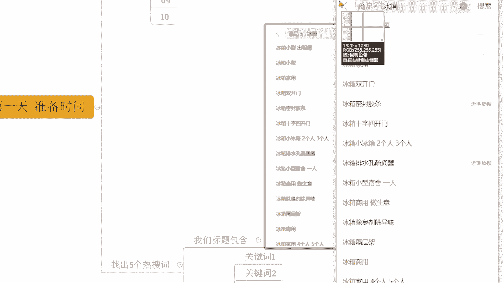

我们就把这些词啊找出来啊，打个比方哎，这一个是适合我的，是对应我产品匹配的啊，这一个是对应我产品匹配的啊，这一个是对应我产品匹配的，对不对，这一个是对应我产品匹配的啊，只要符合我产品的关键词。

这种的我找出来五个啊。

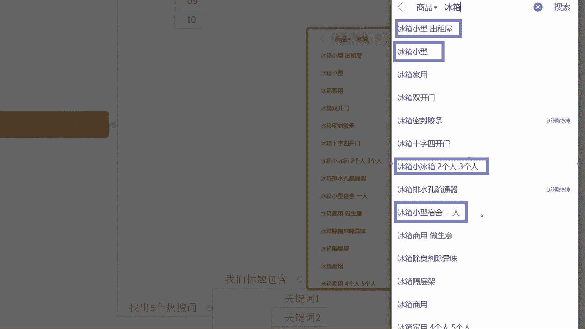

我找出来五个啊，来这里面下面还有啊，下面还有好吧，下面还有啊，如果说这里面没有了啊，注意啊注意啊，我刚刚呢找了四个词，对不对，我刚刚呢找了四个词啊，当然我硬要去用这个家用也是可以的对吧。

我硬要去用这个用家用这个词也是可以的对吧，各位家用这个词跟我也是匹配的啊，我是家用的，我不是商用的啊，我也是可以用的，但是我这里跟大家说一下，有一个重点，那我们要认真看一看，这四个词都有什么样的特性啊。

各位有没有人发现这四个词有什么特性，有发现的话，把你们发现的东西打在公屏上，不清楚的打问号啊，这里这个词啊啊这里这里这里这里对啊，都有小字，都有小字，小是我的产品的是吧，特性我的产品的规格可以这样说。

对没错啊没错，你们还是很聪明的啊，好吧，你们还是很聪明的啊，所以这个时候呢，这些词和我的产品呢是高度符合的，懂吗，他跟我的产品是高度符合的，而不是简单的一个冰箱，家用这种词太泛了，有大有小。

各种产品都有，对不对，能够明白这个逻辑的，现在公屏打一啊啊属性属性啊，属性属性啊，你们说的都对啊，总之这个逻辑你们能够清楚的话，现在公屏打一，好OK没问题啊，没问题没问题啊，能够明白就行了啊。

那现在有一个问题产生了，我们这一个下拉框的词只有四个，没有五个怎么办，只有四个，没有五个怎么办，好OK没关系，那我们可以用到冰箱小型，或者是这个我们收一个冰箱小对吧，我们来看一看哎。

我们来看一看有没有别的词啊，有没有别的词是我这里刚刚没有用到的，是符合我产品的来能够明白的话，公平现在再一次小一走一波好不好，我们要做到这么一个高度符合的一个状态，以它为垂直啊，去做好吧，好能够理解。

对不对，这些词找到之后放在这边，我们做好记录啊，我们做好记录放在这边啊，比如说这个冰箱，小型出租屋就是关键之一，好吧这就是关键词一，然后冰箱小型呢是关键词二啊，以此类推，我把所有词都罗列出来。

做好记录啊，做好记录好不好，这样子方便我们后期去使用它啊，这个很关键啊，这个很关键好，接着再下一步啊，接着再下一步干嘛呢，我们现在让这些人啊，哪些人呢，这十个人好吧。

我们让这十个人去分别搜索这五个关键词，注意啊，这十个人我们把他给复制过来啊，等下我从这里复制吧，啊这一个额操作啊，操作部分啊，十个人我把这个后面这个删掉去啊，十个人分别去搜索这些关键词，比如说一对吧。

去搜索了关键词12345啊，然后二搜索了关键词，123453也搜索了关键词，123454也搜索了这个词，是他们每个人都去搜索一下这五个关键词，啊十个人每个人搜索五个关键词。

各位那么搜索之后呢做了一个动作，什么动作呢，来各位认真看啊，看一遍啊，比如说现在呢我们搜索了关键词小型出租屋。

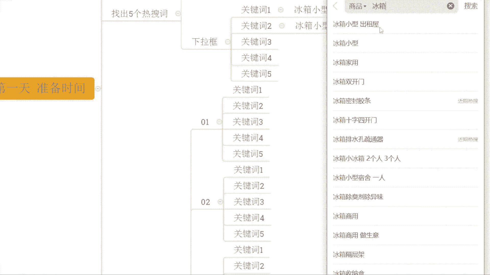

搜索这个词之后呢，等一下啊，我验证一下啊，好OK搜索了之后呢。

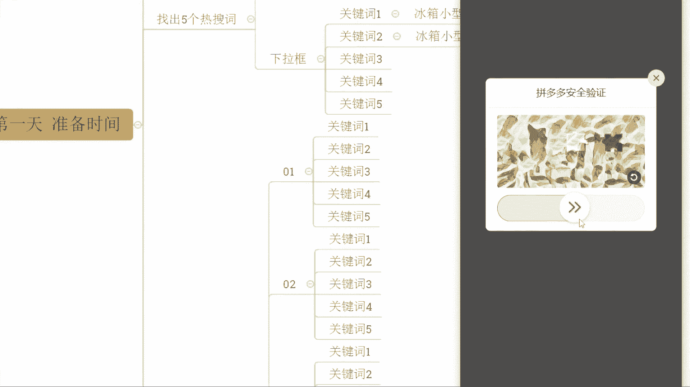

我们把这一个产品排名啊，把它给过一过啊，看一看都有什么样的产品，在这边展示的都是什么样的一个价格，我们自己先心里有个数啊，如果综合排序你后期操作不方便，你可以用销量排序去做也可以啊。

销量排序呢相对来说可能会更好一点，更加稳定一点啊，因为他可以摆脱啊，大部分的这个千人千面的推荐，和我们的这个呃广告推荐的一个卡位啊，所以销量排名可能会更好一点啊，反正你们自己看什么样的方式方便就可以的。

来这些产品呢，你可以先简单的去浏览一遍，做一个这个自己心里面有个数吧，相当于是好吧，那浏览完这个词之后呢，冰箱小型出租屋浏览完之后，我们再来搜索冰箱小型啊，兵用小型同样的这个动作，对不对。

那我们也都用到这个线路卡位，对吧好，我们来看一看有没有那种高度重合的产品，比如我搜冰箱小型出租屋出现的产品，我搜冰箱小型它也出现了对吧，我然后再去搜什么呢，我去搜冰箱小型宿舍一人，他也出现了。

我去搜索冰箱小型，两个人，三个人他也出现了，就是我搜这些词，它都能出现这种最好的这种最好的，尽量的去找到，我通过五个关键词都能看到的五个产品，各位能理解什么意思吧，我通过关键词一我就看到了啊。

有一个商品啊，我们这样写吧，商品A，啊我通过这个关键词一直搜索，我看见了商品A，我通过关键词二搜索也看见了商品A对吧，能理解吧，同时呢我们找五个类似这种产品对吧，商品，商品C商品D商品一啊。

能够最好的状态呢是五个词，五个人啊，十个人五个词都能去同时看得到，这种是最完美的状态，各位这个逻辑现在能明白的话，公屏打一，有没有人不清楚的，啊这个我觉得应该还好，对不对。

当然我看这个如果是很很容易理解对吧，OK的可以的啊，可以的，今天你们确实还蛮认真的啊，让我刮目相看啊，好OK那么这些产品，这些产品呢我们就姑且称它为商品，ABCDE好了啊。

我们就姑且把它这样称之为它好了啊，那这一个时候呢我们只是看到了，对不对，注意啊，到这一步，我们只是通过这些词去搜索去看到了，我们并没有做下一步动作啊，我们并没有做下一步动作，接着才是正式操作，没关系啊。

没关系，操作试试看啊，操作试试，看，不清楚的呢，多沟通，多交流咯，我觉得这个问题不大啊，其实说实话啊，很多小伙伴跟着我实操，他们店铺操作的时候呢，哪怕我跟他们讲的很详细。

他们在做的时候也会遇到一些困难的，但是呢没关系，遇到困难之后跟我沟通嘛，对不对，我们去解决它就好了，所以这也是为什么说，很多小伙伴选择跟着我实操的原因啊，这个我觉得好好好说的啊，好几好几句啊，来啊。

那这一步的操作怎么做啊，我们还是这十个人，第一步的时候呢，我们确认的产品都是谁啊，我们已经确认好了，对不对，那么接着我们正式操作，开始，十个人啊，十个人啊，我把它复制过来吧，好哎等一下啊。

我应该复制到这个地方啊，正式正式操作啊，十个人对不对，其中呢这十个人里面呢用户一，也就是我们的这个，哈哈青岛小哥啊，啊楼上就需要找C罗时代实操了，确实啊确实如果自己去做，不会做的话，OK的啊。

可以跟着实操来啊，这里呢用户一呢，我们就让他去通过关键词一去搜索好不好，让他通过关键词语去搜索，让他搜索的时候呢去点击浏览商品A啊，让他点击浏览商品A好不好，接着呢用户二让他去浏览搜索关键词一。

同时呢让他去浏览我们的商品B啊，让他浏览商品B啊，接着再往下呢，OK的，那么第三个人呢让他去浏览关键词二，同时呢让他去点击浏览商品B啊，以此类推啊，我这里直接我快速的把这个，把这个里面写出来啊。

然后呢你们认真的跟着这个思路看啊，如果说到后面哪里不清楚的，不确定的，直接跟我讲好不好，那这里我直接就我就因为这个字比较多啊，为了方便你们去了解的话，我把这个东西先给你们罗列出来啊。

所以大家可以认真先看一看啊，那不清楚的地方直接讲啊，啊，包括说后面呢，我也会跟他们先说一说这个逻辑啊，商品D啊，Ok，商品一呃，明天跟着实操是吧，OK的啊，OK了啊，OK了啊，其实你早该跟着干实操了。

对不对，浪费那么久时间啊，来这里看啊，接着商品啊，这个九用关键词五呢浏览商品义，现在啊各位各位现在啊呃我刚刚讲了啊，按照我们上面的这个逻辑来的，对不对，我我看看你们的这个逻辑能力怎么样啊。

那我最后考考大家，那这个第十个人是搜索关键词几嗯，第十个人搜索的是关键词几啊，12345是几啊，嗯OKOK啊，非常不错啊，非常不错，给你们点个赞啊，关键词五啊，看来你们还是有在认真看的，OK啊。

风度都把这个商品都发出来了啊，可以啊可以啊，那么这个时候呢，第十个人呢是通过关键词谱呢去浏览商品A啊，那么这个动作是干嘛呢，这个动作其实有很多的作用啊，这里我直接说一下他们这样做的作用是什么，这样做呢。

整个操作呢是可以帮我们快速去提升，我们这一个用户的产品需求标签，啊这是第一步，同时呢还可以让这些产品，这些关键词以及这些用户呢形成一个关联，好吧形成一个关联啊，后期呢方便我们产品进行流量的一个获取。

进行推荐群的一个获取啊，好吧，所以这一部分大家可以入认真的去思考一下啊，看到没有啊，用户一用户二搜索的都是同一个关键词，对不对，那么这个时候呢，商品A和商品B就形成了关键词一，下面的一个竞争关系。

他们有人有人联系，对不对，有人联系啊，然后呢接着用户二和用户三，他们分别搜索的是关键词一和关键词二，但是浏览的都是商品B啊，有的是商品B，这个时候呢，商品B就把用户二和用户三。

以及关键词一和关键词二进行了一个联系啊，接着往下，同样的道理，对不对，那么每个词每个人，每个商品他们之间就会有到一个相互的关联啊，就会这个相互关联啊，好这个是准备动作，第一天啊，这个是准备动作。

第一天各位来准备工作，第一天都能够清楚知道的，都能够明白的，公民打一开始真正的操作了啊，准备动作其实都是小菜来的，真正的操作，马上开始，我们正式的进行我们自己店铺的操作好不好，OK来啊。

那么这个时候我们直接来啊，第一天啊正式操作第一天啊，第一天刚刚那是准备的第一天啊，准备一天啊，那么这一天的话我们去做什么呢，听清楚了，早上的时候你起来了，你干的第一件事情不要像平常一样啊。

哎我看看我的数据怎么样啊，要不要去做点销量啊，要不要去做点开团呢，对不对，要不要去上个产品呢，不用去做这些东西了，现在先去认真干一个事情，什么事情呢，找你的那些朋友回来啊，这十个人你给我找回来啊。

这是第一步啊，第一步我给你打出来吧啊第一步，这十个人你给我找回来，找回来干嘛呢，好通过这十个人，通过这对应的关键词啊，去浏览我们的商品，啊如果说产品直接通过关键词找不到，好O有方法可以去做。

就我刚刚讲到的对吧，你用这个呃以图收款呐，用这个呃链接先发送啊，都可以的，那么关键词这几个关键词啊，这几个关键词如果说你直接搜搜不到，也可以先前期去做冷门词去做也可以的啊，原来我们产品。

那么这个动作呢是干嘛呢，增加我们产品的搜索热度，为什么要做搜索热度啊，因为我们平台会考核搜索热度，对不对，同时呢我们做这个动作之后呢，可以让我们的商品打上对应的标签权重啊。

然后呢让我们的商品呢和这些爆款商品，和这些优秀的产品呢形成一个联系对吧，那这些产品呢这些关键词都能搜得到，而这些关键词是跟我的产品高度符合的，换句话说呢，这些商品跟我的产品，也是有到相同的用户需求的。

也是有着相同的用户人群的，所以说他们跟我产品呢一定是高度契合的，对不对，所以这个时候把这一个标签浏览做过来之后呢，形成一个产品的标签，然后去浏览我们的商品之后呢，我们商品可以快速的去打上一个需求标签。

告诉平台，那么喜欢这些商品的人也会喜欢我们这个产品，虽然说我们是个新品，各位能明白，公屏打印来动手快，OK啊OK那么这个动作做完之后，接着第二步，啊接着第二步啊，那这十个人还是他们啊。

还是他们过来之后干嘛呢，用到对应的关键词啊，等一下啊，我把这个我我我这个得重新去复制一下啊，这个不要了，这里来啊，你还是这十个人啊，还是这十个人还是十个人呢，通过对应的关键词呢。

把我们上面去浏览完我们这些产品之后呢，再回过头来去浏览我们的竞争对手啊，再回过头来去浏览我们竞争对手，这个时候浏览呢可以随意去做浏览就可以了啊，但是要注意啊，要注意其中要安排两个人去完成一个动作。

什么动作呢，就是拍下不付款或者是拍下之后申请退款，各位能清楚吧，那哪两个人呢，比如说用户一啊，用户一下单不付款或者，下单再退款啊，比如用户一啊，然后呢用户三啊，用户三好吧，这两个人去做这么个动作啊。

做这么个动作，那么做这么个动作呢是为了干什么呢，其实道理很简单，后期的话我们需要去进行一个，相似商品的权重获取啊，是需要去做这么这么个动作的，所以说这个时候我们去做了这个事情呢。

那么为我们后面对我们这店铺商品呢进行操作，进行一个浏览截取呢是有一个铺垫的过程的，好吧，OK那么这是第二步啊，简单浏览就可以了啊，为了贬低同行抬高自己啊，可以这么理解啊，可以这么理解啊，我发现这个零啊。

可以的啊，你这个啊思路还蛮蛮蛮清晰的啊，瞬间就能够理解到这个概念啊，然后第三步啊，第三步好，第三步，那这个地方不是浏览完我们的竞争对手了吗，对不对，做了这个动作了吗，好接着第三步呢，听清楚了。

每隔一个小时，每隔一个小时，让我们的这十个人呢，来到我们的店铺进行一次浏览啊，每隔一个小时在我们店铺完成一次浏览啊，那么这个操作呢就是为了增加我们产品的什么，嗯商品热度，啊这商品热度啊。

同时呢去拉高我们产品的用户粘性，来抬高我们产品的曝光的一个推荐权重啊，那么这个动作做的时候呢，接着在晚上的八点钟或者是下午的六点钟，总之你这一天已经反复的操作了好几轮，这个动作了啊。

接着呢你再去做一个事情，就是让白天时间在同行成交，没付款的这两个人，到我们店铺去完成订单的提交，好那么这是第一天啊，这是第一天，那么整个这个操作的话，OK的就可以形成一个同行的什么爆款，它的权重流失啊。

然后呢同时呢我们整个操作的时候呢，去做的时候，可以结合到我们自己商品的一个，具体的流量情况，来算好我们的UV价值，我们的客单价啊，我们的这个额坑产啊，坑惨啊，对没错没错，就这个意思啊，这样的话。

我们整个产品呢就可以快速的去截取到，同样的曝光，并且来说拿到的推荐曝光会很多，新品的倾向就会很快啊，那么这个动作呢持续三天啊，持续三天刚刚讲的是第一天，对不对，其实第二天跟第一天的操作方式呢。

其实差不多啊，那么差别在哪里呢，差别就在于我们第二天呢不需要去做第一步了，第二天不需要做第一步啊，因为这个字比较多，我们懒得去打，我就跟他说一下就可以了啊，第二天不需要做第一步。

直接让我们这十个人里面呢，比如说啊579这几个人三个人啊，来完成我们第一天操作下单不付款，然后再到我们自己店铺去成交，这个动作每一天都会有到这么一拨人，对不对，第一天是一跟三，第二天呢是567啊。

579，这个时候呢你们可以看一下啊，呃一和三分别是关键词一，关键词二，商品A和商品B对不对，然后五呢是关键词三商品C，七是关键词四商品D9是关键词五，商品一相当于第一天，第二天就可以把每个词。

每个竞争对手给他给虐一遍，能懂吧，能懂吧，各位能懂的，公民打一，相当于第二天我们就可以完成，所有关键词和所有的竞争对手的一个覆盖，接着第三天的时候呢，我们再把所有的词，所有的这个啊竞争对手扫荡一遍。

这五个人啊，这五个人2468十过一遍啊，二十六八十过一遍，所以这个时候整个操作的话OK的啊，那么你的权重在后期的推荐就会很多，那这也是为什么说像这个店铺跟着实操，前面几天，对不对。

可以看到基本上没有任何数据的啊，没有任何数据的，对不对，那整个过程的话是可以得到一个，非常快速的提升，就是这个原因啊，感觉懂了又感觉懵哈，不用打啊，那如果是这样子的话，我说一下啊，额可以直接跟实操的。

对不对，有很多小伙伴就这样子的呀，哪有第四天啊，这个一共就三天啊，第一天准备工作站了一天啊，一共四天啊，第四天没有的啊，这个就三天啊，这就三天啊，这个动作就三天的啊，他是三天一个周期。

三天一个周期好不好，三天一个周期，中间会间隔一天啊，中间会间隔一天，你可以把四天做成一次循环，你可以把四天做成一次循环啊，那么准备一天，然后操作三天，准备一天，操作三天，肯定要换人啊，对不对。

你不然你成交怎么办啊，呃现在当然可以啊，温暖我说实话啊，跟着我实操的话，我更喜欢的是新人啊，那这里我说一下吧，不好这里我说一下啊，啊有多少人是跟蹦跶一样的，就是有这种情况，哎我我自己呢操作店铺对吧。

我没有方法的啊，我自己操作店铺呢没有方法啊，没有方法，然后呢没有经验，对吧，同时呢可能也没有资源，所以整个店铺操作呢就会发现啊，完全是在干嘛呢，浪费时间，是吧，然后浪费资金啊，还浪费机会啊。

整个操作呢他就处于一个比较迷茫的状态对吧，如果说你是属于这种情况的小伙伴，公屏上现在打个一好吧，我看一下啊，我看一下啊，然后崩男说没有基础，说实话啊，我我带实操的话，我是最喜欢是没有基础的啊。

我是最喜欢是没有基础的，知道吧，为什么这样说呢，因为如果说你有基础，你有一定的所谓的你自己的一个理解的话，可能我讲什么东西，你会感觉理解起来更费劲，这个我说实话啊，因为什么呢，因为你有自己的想法。

我要纠正你的想法，然后再去给你灌输新的一个正确的一个逻辑，对不对，所以就会导致啊，你整个的操作呢是呃比较比较懵的对吧，但是如果说你完全是一个纯新手的话，OK的啊，那么整个过程的话。

你可能吸收起来会更加顺畅一点，好OK啊，那么既然说刚刚大家都说了，自己是属于这种情况的话，我说一下，那你如果说真的是想要去好好做店，长期坐垫的话，坐垫是做生意，做生意都有投入的，如果说你没有好的方法。

你去盲目投入的话，肯定会面临很多的亏损，这个其实不用我说，如果说你已经在坐垫了，我相信你能感受到的，有没有这种情况，就是已经做了一段时间店铺的，店铺投入的费用跟时间也不少了，但是没有明显提升的。

有没有有的话公屏上打个一啊，有的公屏再打个一好不好，那如果说你们是这种情况的，OK了，我的建议啊，有条件的话，可以直接跟着实操，这样呢至少来说有一点啊，可以减少你走弯路啊，可以什么增加你的成功率啊。

可能你自己做店铺呢凭运继续做对吧，也有可能成功一天，成功率呢，可能就10%到20%不等了啊，可能是最高，这样子了，要凭运期嘛，但是如果说你有这一个好的方法，有一个这个完整的操作思路的话，你去做店铺。

对不对，可能有个七八十成功率是吧，是这样子的，那如果说你愿意去为了这七八十的成功率啊，去努力去奋斗的话，OK的可以跟着实操啊，啊时间怎么算的，OK我说一下啊，哎我说一下啊，那额有兴趣想看的实操的小伙伴。

现在的话可以认真的听一下了啊，公屏上可以打个六啊，可以认真听一下，我把这个实操方式，包括说时间这些东西统统的给大家介绍一下，好不好啊，方便你们能够得到一个更加啊，清晰的一个理解跟认知啊，确实说适合你。

确实说是呃这个合适的话，那么可以直接跟着实操，就不用去浪费时间，好吧，OK啊，来来来来来认真听一下啊，那么跟我实操坐垫的话，我说一下，首先呢是单独指导的啊，不需要你看视频看资料啊，那么你干嘛呢。

你把子账号给到我啊，我会干嘛呢，针对店铺分析，这个分析呢是带着你一起完成的，对不对，然后告诉你好，现在，店铺有什么问题，需要做什么，怎么去做，为什么做啊，让你能够有到非常清晰的啊。

非常完整的一个运营思维，提升你的运营能力，好吧，这是跟着实操啊，这是根据实操，而整个的时间的话听清楚了，带到独立运营啊，什么叫独立运营呢，就是说你能够脱离我的帮助，非常清楚的知道店铺当下这个情况。

应该去做什么，应该怎么去做，而且能够具有到一个能够完整执行，落地的可执行方案，知道吧，当然有小伙伴可能说诶，那我我想说，这个你能能能能不能保证我能赚到钱，能不能这个给我有一个保底对吧啊，包我赚钱。

包我赚多少钱，抱歉兄弟们啊，这个做不到啊，这个做不到，这个不是说做不到吧，这个严严格意义上来说是没有这种说法啊，为什么呢，因为我们整个店铺操作呢，对不对，一定是结合到我们实际情况来的对吧。

我能给到你的是更加好的运营方式，更加完整的操作方法，更好的运营经验，而能赚多少钱，赚1000还赚2000还赚1万，还是看你们的执行情况，你们的操作情况，当然你们的操作，你们的执行我也会去监督啊。

这一方面不用担心啊，可以看到像这些店铺对不对，都是跟着实操的对吧，那么一天啊一天这个3000多单，转化率17。21对吧，一天的话这个20一点啊，19的转化率一天2800多单，对不对啊。

那么各种店铺呢我带实操都是在用心的去啊，针对的去指导的，但是呢每个店铺的数据情况还是不一样的，为什么，因为产品不同操作情况不一样啊，好吧，所以这点大家理解一下啊，而整个的操作的话。

那么呃时间方面的话呃是灵活的，因为你们每个人的吸收情况不一样，你们的这个呃操作理解能力也不一样，包括说我们平台的玩法呢也是不断更新的，所以时间是灵活的啊，而当你们能够独立运营之后，不是说我就不管你了啊。

不是我就不管你了，后期的话如果是平台有什么更新，有什么新的玩法出现一样的，随时找我啊，相当于什么呢。

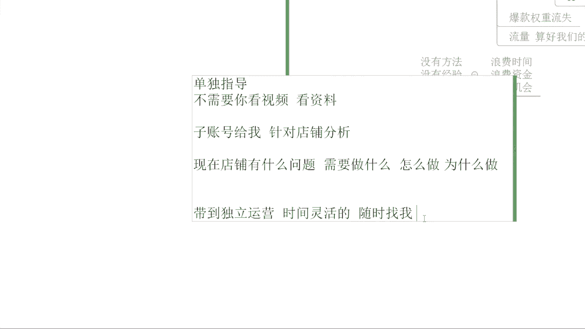

我就是你的店铺顾问好不好，这个是实操方式，各位能够明白没问题，公屏打一好不好啊，这个实操方式都能够接受的话，能够理解的话，公屏打一如果说是有不清楚的地方，可以直接说，OK有神没问题，对不对。

其他小伙伴呢啊安怎么样，还有我们的这个表情表情昵称的这个冰箱，这个哥们怎么样，有没有问题，如果没问题，公屏可以打个一啊，这个实操方式啊，实操方式，那当然了，我刚也提到过，我说如果说你是纯新手纯小白。

那么更好的，那这里我说一下啊，如果说你是纯新手对吧，你看啊蹦跶出来了啊，那指针号是什么，不清楚没关系啊，子账号是我们店铺在运营端口，包括说我们在客服端口都会去设置的一个啊，员工的一个账号啊。

那么这个东西是跟我们店铺关联的，后期怎么设置，怎么去设置，我会我跟你讲啊，这个是小问题啊，小问题，那如果说是跟这个蹦达一样对吧，哎七楼我就是纯小白，我就纯新手，我跟你实操，我也没有店铺，我连产品都没有。

怎么办，OK没关系，可以看一下啊，首先第一步啊，我先带着你去做市场分析，对不对，让你能够清楚的知道什么样的商品是可以做的，我们怎么去选择商品，对不对，那做完这一步之后呢。

后面OK我们再进行下一步什么东西呢，我们去做竞品分析，我们要搞清楚我们的竞争对手是谁，他们的销量情况怎么样，他们的营销方式是怎么样，你去营销的，他们怎么去卖货的是吧，分析清楚这些东西之后，好。

我们完成第三步爆款选品啊，那么这么一步步来的啊，到后面呢产品选好之后好，我们开始我们的啊店铺的搭建啊，再到我们后期的商品布局啊，视觉策划，再到我们的产品上传，啊再到后期我们新品的权重获取啊。

包括后期我们可能还会做到一些活动营销啊，等等啊，这每一个操作环节都是我带着去实操的好吧，所以是新手小白的话完全不是问题啊，那么这个是呃整个的一些这个，实操方面的一些内容吧，那呃方式方面都没问题的话。

有一个重点我需要先提前跟大家说清楚，因为我带实操的话，你们可以看到对吧，呃整个的过程的话，我们需要有到一个非常好的交流过程，所以说我也会遇到一个要求，就是说你真正意义上是能够去把坐垫当做。

一份事业去做的，愿意花时间花精力去做店的这种人可以来，那么我需要的是什么呢，你在周一到周六白天时间，你能够抽出一个小时以上的时间跟着去实操啊，一个小时以上时间，那么这个时间的话碎片化的就可以了啊。

顺便画了就可以的，好不好啊，不用说是一个完整的一个小时，比如说我现在刚好有个几分钟时间，有个空档，我们这个西楼沟通一下啊，过一会之后我要忙别的，我去忙，忙完之后我再沟通一下，把整个店铺的操作沟通清楚。

然后就落地啊，那么整个的方式方面，时间方面都没问题的，现在公屏上打一个六好吧，方式方面时间方面都没问题，可以去做到的，公屏打个六，如果说是白天确实没时间，没关系，白天我把方法整理好之后呢。

你晚上去落地执行，有不懂的直接找我也可以的啊，也可以的啊，然后BA说带小孩没办法出去工作呢，OK的，这个需要你出去工作啥呢，你你选择做电商，不就是为了说有到更多碎片化的时间吗。

带小孩其实碎片化的时间最多的是不是好OK啊，风这边是没问题的啊，风这边是没问题的，然后这个有层是没问题的啊，安是没问题的，OK呃跟我实操做店的话，这里啊费用啊，对我刚刚没说费用啊。

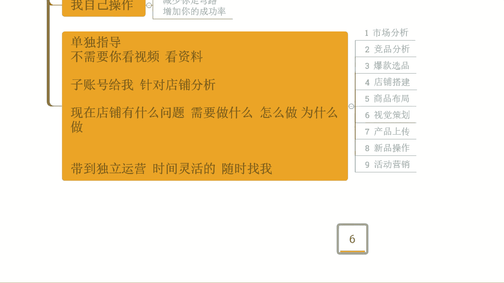

那么这里呢我也说一下，因为你们可以看到啊，我整个的方式方法上面呢，跟那些所谓的这个培训教学是完全不一样的，所以说整个的这个呃投入成本也是不一样的啊，我的时间成本其实投入很大的啊。

那么你们所要支付的费用呢，可能也没有你们想象的啊，那么的啊，第一年对不对，如果说你会觉得几百块那种的，其实不太现实哈，那我这边的一个费用的话，我说一下，目前呢是限时价啊，啊目前是限时价啊，4288好吧。

目前是限时价4288啊，那整个这个费用的话，刚才也讲到这对不对，带到独立运营的啊，带到独立运营的啊，如果说想要跟着实操啊，那么费用方面方式方面啊，整个的时间方面都没问题，那么可以直接微信啊，找我啊。

没有我微信的，可以直接加我的微信啊，这个实操微信，啊只刷微信啊，我就今天我就看到有很多小伙伴是不认识的啊，很多小伙伴说我不认识的啊，像这个呃，像这个这个这个大卫对吧，像这个大卫。

我就我之前好像没见过你啊，像大卫我真就没见过你啊，没有没有直接线上啊，直接线上啊。

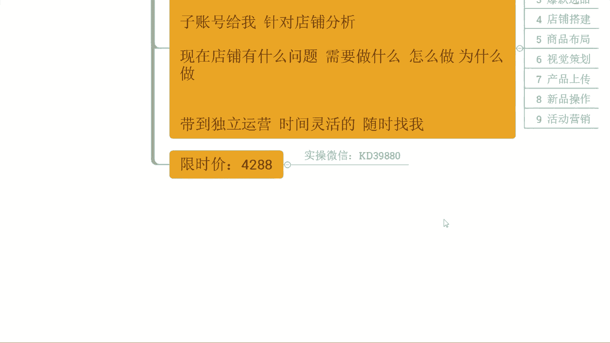

我带实操都是线上的啊，我带实操都是线上的，这个模式也很成熟的啊，所以说不用担心，而且的话本身在整个过程中的话，线上会有到更多优势啊，他没有这个时间跟空间的一个局限性好不好。

然后额有我微信的可以直接微信找我啊，跟我讲确定工程实操啊，或者是公屏上扣个一啊，我把这个付款方式发给你啊，好不好啊啊，有我微信的可以直接微信找我，如果说是没有我微信的，可以直接加到我微信啊。

可以直接加我微信啊，KD39880啊，这个是实在微信，然后呢加过来之后呢，直接跟我讲，要跟着我知道就可以了好吧，像这一个大卫大卫水手对吧，大卫出手，你你是你是哪里看到我的呀，我我真没见过刘你。

你有有我微信吗，有我微信可以微信找我一下啊，如果没有我微信可以加一下我微信好吧，那我相信呢，你今天听我分享直播，应该也是有道一定帮助的，对不对，也确实觉得啊想要去好好做店的啊。

不然的话也不会跟我去呃互动这么多对吧，如果确实说想要跟着好好去做的话，OK的啊，可以直接加我啊，然后像这个呃送太阳对吧，之前呢也是呃有过一些这个操作对吧，但是呢整个操作呢是呃比较不，是不是很理想的啊。

OK啊老公有微信是吧，好OK啦，那啊你可以让你老公找我，或者是你直接加我微信都可以的啊，反正如果是坐垫的话，可以直接来啊，像这个呃宋太阳啊，送大洋啊，送大洋嘴瓢了，送大洋啊，送大洋来，在的话公屏扣一啊。

再来个公屏扣一啊，送大洋在的话公屏扣1OK了啊，像你本身呢做水果对不对，操作方式呢可能在方法上面还是有欠缺的啊，那么呃OK的，我觉得之前的一个不好的一些，这个操作的一些体验的话。

你现在可以去把它放开一边，如果确实说想去好好做店的话，水果方面我也是非常有经验的啊，像每年广西那边的这个呃，这个这个这个这这个叫什么来着，酸酸的那个东西，我一下脑袋就要抽筋了，忘了这个名字了啊啊酸酸的。

泡蜂蜜的那个叫啥来着，名字我一下忘了啊，呵呵尴尬啊尴尬啊，但是不重要啊不重要啊，总之啊总之水果方面我是也非常有经验的，包括对百香果，百香果啊啊百香果，包括像这个呃苹果呀，对不对，还有像这个李子啊。

桃子啊，对不对，每年啊各种季节的水果啊，基本都有带的啊，所以这方面的话水果方面的话打法呀，包括说一些操作方式呢也都是非常成熟的，完全可以直接跟着实操的啊，完全可以跟着实操的啊，然后这个呃风啊。

包括说像这个有成啊，包括像我们的这个表情符号啊，对不对，我刚刚微信也给你们确认过了是吧，要不要跟着实操，如果要的话，可以公屏上或者微信上回复我一下啊，然后呢我把这个付款方式发给你啊。

我把付款方式发给你好不好啊，包括说伟伟啊，那么这边确定用的实操的话，可以公屏扣个一，或者是直接微信回复我，我把付费方式发给你们，搞定之后直接干就好了啊，然后像大洋，你这边的话本身啊。

操作方面呢也是有一定的一个一个一个想法，对不对，那我觉得OK的，可以直接来啊，然后伟伟这边是确定的话，我把付款方式发给你咯，好不好，搞定之后直接开始就好了，就像我讲的。

像你之前说的那个你要去啊找货源之类的呢，完全没必要自己去找啊，没必要自己去这个去做一些呃无用功，因为很多时候你自己分析的一些东西的话，还是还是会有的一些一些这个短缺了。

知道吧啊你知道吧啊伟伟完全没必要去等他，你知道吧，完全没必要等啊，完全没必要等啊，因为你整个店铺呢在前期的布局方面呢，包括说我们数据分析方面呢，这些东西我们现在需要去做的，知道吧。

所以这个东西完全没必要等的啊，可以直接开始啊，可以直接开，可以直接开始的啊，这东西其实道理你应该很清楚的，因为做店铺的话，不是说我们想当然的去开一个店，然后上传产品就可以的，其实上传产品之前的话。

就我刚才讲的，我们要去做市场分析，要去做竞品分析，然后再去做报我们的爆款定位，爆款定位的时候呢，我们怎么去设计我们的SKU，怎么去设计我们的产品价格，这些都是有讲究的，包括说我们后期整个的营销。

我们在这一步都要去完成，完成这些动作之后呢，我们才去做我们店铺的搭建，再去做我们产品的上传好吧，所以这方面的话，可能你现在来说额，因为你之前本身没有太丰富的运营经验嘛，应该是有所短缺的。

我觉得可以直接干啊，可以直接跟着实操的，啊可以直接来的，知道吧，理解吧，明白的话公屏扣一，所以我觉得完全没必要去浪费时间啊，像你现在说你在店铺搞好之后去做，那你这个准备阶段的所有动作，其实都浪费掉的啊。

能理解吧，然后安这边搞定是吧，对对对对对对对啊，对对对，OK的，我看一下啊，OK啊恭喜雅安啊，恭喜雅安啊，啊成功拿下一个名额啊，成功拿下一个名额啊，那么呃加入习实操好吧，安这边的话。

我把这个信息对积表发给你啊，我把信息登记表发给你啊，然后呢你搞定之后啊，填写好之后回来给我好不好，OK啊，我已经发你了啊，已经发你了好吧，可以填写一下啊，填写一下啊，然后下播之后我们直接开干啊。

然后伟伟啊，伟伟啊，如果说OK的话，确定真人实操的话，扣个一啊，直接来就不用浪费时间了，了解吧，目前来讲的话其实就很简单了，你现在要去坐垫，而你在坐电过程中呢，之前你也有到一些这个所谓的经验吧。

做的不是很久，也不是很成功，那你必须需要提升的，对不对，而这个过程中，如果说你在前期选择产品，包括说你的策划方面走了弯路，后期我们可能还需要花费更多时间去浪费，去纠正它完全没必要。

那直接从最开始一步一步来啊，这样子的话整个店铺操作呢其实更加顺畅一点，我觉得更好的啊，这个BA说一般跟你学的话，跟着我是12坐垫啊，不是这个交流培训啊，那么整个店铺操作的话，我说一下啊。

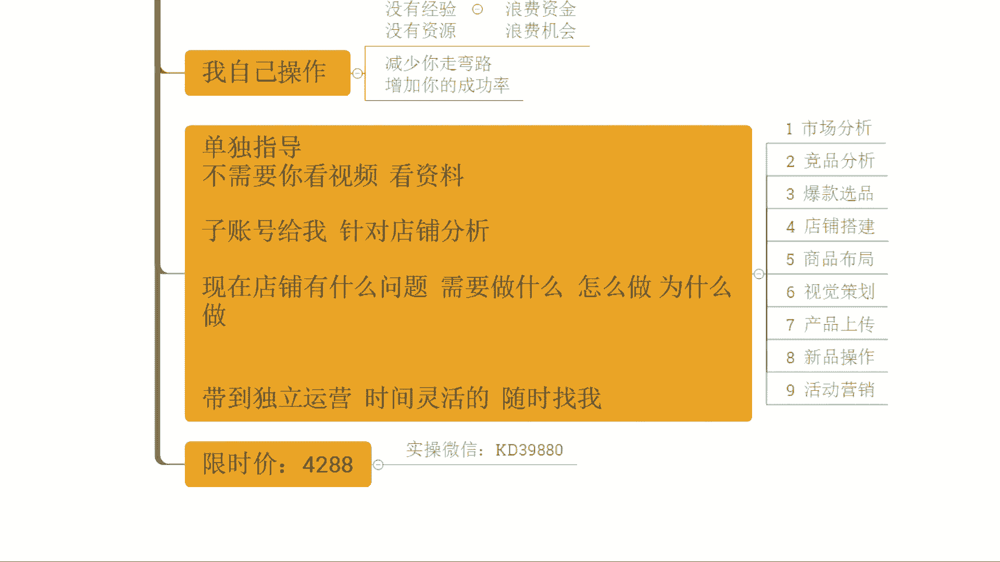

基本上呢两到这个三个月啊，两个月左右吧啊能够步入正轨的，可以看到这些店铺，对不对，来听到这个店铺从最早呢是2000多访客啊，这个店铺最早2000多访客对吧，那60招对不对，直接干到了多少呢。

干到了1万8的访客，看到没有，3100多单，17。21的转化率啊，好不好，他提升的话在这个时间开始提升，当然他跟着实操的话，是之前就跟着实操的啊，之前跟着实操的啊，理解吧。

像这个电本来啊来最早的时候几百个访客啊，几百个访客啊，做好调整优化之后呢，一步一步去重新操作打造，去拉升排名啊，后期呢整个数据提升也是非常快速的，看到没有，那做到了1万3的访客，一天2800单。

转化率呢21。19理解吧，所以整个店铺操作来讲的话啊。

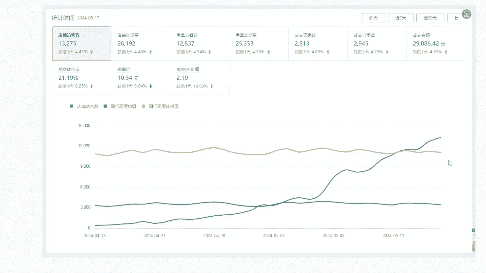

呃如果说你们能够跟着实操，能够去把这个执行力带上，能够去有到更好的落地执行的一个效果的话，其实有的时候时间会更短一点啊，都有的啊，都有的啊好吧，所以这方面的话OK的啊好吧，这个风挡啊如果说是OK没问题。

可以直接来的啊，如果说是有什么其他疑问也可以直接说啊，像这个呃宋大洋宋大洋啊，这边怎么想的，可以说一下啊，包括说像我们的这个呃表情表情，这一个头像的啊，表表情立昵称的这个表情。

昵称的这个也可以直接直接说一下情况啊，还有有层，对不对啊，那么还有包括风啊，对不对，得确认一下啊，那么我觉得OK的啊，OK的啊嗯，然后大洋大洋，你这边怎么样啊，可以回复一下啊，有听到声音吗。

OK了OK了啊，蹦蹦啊，崩了啊，OK了啊，我通过一下啊，我通过一下，然后这个，我的天啊，呃大洋大洋我，我说实话啊，我说实话，这就是这就是差别，你知道吗，这就是差别啊，这就是差别。

你们做店铺的话就是事到临头了啊，就是事到临头了采取怎么做啊，事到临头了才去才想去去做，这样的方式肯定不对的，你知道吧，我们一定是前期去把我们所有的这个店铺，权重啊，包括说我们商品选种去做好的，明白吗。

明白扣一啊，所以这个是一个非常关键的点啊，那完全可以直接跟着实操的啊，然后像这个伟伟啊，伟伟啊，你这边怎么样对吧，可以确认一下啊，可以确认一下好不好，伟伟啊，刚刚这个有听到的咯，对不对。

那你可以确认一下，如果说OK没问题，确认更多实操的话，直接来好吧，可以扣个一啊，我微信也发你了啊，确认一下啊，确认一下，那如果确定这个实操的话，OK的直接来，那我把这个付款方式发给你。

然后搞定之后截图给我就可以了好吧，然后蹦哒啊，额这边确定的实操吗，是的话扣个一啊，是的话扣个一，我把这个付款方式发给你啊，如果确定中的实操，扣个一，我把付款方式发给你啊，用打。

哦ENELI说哎卤味我的天卤味，来来来来来对吧，如果说你们不确定啊，如果说你们不确定什么产品可以跟着实操的话，也可以直接说啊，哎西楼我是做什么产品的啊，那么可不可以做来可以看一下啊，给你们看看啊。

那个还有啊ELI啊卤味，对不对，来给你看一下，前段时间跟着实操的一些这个小伙伴，这个店铺啊。

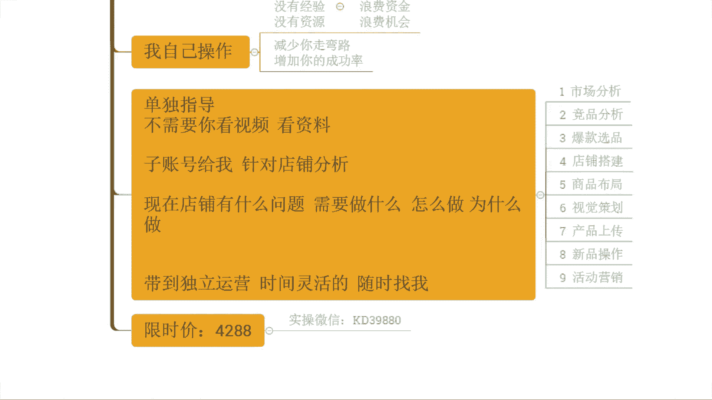

做牛津的来，有看到吗，有看到扣一从零开始起起爆的一个新店啊，从零开始的一个新店啊，从零开始这个新店啊，对不对，从最早零房开始做的啊，也是用到今天这个方法，包括说配合这些其他玩法去做的，对不对啊。

短短的一个月时间干到了1万3的访客，1800多单，一天是3。85的转化率是吧，你说卤味可不可以做，挪威当然可以做是吧，而且你还是工厂，你还自己生产，有价格优势，而且整个的产品的话。

库存方面也不用有任何担心，那这就是你的优势啊，天然优势一定要放大的，对不对。

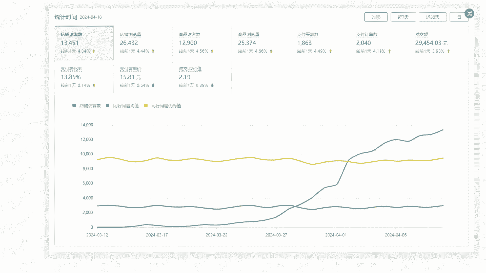

OK的完全没问题啊，我觉得只要你能够去做好落地执行，OK没问题的啊，好不好，然后URLI完全可以直接跟着实操，好不好啊，那么我把这个攻打啊，付款方式我已经发你了啊，付款方式我已经发你了啊。

可以这个呃安排好啊，安排好就截图给我啊，呃然后这个要是说线下线的销量也很好，周边辐射还可以，我说一下，不管你做的线下生意有多大，你要想到一件事情，对不对，你线下所覆盖的范围一定是有限的啊，就像你说的。

你能够覆盖到你其实也是周边来的了对吧，但线上不一样，线上的话你覆盖的是全国啊，这体量完全不一样的啊，啊每天能够抽出一个小时以上，OK的时间有多的话，其实更多时间更好的这个东西灵活的啊。

那整个店铺操作的话，其实你们很多人都会觉得啊特别麻烦，特别浪费时间，包括说像你们现在自己做店铺的时候呢，也都会有这种情况的，对不对，就会觉得很浪费时间啊，这个不知道做什么。

其实更多时候你们停留的这个浪费时间的，一个点的话，就是想在思考，所谓的想，所谓的思考呢就是在那里，这个啊凭空想象去纠结，但是有好的方法，有完整的一个运营方式去做的话。

其实超额店铺并不会占用你特别多的时间，效率会很高，知道吧，E r i，所以这方面不用担不用担心的啊，然后这个呃，啊表情表情这昵称的这个这个哥们还有有成啊，还有风啊，你们这边怎么样可以说一下啊。

一个小时没问题是吧，OK的啊，那我可以直接跟着实操好吧，就不用浪费时间了啊，包括像我们的大卫水手是吧啊也都可以，也都可以直接来啊，还有像我们的这个张浩伟对吧，张浩伟建议讲出更实操的嘛，对不对啊，是吧。

张二维，你这边怎么想的呢，嗯也可以说一下啊，我觉得完全可以直接跟着来了啊，就不用浪费时间好吧，OK的啊，恭喜蹦跶啊，恭喜蹦哒成功拿下一个名额，好不好啊，加入修罗时差，然后蹦哒这边的话。

我把这个信息登记表发你了啊，蹦跶啊，然后呢填写好回答给我好不好，然后下播直接开干啊，多的我们就不多说了，然后其他小伙伴如果说还有这个呃，什么问题对吧，可以直接说，那如果说没有什么其他疑问呢。

我们就呃直接下播了啊，好不好，我们就直接下播了啊，然后呢整个的呃实操方面，如果说还有什么不清楚的地方对吧，你说哎其实我不清楚我这个店铺，我这个产品能不能给你实操啊，可以直接找我啊。

有我微信的直接微信找我，没有我微信的可以直接加我微信啊，KD36880好不好，OK啊，那么今天的直播呢就到这里结束，我们下次再见。

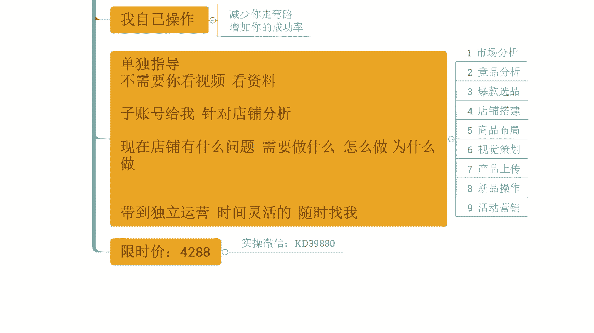