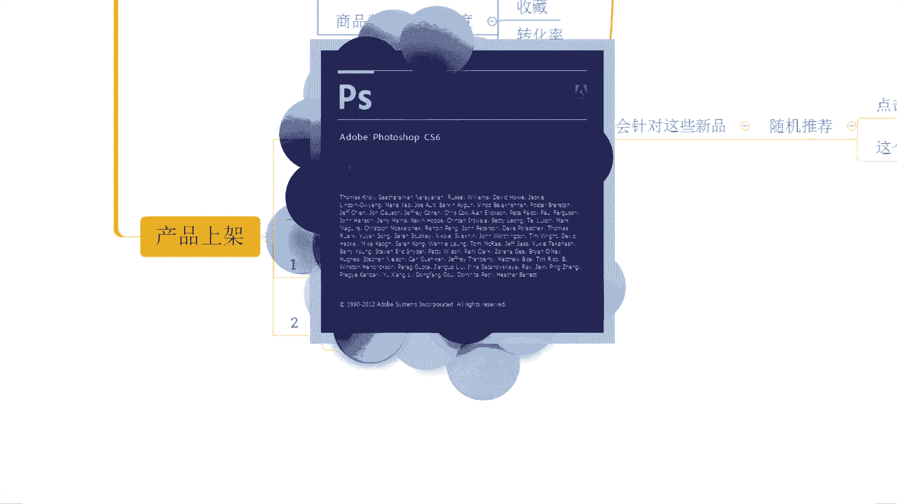
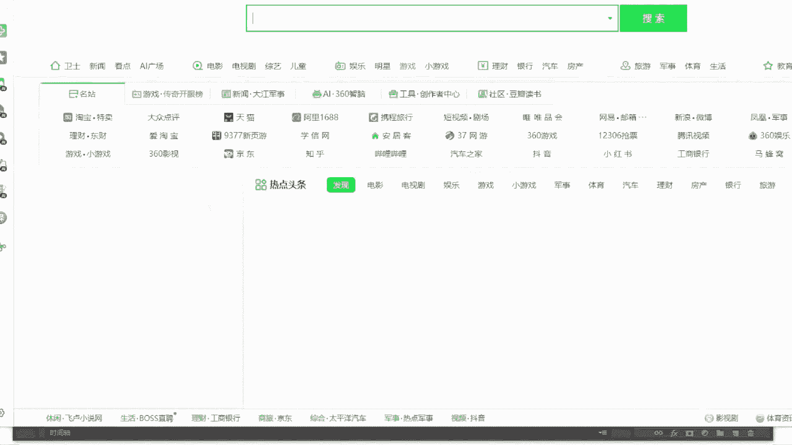
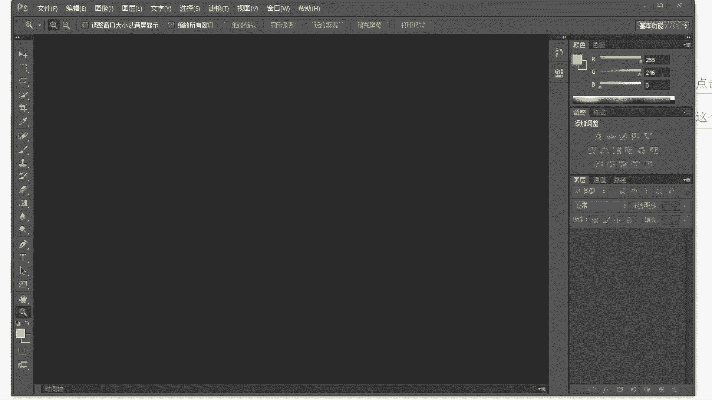
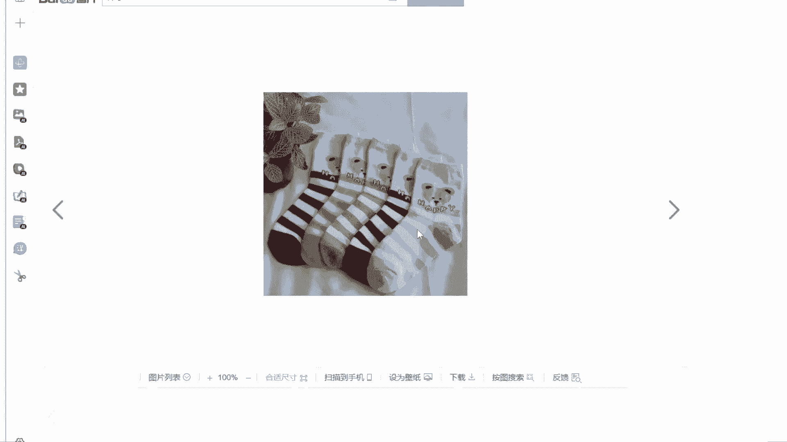
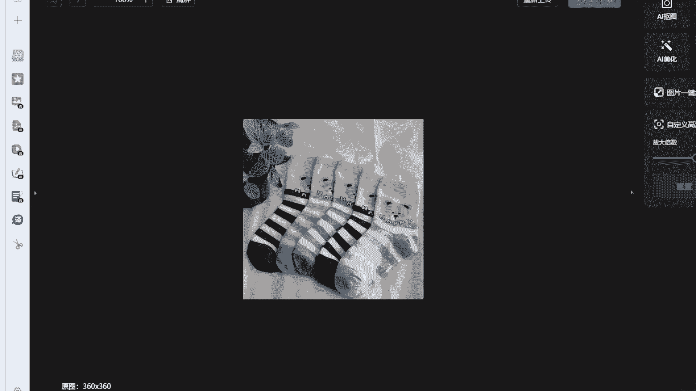
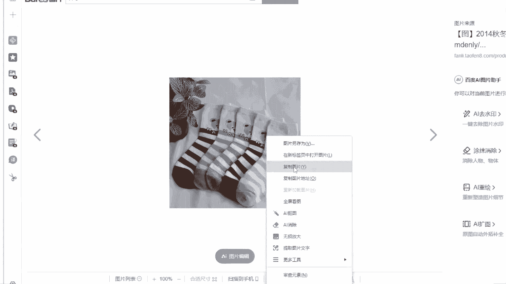
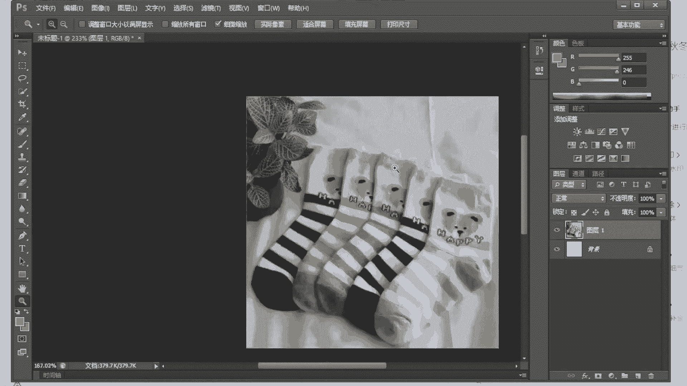
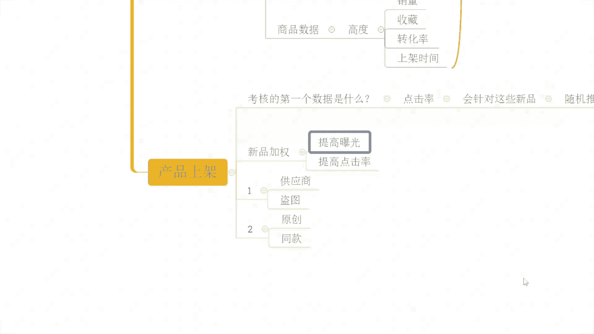
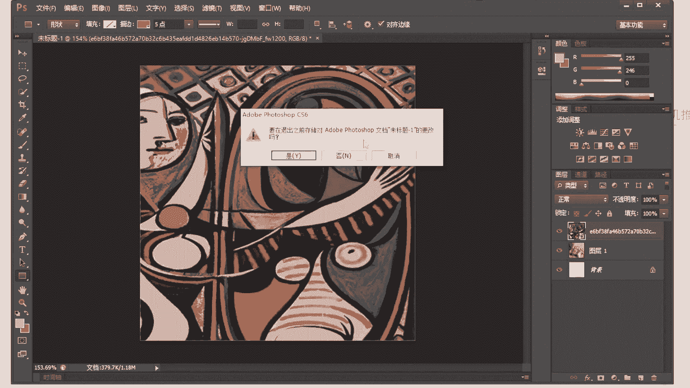
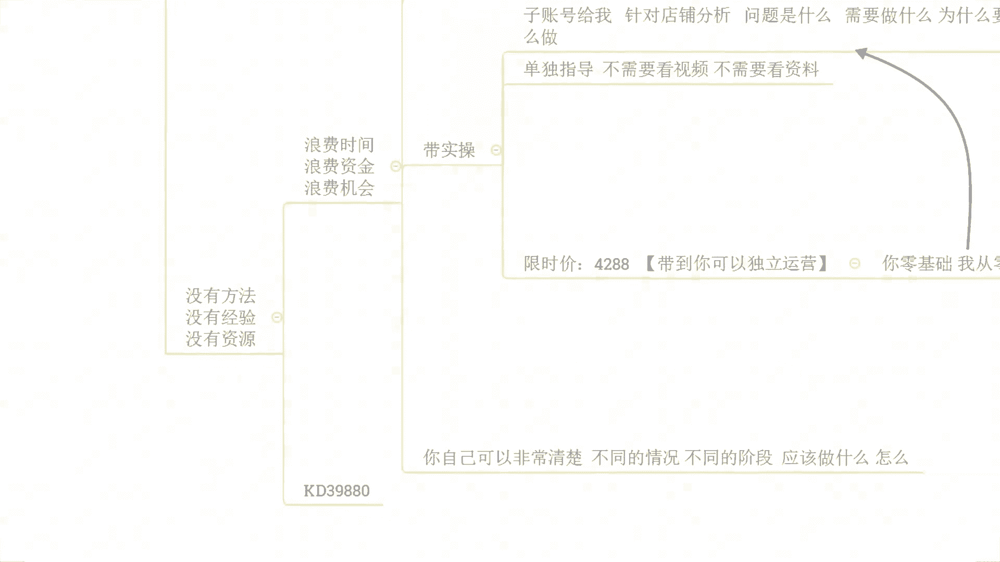

# 【小红书运营教程】B站最良心的小红书运营2025全套新手实操教程（适合零基础小白学习小红书起号／小红书笔记／小红书开店） - P41：41、开店新品上架技巧 获取平台推荐权重 - 红书运营 - BV1kE421P7W3

OK啊我后来了啊，呃能听到声音吗，这边测一下麦啊，所有的小伙伴在直播间的，能够清楚的听到我声音的，能够看到我这边电脑桌面的声音，后面如果没有问题的话，小一走起来好吧，OK嘤嘤嘤也来了啊。

可以的可以的可以的啊，啊大家今天来速度挺快的啊，说实话啊这个效率还还可以啊，可以啊，OK呃那么行啊，既然说大家声音各方面都没问题的话啊，还是按照国际惯例，对不对，我们先呢把这个直播间的一些小规矩啊。

先说一下好不好，那避免呢等一会呢我们可能在直播过程中，如果出现一些其他问题呢，导致啊这个发生一些不愉快哈，那么呃几个点啊，首先第一个对不对，在整个的直播过程中啊。

我希望呢大家能够啊做到第一个就是积极回复，好不好，积极互动啊，那当我在分享完某一个知识点之后呢，我会跟大家进行确认，对不对，你是不是能够听明白，是不是能够听懂，如果说你真的能够听明白，真的能够听懂的话。

记得扣一回复我，那当然啊如果说你没有听明白，没有听懂，OK也要第一时间跟我讲，因为如果说你不跟我说，我是不知道的，我以为你懂这个很可怕的一个事情，对不对，那我就会往后面继续分享，到后面呢。

你可能更多的东西你是没有办法吸收理解的，就会导致我们整个这个时间浪费掉啊，那就没有意义了，各位能理解吧，所以这个点的话希望大家能够去注意一下啊，还有一点就是什么呢，那我分享的时候呢，我喜欢提问。

那我提的这些问题呢，肯定不是说随随便便提的，对不对，一定是跟大家去掌握运营，去提升运营能力相关的，那所以说大家可以把这个思路呢，集中在我提的问题上，跟着我的思路去走，对吧。

不要说自己去这个天马行空的想一些，有的没的啊，那如果说我提到这些问题呢，大家如果能够去有到一个自己的答案呢，也记得发在公屏上，如果说不清楚的呢，没关系，也可以直接公屏上跟我说啊，让我知道你们的状态。

这样呢啊才能够更好的去这个提高好吧，OK那我们继续往下啊，第一个点是这样子的啊，然后第二个点呢就是说在整个的直播过程中呢，我知道啊，大家可能会有一些问题想要去了解，对不对，但是这里我说明一下啊。

在直播过程中的话可以提问，但是呢问题仅限啊当前内容相关的好吧，如果说你有店铺操作方面的问题，你可以现在提，也可以等到我直播结束，正式内容分享完，你单独问都没问题，但是在直播过程中的话。

问题仅限当前内容相关的，那么这样的话啊，才能够保证大家能够去到更好的吸收，尤其是对于一些新手小伙伴来说，像我们今天直播间有没有这种纯新手的诶，七楼我想做拼多多，我想做电商对吧，但是呢我完全没有基础。

零基础的，有没有有的话，公屏打一个零好不好，我确认一下来动作快啊，OK有的啊，有的一阶是这样子的啊，啊包括说还有很多其他小伙伴，我相信也是这样子，OK落败也是这样子的，那么像类似像这种小伙伴的话。

如果说我们在直播过程中问题东一个西一个，那么可能他们真的很难理解的，是不是，那另外还有一点呢，就是说呃本身呢我们这个直播时间确实有限啊，因为我平时可能更多时间，我需要去带实操嘛对吧。

所以呢我本身做直播分享也是挤出时间来的，所以说如果大家你一个问题，我一个问题来问啊，我们解答问题的话，可能要分享的内容是讲不完的啊，所以时间方面呢这样子安排的，所以大家理解一下啊，那么这是第二个点。

然后呢还有到最最重要的第三个点啊，第三个点是什么呢，如果确实今天我分享的内容对吧，是适合你的，是你没有做的啊，没有做到位的，那么一定要什么去实操好吧，一定要去做，去落地执行，你不去做，你听再多的直播。

看再多的视频都没用，店铺的数据呢不是说你去听直播，你去看视频看出来的好不好，包括像我这里很多跟我实操的小伙伴一样的，他们店铺呢也都不是说看视频看出来的咳，是不是，而是去做出来的好不好。

所以这个点大家注意一下，OK啊，那么呃有没有是第一次来直播间的啊，我看一下，OK有啊，以后有迪斯来的啊，有第四来的呃，一个游客登录的，这个是辉辉，是你吗，来啊灰灰是你的话，你公屏上打个一啊。

我确认一下啊，应该是你啊，应该是你，嗯落败怎么扣了个一落败，不要冒充灰灰啊，不要冒充灰灰啊，啊这个这个游客不是不是灰灰是吧，啊我也看到很多这个熟悉的面孔啊，诶百分号也来了啊，还有我也来了对吧。

OK啊很多这个熟悉的面孔啊，好OK啊，那么行啊，既然说都是老熟人，那么这里呢我们就不去做过多的自我介绍，这些东西了，对不对，像很多小伙伴呢也会在在纠结啊，啊你是第一次来是吧，OK啊行行行啊。

有很多小伙伴呢会纠结说哎现在这个电商啊，这个拼多多还能不能做，还好不好做，对不对，我应该怎么去做啊，有的小伙伴呢可能对于店铺操作呢会比较迷茫，有的小伙伴呢可能也去做了很多的攻略啊。

像今天在直播间里面的小伙伴呢，就像这个呃A百分号对吧，来有在有在听吧，A百分号有在听的话，公屏扣个一好吧，有在认真听的话，公屏扣个一啊，像他我也觉得不错的啊，我说实话，在众多的跟我沟通。

这个坐垫过程中的小伙伴里面，我觉得他是有在认真做攻略的，知道吧，他有去认真分析过，他自己去也要去做什么产品，那么这个产品到底的一个这个静音的一个环境，到底是什么样子的，他有去思考过这些东西。

我觉得这是很好的一个事情啊，这个是很好的一个东西啊，所以说这种情况的话，我们操作店铺呢，往往来说会比一些小伙伴什么都不清楚，什么都没思考过的话去做成功率要高得多的，所以是这么个情况啊。

我希望大家能够去到一个正确认知啊，呃时间呢也差不多啊，还有几分钟时间，大家有没有什么其他方面的问题，如果说没有什么其他方面的问题的话，我觉得我们要不然就可以直接开始了，各位你们觉得呢。

嗯你们觉得呢要不要再等一等啊，正常来说是两点钟开始的对吧，我感觉今天今天人的差不多了啊，咳，可以开始是吧，OKOKOK啊，哎呦落败啊，你还挺着急的啊，啊在众多第一次来直播间的小伙伴啊。

你是一个比较着急的一个小伙伴啊，OK的啊，行行行，没关系啊，呃那么时间不等人啊，我也不想浪费时间，就像我讲的，可能大多数时候呢我也有，但是稍比较忙一点嘛，所以我我不想把这个有限的时间浪费掉啊。

啊今天的话应该差不多都来了啊，已经呃时间的话还有2分钟，两分多钟啊，我觉得可以不用等，直接开始啊，那么呃今天要分享的内容呢，是我们拼多多新品起款的一个技巧对吧，包括像我前几次直播分享的。

也讲了很多很多东西，大家也都呃听到了很多，也都会觉得哎确实还不错啊，确实这个C罗还有点东西啊，那么呃当然了，整个的一个分享过程中呢，也有很多小伙伴啊，产生了很多很多的一些疑问对吧，我们也进行了交流。

那么今天呢分享这个内容呢，仍然是我们这个自然流操作的玩法，那对于我们这个对于我们这个自然流的操作呢，其实很多时候啊，各位他就是对于我们这一个规则的解读啊，对于我们这个算法的一个利用，啊或者是运用吧。

不能说利用啊，只能说运用啊，那所以是这么个情况的，对不对，像你们有很多小伙伴呢，会喜欢去追求一些所谓的黑科技，所谓的一些暴力玩法对吧，这里我跟大家讲一下，你真正意义上想要去做好店铺，想要去做好运营的话。

所有的这些所谓的黑科技，所谓的黑玩法都是不靠谱的啊，它只是一时的，它只是在当下某一个阶段啊，可能在平台的一个算法里面啊，产生的一些所谓的bug啊，能够去利用到这个bug。

但是真正意义上想要去好好做点诚意坐垫的话，一定是要去懂得理解规则，运用规则，运用算法的啊，那么呃今天呢分享的这个东西呢，也是我们去了解算法的一个开始啊，那么首先呢我先确认一下各位。

你们有很多小伙伴呢也是刚开始坐垫嘛，甚至有些小伙伴可能还没开始坐垫，对不对，那么大家对于我们这个拼多多平台啊，他的这个额排名考核机制，大家都理都都都知道嘛，啊排名的一个考核机制都清楚吗。

如果说清楚的话啊，把你们认为的排名的规则发在公屏上啊，如果说不知道的，可以打问号啊，有需要我讲一讲的，打问号好不好，那我们把这个东西先搞清楚，搞清楚完了之后，我们再从规则出发一步一步的反推。

如何去把我们产品的权重，把我们产品的排名拉上去，好不好，来动作快啊，可以一起呢把你们自己的这个答案发出来啊，那对于我们整个的拼多平台来说，产品的排名啊是通过什么样的方式进行计算的。

或者是通过哪些因素进行计算的，好吧，大家可以说一说啊，如果说对于这个问题，我刚讲到的你是不清楚的，你是没有答案的，你是完全不知道的，没关系，打一个问号好不好，OK落败不清楚啊，落败是第一次来直播间啊。

然后呢整个的店铺情况呢也是啊，刚开始接触这一块吧，还没还还没算入门，对不对，可能会有到很多的一些疑问啊，这个我觉得很正常对吧，那么其他小伙伴呢嗯小小伙伴们都清楚吗，都清楚吗，来我我看一下啊。

这个呃李佳啊，风度啊，都是些老熟人了，你们说一说好不好，还有这个苏啊，苏也是老熟人了，对不对啊，叔也是老熟人了，叔有在认真听吧，有在认真听的话来，如果说知道答案的话，发出来啊。

然后还有这个呃字母R我好像也记得也好，好像看不见很多很多次了呀，啊不清楚是吧，我好像看了你很多很多次了呀，这个这个2OK我和啊我和来了啊，我和说销量啊，销量啊，OK其他人呢其他人呢我们直播间人不少啊。

其他人呢，这这里我先我先问一下啊，我先问一下各位，你们，其实我有的时候就很不明白，你们来直播间的目的是什么呢，你们来直播间的目的是什么呢，嗯是为了提升吗，还是为了就是打发一下时间呢。

如果说只是为了打发时间，我我讲真的啊，有这个时间你还不如去打两把游戏，刷两局，刷两集剧对吧，更好一点啊，如果说是为了提升的话，OK的那我觉得我们还是需要去多沟通的啊，把你们自己呃所理解的东西讲出来。

把你自己所知道的东西讲出来，相互提升之后呢，才能够得到更多帮助，不然的话你来这里没有意义的，对不对，Ok，OK我看我看看啊，这个欧若拉说是不知道对吧，然后呢之前呢你也打了一个问号的啊。

包括像我们的R说不清楚，然后呢这个额你家说是这一个商品数据是吧，我会说销量啊，然后一一是权重啊，然后输说是ROOI好，OK行啊，那么大概我知道了RI是什么，RI呢叫做投入产出比啊，这个也是我们啊。

产品在进行付费推广的时候的一个数据指标，那么当然了，这个在我们企业经营管理中啊，也会去去权衡到这个RI的，一个一个一个产出的一个具体数据，对不对，诶，我做了这个公司，或者我做了一个这个店铺。

我对这个店铺投入的资金成本是多少，我做了哪些的一个呃，这个投入产出的一个结果是怎么样的，达到了什么样一个产值，那么这个也是可以称为LOI啊，那我们在坐垫的时候呢，其实RI呢嗯在某种意义上来说。

确实可以去影响到我们的排名啊，但是呢在我们具体的啊平台的排名算法里面啊，他是没有这么一个数据指标的啊，这里我说说清楚啊，那其实呢对于我们产品的排名呢，平台是有到相关的规定的啊，这个是有道一个规定的。

这个不是说完全没有一个这个概念，或者是没有这么一个呃所所有的一个标准的啊，是有标准的啊，那拼多多平台呢它的一个产品排名，这里我跟大家说一下啊，是考核什么呢，考核的是一段时间啊，一段时间啊。

产品的这个上新时间，上新时间啊，然后呢产品的销量，产品的价格，产品的质量，产品的售后啊，产品的评分啊等等啊等等啊，这些东西，当然呢可能这样去写呢，大家可能记不住对吧，没关系啊，额你们有谁，你们有谁。

目前是已经开店的啊，你们目前是有谁已经开店的，来有开店的公屏扣个一啊，有开店的公屏扣个一好，OK啊，不错啊，呃茵茵开店了是吧，至尊有开店啊，欧若拉有开店啊，然后呢这个李家有开店，我会有开店。

好各位已经开店的小伙伴呢，如果说你现在在电脑前面的话，你可以在电脑端打开你们的店铺后台好吧，你可以在电脑端去打开你们的店铺后台，然后在你们的后台进入之后，左侧啊菜单栏啊，你们可以找一下啊。

有一个帮助中心啊，有一个帮助中心啊，可以去找一找啊，然后呢你们打开帮助中心之后呢，进入到这个帮助中心的界面之后，可以找到在我们的商品管理啊，这个界面里面呢有到一个商品数据与搜索，啊可以找到这么个东西。

在这里面呢，就可以进去之后看到我们平台商品的排名规则，这个是有明文规定的啊，啊里面呢就是写到我刚刚说的这个东西，对不对，考核我们产品呢在一段时间的商品的上新啊，包括说我们的销量，价格质量。

售后商品评分等等这些东西进行综合排序啊，进行排名更新啊，他有这么说的啊，具体的原话啊我就不去给大家读了，我也我也没有那个闲工夫去记这种东西对吧，但是呢大家要清楚的知道它的考核内容是什么，内容就是这些。

而具体的划分标准的话啊，在整个排名考核中呢，店铺考核的啊，这个商品的考核排名呢，它是分为四个类型的数据指标啊，哪四个类型呢，第一个是我们的店铺数据好吧，第二个呢是我们的商品质量啊。

第三个呢是我们的商品数据对吧，最后呢是我们的处罚类啊，你们可以自己看一看啊，这个地方呢我就不去读啊，我先我先不用去读，你们可以先看一看，那么这里我给大家看这个东西干嘛呢，我是要重点的告诉大家。

其实很多时候啊我们店铺运营的时候呢，在解决店铺操作这个东西上啊，我们缺乏的是一些真正意义上对于平台的了解，对于我们产品的了解，对不对，你们可能有很多小伙伴每天会花费掉很多，很多的时间去看视频。

去逛所谓的这个干货的论坛，包括说看直播分享对吧，没错吧，但是你们可能很多人并没有，真正意义上的去了解过拼多多平台，去认真的思考过你的产品的竞争环境，去了解过你的竞争对手是谁，这个是一个很危险的事情。

各位听明白了吗，如果说你这些都不清楚的情况下，你去做店铺，说白了你无疑是去干嘛呢，是去撞南墙，知道吧，虽然说我们讲不撞南墙，这个心不死对吧，但是你这个东西明知是南墙，你还去撞对吧，那就有点太可惜了。

对不对，那我们整个店铺操作里面呢，我们刚刚讲到的这些数据，他的考核也是有主次之分的啊，所以这个是我们首先要搞清楚的事情，那么现在啊，你们有谁已经看过我刚刚说的这个位置的，有看过的公屏扣个一啊。

有看过的共鸣扣个一，刚刚已经去看了的公屏扣个一好O好不错啊，执行力还是可以的啊，执行力可以的，我觉得说实话，但凡是你们后期呃，如果说跟着实操有这样的执行力，我觉得店铺操作应该不难的啊，我说实话啊。

像我这里的书，跟我做实操的小伙伴们，真的但凡是执行力跟得上的小伙伴，我觉得店铺操作能够去有到一个好的提升，及早晚的事情啊，那对于我们刚刚讲到的这些东西，它我刚刚也提到过有主次，那哪个是主，哪个是次。

我们一起来先把这个东西搞清楚，理顺它，我们知道了平台的规则，懂得了算法，我们才能够去加以利用，对不对好，那么先来看一看啊，首先店铺数据是什么呢，店铺数据我们刚刚应该有小伙伴已经看过了。

对3分钟人工回复率啊，包括说我们的这个额物流服务异常率，对吧，包括说我们的这个30天流速率，包括我们的这个啊品质退款率，包括我们的这个纠纷退款率，啊等等啊等等啊，这么些东西，这里啊我说一下啊。

在我们后台，在我们刚刚看到的这个后台里面，他写到的内容，在我们店铺数据里面只有这些，但实际上不止这些啊，这里我先说一下啊，实际上不止这些啊，新店前期做综合数据，店铺DSR评分是吗。

NO NO NO NO NO NO NO啊，这些东西啊是在我们操作新品时候，自己会产生的，不需要刻意去做啊，为什么呢，来现在我们一起来看一看，刚刚书有说到的店铺DSR评分，我想问大家，这一个考核内容。

大家认为是在店铺数据里面呢，还是在商品质量里面，又或者在商品数据里面，还是在我们的处罚类里面，在哪个里面，各位你们说一下啊，如果觉得在店铺数据里面的扣个一啊，如果觉得在商品质量里面的扣个二。

如果觉得在商品数据里面的扣一个三，如果觉得在处罚类里面的扣一个四，各位工作快啊，刚刚这个书提到的店铺DSR评分是在哪个里面，店铺的DSR评分啊，平台介入上上啊，都上到15去了啊，那是你自己这个怎么说呢。

要么是你产品本身有问题，要么是你自己这个沟通技巧有问题啊，OK啊有人说在第三个里面，有人说在第一个里面啊啊有个别的啊，少部分的啊，目前来讲哎啊差不多一半一半啊，目前给了我反馈的是差不多一半一半。

其他人呢喂你们这么多人在直播间，就就这么几个人回答我问题，其人是不清楚吗，不知道吗，如果说不知道啊，你打问号，兄弟们啊，动作快一点啊，你们不要不不要不沟通啊，对不对，一定要说啊。

一定要说在考核排名机制里，我的天叔，你这个话说的没毛病啊，确实在排名考核机制里面啊，那在这里面的话，在哪个里面啊，在哪个里面，这四个类型里面啊，在四个考核项目里面，他在哪个里面。

啊英英说是物流服务商品这个质量描述啊，OK好行吧行吧行吧行吧好哎，那我告诉大家吧，好不好，我告诉大家吧，下三个啊，我告诉大家吧，你们说的都不对啊，刚刚这一个呃，讲这个1234啊，讲这个什么呃。

这个下面三个这个都都都肯定不对的，讲第三个的肯定也更不对的啊，店铺的DSR大哥明明都写了很大的两个字，店铺了对吧，你怎么会到这下面去找问题呢，店铺DSR评分肯定在店铺数据里面考核呀，各位这个逻辑能懂吗。

那商品数据的话，你说有商品DSR数据，那这个我承认对吧，商品DSR数据汇总可以得到店铺DSR评分，这个我也承认，但是你说店铺DSR评分，考核在这四个项目里面的话，哪个里面一定是第一个。

各位这个逻辑能懂吗，这个逻辑能懂吗，能懂的话，现在能理解，能明白我表达的意思的话，公屏上打一个一好不好，店铺DSR，所谓的店铺DSR，你说你在下面去找，你下面哪里找啊，考核项目。

考核项目它不是指我们数据来源懂吗，好那这个问题为什么说我刚刚要去回答，他要去解答它呢，兄弟们，我讲真的啊，这个就是你们很多人做店铺的一个弊端啊，完全没有搞懂平台的一些东西跟算法的时候呢。

自己会有一些自己认为对的一些想法，然后去操作，或者道听途说的一些想法去操作啊，那这里呢我们继续往下来看啊，刚刚呢我们说的呃，这个店铺数据里面，除了我们平台给到我们明确规定的。

或者明确表达的这些考核内容之外，还有其他的东西啊，其他东西里面这边我是省略浩宇打到的，对不对，那么这个其他东西里面到底有什么呢，刚刚这个店铺DSR在里面的啊，包括说我们的店铺层级。

啊店铺层级也都在这里面的啊，还有更多东西其实都在这里面的，那么这里我为什么要讲这个，那就是因为我们很多人做店铺，有的时候本末倒置，完全没有搞懂算法的时候呢，瞎操作什么意思呢，各位这里我要重点说明一下啊。

有很多人开店之后，第一件事情先去啊搞DSR，先去搞店铺层级，有没有，今天在直播间的小伙伴们，如果说你有这种情况的公屏上，现在给我打一个二好不好，我先确认一下啊，来动作快，今天我们直播间里面有没有这种人。

上来之后先去这个呃，通过各种渠道去做DSR评分，通过各种渠道去干层级对吧，做大单呐是吧，从直播间做呀，从这个呃果园去做呀，通过其他的途径各种去做，做到单做升级有吧，有没有，OK有啊，OK啊行。

那么这里我要重点说明什么呢，店铺数据啊，它在我们整个的新品啊，包括说新建前期考核的时候呢，其实对于我们来说根本就不重要，这个这个说法我知道可能会颠覆你们的认知，对吧，你们可能很多小伙伴并不是这么想的。

包括说你们一直以来接触到的，了解到的这些信息，也不是这么跟你们说的，可能一直以来你们接触到的信息就告诉你啊，店铺的DSR评分很重要，你上架商品之后先去把这个50个评价干出来，先去把DSR干出来。

不然的话你的商品不可以入入池，不然的话你的商品不能搞活动，不然的话你的权重就会很低，没错吧，但实际上真的这样子吗，不是的不是的啊，为什么说不是的呢，各位我们一直以来都听说过一个事情，叫做心电啊。

这是新店有扶持对吧，各位这个词大家有听过吧，这个词大家有听过吧，来有听过新电扶持这个词的，公屏上打个一好不好，你们可能现在还觉得哎这个西楼，你你现在表达的这个意思是什么，不用着急啊，不用着急，认真听。

你们会知道，你们会了解到你们所以前没有认知道的，没有了解的东西啊，对你们来说应该是一个啊非常大的一个提升哈，那今年分数是什么呢，各位很简单，那么对于我们店铺来讲，我们是一个新店。

我们是一个啊刚刚入驻的一个店铺，那我们在平台上去发布了商品，这个时候我想问大家一个问题，你有所谓的3分钟人工回复率吗，你有所谓的物流服务异常率吗，你有所谓的这个30天投诉率，品质退款率，纠纷退款率。

店铺跌12评分，还有店铺层级吗，这些你通通都没有，对不对，那么这些你通通都没有的情况之下，平台为什么说还会给你曝光呢，这个曝光其实就是心电复制啊，这个曝光其实就是心电复制，它扶持是什么扶持啊。

它扶持是你在这些数据都没有的情况之下，让你存让你存在着一个状态，就是默认达标的状态，各位能懂吗，这些东西你前期是一个新店的时候，你是没有的，没有怎么办，默认你是达标的，默认你是达标的话。

OK那么你的产品你的店铺是可以正常曝光的，什么意思，各位我画一个图，大家认真的看一看哈，来现在有在直播间的，有在认真听我分享的公屏上打一个六，好不好，动作快啊，有在认真听的，现在公屏打个六啊。

我现在画一个图，这个画图的过程的话，我可能不会去打字，所以希望大家能够把注意力集中啊，能够去认真的看懂这个图好不好，来现在呢我们一起看一看啊，这里呢是我们的拼多多平台哈，这里是我们的拼多多平台。

那现在呢我们画了一条横线啊，啊我们用这个画一条横线吧，红色的横线啊，来现在我们画了一条横线啊，这一条横线在最中间的位置呢，就是我们产品的曝光的一个原点啊，我用一个别的颜色啊。

用一个黄色吧哈我来画一个黄色的圆点啊出来，好，那么这个黄色，我相信大家应该能看的很清楚对吧，在这个位置啊，在这个位置，这个是我们曝光的原点，正常来讲我的产品上架之后呢，他就从这个位置啊。

他就从这个位置开始去获取曝光的，从这个位置往上啊，往上数据会变大对吧，往右数据也会变大，那往右是什么呢，往右是我们产品的基础权重考核，来我我现在来画一个框子啊，这个这个这个框子啊。

我用一个蓝色来来来表达吧，啊用一个蓝色来表达来这一个蓝色的框子呢，如果说一开始我是新品的时候对吧，我没有商品的销量，没有商品的这个转化率，各种数据指标都很少，它可能就很矮啊，他可能很矮。

然后呢我产品上架的时候呢，我产品的标题呀，图片呐，价格呀，属性呢这些各种东西都不是最优值对吧，这个时候呢它就会很窄，又矮又窄对吧，但是如果说今天我的产品，有到一个很好的产品的这个价格。

有着很好的产品标题，有着很好的商品的属性，有着很好的商品的图片好，那么它的宽度是可以被扩大的，价格是一个超级适合我们拼多多平台的，一个价格，具备非常好的价格竞争力的话，那么它的流量宽度会被扩大。

他的图片是一个优秀的图片，是一个原创，图片是一个新品，它的宽度再次被扩大，当它所有的东西都是最优的时候，它就变得最宽最宽，它能够覆盖到所有的这个产品，应该能够覆盖到的最大的流量范围。

然后呢商品的销量板块啊，它能够具有到一个好的销量数据，它的高度会增加，它的转化率很不错，高度再增加他的客单价也很好，高度再增加它整体的坑场不错，GMV做的很好，靠高度再增加。

再到后面呢它的这个整体的啊UV价值啊，同比增长率啊等等，这些东西做的都很好，它的高度再增加，直到最后能够覆盖到最大的范围，这个就是我们刚刚讲到，这个商品能够拿到的最大曝光啊，但是但是听清楚有。

但是啊但是如果说我们的店铺的数据不达标啊，哪些店铺数据呢，3分钟人工回复率30天，物流投诉率对吧啊，30天这个呃投诉率30天，这个物流服务遗传率对不对，还有我们的品质退款纠纷，退款率等等这些东西。

我们的DSI我们的店铺层级不达标，那么这个时候它是不会从原点来的，这个黄色的圆点还记得吧，这个黄色圆点我把这个绿色删掉去啊，黄色是我们的曝光原点，我的产品从这个地方开始曝光的，对不对。

那如果说我的店铺数据不达标的话，那么抱歉，这个时候呢你的起点就不是这个位置，你的起点会往左边移动啊，那么相当于左侧部分呢它是一个降权的状态，知道吧，各位啊，左侧部分是一个降权状态啊。

我把它画成这个青色啊，那么这条这个框子啊，如果说我的这个店铺的30天啊，这个呃3分钟人工分率不达标，它往左侧移啊，他的这个呃30天这个投诉率不达标，往左侧移啊，所有的数据考核完之后。

哎那么它的这个时候才是它的起点，那这个时候才是它的起点啊，等下哎，等下我要画一个这个我要画一个别的颜色啊，啊画一个紫色啊，来这个紫色才是它的起点，对不对，而正常来说，我如果说店铺权重达标的话。

那我的起点在这个位置啊，围棋垫在这个位置来，我换一个颜色啊，来表达好吧，换一个这个刚刚蓝色好，各位起点就不一样了，对不对，但是听清楚了，产品在进行发布之后呢，第一时间优先考核的是什么。

优先考核的是我们产品的这个啊商品的数据，商品的权重，商品数据权重考核完之后进行产品排名，才会去考核我们的店铺数据，各位来整个的逻辑现在能够明白能够搞清楚的，公屏上打一啊，能够明白能够理解公屏打一。

好当我们把这个搞清楚之后，我们再回过头来问一问啊，我们现在作为一个新店，作为一个新这个新操作的一个店铺，新操盘的一个店铺，我需要上去去做我们的店铺DSR，上去去做我们店铺层级吗，各位需要吗。

觉得需要的打一，觉得不需要的打个二，啊现在这个逻辑应该很清楚了吧，对不对，还需要啊，我的天怎么可能还需要，我们不需要，为什么，因为这个时候我们是达标的，我们做来干嘛，对不对，这个时候我们是达标的。

我们不需要做它对吧，只有当我们不达标的时候，我才会影响到我们排名，而店铺的这个数据，包括说我们的处罚类啊，这两个板块啊，他们两个只降权啊，他们两个只降权不加权啊，那我们真的想要去做好店铺这两个数据。

我们在日常运营的时候去维护好就可以了，而我们要获取产品排名的话，实际上真正意义上要做的是什么，是做我们产品的质量，是做我们产品的什么数据是这样子的，好不好，这个逻辑才通的。

那么这个时候呢我们就往下继续看了，好不好，我们就往下继续看，那么商品质量各位是什么都清楚吧，如果说不知道的，打问号，我讲一下啊，呃五说我找了个代运营，先刷单做层级，昨天补了300人啊，这个我不做评论啊。

这个我不做评论，我给你这么解释吧，呃这个是是是上个月还是哪个月，我忘了啊，应该是上个月的事情啊，有一个哥们啊，有一个哥们他去开了个店铺啊，然后呢他也是听到一些人跟他说，你这个店铺啊。

你现在这个新店里没有层级，你是没有流量的，对不对，你先得去做到第三层级，第四层级才行啊，打底三层级是吧，要做到这个数据才行好，他去做了，他去做了大单去做了啊，额一共的营业额呢是做到了12万多。

将近13万啊，做到了第三层级还是第四层层级，反正做到这个样子吧，啊当时觉得哎我感觉要起飞了，对不对，然后呢扣点呢扣了有个，反正差不多快快1000块钱了吧，啊八九百块钱差不多小1000了啊。

扣点扣了这么多，做完之后，店铺反正一直以来都没有什么太多的访客，所以说你说他这个靠不靠谱，我不知道，因为我不知道他后续的操作啊，我的天五啊，我跟你讲啊，我跟你讲，我你说这种我见过啊，你说这种我见过。

我不知道他是不是我给你讲一个案例吧，我给你讲一个案例吧，啊额有一个这个有个哥们啊，也是也是这个在看我视频加到我这边的，他跟我讲，他说呃戏楼这个我我这个确实认识你比较晚啊，这个有点后悔。

我应该早点认识你的，我说怎么了，他们被骗了，我说怎么被骗的，他说找了一个代运营，这个代运营呢不是说收服务费这种的，免费代运营跟你一样的啊，说存存这个提点，而且还签合同的对吧。

呃一个月销售额如果说没有做到10万，分文不取，做到10万之后啊，提多少呢，第五个点啊，5%啊，他一听哎也感觉合理啊对吧，一个这个钱也不多嘛对吧，这个钱也不多啊，他真的是能做到10万的话也很合理的对吧。

各位你们觉得这样的方式合理吗，你们觉得合理的话，公屏扣个一，你们觉得这样的方式合理吗，对吧，如果说是你，你愿意去做吗，这个事情各位可以实事求是啊，我相信啊，现在在直播间很多小伙伴都已经听了哇。

还有这种好事对吧，找我呀，我我我愿意啊对吧，OK了，我说一下啊，这种东西啊，你们如果觉得真的好的话，那你你你你你这个嘴都瓢了啊，你离被骗啊就不远了，你知道吧，你离被骗就不远了啊，这哥们怎么被骗的。

我告诉大家，然后呢，这个所谓的代运营呢怎么做的店铺咱也不知道，我只知道一个事情，就是他店铺的这些订单确实出现了，确实经营的效果很好，确实有很好的转化，确实有很好的这个销售额啊，确实有很多销售额。

一个月下来干了有个20几万啊，销售额干了20几万，然后呢这个这个黛玉呢就找找他呀，哎呃这个兄弟，我我这个业绩都做出来了，对不对，这个你现在看你什么时候把这个体检结给我好，这个哥们就上头了，哇，这个不错。

牛逼对吧，我我我要跟你长期合作，结马上给你结卡，前脚把钱打过去，后脚店铺里面咔咔咔订订单全退货了，哼厉害吧厉害吧，我就说厉害吧啊这个是最恐怖的啊，这个是我见过最狠的一个一个一个操作啊对吧。

这是我见过最狠的一个操作啊，像这种东西，对不对，就像这个我和说的一样，就是天上掉馅饼，哪里轮得到你的呀，是不是没错吧，他有这功夫去帮你把店铺做起来，赚你的那点提点，他自己做店铺，租个店铺不香吗对吧。

神经病啊是吧，跑过来帮你帮你打工，白打工还是啊好了啊，所以这个东西大家有正确认知啊，对不对，OK啊这个刚刚这个一个这个别的话题扯远了啊，我们我们收回来啊，我们收回来啊，我们收回来，那么我们刚刚讲到的呢。

是我们整个店铺的一个排名考核机制，对不对，但是在里面我们刚刚提到的，真正意义上对我们商品有帮助的啊，五你不会是已经合作了吧，哦对对对，你，你已经开始做这个层级了是吧，OK啊呃节哀啊节哀。

愿天堂没有带你赢，我的天啊，开玩笑开玩笑啊对吧，这个东西怎么说呢，吃一堑长一智吧，我觉得还好啊，你目前的损失还不大是吧，及时止损吧啊及时止损啊，OK啊呃继续我们刚刚的话题啊。

刚刚讲到的是我们这个店铺求职考核啊，大家兄弟们啊，注意力集中吧啊来有在认真听的公屏扣个一，好不好，稍微的这个这个注意力啊转移一下啊，跟上了啊，跟上了啊，要开始分享了啊，好不好，来所有人动起来啊。

有在认真听的啊，小艺走起来，我看一看，OK啊OKOKOK啊，可以的啊，那么对于我们整个店铺来说，我刚刚讲到的，真正意义上影响我们的产品排名的，能够帮我们去增加权重的。

其实是我们的商品质量和我们的商品数据，是这两个板块啊，这两个板块是增加权重，增加排名的，知道吧，那首先第一个商品质量啊，商品质量是什么呢，商品质量不是说我们产品的这个啊材质怎么样，耐不耐用对吧。

哎不是这个东西啊，它指的是我们商品的这个标题，我们商品的关键词，我们商品的主图，我们商品的详情，我们商品的价格，我们商品的属性啊，还记得吗，我们刚画的这个图，它影响的决定的是我们流量的宽度啊。

这个东西它决定我们流量的宽度啊，好吧这个东西决定我们流量的宽度啊，在这个地方，那么这些东西的话，当我们上架商品的时候呢，就直接出现了，在我们平台上就直接有了，对不对，平台呢会针对到这些数据来进行考核。

然后给到我们产品一个基础曝光，那么这个基础曝光给到我们之后呢，对于我们产品来说的话，我们可以获取到一定的曝光量之后呢，群众的获取，哪些后续的数据反馈呢，我们的点击情况，我们的点击量情况。

我们的搜索热度等等啊，然后整个商品在进行运行过程中，产品有了曝光，有了访客之后，再会进行我们商品数据的考核，对不对，那么这个商品数据呢，它决定了我们流量的高度啊，我们能够拿到多少的量啊，高度在哪里。

这个它决定的，那么这里面呢就包含了我们刚刚有很多小伙伴，提到过的销量啊对吧，包括说我们的这个啊收藏对吧，你们没有提到过的收藏啊，还有到我们的转化率是吧，还有我们的上架时间啊，这些东西考核这里面的。

那么现在啊，我有一个非常非常重要的问题要问大家啊，我有一个非常非常重要的问题要问大家，那么对于我们店铺来讲的话，现在我们产品上架了，那平台针对到我们商品考核的，第一个数据是什么，刚刚我其实有讲到的啊。

我不确定大家有没有认真听啊，如果有认真听的话，现在应该能够给我答案的，如果说不知道的，不清楚的打问号，没有听清楚的，不确定的打问号，有知道答案的发到公屏上来，欧若拉你知道吗，然后李佳你知道吗。

战争与和平啊，包括英英，还有阿比啊，还有这个微微养生啊是吧，来如果说清楚的话，知道答案的话，可以发到公屏上啊，如果不知道的话，没关系啊，没关系，打个问号好不好啊，阿比你是知道是不是宽度啊。

战争和平说宽度啊，然后按说商品的质量啊，然后因一说评价我的天呐咳，还记得还记得我刚刚讲到，我说我们产品呢平台给到诶，有人说到了一个点子上啊，稍稍微有点接近了，稍微有点接近了啊，我们产品上架之后呢。

平台会根据我们的商品质量对不对，来进行产品的基础权重考核，各位还记得吧，而针对到这个技术群众考核的时候呢，平台给到我们曝光之后，后续会根据我们的数据反馈，来进行推荐权重考核。

那么其中呢就会考核到我们的点击情况对吧，我们的点击率啊，刚刚我有提到过的，我有说过的啊，可能大家这个语速比较快的情况下，大家没有听清楚啊，这个没关系，但现在的话我希望大家能够记住它啊。

所以在这个时候我们产品上架了啊，那么平台会进行考核考核的第一个数据点击率，各位记住了啊，点击率为什么说考核点击率呢，道理很简单，各位你们想象一下啊，今天如果说有很多产品发布到平台上来，对不对，都是新品。

都是跟你差不多的一样的产品，都没有销量，平台呢会针对干嘛呢，会针对这些新品进行推荐啊，进行推荐，进行一个随机的推荐啊，给到一定的曝光，那么这个曝光呢他们的数据量呢，按照我们商品质量不同。

可能也会有多有少对吧，但是都会有到一定的曝光，那么有人给到了曝光啊，可能和你差不多，或者比你多，或者比你少，这个东西都不重要，重要的是什么呢，有人他的点击率很高，那么平台就会认为这个产品啊。

这个产品啊用户的喜爱度高，举个例子啊，打个比方举个例子啊，今天像这个敏啊敏啊有发布一个产品啊，这个产品呢发布出去之后呢，啊平台给了他1000个曝光对吧，那么这个产品呢哎图片呢做的还可以，对不对啊。

做的还可以，点击率呢做到了10%对吧，点进率达到10%，他能够去拿到100个访客啊，打个比方啊，另外一个哥们呢哎也能够拿到1000个曝光，这个哥们就是安啊，安也拿到1000曝光。

然后呢安的这个图片呢比较差劲啊，只有1%的点击率啊，1%的点击率，他的访客只有十个，那么各位我现在想问大家是第一个群种高呢，还是第二个群种高呢，对不对，来大家可以把单发公屏上啊，你们把这个东西搞懂。

你们就应该能够理解到，为什么说是点击率的考核了啊，OK啊呃其他人呢，来我点个名吧，点个名over over，啥欧若拉啊，这个是谁权重更高，答案发出来好不好，战争与和平阿比啊，还有这个言有物行有格。

还有走下去维维养生，不吃青菜的小河，还有新旺达啊，还有这个勤奋丢肥仔仔啊，还有炸炸是吧，来把答案发出来啊，把答案发出来好不好，是谁是谁，权重高，OK啊OKOKOK啊，还不错啊，还不错啊，都有在认真听啊。

至少对不对，所以这种情况之下，那既然说第一个优先考核的数据是点击率的话，那我们在做店铺的时候应该去做什么，应该去，那就是最早的时候我们应该注意什么，大家说一下嗯，那我们现在去操作一个店铺。

我们去经营一个店铺，我们去做了一个新品，那我们在最开始产品进行啊，这个上架操作的时候呢，我们应该注意什么，应该做什么，怎么样去保证我们能够得到更高的权重，能够拿到更好的排名，各位一起说一说好不好。

一起说一说，其实刚刚呢在在这个之前啊，我问大家考核的这个数据是什么的时候呢，有人提到过这个东西的啊，就是敏有提到过的对吧，他提到过一个词叫主图啊，他提到过一个词叫主图，其实对于我们店铺来讲的话啊。

我们在前期经营店铺的时候呢，我们要核心操作的部分呢就两个点，提高曝光而不是提高浏览量啊，是提高曝光啊，另外一点呢就是提高点击，提高点击率好吧，有个点击率啊，是这两个部分是最重要的。

你把这两个部分搞定之后呢，你的产品在初期考核中才能够脱颖而出，而产品的曝光怎么提高的，刚刚我们提到过对不对，流量的宽度啊，商品质量考核的呀对吧，那在这里面的话，我们进行商品的上架的时候呢。

我们能够具有到一个啊很好的爆款，潜力属性的产品，我们去发布它，同时呢我们的标题，我们的图片都是原创的，能够去有到一个更好的系统推荐权重，同时我们的价格呢也是一个合理的价格段。

能够具有到更大的人群覆盖范围，对不对，那么自然而然，我们整个商品的曝光呢也会更多啊，这样让我们产品的曝光也会更多，而提高点击的板块的话，OK的，那么就重点在于主图了，而主图它也是考核到我们。

提高曝光的一个重要途径，如果你能够去有到一个新品标，你能够拿到新品的加权啊，你能够拿到新品的加权，那么这个时候，啊，这个时候你的产品呢，在初期运营的时候就会很顺，知道吧。

那这个板块你们可能很多人都不会去做，甚至都不懂怎么去做，这个没关系，今天我来重点说一说这个事情好不好，各位有多少人你们是自己拿货的啊，图片呢也是呃这个盗图，或者是拿供应商图片的啊。

或者是东拼西凑去自己拼的这种情况，扣个一，这种情况扣个一，如果说你自己是拍摄的啊，自己去设计的，自己拍摄的这种情况，扣个二好不好，来动作快，OK啊OK啊，有有小伙伴呢是这个哎小涵哥来了啊。

青岛小文哥来了啊，啊有有小伙伴呢是第一种情况，也有小伙伴是第二种情况对吧，也有小伙伴是第二种情况啊，那么不管你是第一种情况还是第二种情况，都给我听清楚了，今天这个操作非常非常重要，一定要记住好吧。

有多重要呢，给大家讲一下，那么那么对于整个的操作来说的话啊，我们的店铺，我们的商品它在进行权重考核的时候呢，是会去考核我们的相似商品，会考核我们的同款商品的，如果说你的图片是供应商的。

如果说你的图片是盗图的啊，那么这种情况你很难去保证你的原创性，各位没错吧，那么这个时候呢，你想去拿到新品加权也会很难啊，也会很难啊，而你如果说是自己拍摄的这种原创性，你是可以保证的。

但是如果你自己是厂家，你会拿图片给别人分销的话，这个时候也会遇到一个问题，你的同款你的相似款很多，会导致产品的新品权重也会受到影响，所以说我不管你们是第一种还是第二种，今天分享的这个方法一定要掌握它。

一定要去用它好不好，来什么方法呢，这个方法叫做颜色叠加法啊，也是我自己原创的方法啊，包括像我自己做的这些店铺，我自己带实操的这些店铺，我们都有在用到这个方法，对不对，用了这个方法的话很简单，一个点。

我们的产品跟同行可以进行一个区分，哪怕你是同款，哪怕你是用的相同图片，在权重考核上也是有区分的，那我们是可以有到一个更高的加权的，所以这个点很重要啊，那么可能你们说哎这个东西到底是什么。

它有它到底是怎么做的啊，我们首先搞清楚一个东西，各位呃，今天你们在直播间有小伙伴是自己拍摄，自己作图的，对不对，那么呃应该是有接触过摄影或者设计的，那问大家一个东西啊，在计算机里面图片啊。

在计算机里面啊，图片或者在互联网里面吧，我们也不是计算机吧，啊我们就说在互联网里面啊，在互联网里面图片的表达形式，它是通过什么表达出来的，这个这个一个非常非常这个常识的一个问题啊，非常常识的一个问题。

我我觉得应该应该是能够去你给了我答案的，如果不知道没关系，可以打问号啊，对啊你家说的不错，代码啊，我们的互联网也好，我们的计算机也好，对不对，他是没有图片这么一个表达，或者是一个一个呈现的方式的。

它只是代码各种各样的信息，包括我今天打的这些文字一样的，拼多多平台也好啊，各种平台也好，各种这个系统也好，没有哪个系统是可以直接读取到文字的，尤其是汉字，汉字最复杂的计算机就是个，他根本就不认识汉字。

这些汉字在计算机里里面，就是二二进制的一串代码，对不对，那图片也是一个道理的，他不认识图片，他只认识代码，那么这个图片在代码的世界里面去表达的话，它其实以不同的一个阵列的，像素的一个排序来进行展示的。

比如说代码里面会呈现出这一个图片，它的啊这个高和宽分别是由多少个像素组成的，然后每一个像素的分列形式是怎么样的，每个这个带每个这个像素，它的颜色是什么样子的啊，然后呢它们组合起来。

拼接起来就跟堆积木一样的，堆出来一个形状，这个东西堆出来之后，最终就是我们的产品图片啊，但这样的一个一个这个说法，可能有很多的一些完全没有接触过，不懂这个东西的呢，不理解啊，没关系。

我们去打开一个图片好不好，我们先去打开一个图片，这样子呢大家可能会更加直观一点啊，我先打开一个图片来啊。

呃你们你们做什么产品的呀，来这样子我问一下吧，你们做什么产品的呀，可以把你们做的产品发在公屏上啊，我们去随便找一个啊。

找一个产品呢，我们来举个例子啊，OK袜子是吧啊，这个茵茵说袜子啊，OK啊，我们来哎。

等一下我我这样子吧，我去我用这个我用这个呃，我用这个浏览器啊，把这个拼多多打开啊，把拼多多打开，我们来找一找袜子啊啊欧若拉说这个做家访的，欧若拉，你是南通那边的吗，是南通的，还是这个天津那边的。

南通是吧，我就知道啊，我就知道啊，哎我完蛋了，这个还这个这个网页还打不开，那我直接百度一下吧，直接随便搜一个图片了，好不好啊，袜子啊，袜子，OK啊我们随便去找一个袜子的图片吧。

这样子大家可能会更加直观一点啊。

来呃来找一个啊，来找一个，五金好像图片没有什么好做的吧，啊这个我跟大家说一下啊，这个不管你是什么品类都一样，都要去做，都要做出区别，都要做出差异化啊，都要去做啊，具体怎么做，大家不用着急，认真看着啊。

认真看着呃，找一个这个有模特的吧，对不对，我觉得找个有模特的会会会好看一点啊是吧，不然这个平拍图挂拍图这种的太死板了啊，这个看着没没没劲啊，哎怎么怎么全是这种啊，唉算了算了算了算了，随便找一个吧。

好吧啊，就就就就就这个吧，就这个吧啊就这个吧啊就这个吧来啊。

我先把这个图片啊啊给他放大一下啊。

哎呀放大也就这个样子，太坑了啊，那直接复制吧啊直接复制OK啊。

复制一下好，这个图片我已经复制了啊。

兄弟们，这个图片我已经复制了啊，好我不管你们做什么产品的，现在认真看啊，我不管你们什么鬼东西啊，我和你你你又你又败坏我名声啊，真的是啊啊，我是那么的绿色健康对吧，你给我来这一出来啊，这个是袜子啊。

这是袜子啊，这里没有妹子看到没有，这都是袜子啊，不要败坏我名声啊，真的是啊，来各位刚刚我讲的，我说在计算机里面，在互联网里面，我们的图片呢平台是没有办法去直接识别的。

它识别出来呢是以一个一个像素的组合排列，来进行识别，对不对，还记得吧，那么它怎么组合的呢，来它放大一下看一看啊，这里面呢会有的一个一个的格子，各位看清楚没有，现在能够看得很清楚的话，公屏上打个一对不对。

这么一个一个的小格子，这个就是像素，这就是像素，有看清楚没有，有看清楚的扣一所有人动起来啊，这一趴很重要，这一趴我不会去给你们记笔记的，这一趴我就全部用嘴讲，我不会去打字，如果说你没有认真听。

然后你又没跟我互动，下播之后你问我说哎这个东西怎么做的，抱歉啊，一边凉快去，知道吧，我懒得鸟，你知道吧，对不对，讲的时候不认真啊，又不问又不互动的啊，下播之后来问问题，这种情况你你一边两块去啊，对不对。

好，这个是像素啊，这是像素，那么在像素里面的话啊，刚刚讲到的，在互联网里面，它是每一个像素进行一个排列组合，然后汇总最终呢形成这么一个图片，对不对好，那么在这个过程之中。

各位我想问大家一个一个一个问题，如果说这些像素的排列，颜色信息排列情况发生了改变的话，它是不是一张新的图片，嗯这些这些像素啊在整个的排列分布过程中，在颜色信息的体验上面发生改变的话。

它是不是一张新的图片，觉得是的，打一个士，觉得不是的，打一个不是，OK啊，按说四没毛病啊，老铁啊没毛病，绝对是啊，绝对是啊，那么现在我们再回过头来看一看啊，如果说我想要去改善。

改变这一个图片的像素信息的话，改变它的颜色信息可以做到吗，完全没问题，改变它的排列信息，排列的状态可以做到吗，也可以做到对吧，排列方式很简单呢，我们可以做一个镜像啊，就可以了对吧。

我们可以做一个镜像就可以了，对吧，唉原本呢它是这样子的，我把它调转一下，他的排列方式是不是发生改变了，它的排列方式是不是发生改变了，没错吧，那么这个时候有交通可能说唉，但这样子感觉好别扭。

这个图片感觉就很奇怪，很丑，对不对，OK没关系，那我们现在先不改变它的排列方式，我们来改变另外一个东西，另外一个完全没有办法被人模仿的一个东西，什么东西呢，来今天呢我们去找一张图片啊。

今天我们找一张图片，这个图片呢颜色背景特别的复杂，好不好，去找这么一张图片，你自己找随便找一张啊，自己找随便找啊，看清楚，找到之后呢，把这一张图片拖到我们的这个PSPS里面来啊。

然后呢这个图片呢我们可以把它稍微拖动一下，变形一下对吧，让它能够覆盖到整个的画布啊，看到没有，正常发布，是中间这一块正方形的嘛，对不对，但是我把它拉大拉宽，拉长了啊，把它覆盖到我整个的产品的上面去了。

各位这一步能够看懂的，没问题的话，打一它在PS里面的话啊，在我们自己图片的上面这一层我拖进来的啊，然后我点击回车确定啊，把这一个图片不透明度调低，现在呢我把它调低一点啊，调到2%啊，现在把它调到2%啊。

不透明度调到2%，现在我想问大家一个问题，你们看到这一个袜子清晰吗，是不是刚刚的袜子，就你们自己肉眼观看，它有没有说影响到你的视觉感官，是不是你原本看到的这个袜子四的话啊，打一个四字，如果说这个袜子。

你还是觉得他是刚刚的那个袜子的话，打一个四啊，我们自己从主观意识去判断就可以了，看到的是不是是吧是吧，没毛病吧，OK但是我告诉大家，这个时候这一个图片在整个的互联网，在整个的计算机的识别里面。

它其实不是同一张图片的，虽然说他们的产品是一样的啊，他们可能会识别成是同款或者是相似款，但是它的图片是已经具备了原创性的，这个时候当图片具备原创性的时候呢，你是可以拿到新品加权的。

你的曝光是可以得到提高的，这是第一个事情。

对不对，那你们可能会说哎他哪里不一样，怎么会不一样呢，来我们仔细的把这个图片放大看一看啊，呃我先先不用放了啊，不用放大都能看到啊，不用放大都能看到这个位置，这个位置啊不用放大都能看到。

来注意观察这一块啊，注意观察这一块来有没有多出来几个条文，有没有多出来几个条文来，有看到的打一没有看清楚，没有看到的打个二好不好，有但不明显，OK明不明显没关系，在我们肉眼观看的时候，不明显，很正常。

因为我们需要保证我们产品能够正常的展示，啊能够理解吧，能不能理解这个部分能不能理解，我们肉眼看不明显，很正常，但是他系统识别的时候，实际上这个图片是完全不一样的，在我们整个图片里面啊。

在我们这个产品里面其实都有很多的差别，来这里也有一挂啊，这里也有一个啊，这里也有一个非常清晰的一个一个一个斜杠啊，从这儿到这儿啊，从这儿到这儿来，看到没有好，各位当系统识别出来。

我们产品跟我们的图片是原创的，刚刚我讲的对不对，他跟我们别人是不一样的，时候呢，我们拿到新品权重，这个时候可能有小伙伴会说诶，纳西楼，你为什么说让让我们都要去做这个东西，为什么说让我是原创的。

我还要去做这个东西呢，来如果说你是原创的，你给别人的图片啊，和你的自己的图片稍微做的不一样，所有图片都做啊，所有图片都做啊，最好这样子，那你如果你你就懒，你就想只做个主图，那也行啊，我无所谓的对吧。

但是我一般要求是所有人所有图片都做啊，那做这个动作干嘛呢，我让我的图片变得不一样，如果说你是盗图的，你是供应商给你图片的好，我把这个动作做完之后，我的图片跟我的同行，跟我的这些同款图片不一样的。

那我的姓名权重不一样，对不对，如果说我是厂家的，我是供应商的，我的图片会给别人去用好，我自己的图片，我单独去做这么一套好，这个时候呢我的图片跟那些同款也不一样，当然也有可能说有人会盗我们的图，对不对。

但是盗我们的图没关系，我们永远是第一个使用这个图片的，那我的权重也仍然是不一样的，这是第一个啊，第二个什么呢，这个这个操作方式的好处有很多啊，这个操作方式的好处有很多，其实早期的时候。

我不知道你们有多少人接触过这个电商，做过电商的早期的时候呢，我们要去做新品权，重新品标有很多种方法啊，什么抠图换背景啊，什么这个啊，就像我之前给大家展示的这个镜像一下呀，对不对，这个处理方式镜像一下呀。

啊这种方式都有人在用，那为什么说这些方式我不用，而我去开发出了这么一套，做这个颜色的一个操作的一个方法呢，我告诉大家，因其实很简单，像我们做这个抠图换背景的话，没有任何意义，为什么呢。

因为产品识别的时候呢，系统会识别我们产品主体部分的颜色信息跟，图形信息，我们在进行产品的这个呃以图收款的时候，大家看得很清楚，对不对，平台呢会进行一个这个摄像头的一个抓取，对不对。

会给到我们一个这个框子啊，比如说我们拿这个图片去做的话，可能以图收款的时候呢，平台就会有到这么一个框子啊，他会把这一个部分框出来，供额给到我们，让我们去确定，让我们去确认，没错吧。

哎他会跟你确认是不是他是的话搜索没错吧，这个搜的是我们产品主体部分，那你去扣动换配件，你怎么扣怎么换，你的产品主体没有变，都等于零，所以刻度换背景的东西，这个方法行不通，各位能理解的明白，公屏扣一。

然后啊这个东西搞清楚之后，我再来说说为什么说我们去做镜像没有用啊，为什么说我们做镜像没有用，首先第一个做镜像这个动作的话很简单，对不对，但凡是个人都能做，没错吧，这个镜像的操作是不是我刚说了。

只要是个人都能做，只要是个人都能做，随便什么人做过，跟你一样去做一个镜像，那么你的图片又是一样的，没有任何意义，各位能理解吗，随便什么人去做这个动作，你的图片都是一样的，你在做这个之前。

可能很多人已经做过了，所以他仍然没有办法去拿到，一个很好的产品权重，但是今天我给大家分享的这个方法呢，却完全不一样，它可以充分的保证原创性，为什么呢，因为这一个颜色特别复杂，图片啊，是我自己随便去找的。

是我自己找的，你能找到跟我一样的图片吗，你可能找不到对吧，那这个时候呢，我们的颜色信息发生改变的时候呢，是我自己是独一无二的对吧，退1万步说，你真的找到了一张跟我一模一样的图片，那兄弟，我告诉你。

我自己都没办法一比一复制出来我的图片，为什么呢，因为我每次把这个图形拖动放大的时候呢，我自己随机拖动的，知道吧，我每一次拖动的图形，可能最终结果都是不一样的，所以说他可以做到几乎啊。

杜绝或者是保证一个原创性啊，杜绝跟别人产生雷同的一个情况啊，导致我们这个图片操作方式结果是一样的，对不对，我们是我们还被识别成同款啊，还被识别成这一个图片，没有原创性，各位能理解的话，公屏上六走起来。

觉得这个方法OK的，学到了啊，很六的话，公屏上六走起来好吧，这个东西呢怎么说呢，你们如果说掌握的话，我相信对你们自己店铺的操作，应该是有很大帮助的啊，但是言尽于此啊，这个部分我刚才也讲了。

我不去做笔记的，我也不跟你们去写他的文字的。

我就讲一遍就完事啊，你们能够听明白，能够听懂的话，你们的造化你要是没听懂，没听明白的话，我只能说你不认真，因为每一个环节，每一趴我都有给你们确认是不是能听懂，能不能理解对吧，如果说你没有表达。

你没有跟我说，那抱歉啊，你自己的锅我不背啊，OK啊，没有收获是吧，但是啊我说一下店铺操作的话，却并不仅仅只是这个东西哦，对不对，落败像我们店铺操作的话，刚刚这个只是为了去获取到我们产品的曝光。

包括说我们还要去做什么呢，还要去做很多的产品图片的策划，对不对，我们如何去提高我们的点击率对吧，我们如何去体现出我们产品的竞争优势，我们如何去做好我们产品的差异化对吧。

我们如何去做好我们产品的这一个卖点，提炼这些东西也是很重要的，当这些东西你做好，你产品的曝光很好，你有到一个很好的差异化，有着很好的竞争力的时候，这个时候你才能保证你的点击率，那么有了这些东西。

我们才是坐垫，我们才是以最基本的东西出发，去真正意义上做点，而不是说凭运气，或者是用一些什么所谓的黑科技，知道吧，这才是踏踏实实的坐垫的一些操作方式啊，很多小伙伴做店铺的话，就是说白了就是就凭运气啊。

真的就凭运气，那如果说做店铺只是凭运气的话，说实话你买彩票好了，是不是你还做什么店，买彩票的话，那个投入成本还少，对不对啊，做电的话，这投资成本说实话太多了，时间精力各种东西都有啊，包括资金。

那你很多时候呢像我们又不懂操作店铺的话，对不对，你没有方法啊，你没有方法啊，啊你没有方法啊啊，然后呢你又没有这个没有这个经验啊，你没有没有经验，对不对，同时呢你还没有这个什么没有资源。

然后你整个店铺操作的话，OK那你完全就是浪费呀，对吧对吧，你这样玩浪费什么，浪费时间啊，浪费资金对不对，浪费机会，浪费机会啊，那么这些浪费呢很多时候啊成本是很高的啊，别人先出玩不贵，我说一下啊。

我和你要真的这样想的话，OK的我这里方法大把的，对不对，可以直接跟着实操嘛对吧，很多东西你可能听都没听过，在我这里都是小，怎么说呢，小儿科的玩意儿吧，算是包括像你们在我直播间也好，听我视频也好。

很多东西你们在别的地方花钱都听不到的，这个大家承认吧，来承认的话，公屏上打个一，我分享了很多东西，真的你们在别的地方，我相信你们肯定不止在我这里听过直播，看过视频吧。

甚至有的人在别的地方还买过什么VIP，有没有有吧，绝对有啊，绝对有，对不对，我这里啊，包括我分享的直播也好，分享的这个视频也好，很多东西你们在评上买课，你都听不到，花钱你都听不到。

为什么真正做店的真正有货的人不一样的，知道吧，差别就在这里，如果说你真的是这种自己不会操作的对吧，想要提升的好吧，真的是想要去好好坐垫，长期坐垫的，啊那么OK可以跟着实操，啊可以跟着实操。

有没有这种小伙伴，有的话公屏打个一好吧，我我我也确认一下啊，我也确认一下有没有这种小伙伴，就是自己确实说哎我想要去好好做店，长期做电，但是呢我自己没有一个好的方法啊，我也不懂操作，我想要提升的啊。

如果有的话，公屏可以打个一，新手完全没我跟你讲啊，落败我其实带实操，我最喜欢的就是新手，就是完全没基础的，你知道为什么吗，因为你不会有太多，自己所谓的一些乱七八糟的想法，你能够去更好的吸收我讲的东西。

能够更好的去接受它，然后整个提升的话也会更加的好，更加的快速明白吧，包括像这个欧若拉啊，路拜啊，那么如果说这样子的话，OK我说一下啊，那么有兴趣呢可以直接来跟着实操啊，可以直接跟着实操。

那么啊但是我说清楚啊，跟我实操做练的话，这个是要收费的，另外一点的话，不是说什么人都都都能跟着实操的啊，这个点我想讲清楚啊，啊那么哪些人可以，哪些人不可以呢，认真听一下啊，好不好，如果说你坐垫啊。

你是能够去真正意义上，把坐垫当做一份事业去做的，能够去认认真真的去操作店铺啊，愿意花精力去做的啊，同时呢你是那种能够脚踏实地的，不是那种三天打鱼两天晒网的，OK可以来啊，可以来跟着实操啊。

但是有一个非常重要的点就是什么呢，周一到周六啊，白天你能够抽出一个小时时间，包括店铺操作一些细节要去落地执行的，这些都没问题，如果没问题，公屏上打个一好不好，欧若拉啊，包括说落败。

包括说我们的这个啊西江河，对不对啊，如果说OK这些都没问题的话，公屏打个一啊，我说一说具体的这个费用，包括说方式啊，那么啊如果这些都做不到，那就不用说了对吧，那就没有意义，没有任何意义了，OK没问题。

能做到，对不对，好OK啊，那么落败啊，欧若拉还有这个哦，豁啊，那么可以听一下啊，那跟着我实操坐垫的话，首先听清楚了，那么这个这个费用的话，我相信你们了解过很多吧，不止我这里一个对吧，包括百分A百分号啊。

那啊有的可能很便宜，有的可能很贵，在我这里啊啊我的价格不算便宜啊，我先说清楚啊，不算便宜啊，但是呢跟你们了解到的，其他的地方的这些实操方式啊，这个这个这个呃提升的方式肯定不一样的啊。

啊提升的方式肯定不一样的啊，那么什么不一样呢，别的地方可能是这个培训教学对吧，但在我这里的话啊，是带实操啊，但在我这里是带实操，什么叫做带实操呢，OK可以认真听一下，就是说你把你的子账号给到我这边。

我针对到店铺去分析，然后我会告诉你好店铺目前的问题是什么，然后我们需要去做什么，为什么要做，怎么做能理解吧，这个是实操方式，而不是说让你去看视频看资料啊，跟着我实操的话是针对到你个人。

针对到你店铺进行单独指导啊，不需要看视频，不需要看资料啊，直接进行店铺操作，好实操方式没问题，能够理解公屏打一好不好，这个落败欧若拉哦，吼还有A百分号啊，如果OK没问题的话好，那么认真听一下啊。

费用方面的问题，那跟着我实操的话，我说一下整个的费用呢啊，这个原价是比较高的啊，现在呢是限时价啊，现在是限时价，目前的限时价呢，4288啊，4288，那整个这个费用的话啊，听清楚带到你可以独立运营啊。

OK若白来说，哎我可以理解，但是我还没开店，听清楚了啊，没有开店没有关系，怎么没关系呢，为什么说这这样说，这样说呢，如果说你是纯新手的，你是没有开店的，你是跟落败一样的啊，兄弟们认真听一下啊。

那么这样的话，OK来那首先你是纯新手，那我是从零开始带的，你零基础，我从零开始，啊对吧，怎么从零开始呢，首先我带着你去做市场分析，然后针对到市场分析之后呢，我们去做我们的一些竞品分析，完了之后。

我们再去做我们的爆款选品啊，接着往下呢我们再去做我们产品的货源对接啊，到后面呢我们再去做我们的店铺搭建，啊然后再去做好我们产品的布局，再往后呢我们做好我们的这个视觉策划啊。

在后面呢我们去做好我们产品的新品的操作啊，再到后期呢我们可能还是做了更多的是吧，包括像我们的营销活动啊啊，包括像我们的一些其他的一些付费推广啊，等等啊，这每一个流程所有的细节。

包括后期我们的数据维护是吧，这些都是我带着你去实操的，你需要去做的就是能够跟上节奏去落地执行，能够去认真的操作，去执行，去落地，不清楚的地方呢，不要乱操作，跟我讲，跟我确认没问题的话，公屏打一落败啊。

没问题的话，公屏打一，所以是这么个情况的啊，那这个是我们的一个具体实操方式，那如果说你是有基础，有店铺的，你哎我已经开店了，对不对啊，那么没关系啊，那就像我之前讲到的，我直接针对到店铺去分析，对不对。

我会直接针对店铺分析之后直接跟你讲，哎你店铺目前的问题是什么，那针对到这些问题呢，我们需要去做什么，我们怎么去做啊，怎么去做啊，是这样的一个情况的，好不好，像这个落败啊，包括说像这个欧若拉。

包括像我们的百分号A百分号啊，还有这个呕吼，那如果说实操方式啊，包括说我们的这个费用方面，包括说这个要求，这个时间要求方面都没问题的话，公屏上可以打个一啊，这些问题都没有，这些都没问题，公屏打个一啊啊。

时间方面方式方面，包括说我们的这个费用方面啊，都没有，都没问题，都清楚的话，公屏打个一，然后落败说呃那跟你学的话，这个店铺都能起手啊，我说一下跟我是实操坐垫啊，不是学习培训啊，这点要搞清楚。

区别是很大的啊，那么呃像我这边带师的小伙伴，你们可以看到啊，这些店铺啊，正常来说的话，像这些店铺可以看到啊，这个店铺呢一个月这个店铺起来就一个月对吧，像这个店铺呢啊这个一个队两个月的样子啊。

两个月的样子，对不对，那像这个店铺呢也是新建来的，也是从零开始的，正常来讲的话啊啊店铺成型的话啊，能够去步入正轨的话，两个月左右啊，两个月左右，那如果说你的这个吸收效率高，操作到位，执行到位的话。

时间会更短啊，啊这个呃初夏微光说家里的干辣椒可以吗，没问题啊，没问题啊，我就有带过这种做辣椒的，还有做大蒜的啊，啊之前都有这种带过的啊，做这种产品的，OK的啊，其实这种产品的话怎么说呢，他的需求来说。

转化来说都是OK的，市场体量也都在的啊，更多的其实还是方式，方法跟运营手段的问题是吧，包括像我们刚刚今天这一个额欧若拉对吧，做的是这个加法欧罗拉来啊，有在认真听的话，公屏扣个一，南通那边的家访啊。

我真的再熟悉不过了，我跟你讲啊，南通那边的家访真的再熟悉不过了，对所以你刚刚一说哎做家访的，我就问你是不是南通的，还是说天津那边的啊，基本上啊百分之不说90%吧，80%以上的做家纺的都是南通啊。

因为那边产业带啊，然后还有一部分呢在天津那边啊，基本上就把这个所有的这个做加法的，就给就给干干完了啊，所以说呃这一块的话我特别熟悉，而且自己也有带过啊，那如果确定说是想要好好去做店的话。

确实自己是有需要这个提升对吧，缺乏方法的话，我觉得OK的对吧，像我这里的话，方法从来都不缺的，更多的呢，还是说你是否能够去认真的去跟着去执行，去落地去操作啊，好不好，这样的啊，然后像这个呃A啊。

百分号啊，今天会提到说他很认真啊，也做了很多的一些分析，我相信啊，那么今天A百分号呢应该是能够去听进去，我说的这些东西的，能够去听懂的对吧，那么额相信你今天也有所提高吧，或者有所吸收吧，怎么样啊。

今天的这个分享呢，你你感觉怎么样，A百分号今天的这个分享，你觉得OK吗，呃有没有什么不理解的地方，或者是呃吸收情况怎么样，如果还可以的话，公屏上可以打个六好吧，如果还可以的话，公屏上可以打个六啊。

那呃OK的理解是吧，我看那我就觉得挺好的啊，就觉得挺好的，那如果这样子的话，其实像你自己目前来说的话，店铺操作方面也是啊，已经在进行这个操作布局了对吧，我觉得完全可以直接跟着实操的，就不用你耽搁了。

本身你也想说找一个这个对吧，这个比较靠谱的人对吧，值得信赖的人一起去玩这个事情，其实我觉得OK了，像这样就可以直接来，你说呢本能像你自己去操作的话，其实很多的细节可能你自己很难把控到啊。

但是呢跟着实操不一样的话，更多实操的话是每一个操作环节，每一个细节点我都会带着你去做这些事情，理解吧，那么这样呢其实很多时候呢就可以避免掉，你走弯路啊，很多小伙伴为什么说自己做店铺的时候对吧。

可能诶听的时候听的津津有味的，觉得你自己很懂了，但做的时候发现做出来的东西就不对劲，为什么，因为很多时候你理解的东西，你所认为对的东西只是你以为的很多，像我讲的也好，别人讲的也好，可能你们听到的东西。

理解到的东西呢还是会有到很多的偏差对吧，就会有到这么一些一些问题啊，所以这种情况的话啊，呃自己去做了，就难免会说有走弯路啊，这个这个碰壁的一些情况，对不对，那尤其像我们初期创业的时候呢。

本来资金可能就不是很充裕，再走几步弯路的话，我的天对吧啊，雪上加霜了，对不对，人能有的时候能减少走弯路的过程，也是我们对于成功来说，可能就至关重要的一个环节吧，因为有的时候你走了弯路之后，你一碰壁之后。

你的信心会很受影响，那么你可能整个店铺操作呢也会受到一个呃，这个后期发展也会受到一些瓶颈吧，或者是你后期再做一些决定的时候，也会很难去啊，很很难果敢的去做一些决定吧好吧，那么A百分号啊。

如果说OK没问题的话，我觉得可以直接来啊，呃对于这个实操方面呃，确定的实操的话可以扣个一好不好，像这个我和我也说了啊，贵倒是不贵，我说实话啊肯定不贵的，你想想嘛，就像我刚刚讲的这种方式，对不对。

如果说呃这种方式你们可以自己想象的到，这个工作量有多大，这个投入的时间成本有多大，所以这样的一个费用其实真的不贵的啊，而且我带实操的话是直接带到，你可以独立运营的啊，什么叫独立运营呢。

就是说你自己可以非常清楚不同的情况，不同的阶段啊，应该做什么，怎么做理解吧，而且当你自己独立运营之后，后期呢你说平台有更新呢，或者是你有什么不理的地方吗，也都可以随时找我的。

相当于后期呢我就是你的店铺顾问，而且是没有收费的好吧，所以这方面来讲的话，OK没问题的啊，然后这个额落败呃，确定能的时候吗，确定的话扣个一，然后呢我把这个额付款方式发给你啊，确定这个时候的话。

我把这个付款方式发给你，没问题的话，扣个一啊，落败啊，你刚刚这边这个微信上也找我了啊，也说了这个事情啊，确定吗，确定扣个一啊，确定扣个一，我把这个封口方式发给你，OKOKOKOK啊啊我发给你啊。

付款方式我发给你，然后搞定之后的话，截图给我，好吧，好搞定之后截图给我，然后呢呃我把信息登记表发给你之后，填写好，我们下播直接开干啊，就这么简单，其实有的时候就是这样子的啊，呃做事情嘛真的是有的时候呃。

认准了就干就完了对吧，哪有那么多花花肠子，哪有那么多花里胡哨的，对不对啊，OK啊啊已经发你了啊，搞定一下啊，搞定好之后截图给我啊，然后像这个呃A百分号，还有哦豁啊，你们这边是怎么想的，可以说一下啊。

呃如果说是对于这个实操方式方面呢，或者是对于其他方面有什么疑问，也都可以直接讲啊，这个没关系，很正常啊，不限制时间啊，时间是灵活的啊，时间是灵活的，因为我们每个人的一个吸收情况不一样嘛，对不对啊。

包括说平台的这个玩法也是在不断更新的，所以说这个时间是灵活的，没有限制的啊，没有特别限制时间的啊，是以你们的一个具体的吸收为标准的好吧，那么也有可能小伙伴呢可能会说哎啊细楼呃。

我确实呢也想要去这个说找人去带一带啊，但是呢我自己呢还是有点不太甘心，我想自己先试一试，我想自己先摸索一下是吧，有没有这种想法的小伙伴，我相信有吧，今天直播间里面肯定有的啊，我说实话这种想法。

有这种想法的人很多不在少数，但是呢大多数这种情况啊，大多数这种情况啊啊这种想法的小伙伴呢，自己做店铺呢都是在浪费时间，为什么呢，因为你自己本身就不懂方法，没有经验啊，那自己整个操作呢你就会浪费时间。

你就会有大量的试错成本，那么整个店铺操作呢说白了啊就是凭运气对吧，凭运气什么什么为什么轮到轮到底啊，对不对，是不是这个道理其实很简单啊，当然了，也有小伙伴可能说哎希罗，我确实呢也想要说跟着实操。

但是呢我有点担心啊，我我有点害怕啊，我害怕这一个这个是割韭菜的，对吧啊，肯定有吧，有没有这种小伙伴，你不是这样想的，来这个偶尔来对吧，包括说我们的走下去啊，包括说我们的这个奋斗牛啊啊青岛小哥呀。

对不对啊，如果有这种想法的小伙伴都可以扣个一啊，没关系啊啊这个东西很正常啊，很正常，其实说实话啊，有这种想法才正常，毕竟的话谁的钱也不是大风刮来的，对不对，但是的话我讲真的在我这里的话不用担心的。

为什么这样说呢，给大家一个承诺啊，在我这里如果说跟到我实操，我是让你去看视频看资料的，如果说对你爱答不理，敷衍了事的，如果说没有代理实操全额退款好吧，所以这方面大家不用担心，大家知道啊。

首先我能够去分享出这么多的干货，能够去在我的视频里面，在我的直播里面，讲一些别人花钱你都听不到的东西，为什么，因为我有货，知道吧，因为我有过，那我为什么不怕你们把这东西学会自己去做。

因为说实话你只是去听你听到的东西去做，做好了，那是你的本事，但是为什么有很多人选择跟我实操呢，因为你只是听听，就像我刚刚讲的很多东西，你没有办法去理解透彻，因为你的理解你的认知是有限的啊。

这也是为什么说很多小伙伴跟着我实操的原因，再加上呢跟着我实操，你们的每一个操作环节对吧，你们做了什么，我通过子账号，通过后台可以看得到啊，有操作不到位的地方呢，我也可以直接及时指出。

那么可以让你们找减少走弯路，可以更好提升，像这些小伙伴，为什么店铺数据可以做到这么快速的一个提升，是吧，就这个原因的啊，就这个原因的OK啊，那么这边这个呃恭喜下落败啊，我先恭喜下落败啊，那么已经搞定啊。

成功拿下一个名额，加入西60超，OK落败，我把信息分析表已经发你了啊，填下之后回来给我好吧，那么这个其他小伙伴，如果说还有什么其他疑问啊，这边我就不去多纠结了，你们有问题呢可以直接找我啊。

想看实操的小伙伴呢啊，如果说没有我微信的，可以加我微信啊，KD啊，KD39880好吧，那么今天的直播就先到这里，我们下次再见。

