# 【小红书运营课】小红书新号及老号 起号方向及账号问题诊断策略 - 大咖新媒体运营 - P1 - 大咖猿计划全栈运营 - BV1RM4m1m7Nt

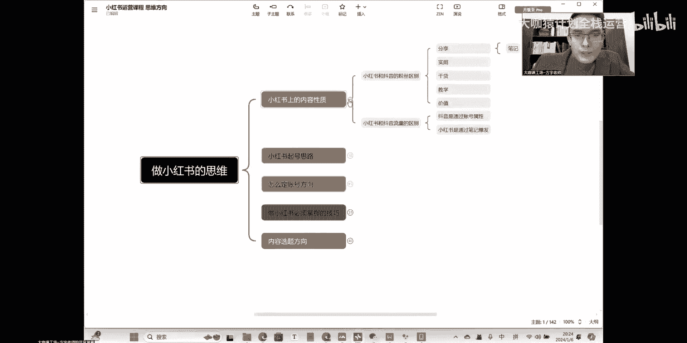

然后的话呢还有第二点，就是关于小红书的一个起号的思路啊。

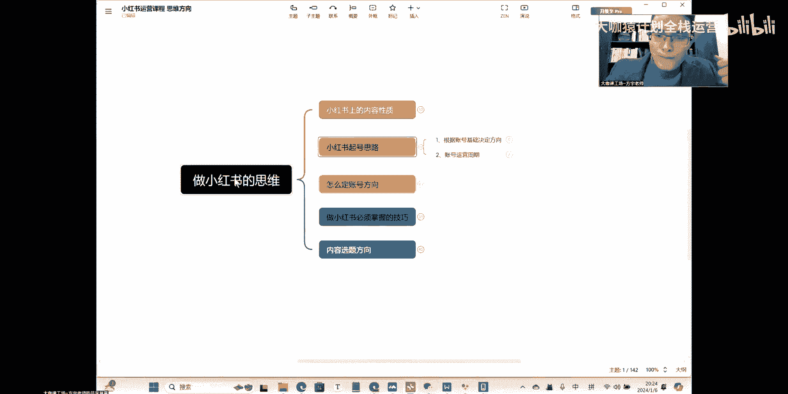

起号的思路你们一定要认真听好了好吧，直播间的各位一定要认真听好了，可能说旗号这个东西你们应该知道，就是我们要怎么在小红书上面去开展，我们整个的一个运营，这里呢我讲了两个点啊。

两个点是我们现在你们我们所有人同学。

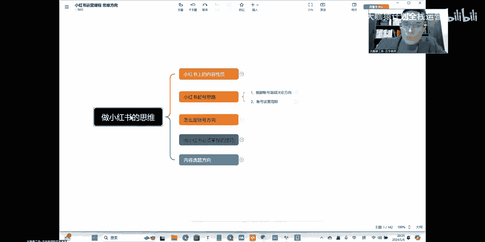

你们要去考虑的一个方向，首先呢我们要根据账号的一个基础。

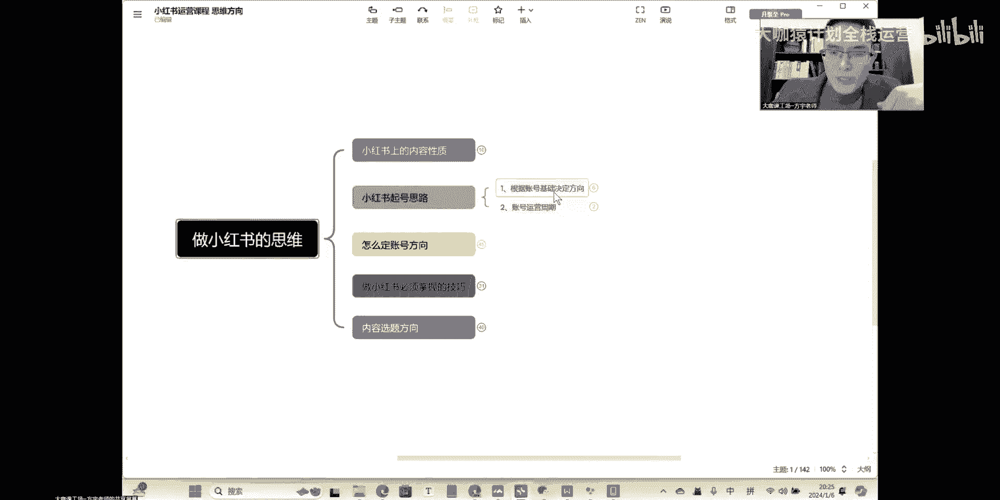

来定我们的一个方向和思路呃，所谓的基础就是你的这个账号，你之前在小红书上面有没有做过对吧，如果说我们有些同学因为我看过啊，有些同学的账号呢在小红书上面有一定的基数，这个整体的人设呢。

虽然说跟护肤呢有一定的这个偏差，有一点偏差，但是有些人呢也做的还不错啊，粉丝呢赞长数据啊，日常发布出去的内容呢也有。

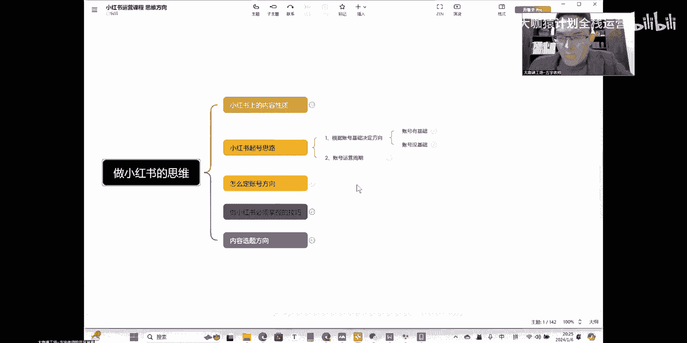

但是我们大部分顾虑的就是你有基础了，可能你的账号停更了很久，那么这一类型的账号，就是你做的这个账号数据还可以的啊，有一定的基础数据，而且也发过很多篇这个笔记，那么这一类的账号我们如果说停更了很久的。

你就要往这两个方向去做，首先定方向定方向，待会我会告诉大家怎么去弄，但是这个定方向我们后期要去做实施好吧，要去做实施。

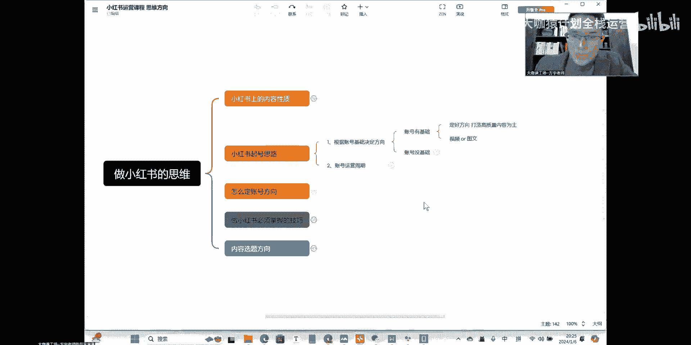

我们暂时先给大家把这个思路捋清，也就是说你有基础的账号呢，你把方向定好了之后，你这你的这个账号就要开始，以打造这种高质量的内容去吸引用户，那么这个内容怎么打造，我们后面会教好吧。

那么现在我们有基础的这一类同学，你就要开始做一件事儿，就把你这个账号呢给它捡起来，那么你之前呢可能年把没有更新的，那这种账号呢，你就可以把这个账号给它捡起来，然后把这个正更新走起来。

不管你现在更什么内容，只要是跟呃你可以跟护肤相关，也可以是生活日常，但是你不要发别的什么东西，比如说呃你不要去发别的什么产品，呃，比如说我发一些这个呃，母婴的一些宝宝相关的产品啊，或者说一些旅游的产品。

你不要发别的产品，你只要你是生活号，你就继续发你的生活内容就可以了，然后呢呃开还是要讲的精致一点好吧，内容还是要讲究精致一点，这个内容暂时不限，这个，这个目的是为了把我们账号的整个活跃呢，给它捡起来。

也就是说你之前可能有年把的时间没有更新了，然后或者说你平常更新的比较少，那么这个时候你把这个更新给它捡起来，然后呢保持一定的一个更新周期，也就是说从我们现在课程内容开始之后。

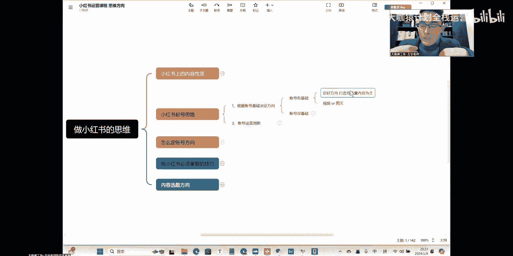

你有这样的一个基数的，你就要开始更了，这个更呢呃根据你自己的一个内容来，可能说你拍的比较好的这种视频啊，风景啊，或者说你日常的一个啊这种，或者你以前有以前的存货啊，你就把这种内容呢给它拿出来发一下好吧。

发一下发发一下之后呢，嗯可能说三天能够发一条，两三天两三天能发一条，把这个账号活跃给他捡起来就OK了，那么现在呢就是这个操作就是让平台认为诶，我这个账号的主人回来了，我的我开始创作内容了好吧。

那么后期我们方向定好了之后，我们就要去呃，比如说你更新了大概呃个把月之后，然后呢你的这个账号整个基调起来了，那个时候呢你再跟我说，我再告诉你这个时候怎么去定你的方向，然后去把你的内容做起来。

OK嗯然后的话还有一点就是这一类的内容呢，呃账号我们后期也是有基础的，你要去看一下你到底是做视频或者图文好吧，这个呢也是我们要选好的一个方向，K，那么这是以我们这这个是讲的，我们后期的一个运营方向啊。

我刚才说的这个更新。

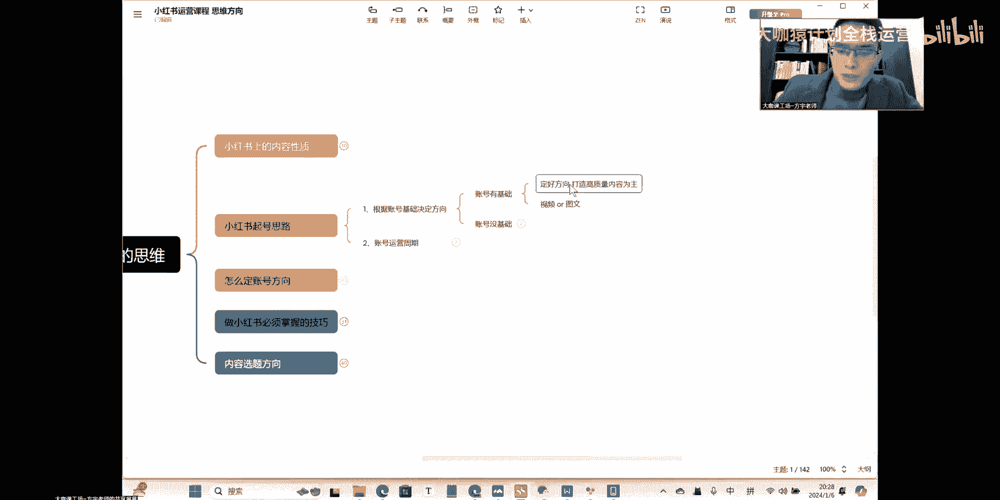

我刚才说的这个开始更新了啊，账号开始更新，这个呢可能就是更新了，我们一些日常生活之类的内容好吧，这个是我们一开始，那么这两点呢是后面要做的事情，OK这个是账号有基础的。

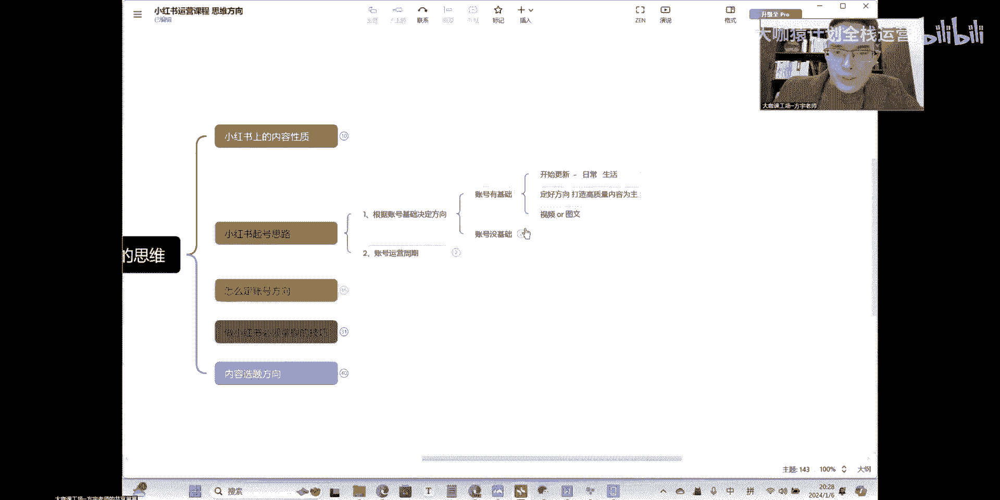

那么没有基础的。

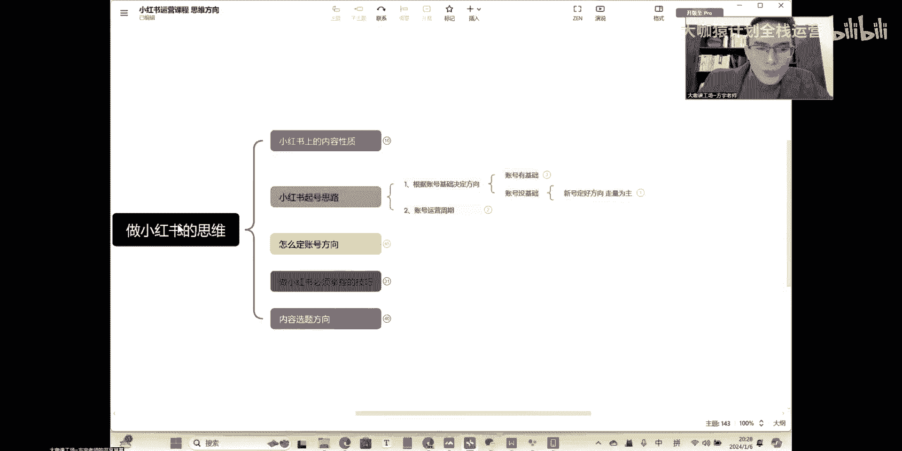

没有基础的，没有基础的同学怎么做啊，没有基础的东同学怎么做，你的账号是属于刚起号的，也就是说现在你想去做小红书平台，你将面临一个什么样的一个情况呢，就是小红书上面所有的内容呢，它都已经有了。

那么我们现在就要在这些所有已经有的内容，里边去抓取用户，就我们我刚才不是说嘛。

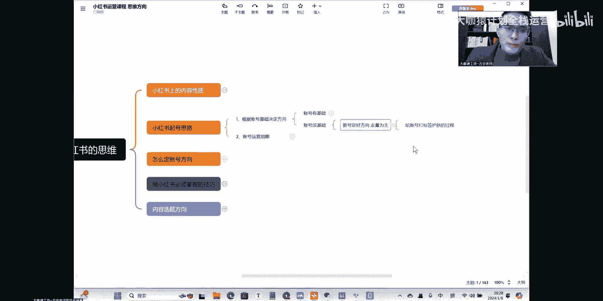

小红书上面的用户他会去这个平台上去搜呃，这个护肤的步骤啊，用什么样的一个面膜他会去搜对吧，这是他的需求，但是你觉得这些内容他有没有可能就是没有，是成形成一个空白的呀，其实这是不可能的。

也就是用户只要去搜，他在这个平台上肯定能得到他想要的，但是我们还有没有机会去抓不住这波用户呢，肯定是有的啊，有的为什么呢，因为所有的内容我给你讲一下啊，所有你们现在能看到的内容。

你们在互联网上去搜索到的内容，整个中国互联网当下的一个内容的结构，就是可以用一个词来形容，就是炒现饭啊，就是炒现饭，你能看到的所有的东西前面都有了啊，啊为什么大家发的内容看起来都是重复的。

但是还是有用户喜欢去看呢，因为我们很多人你正常的一个内容吧，在他那里发的啊，他可能意思是A，但是它传达出来的却是B，那么到你这儿呢，你把这个内容写出来，或者通过一些其他的方法给它柔和一下。

你的意思也是A，但是你给用户看到的，他的感觉就是你这是一个C的内容啊，也就是说怎么说呢，就这个内容呢到你这里他的表现形式不一样，只要你换一种表现形式，用户就会觉得你这个内容是新的。

然后平台也会觉得你这个内容就是新的，那么这就是我们现在整个互联网上，关于价值这一点它的一个关键性的问题，K就说创新的东西其实没有多少了，我们现在所有人做的东西呢，基本上都是炒线饭啊，炒鲜饭。

哪怕你去发的这些内容其实也是怎么样，你也是去找一些思路诶，别人的视频拍的还可以，内容呢文案用的还可以，我把它拿过来，我自己呢变成我的内容，我换一种形式去讲出来，那么它就成为了你的一个原创的东西。

用户照样喜欢，因为这个内容还有一点，就是内容不是说固定的用户呢，他可能A用户看到的是这一点，B用户呢他可能就看到是你刚才新发的笔记，那么这就是你的一个新的流量的一个来源。

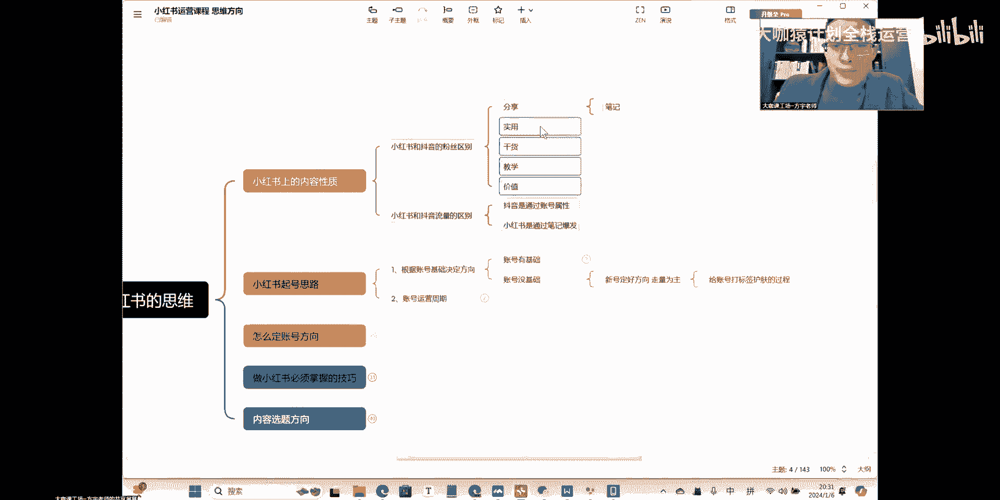

好吧，这是一个点啊，这是一个点，然后呢扯远了啊，就是我们刚才说的账号，没有基础的这一部分人群，你们怎么去做内容，你们是要把方向定好之后，去保证一个笔记的更新的一个量，因为只有这样的情况下。

你才能去抢占这一部分的流量，因为怎么说呢，我们待会要讲到一个关于标签那个问题嘛，这个问题还没讲是吧，我们平台上面现在你去做小红书，他跟你发朋友圈是不一样的，小红书上面呢他对账号。

也就是说我们日常账号没有发布笔记的时候，我们就是一个用户，你一旦开始发了笔记之后，那么平台呢他就会去考量，你发的这个笔记到底是什么东西，你发的这个笔记有没有价值，他会去做判定，那么我们去发内容的时候。

我们肯定有目的的，我希望把这个内容推送给我们，所有想了解护肤相关的用户，他们在搜索哪个产品好用，然后呢搜索完了之后看到我的笔记不错了，然后在我这里购买，那么这是我们的目的，我们要实现这个目的。

我们就要让平台把我们的笔记，精准的推荐给这些搜索护肤的，或者说关注护肤的这些群体，而不是说把我们的内容关推荐给那些大学生，那些男孩子，或者说那些关注旅游的，想去呃呃对护肤不感冒的啊，这种群体。

那么这是我们要去避开的一个端，也就是说我们要去做的一个账号，给给账号打标签啊，就是把这把我们的账号呢确定我们的账号呢，它是一个护肤的博主，这是我们要做的一个关键性的东西，因为你不做这个过程。

你不把标签打好，那么你的用户是不精准的，不精准的就会导致你发的东西没有人看，那么不管你发多少，你的这个可能是正常的，我们把方法掌握好之后，一个月两个月就可以把账号做起来，做出一定的效果。

但是如果说你没有把这个整个运营的方向走好，你去发的内容呢，呃可能你做个半年吧才会有一定的效果，那觉得你觉得你能坚持半年，去运营一个毫无效果的账号吗，那是肯定办不到的，噻是吧，所以我们运营就是这一点。

OK没有基础的，我们就要去做量。

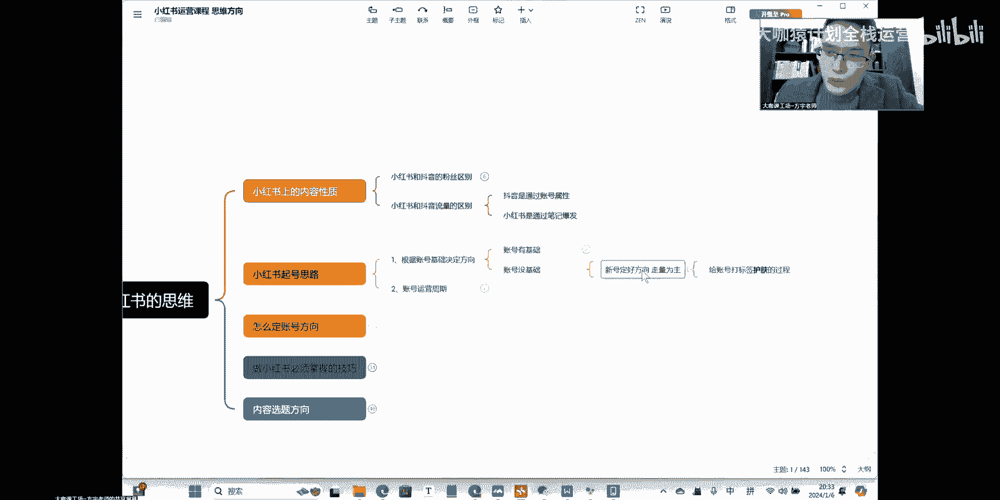

在这个量呢就根据我们后面要去教大家的，怎么去做出好的内容。

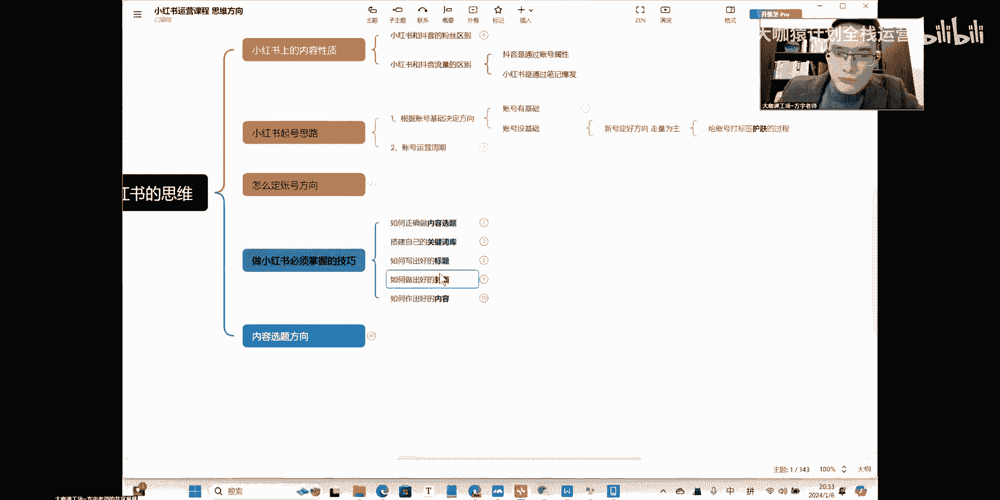

封面标题这些东西，OK嗯这是我们要讲的点方向啊，一个是有基础，一个是没有基础的，这一点大家能不能够听得懂，能听懂的给老师扣个一好吧，OK有问题的话也随时在直播间打出来好吧，我看到了。

我都会及时回复大家的，OK嗯。

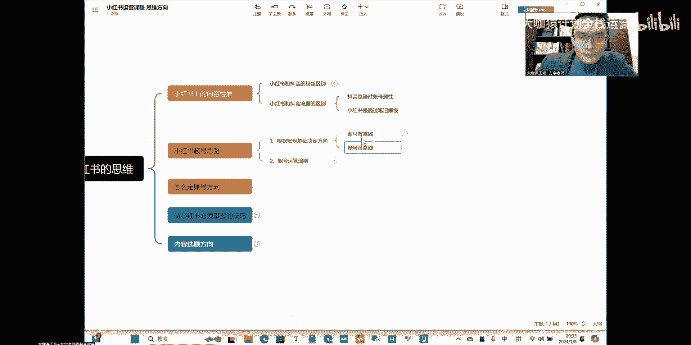

这是账号的一个，没有基础就发量，对对对，就是说要以这这这这个量是什么意思呢，就是呃我们刚才不是讲了吗，可能说高质量的内容，一天我只用发一条或者两天发一条，那么我前期账号没有数据的时候。

我刚开通的这个账号，我就要通过一些手段和方法，一天你每天提供一条持续下去啊，或者说每天提供两条，这样的话呢你的这个账号才能打上标签，好吧，这个就是我们讲的量，一个是量，一个是质量。

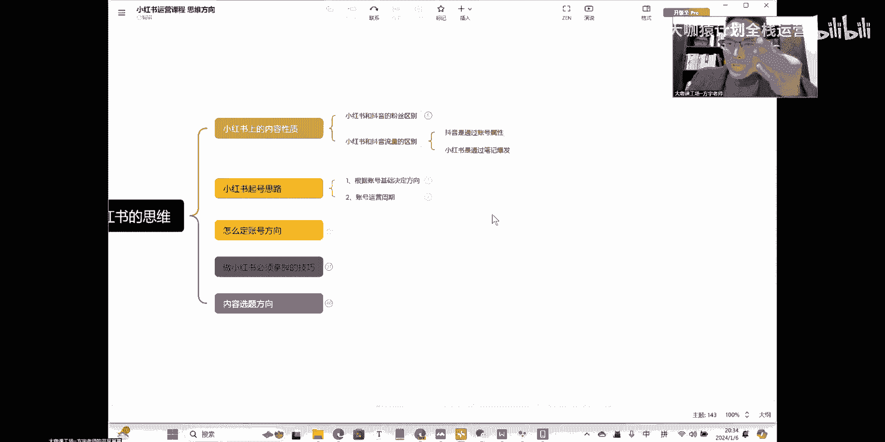