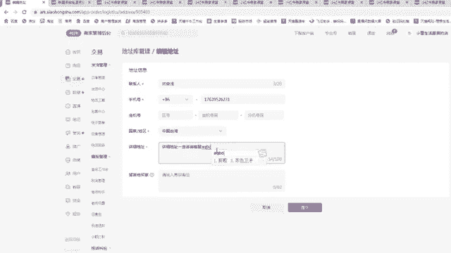
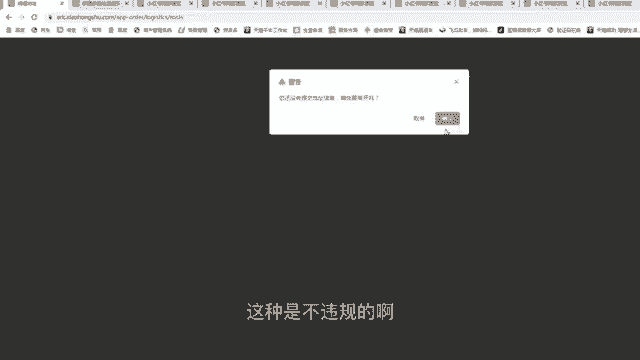
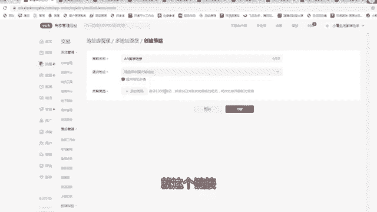
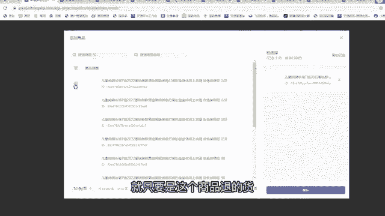
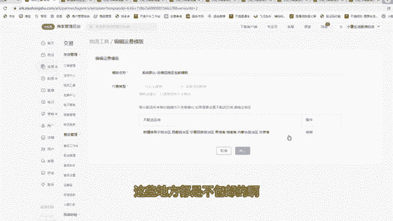
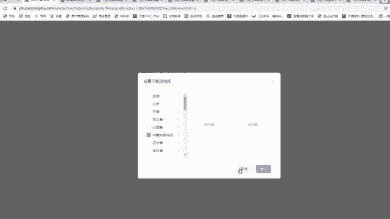
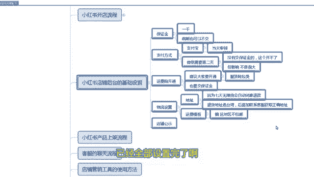

# 【小红📕实操】最良心的2024小红书电商硬核干货分享 ｜ 零基础暴力起号，新手光速掌握小红书电商技巧！ - P16：第3课：小红书店铺后台的基础设置【小红书零基础电商运营课~全流程】 - 夜间指路灯 - BV1kmiueEEfh

啊大家好，这节课给大家讲解，小红书店铺后台的一个基础设置，前面咱们已经讲了小红书店铺怎么开通的，那么开通完店铺之后，你肯定要给店铺后台做一些基础的设置，你才能去运营，才能去卖货，那么第一条就是保证金啊。

保证金这个额咱们开个人店基本上都1000啊，这个而且前期我也给大家讲了，是可以交也可以不交的啊，如果你比较纠结这1000块钱，你可以先不交，等什么时候赚钱了，你再去交也可以啊。

但是尽量建议大家这1000块钱也不多，先交上去啊，因为这个保证金也可以退的啊，你不开，你退了就行了啊，没什么损失啊啊那么你看这家店啊，这家店你看你点击那个进入小红书的一个后台，有个资金这一栏。

资金这一栏咱们点保证金，保证金看这个是1000块钱，因为我这家店也是开的个人店，所以1000块钱保证金就行了，那么具体大家是需要了解诶，我到底有多少保证金，在这里面其实有很多的规则。

大家都可以在这里面搜啊，有个课堂啊，比如说你搜索那个保证金嘛啊嗯搜索保证金啊，这里面店铺如何进额接纳本，开这里面啊啊，就这个店铺保证金平台服务费的一个介绍啊，咱们点击这个啊，点击这个点击第一个啊。

啊你看啊基本上80%的类目，个人店1000块钱就可以了，你看这个人店这一栏啊，基本都是1000啊，所以大家基本上都是1000啊，其他的类目咱们也不用去开啊，你就记着1000就行了。

这可交可不交啊啊第一个支付方式，支付方式的话是呃啊，怎么点击那个货款资金这一栏，货款资金这一栏有一个支付账，支付宝账户，有一个微信账户，这两个都要开，都要开，但是你不交保证金的情况下。

微信账户是开不了的，但是开不了的情况下影响转化吗，基本上没有影响，支付宝这个这个开通方式就很简单了，你就按提示去操作就可以了啊，那么微信的话当天是开通不了的的，支付宝是当天认证，当天过啊。

一般是当天审核的，当前审核微信的话需要第二天啊，如果你保证金不交，微信是开不了的，但是不影响转化啊，基本上不影响转化嗯，然后是你们如果是有绑定银行卡的话，包括支付宝账户和微信账户。

还有银行卡账户的法人名，必须是你给你小红书的认证的身份证是一致的，这个大家注意一下啊，比如说你让谁的，你用谁的身份证开的店，他的提现账户，支付宝账户，微信账户都要用这个人名下的啊，啊第三条是运费险的。

开通运费险我建议大家要开通的啊，因为这个嗯这个会影响转化，但影响转化不是很多，但是会影响转化啊，特别是我建议大家是什么什么样的产品，就是衣服类的服装啊，服装鞋包类的，因为服装鞋包类的。

大家其实用户对于消费者来说，他有一个额退还货的一个需求，它不像百货，因为他要试穿呀，所以这个时候他都比较纠结，如果没有运费险，会影响一部分转化率啊，我建议大家还是开开起来，然后运费险的开通方式。

大家去进到这里面啊，啊咱们还是点击那个小红书商家的后台额，有一个交易，然后点这个运费保云飞榜有这一栏啊，因为我这个已经开通了，你运你看云飞云飞险也不高呀，一单也就是几毛钱，但是咱们一单能赚大几十。

所以这个大家不要吝啬啊，就是该开还是开一下这个，因为这个开了之后会额，对转化率的提升还是很有必要的啊，嗯然后这个运费险大家要理解一下，是每一单都要扣你0。59，就是五毛九啊，就这这样一个钱，每单都扣的。

然后是但是没单扣有个好处，顾客退货之后，他会给顾客返七块钱，所以顾客下单就没有什么顾虑了啊，第四项是那个物流的设置啊，物流的设置就是咱们快递的一个设置啊，物流的设置大家进入后台有一个交易。

然后点这个物流工具涡轮，估计的第一个选项是地址库的一个管理，那么地址库的话有一个发货地址，还有一个退货地址啊，嗯嗯但是那个小红书最近更新了，有地址，退货地址可以多地址退货也可以呃，我先跟大家讲发货地址。

发货地址没要求，我建议大家发货地址留自己的手机号，留自己的手机号，留自己的地址，我觉得这样比较好一点啊，如果你自己本身就处在偏远地区，我不建议你，比如说流到那个呃快递比较发达的城市，比如说江浙沪呀。

像杭州呀，上海呀，这都行啊，尽量杭州，然后是广州也可以想留这种地址啊，如果是你本身你自己的地址是处在偏远地区，或者比较偏的，那么你留在一些一线城市，这样更好，这样的话就是你页面上会显示这个一线。

一线那个城市的这一个发货地，这样利于顾客去下单，因为他收货比较快嘛，那么退货地址也有一个讲究啊，退货地址呃，退货地址给大家讲一下啊，因为小红书里面有时候你来不及操作同意，他会默认同意顾客的退款啊。

没有没有默认同意顾客的退货，那么默认同意顾客退货之后，他就直接默认你的退货地址，但是咱们嗯大家嗯后面我会给大家讲啊，你的是你的上家，就是你进货的那个上家，在多多或者1688是不止一家的，有很多家。

所以每一家的退货地址是不是不一样，但是你这个默认地址只有一个，对不对，所以说这个默认地址不能给顾客真实的，那么这个里面有个技巧，就是你这里面要输入一个偏远地区，这个偏远地区并不是咱们国内的偏远地区。

是港澳台的，因为比如说你设置一个偏远地区是新疆的，还还真有一些顾客给你退到新疆去了，但是退货如果万一你的东西有问题，那个这个运费又非常高，到时候你还得承担，这样能去增加你的损失啊，就是不太好。

所以说你们就是退货，默认退货地址，选一个，他压根寄都寄不出去了，你说台湾，你说你寄个台湾，他肯定很慎重啊，那快递肯定是各种核实，就是你说记不了干嘛，到底这个地址到底对不对，然后在详细这一栏里面选。

台湾或者香港澳门都行，在详细这个地址里面选详细地址，一定咨询客服，大家就按我的来就行了，但是手机号必须还是写你的，因为万一他有急事想给你打电话，就问真实地址，他直接给你打电话了，知道吧。

所以这个就是大家按我的模板走就行了啊，姓联系人姓名和电话留自己的，然后是退货的地址，选港澳台，然后这一栏选详细地址，已经咨询客服获取啊。

嗯啊就可以了，然后直接点击提交，没关系了，这样不这种是不违规的啊。

不违规可以这样做呃，但是现在小红书又多了一个功能，就是多地址退货诶，为什么有个多地址退货，你看咱们的上家有很多个，对不对，可以有五六个甚至十几个上家，那么每一个产品它的上家是不一样的。

所以这个功能非常有用啊，你比如说策略，你是A产品，你打个A嘛，等下A童装嘛，A童装童装链接是吧，然后退货地址你就问上家要退货地址了，因为这个款如果你每天都在卖，问商家要下退货地址。

那么你把这个退货地址填上去，那么这个退货地址是针对就AA桶装链接，就这个链接你是不是要把这个链接就关联了。

就只要是这个商品退的货。

他的地址都是他，这样是不是很方便呀，就是就是不用咱们来回去切换干嘛的，所以这个是一个技巧，大家要注意一下啊，啊第一个栏是物流模板，一般咱们用不上用不上的，一般咱们是用的快递，说物流模板也没什么填的啊。

就填一个发货地址，你就留自己真实的就可以了啊，然后是第三个是运费模板，运费模板系统会有一个默认的，一个默认全国包邮运费模板，和默认的非偏远地区包邮模板，那么这两个模板大家一般上架的时候。

一定选择非偏远地区包邮模板，用这个啊，一定选择这个，因为因为这这些像偏远地区啊，新疆西藏宁夏青海海南内蒙古这些东西，这些地方都是不包邮的啊，要不然你会有损失。

因为你去多多那边，他很多也是不包邮的啊。

把这些选中就行了啊，这是物理模板呃，运这是运费模板啊，还有一个店铺运费策略，店费运费策略一般不设置，一般不设置，因为咱们都是包邮的，不设置就可以了啊，这个不用管，那基本上就是就是物流工具里面就四项。

大家是按我的模板去操作就可以啊，那么最后一步是店铺公示，如果你店铺不公示，你上传产品的时候，上架的时候，他会提示你让你去操作，要不然你上不了，你像这个就是就按照你真实的信息去填就行了。

联系人填自己手机号，填自己，因为这里面会有一些呃有些紧急的一些，如果店铺出现一些紧急的问题，会联系会发送这个手机，然后短信验证码，邮箱里有你自己啊详细地址，这个你们自己看啊啊。

就是填你们自己真实地址就行了，这个经营类型里面全选就OK了啊，这个不影响你选前三个也行啊，第四个勾选也可以，这个基本上没什么影响的啊，然后直接点击保存公式呃，那么这五个选项12345做完之后。

你整个的店铺就基本上不需要设置了，就可以，咱们就可以去选品卖货啊，去发布笔记了。

