# 【小红📕实操】最良心的2024小红书电商硬核干货分享 ｜ 零基础暴力起号，新手光速掌握小红书电商技巧！ - P17：第4课：小红书商品上架实操【小红书零基础电商运营课~全流程】 - 夜间指路灯 - BV1kmiueEEfh

大家好，这节课给大家讲解，小红书的商品是怎么样上架到咱们的店铺后台，只有上架到咱们店铺后台，咱们才能去卖货，消费者才能去购买对吧，那么首先这个操作啊，我建议大家哈是必须用到电脑的，如果不用到电脑。

我觉得这个项目你很难干下去，就这个很多的新手，可能之前嗯他在问我，他说老师我必须要用电脑吗，我说还真得必须用电脑，如果不用电脑，你就真的是不是正儿八经干项目的一个人，就是效率太低了。

你说手机上能不能上也能，但是那个超级麻烦，效率太低呃，但是电脑不需要一天一直用是吧，就上货的时候用，那那那那几个几10分钟就可以了啊，就时间很短的，所以这个东西还是很有必要的啊，看你什么样的电脑都行。

其实就能打开网页，不卡就可以了啊，基本上都能用，配置配置要求不高啊，额那么第二个就是咱们怎么样去操作，给大家讲一下，首先咱们还要订购订购一个软件上架的软件，因为呃我知道大家想象中的上货。

可能是手动一个一个添加图片，对不对，但是跟大家想的不一样，咱们这个上货非常简单，一键复制，你就把链接一点一啪一下就上传了，所以非常方便电脑非常方便的啊，那么咱们需要如果这么方便去操作。

所用到的软件就是这些软件，摸鱼助手搞定商品，蚂蚁蚂蚁搬家，打个宝，这四个软件是一样的啊，你们只需要订购一个就可以了，这个看看大家只是给大家推荐这四个都可以啊。

呃那么我今天给大家演示一个，就是刚出的一个软件，就是目前是免费12周啊，就是时间挺长的，就免费让大家用，我觉得这个给大家去演示一下啊，比如达克宝啊，那咱们点击啊啊从头开始给大家演示吧。

先进入咱们店铺商家的一个后台，有个服务服务，点了之后有个服务市场，咱们点击前往服务市场啊，点击完之后，这里面有一个一键搬家，咱们点击一键搬家啊，嗯那么这里面全是一件搬家的软件啊，那还有这些。

你看前期都是免费的软件，都给咱们免费啊，免费用一周，咱们用这个时间长的啊，达可宝啊，然后是点击前往获取，啊授权。

啊完了之后点击这个商品搬家啊，点击免费试用商品搬家，啊这里面免费使用90天。

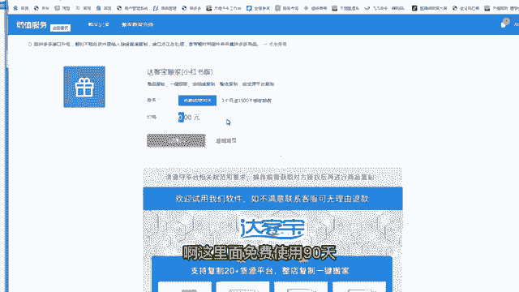

需要咱们订购这个服务，这个服务也是免费的啊，零元啊。

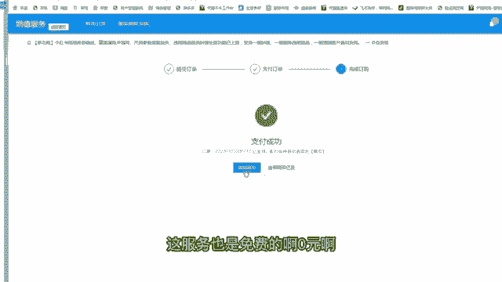

先订购完之后返关闭啊，这里面点击试用啊，这个就可以了啊，点击亲属啊，哦咱们订购完之后，进入那个小红书的搬家界面啊，第一个按商品链接复制。

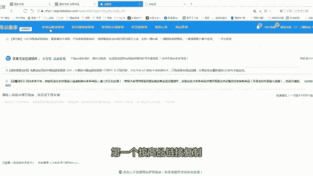

一般是用这个功能，你看啊，这功能里面能复复制很多，这么多网站的链接，都可以搬到咱们小红书店铺里面啊，但咱们一般用到的是1688啊，拼多多这两个因为是货源网站啊，咱们在这里面去找比较方便一些。

那么基本上咱们都是用的拼多多啊，因为拼多多价格没办法，实在太便宜了啊，嗯而且售后还可以48小时发货，这个服务很好，那么咱们比如说我在拼多多里面，搜一个童装两个字啊，比如说这个产品是我想上的对吧。

嗯那么点击更多啊，啊然然后是咱们把这个链接复制下来啊，把这个网址啊，拼多多这个网址，然后点击复制啊，点击复制，复制完之后，然后粘贴到这个这个浏览器这个界面里面，因为我建议大家啊，你可以一个一个复制也行。

如果你方便的情况下，比如说你今天要要搬那个，已经把品提提前选好了，你选了十个品，对不对，或者你选了三，你做了三条笔记，要上架三个产品，你提前把这三个链接全搞上去。

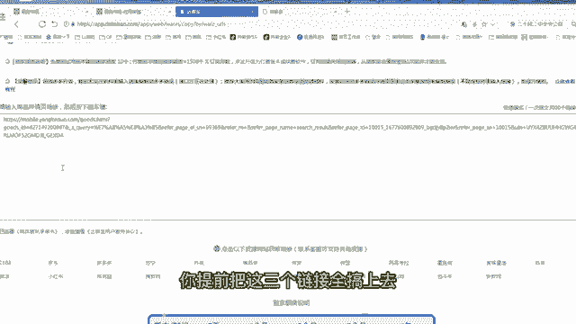

他一键啊全上了，这样比较方便一些，然后咱们点击这个啊，点击额点击那个开始获取啊，这个按钮开始获取啊，额那么咱们在复制之前啊，咱们首先要对咱们这个要点击这个地方啊，确定啊，要点击这个搬家设置，大家看好啊。

先把搬家设置设置完之后。

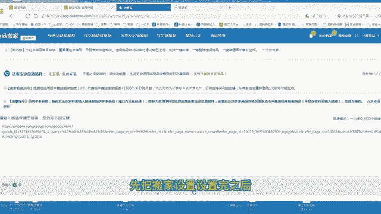

然后咱们再去搬运啊，先点击搬家设置，这个搬家设置的话，大家可以按照我的操作去做啊，嗯啊嗯里面有几个重要的点，我给大家去强调一下，底个立即复制，这是市啊，这个不用改，然后这个里面是一个强调的一个点啊。

默认运费模板，默认运费模板啊，这个默认品牌大家不设置就行了，选不设置运费模板，默认的是全国包邮，大家一定要选择非偏远地区包邮模板，要不然你新疆西藏也有运费，很多人把这个东西就忽忽视掉了啊。

到时候你万一卖出去了，新疆你加30块钱运运费，这个就有点坑了啊，所以这个要选上去要换了啊，啊这个库存可以填多久啊，999都可以啊，啊其他全部默认啊。

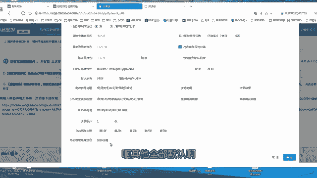

然后是呃这个页面默认价格设置里面，大家按我的来，市场价要三倍，就是300，那么售卖价要200啊，这是我们一般的一个习惯设置，就是我咱们要至少卖两倍的价格去卖啊。

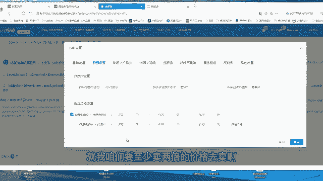

加价两倍去卖，标题的话过滤品牌，其他的默认详情的话啊，详情的话基本上都是默认啊，基本上都是默认，然后是运物流模板，选选好物理模板就行了，相对时间发货，咱们发货时间一般是两天后发货，如果后面的话。

你想三天尽量是不要三天发货。

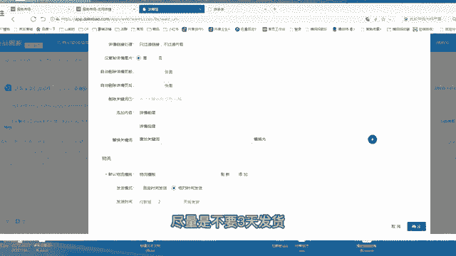

还是48小时内两天发货就可以了啊，这里面嗯这个软件自带的啊，挺好的啊，跳个不复制啊，不用管属性预设，不用管尺码表，不用管其他设置，其他设置里面咱大家把这个东西去选一下啊，要支持七天无理由的啊。

你不支持七天无理由没人买的啊，嗯这个要支持啊。

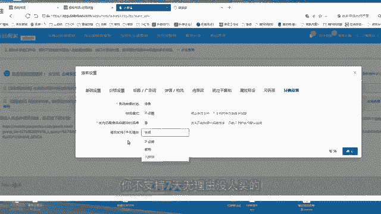

然后点击确定，只是后面所有的复制的链接，都会按照你这个搬家的设置去搬家。

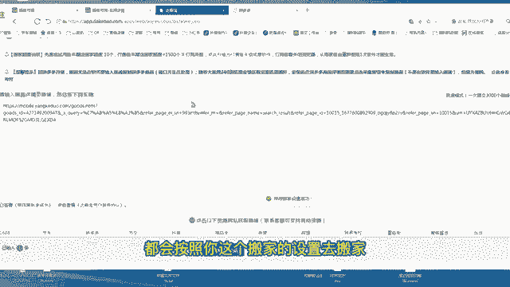

这样方便不用咱们每次都设置一遍啊，好然后咱们点击那个开始获取商品之后，就会直接去这样啊，这里面给大家讲一下啊，因为最近的话是拼多多这边升级啊，然后升级的话这是一个呃之前是不需要的。

推荐大家用360浏览器先安装这个插件。

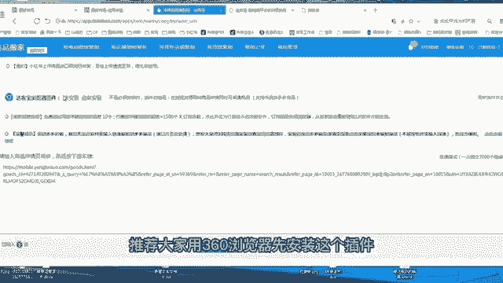

这里面点击安装啊，给大家演示一遍，点击安装，然后点击这个360极速浏览器，因为我用的这个浏览器，你什么浏览器就用哪个啊。

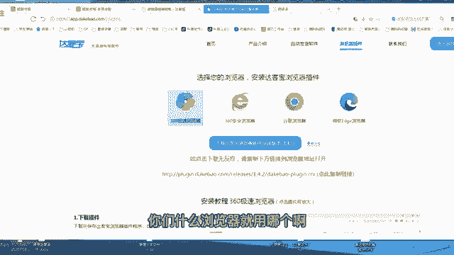

然后下载完之后在这个地方啊，点击我刚才下载的，点击打开。

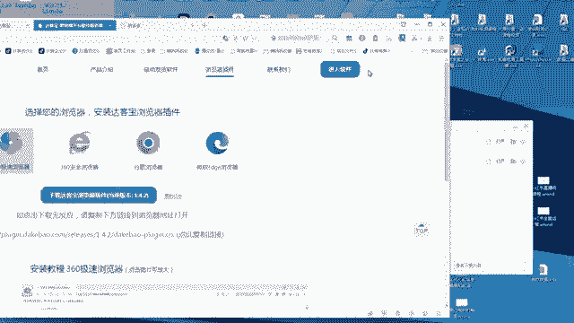

打开这个插件就按添加完成了，在这个地方啊，有个答这个界面啊。

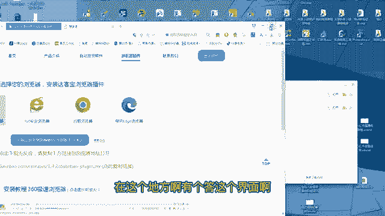

啊添加完之后啊，比如说这是你的拼多多的链接啊，刚才咱们讲了拼多多的链接，你刷新一下，刷新一下，这里面会有一个采集该商品，采集该商品咱们点击采集啊对吧，已经采集了，采集完之后会在他的复制记录里面。

咱们再回到复制记录里面，看他是不是正在复制呀，对不对，一个复制中，那么这个会更简便一点啊，因为最近是拼多多，那边是有一些啊风控问题。

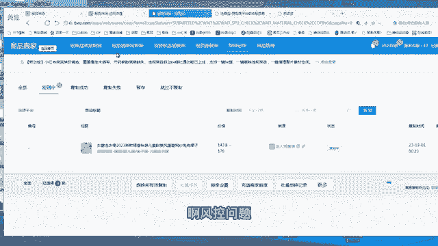

大家按这个步骤去操作就可以了啊，然后是嗯达克宝上传完之后，它会在咱们商品列表当中点击后台的商品，商品列表，你会看到这样一个商品，看到一个商品是开始是不是上架的一个状态啊，如果是这个时候。

咱们需要看一看商品有没有什么问题呀，类目有没有对呀，可以点击一下编辑啊，这样比较保险一些，因为有时候它内部可能匹配的不对，如果你这是你看我这个东西是一个童装，儿童的连衣裙，那么他匹配的是儿童连衣裙。

那这是对的，如果他匹配不对，咱们把类目再修改一下啊，啊比如说他是开着衬衫，那么修改成连衣裙，然后下一步就可以了啊，非常简单啊，然后再去再次点击这个提交就可以了，那这样咱们一个商品就已经复制完了。

复制完之后咱们需要把它去上架啊，点击上架全部SQU，那么这个商品咱们就可以去售卖了。

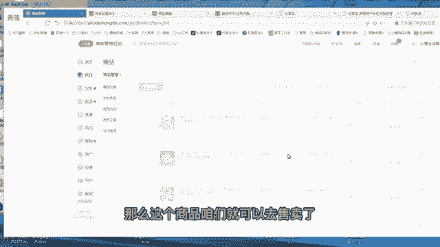

额这里面建议大家啊，建议大家因为你复制商品的时候啊，注意点啊，嗯啊第一个上架的时候啊，如果当天上的产品多，那尽量一次性啊都放进去啊，都放进去复制啊，这样这样就咱们不不用一个复制完了之后，再等另一个。

这样节省时间啊啊第一个就是上传完后，如果类目都不对，把类目改一下啊。

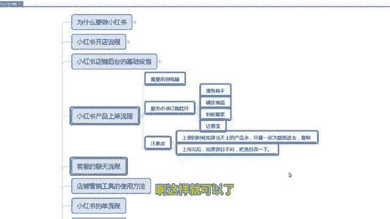