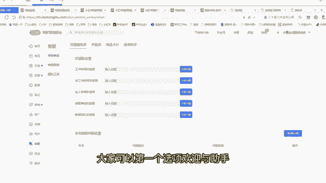
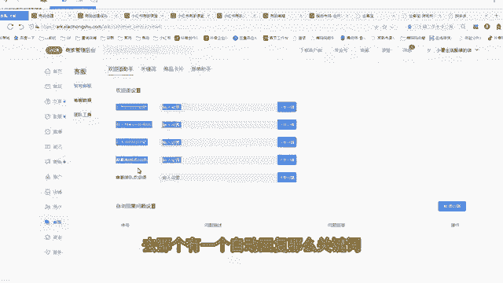
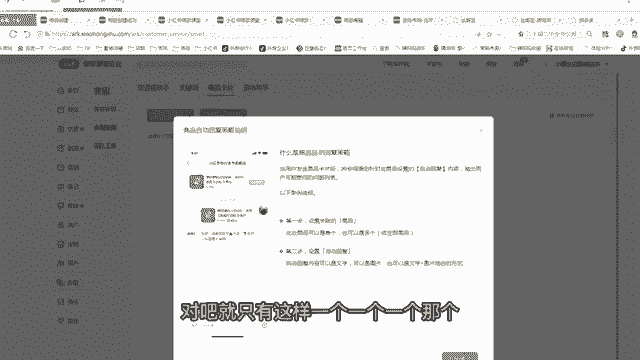
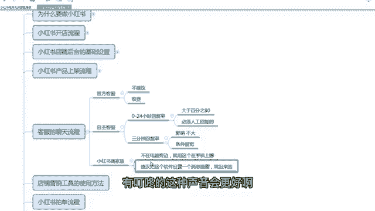

# 【小红📕实操】最良心的2024小红书电商硬核干货分享 ｜ 零基础暴力起号，新手光速掌握小红书电商技巧！ - P18：第5课：客服的聊天流程【小红书零基础电商运营课~全流程】 - 夜间指路灯 - BV1kmiueEEfh

大家好，这节课给大家讲解小红书客服的一个聊天流程，那小红书的客服我之前给大家已经那个讲过了，就是如果你没有时间聊天，官方还可以给你有一个代聊的服务，但是即便官方给咱们一个代理的服务，我也不建议大家用。

因为有点小贵啊，有点小贵，而且不至于啊，因为目前小红书的那个聊天的一个规则，不是很严，大部分人，我觉得95%的人都能满足这个要求啊，呃那么呃不建议大家用官方客服，是因为他要收费的，所以不建议啊。

嗯那么咱们就用自主客服，那么官方客服自主客服就是自己去聊天啊，就咱们自己去聊，那么官方和自主在哪里面设置，咱们还是进入小红书的一个后台，点击客服，有个客服团队，客服团队啊。

你看这个当前我们这个店铺的运营，运营模式为自主客服，只有咱们自己聊，自己老板聊，或者自己员工聊，不是让那个平台去聊，那么如果你不想你想用平台，那么申请关关闭自助客服就可以了，你选平台，但是不建议啊。

我建议大家还是自己聊，省这个钱，因为赚钱都不容易，因为以后不需要花费你太长时间额，这是这是官方和自主的一个区别啊，那么第二个自主客服聊天里面有两个重点，我给大家讲，为什么建议自主客服呃，虽然有些兼职的。

或者有些上班的也可以满足，因为小红书线的规定啊是0~24小时，一天24小时内，只要你回复人家一次就行了，而且这个回复必须是是人工回复的啊，嗯就是那个机器自动回复的，不算是人必须打字，或者你发一个表情。

打一个数字都行，都算是人工回复，机器回复不算，就是在这一天当中，24小时你必须回复率大于80%，但是不要求你回复的时间啊，谁这个是条件很宽松啊，比如说有一个顾客早上八点问你一句。

你晚上八点回回他一句都可以，只要不超过零点，对不对，但是不建议啊，咱们还是做生意的，如果有人因为小红书的咨询量很低的，你一天卖一，你一天卖十单，我估计也就一两个人问你一句啊，就是咨询量很低。

所以说能回复尽量回复一下，然后增加你的一个转化率，万一人家有急事呢，非要问一句，对不对嗯，还是尽量去去回复一下啊，但是这个你即便回复不了也没关系啊，不违规，那么小红书还有一个3分钟回复率啊。

这个3分钟3分钟回复率什么意思，就是你在3分钟之内顾客问一个问题，你在3分钟之内用人工去回他一句话，任何一句话只要回复他都行，只要3分钟回复率，3分钟回复率是影响你的店铺的一个体验分，对吧。

这个体验分啊，就是这个动店铺动态评分，里面有那个有一个咨询这个4。5，这个是就是3分钟回复率会影响这个指标啊，那么这个指标其实也没什么影响，因为咱们开店都04：05分啊。

然后你这个嗯你你即便是低于四分也没关系，对你笔记的影响不是很大啊，但是就是我说这个啊80%的回复率，这个影响非常大，这个如果你80%都达不到，这个有点太过了，这个会屏蔽你的笔记和商品。

会这个影响比较大啊，但3分钟回复率也没必要，所以这个条件很宽裕啊，条件很宽，所以说为什么建议那些兼职的也可以做啊，重点就在这个地方，客服都不卡你啊，啊，那么后台嗯，带大家去看一看那个客服的一些设置啊。

啊你比如说客服大家可以第一个选项，欢迎与助手。

就是如果哎有一个人跟你聊天了，你可以你可以那个嗯你可以设置个关英语啊。

去那个有一个自动回复。

那么关键词比如什么时候发货，那么发货的话自动会提取这个第一步，本店现商品下单，预计三天内发货，会提取这个这个大家做不做都行啊，然后商品卡片，商品卡片就比如说关联什么产品啊对吧。

就只有这样一个一个一个那个额一个助手啊。

一个小助手跟单助手也一样，这个就大家要不要都行，我无所谓的啊，客服数据就是今天啊，就是有些聊天记录都可以在这里面看，其他的没有什么东西额，然后是网页端也可以聊天，大家看啊，有这个地方有个客服啊。

就网页端也可以聊，就在电脑上也可以这样去聊，啊点击客服工作台啊，这个就是客服工作台，你看这这里面有很多绘画啊，这是我们之前聊天的一些绘画啊，看一下啊啊啊什么叫人工客服，就是你自己打上的字对吧。

嗯打上的字发过去才叫人工，那自动回复，你看这种自动恢复数队长这种自动回复，这个不算的啊，人工回答才算是计入指标的啊，啊这都是之前我们那个嗯你看嗯，小鼠生活服服装，那这是我们自己店主回复的啊。

有些系统回复的带大家看一下啊，你要十队长啊，这个是系统自动回复的，那这个都不算啊，嗯额那么第二个点啊，就是如果我现在不在电脑旁，我出门了或者我上班了啊对吧，我在电脑上没办法聊，怎么办，手机上聊。

那么手机上你们一定要下载一个小红书商家版，这个商家版它就有一个客服聊天的一个窗口啊，在中间这个位置啊，一个窗口，然后不在电脑时候在手机上聊是一样的，而且这个哈建议大家建议把这个软件啊。

设置一个消息提醒啊，就而且这个消息提醒是能跳出来的啊，这个应该大家都会吧，都会玩手机，就是你的消息提醒，你要跳出来，直接跳到屏幕上，让你能看到，这样万一你在吃饭或者出门的时候，他这个消息比较明显。

而且不要静音啊，尽量直这个消息弹出来之后，有叮咚的这种声音会更好啊。

这是小红书的一个商家版，啊但大带大家看一下小红书商家版的app啊，上面这是咱们打开小红书商家版的一个app，这个app里面中间有个消息，这个消息就是咱们聊天的一个窗口，有顾客有给咱们聊天。

咱们就点击这个消息啊，进去之后，然后是直接聊天就可以了啊，那么这个商家版的app也有一些提醒啊，待发货呀，还有一些工单呀，需要咱们处理这些售后啊，都在这里面。

