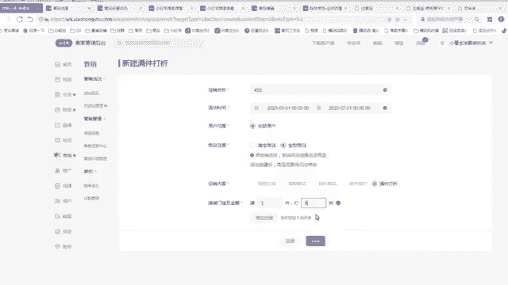
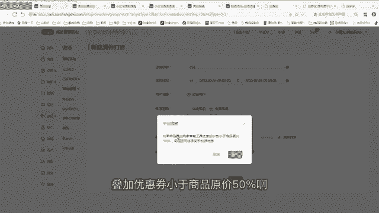
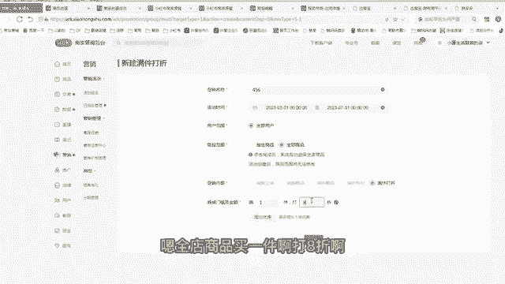
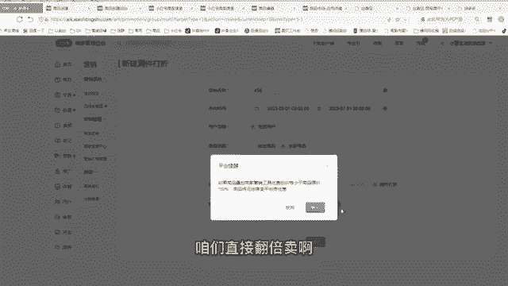
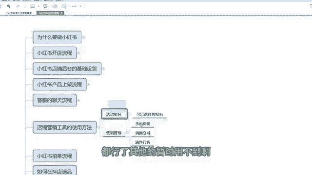

# 【小红📕实操】最良心的2024小红书电商硬核干货分享 ｜ 零基础暴力起号，新手光速掌握小红书电商技巧！ - P19：第6课：店铺营销工具的使用方法【小红书零基础电商运营课~全流程】 - 夜间指路灯 - BV1kmiueEEfh

呃大家好，这节课给大家讲解，小红书店铺营销工具的一个使用方法啊，那么之前咱们已经把商品两倍上传到咱们店铺，如果咱们需要对这个商品做一个活动，或者是打一个折扣，或者是做一个优惠券，咱们需要用到一些工具啊。

咳那么这个工具，咱们点击咱们小红书店铺的后台点击营销啊，你想营销第一个是一个营销活动的，这个营销活动有个活动报名，这个活动报名里面，咱们点击可报名的活动，里面会展示最近咱们这个店铺能参加的活动。

你看最近啊，你看这个这个时间咱们能参加的活动，就三八节这三八节的一个条件，咱们可以去点击报名活动去看一看啊，它里面有些条件啊，比如说需要那个额额，需要这个店铺分要四分以上，然后是那个商品价格等等啊。

咱们可以再点进去啊，这里面有一个店铺的一个基本类型，都都符合活动详情，就是呃就是就这样一个门槛嘛，啊而且有一个满减满300-40，你觉得咱们满300-40，你能承担这个折扣，那么你就报不能承担。

你都不报，就这个活动是可报可不报的啊，那么比如说咱们遇到双11，双12，我建议大家都报上，那平时的小活动，我不太建议大家去报啊，还是把精力花在那个笔记上，那么第一个是营销管理，营销管理有一个商品促销。

商品促销，有个单品促销，单品促销就是你对单个商品去做打折，你用到这个工具，咱们一般咱们都是批量性的不做单品刺绣，咱们一般是多品刺绣，那么招聘促销里面咱们用到的工具，第一个是满额立减，第一个是满件打折。

中间咱们这三个是基本上不用的，那么满额立减我给大家去讲一讲啊，咱们去嘶额去做一个点击选中就行了啊，啊比如说我随便起个名123啊，时间啊，那今天的是一号，嗯然后是然后是到期的时间，咱们时间长点啊。

尽量三个月以上啊，然后点确定啊，指定商品和全部商品，咱们一般是全店打折的啊，全全店打折，指定商品，比如一部分商品的一部分商品打折，尽量也咱们怎么做电都是全店打折，这样比较方便啊，啊然后满多少减多少。

一般情况下，咱们设置一个咱们店铺的一个平均的客单价，比如说你店铺基本上都是50块钱以上的，咱们就点50嘛，你要减多少，比如说减个五块钱嘛，是个五块钱优惠券对吧，然后点击完成就可以了啊。

那么这个活动都创建成功了啊，那么如果你想不想要这个活动，那么你就暂停或者删除都可以啊，那满满减打折也一样的啊，一个道理啊，456咳，好仅当天的一个时间，然后是三个月啊，这满一件咱们打个九折啊。

嗯啊这里面大家听一下，我建议这个大家做一下啊，满件打折，我建议就是所有的学员都这样做，因为咱们两倍上传的两倍上传哎，我经常跟大家说，两倍上传啊就可以了，因为小红书的利润非常高，对不对，翻倍卖。

但是你是一个新店，如如果你想让更快速的出单，你还是打一个折扣咳，我建议你打个九折，八折都行，看自己的一个情况，如果你你不想要那么多单子，不想那个怎么着了，你就打一个九折啊，或者不打都行。

如果你是这段时间你想快速出单啊，我前期新店没什么权重，我想快速出单，我不想一单赚那么多，我觉得赚翻倍卖，我觉得有点太狠了是吧，那我打个八折也行啊，我觉得打个八折都够了，这时候点击完成就可以了啊。

就是你全店所有的商品啊都会打八折的啊，嗯叠加优惠券小于商品原价50%啊。

因为呃因为我这两个折扣时，我这两个折扣不能一起做啊，所以我要删除一个那个才能建啊，大家只只满格立减和满减打折，只需要一个就行了，我建议用这个满减打折啊，满剑打造都挺，基本上够用了啊，嗯全店商品买一件啊。

打八折啊。

啊后面你卖起来之后，店铺权重高了，你可以把这个活动取消了，咱们直接翻倍卖啊。

韩式啊，这样就可以了，对不对，然后咱们店铺的这些东西都是没用的，善单有礼，没没有用啊，这些不用管，大家只需要管我讲讲的几个东西就行了。

