# 【小红📕实操】最良心的2024小红书电商硬核干货分享 ｜ 零基础暴力起号，新手光速掌握小红书电商技巧！ - P23：第10课：如何在淘宝选品【小红书零基础电商运营课~全流程】 - 夜间指路灯 - BV1kmiueEEfh

啊大家好啊，这节课给大家讲如何在淘宝去选品，咳呃那么为什么要在淘宝去选品，先给大家去那个呃去分析一下啊，因为淘宝是国内电商体量最大的一个平台啊，因为目前虽然说抖音也比较热，什么小红书也比较热。

但是淘宝还是number one还是第一名，因为是瘦死的骆驼比马大嘛啊，所以买买买卖这个东西还是淘宝是第一啊，但是商品也是最全的，因为万能的淘宝，基本上所有咱们能想到的东西，都是在淘宝上能搜到啊。

第三个是淘宝的爆款是经过日期考验的，因为体量大，他的爆款他大概率咱们去抄，一样也会爆啊，嗯那么淘宝爆款其实咱们从三个方面都可以选，第一个可以榜单选品，第一个可以搜索选品，第三个可以数据选品。

那么榜单选品给大家是手机端给大家展示一下。

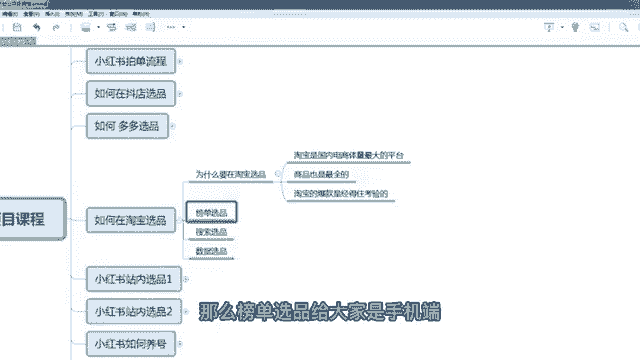

因为这个榜单一般在手机端啊，咱们去点击那个淘宝啊。

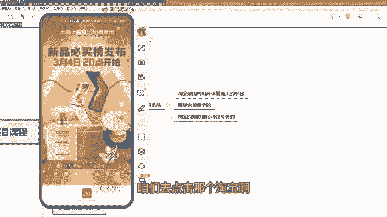

咱们直接搜索那个排行榜，但这个排行榜一般是一般是物品类的会多一些。

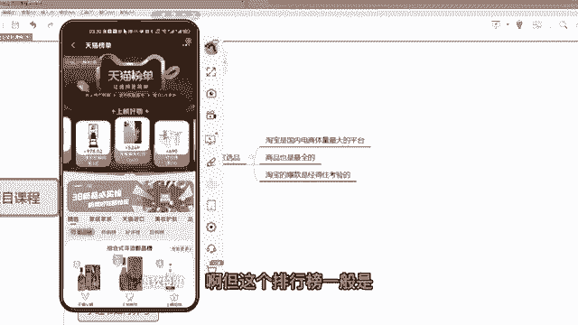

你看鞋呀，但是鞋也有啊，鞋有服装是有点少，但服装那个你看配饰也有这个这个大家去看啊，如果你是做配饰的，你看这个运动帽新品榜啊。

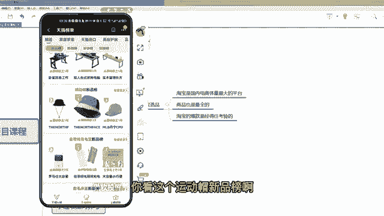

咱们点击嗯啊就是你在那个淘宝的搜索框。

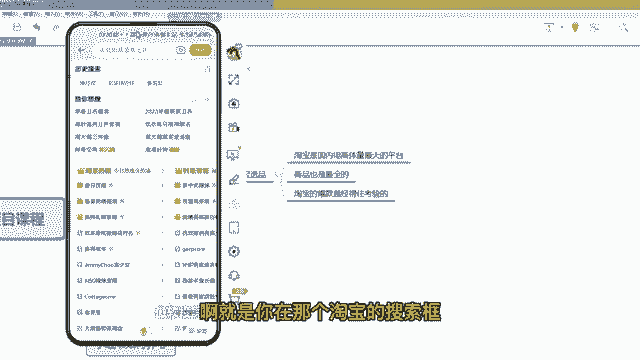

搜一个排行榜，它自动会显现出来这种各种各种行业的排行，比如说咱们是家居家庄，咱们是服饰时尚啊。

服饰时尚这个类目，咱们看一下啊，有没有咱们要的这种排行榜嗯，如果你选鞋子，可以在鞋子里面去选。

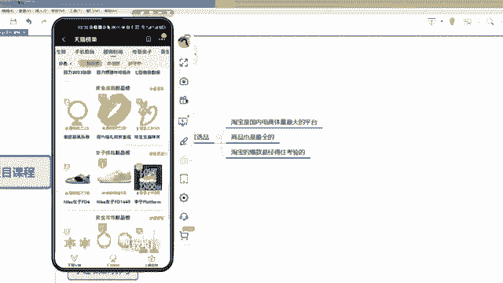

啊鞋还是比较多的啊，上榜好污嗯。

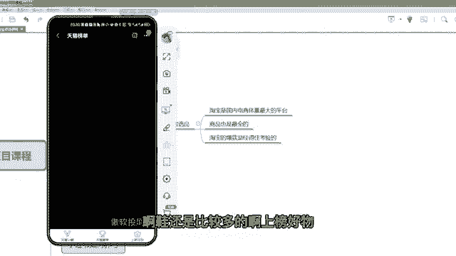

在这里面看一下啊，有一个嗯美妆的。

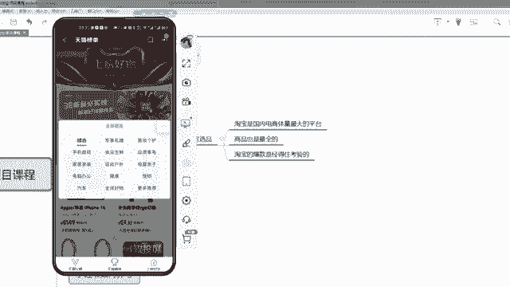

啊对假，假如说是母婴亲子的话，这里面有很多那个母婴产品啊，大家都可以看一下嗯，母婴产品，比如说是。

鞋子吧，按鞋子来选选吧，这个鞋子就是防滑。

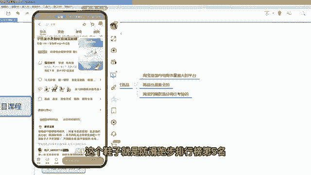

跑步排行榜第五名，那整个排行榜咱们点进去看一下啊。

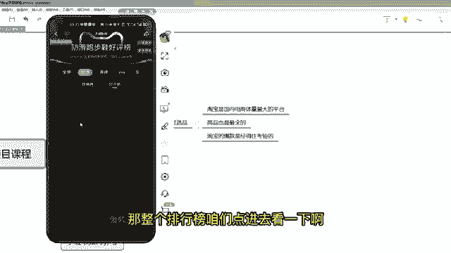

有这么多，这都是鞋子。

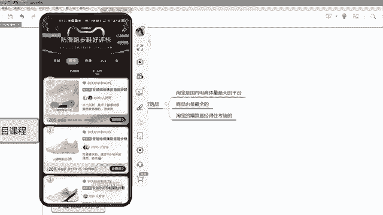

啊你比如说咱们做服饰类的，咱们选那个服饰类的热销榜，那服饰类服饰类里面也有一些那个一些分类啊，咱们可以看一下热销榜，你看这个家具库，如果你做是家居用品的话。

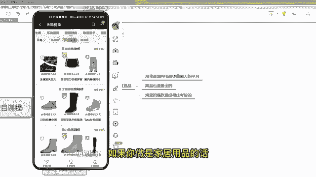

咱们就可以看一下这个榜单，这榜单有这么多家居用品，那么咱们肯定是选择热销榜嘛。

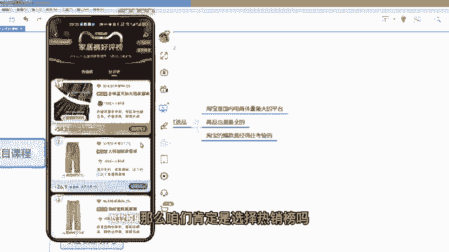

第一个卖这么好对吧，第二个卖34块二嗯。

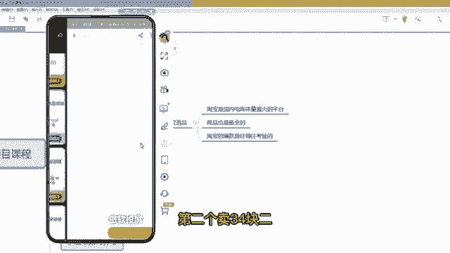

也卖的挺好，这算第一个名，那么这个品咱们就可以搬过去。

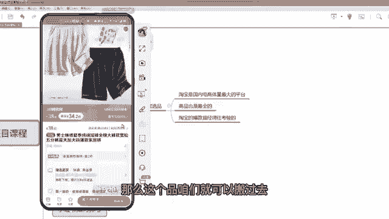

那么他的评价和素材呃，咱们都用那个至尊宝插件啊。

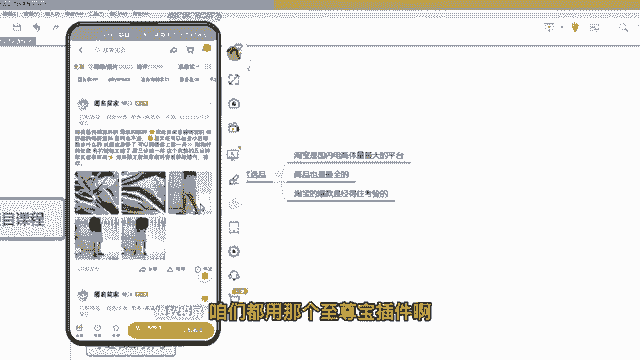

因为之前的章节已经讲了，这个插件，咱们可以把它素材啊，把他比较好的这个买家秀全下载下来。

然后编辑成成那个笔记发布就可以了。

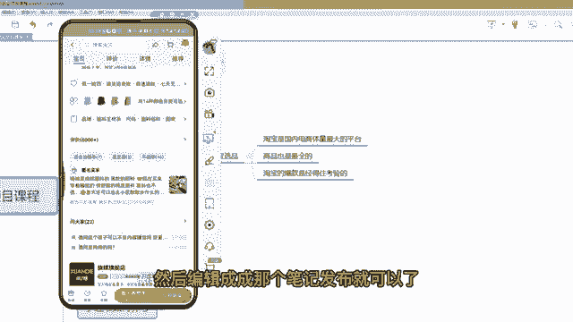

啊这个是榜单选品，那么还有搜索选品。

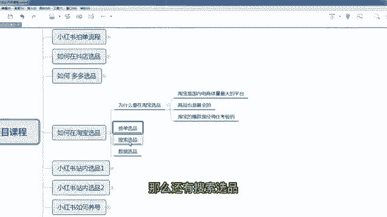

搜索选品的话，在电脑端给大家展示啊，咱们直接打开淘宝，比如说你想嗯，你现在想想那个卖什么东西，比如说连衣裙，那你们能搜索连衣裙吗，搜索连衣裙之后，那么这个咱们就不看排行了，咱们就看他的一个款式。

这个就是有一点自己个人的一个喜好的感觉，包括你小红书，你发的一个人群的定位，比如咱们是想要一些嗯中国风的吧，或者是偏休闲一类的，咱们看有没有啊，嗯咱们通过关键词搜一下，搜一个连裙国风，对吧。

假如说咱们是做这种风格的啊，那么国风里面有这么多，咱们选一个销量还可以的，比如说1000的啊，这个359嗯，看他最近评价怎么样，嗯最近评价不多啊。

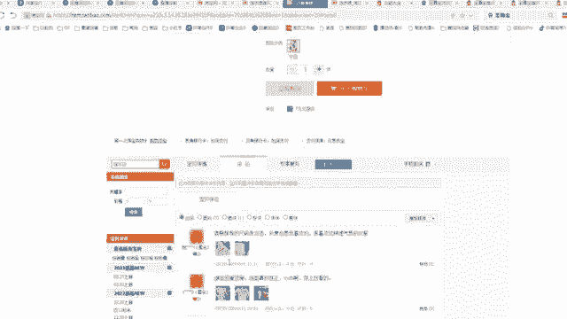

最近评价不多，但销量有多少，1000个哎，销量1000个，评价不多，就代表他是刚刚开始卖起来的，那这种款就是趋势款呀，大家都可以去呃把它踩下来啊，这个宽度可以去用，对不对，嗯搜索那么这种款其实很多的。

这个就要看自己个人的一个经验的，选品的一个经验搜索选品啊，第三个是数据选品，数据选品的话不给大家演示了，因为很多人是没做过淘宝店的，如果你们之前是做过淘宝的啊，或者你的朋友有淘宝的，他做过淘宝。

那么可以用他的淘宝账户的收银参谋，去看一下最近额的趋势产品，在收银参谋里面可以去选，这个大家是备选啊，如果是有这个条件可以去用啊。

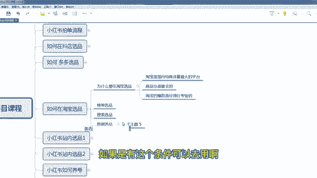

那么至于嗯你选出来的产品，如果你想要他的买家秀呀或者主图视频啊，你是需要把这个链接发到电脑端，在电脑端去下载，在手机端是不好下载的，电脑端因为有这个插件啊，咱们其他的那个课程已经讲了。

直接一个至尊不好插件，你们下载下来直接下载评论，然后下载那个主图的一个视频都是可以的，下载下之后再去编辑，再去发布咱们的一个笔记啊。

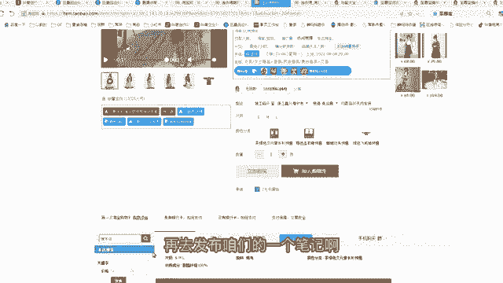

包括买家秀的一些评论啊，有些评论其实很好的，那这这种评论也可以作为一个，咱们发布笔记的一个文案啊，一样很好啊。

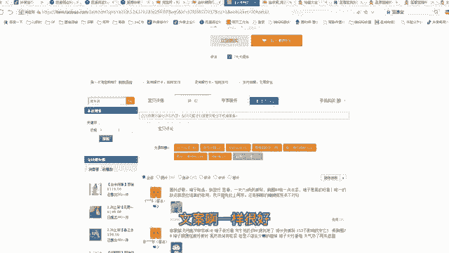

至于在淘宝选品，我们就咱们的学员，有一个非常成功的一个案例啊，就是去年的冬季，他在淘宝上找了一款羽绒服，找了一款羽绒服，这个羽绒服淘宝是卖500多，卖500多，但是呃他最后在多多里面找。

其实这个羽绒服只有200多，只有200多嗯，然后是嗯，所以说他就做了，他就做了一个动作，他把呃他把拼多多的这个呃这个200多的，然后是加价，然后是在小红书里面卖啊，但是呃但是这个这个羽绒服有非常非常爆。

大家都知道卖多少钱，然后它的价格降下来只卖300多，中间差价差了将近200，然后他这个羽绒服卖的特别特别好，去年一天就卖了好几万，就一条笔记一天就卖好几万啊，所以说淘宝的有效爆款。

是非常经得住那个市场考验的。