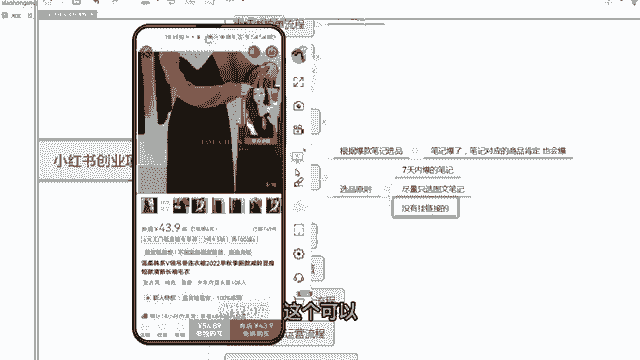

# 【小红📕实操】最良心的2024小红书电商硬核干货分享 ｜ 零基础暴力起号，新手光速掌握小红书电商技巧！ - P25：第12课：小红书站内选品2【小红书零基础电商运营课~全流程】 - 夜间指路灯 - BV1kmiueEEfh

啊大家好，这节课给大家讲如何在小红书站内选品的，第二部分，上一节讲了，如何在小红书商家后台通过笔记灵感去选品，那么这次教大家，怎么样在小红书的一个笔记的页面去选笔记，然后通过笔记去选品。

那么额为什么要这样做呀，因为因为小红书的笔记如果爆了的情况下，就流量比较大，那么笔记对应的产品它大概率也会爆，因为爆款都有相通性嘛，所以笔记爆了，笔记对应的产品肯定也会爆啊，咳，那么笔记。

咱们首先要在小红书站里选一些爆款的笔记，那么什么样叫爆款的笔记，第一个呃这个爆款笔记尽量是最近爆的，就七天内报的，一周内爆的都可以啊，嗯然后是嗯尽量选一些图文的笔记，为什么要选图文的笔记。

因为图文咱们可以转换成视频，但你选饰品的情况下，你转视频都不好转了，那么第三个就是没有挂链接的，没有挂链接的，就他没有带货，那么咱们去带对吧，他没有带货，咱们去贷，那么咱们是不是竞争力也比较大了对吧。

根据这三个原则，咱们去带大家实操一下啊。

好嗯大家看一下啊，咱们打开咱们小红书。

然后在小红书，比如说咱们现在要要做连衣裙，要找一下连衣裙的爆款。

咱们搜索连衣裙啊，搜索完之后这样一个界面，咱们要点击筛选，这地方左上右上角有个筛选，咱们选择图文，选择图文之后。

咱们要选七天内报的笔记啊，怎么选，咱们点开看一下，你看这个是1月28号。

这个时间太久了啊，这报的太久了，2月4号也太久了啊。

你看这个是1月11，2月15也太久，尽量选七天或者七天左右都可以。

你看12月27号哎，这个可以啊，刚刚报，而且报了2万的点赞啊。

这个已经挺爆了啊啊那看这样一个裙子诶，挺好啊挺好啊。

这样一个合集啊。

嗯选完之后大家看一下啊，就是尽量选一周左右的这种半个月之内的。

还有一个点赞量高的。

你看这个都不错啊，微胖女生这个吊带连衣裙啊，而且也是春季的，也比较应季。

而且他是图文的，他也没有挂连线，你看左下角是没有链接的，你像他点赞量这么高啊，你看有这么多点赞量，但是没挂链接啊，那么咱们把这个产品这个笔记啊，对应的产品找到，咱们再发一条B级上挂链接。

是不是咱们的竞争力就比他大了，对不对，那么带大家去实操一下啊，嗯啊，他这个虽然后面也挂了这样一个一个一个地方，但是顾客不能直接去拍，这个就很尴尬了啊。

额那么咱们还是先截图。

用拼多多啊，截图用拼多多去搜到。

去扫这个款。

额那么完了之后咱们找拼多多的源头商家。

看第一个啊，第一个评价太少，不选第二个啊，还看可以评价。

评价也有点少嗯这个可能是新款啊，刚刚开始卖的一个春装。

大家都卖的不多，这个有点多啊，评价也还多一点。

嗯啊但是这两个都没有货，他是卖的里面的一个内搭开衫白色啊。

所以说呃里面的一个外搭啊。

外搭只卖外搭，所以这个也不选，咱们要的是一个套装啊，那咱们还是选第二个吧。

你这个都可以啊，这都可以。

那么咱们就把这个链接去发送到，保存到咱们电脑端，然后上传到上传产品啊。

呃那么笔记素材怎么找，在教大家去找笔记素材。

你像这个笔记怎么完全就可以去抄过来，超过来，把这个图片12344张图，感觉不错，咱们去保存下来，对不对。

额但是啊你会发现我保存了之后，右下角会有小红书这个水印啊，所以说咱们要用去水印工具把水印去了之后啊。

咱们再使用这样一个图片啊，那么这咱们要用到什么工具，用到那个青斗青斗，咱们首先打开咱们的微信啊。

啊咱们在微信端去搜轻度两个字，有一个去水印。

去水印，用轻抖点开啊，点开之后咱们有一个去水印去水印。

咱们把小红书里面，这个链接粘贴到咱们这个工具里面啊。

嗯粘贴到工具里面啊。

然后是右上角有个分享分享，咱们选择复制链接啊。

然后到去水印里边，咱们去粘贴链接。

然后一键去水印，啊这个时候会有一个广告啊。

广告咱们去点掉就行了，咱们看啊，去完之后这个图片是不是全部有了。

而且这个图片大家看一下啊，这图片也是没有水印的，咱们把这三张图把它保存了，这个有点少，一般会比较多一些，这个稍微有点少。

嗯咱们保存至相册啊。

啊需要看一个广告啊，广告看一下就可以了。

需要在哦完了之后，咱们这个图片都保存下来。

保存下来之后，咱们点击咱们的小红书额发布，发布这三个三张图片啊。

尽量多一点啊，啊三张图片其实其实上一步啊。

大家看上一步其实就有一个智能成片啊，其实小红书的功能也挺完善的。

有个智能成片，咱们直接点击智能成片。

嗯结束之后就这样一个效果，其实看起来还可以，如果图片多了之后。

这个视频的品质感还是挺高的，咱们就可以直接这是啊。

这个BGM大家都可以去选一下啊，看哪个比较适合都可以。

然后点击下一步，这个时候咱们就可以直接发布笔记了对吧，还是很还是挺简单的啊。

呃还有一种情况，如果你看刚才这种情况，小红书的呃图片太少了，只有三个图片，那么其实多多里面你看他主图有十张图片，其实咱们可以把多多的十张图片，的主图也保存下来，然后用这十张图片去在小红书里面或者剪影。

剪影里面去一键成片啊，去做成小红书笔记就可以了，那包括小红书的额，咱们在提，咱们在提取他图片的同时，咱们还可以问，还可以提取那个文案。

对不对，你看这个小红书里面有个文案的一个提取啊，有个文案提取，咱们也可以粘贴链接啊。

