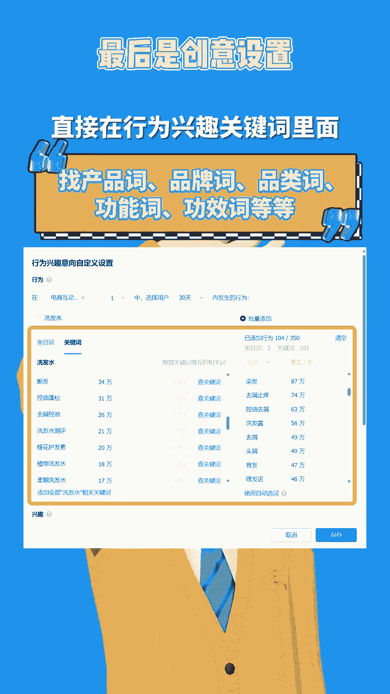

# 【巨量千川】想用莱卡计划起号？一套流程帮你精准定位人群提升投产 - P1 - 千管家巨量千川投放 - BV1gr421G79s

巨量千川怎么用徕卡计划起号起号，用徕卡定向的原因就是人群更精准。

相比通头定向，前期没有模型流量比较泛，莱卡的点击率转化率更高。

今天我们就来分享莱卡计划的搭建，完整基础流程，首先是投放方式。

通常情况下我们推荐选择控成本投放，非必要时不选择放量投放优化目标，建议选择直播间成交和商品购买，因为我们的目的是打标签和打模型，而支付ROI目标更多，适用于后期收割成交计划累积的人群。

如果是直播投放优化周期，选择直接成交选项的ROI更高，不建议选择7日总成交。

它跑量比较大，但ROI比较低，建议在没亮的时候再使用，在预算出价方面。

日预算建议设置在3000元以上，但是不要拉满，具体出价根据你自己产品利润实际情况而定。

但是要记住出价一定要填到小数点后两位，不要填整数。

出价差几分几毛，曝光量差距也会很大，接下来是定向方式。

性别年龄和排除幸运地区，这三个基础定向一定要选，不然人群会跑偏。

那重点来了，莱卡定向怎么设置呢，选择近30天的电商互动行为。

莱卡定向类目词和关键词的选择，没有固定的方式，你要测试过才知道哪些词数据是好的。

类目词和关键词是排除逻辑，我们选词的逻辑应该是排除弱关系的。

低点击人群，除此之外，其他的相关词都可以尝试，所以我们不用看选择了多少个关键词。

要关注的是覆盖了多少人群，以避免人群范围过窄，跑不出去。

具体选什么词更合适，效果更好和怎么选，可以看我们之前的视频有详细讲解过。

至于其他的定向选择，一般不建议同时选择达人定向和徕卡。

如果要选达人定向，建议选整个达人分类，不要选择单个的达人网络就选WIFI和5G。

其他都选不限，智能放量基本上没用，最后是创意设置。

选择自定义创意或者程序化创意都可以，但是要注意一条计划，最多放三个视频和三个文案。

但在跑量以后，建议只放一个视频和三条文案进行单独投放。

创意分类，初期测的时候，可以多测试一下和产品相关的周边类目。

然后选择表现最好的一个持续投放就行了，创意标签要写满20个，直接在行为兴趣关键词里面找产品词，品牌词，品类词，功能词，功效词等等。

以上就是徕卡计划搭建的一些技巧，点击左下角领取会员。

