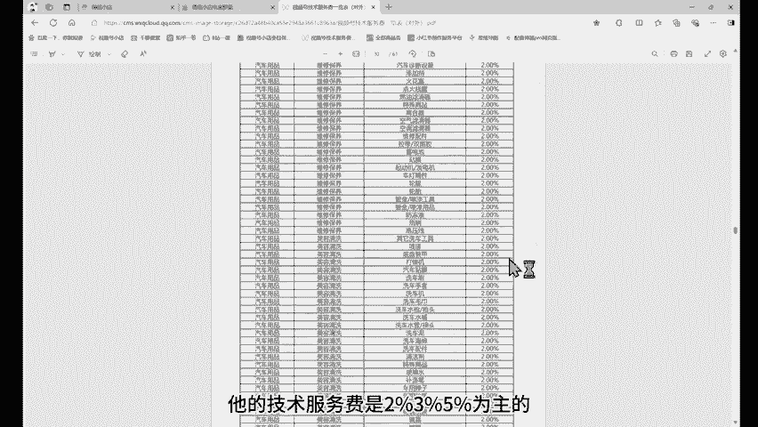

# 【微信小店】彻底火了！一天卖3万多，5个利好消息告诉你怎么做？ - P1 - 陈奶爸V - BV1Hb26YuETP

好，现在的时间是10月13日啊，晚上的呃10点多，现在是10点48。ok刷新一下啊。然后今天卖了33222啊，那么这个数据呢其实还是比较普通的。我们看近7天的，7天卖了24万。

还有近三0天的是110万啊，我们这一个其实呃一般很少对外展示。因为这个毛利润率比较低，大概只有多少，大概只有8%啊，不像我们那个新店呃，用这个利润率大概能达到20个点，这个大概只有8%啊。

所以你看它的这个利润的话，其实也并不是太高，对吧？3万多的话，大概3000多，3000多乘以8%啊，2万2000多。然后近7天的话是这样子。好，今天32点还是比较稳定的啊。那现在的话。

如果说你还没有去做这个无线小店，其实我建议你去做一做啊。那包括现在像这个技术服务费，对不对？像现在这个都是比较低的，赶你去看一下啊。

目前来说呢嗯微信小店它的技术服务费是2%3%、5%为主的那现在有个新的政策，就是给到我们都是1%，所有类目全部都是1%。只要你是新店，在90天以内都是1%。

然后现在的这个保证金，那各位去看一下啊，现在保证金呢正常我们去做一些家居日用的，像这些用品，包括运动户外的都是2000块啊，个体工商户都是2000块，前面的100单啊都是不要钱，都是免费的啊。啊。

所以呢这个门槛相对来说比较低啊。然后昨天发布了一个新的消息，就是双十一的好物啊好物节的一个活动激励啊，还有这个直播间添加商品功能的一个调整。我这里呢重点给你讲一个。

就是目前来说比较好用的一个东西是什么呢？就是呃给你看啊。

关于优选联盟支持微信公众号带货的一个广告啊，就是现在微信公众号，也是我们所说的这个小秘书啊，类似于小红书那种的。那么它的开通条件是什么呢？就是大于100个粉丝。然后呢。

在公众号后台带货联盟商品这里呢啊可以去实现带货操作来说呢，也是比较不错的。现在有的做的不错的一天佣金能达到2000。

ok还有其他的一些比较利好的消息，这对于我们。

达人来说都是蛮不错的啊，微信小店零保证金是运营公告啊，之前的这个零保证金呢，它的这个类目比较少，现在基本上开放了很多类目了。这一次开放类目总共是800多个，之前开放了100多个类目。

所以如果你想开店啊，前期100单，前面的100单都是不需要保证金的，这个是非常好的。等于说你注册一个个体户的营业执照啊，注册好之后直接入住，然后呢就可以直接上品啊，前期不用花钱。

保证金不用交，然后这些类目的这一个呃技术服务费呢就是1%啊，所以你只要处理这些就可以了啊，也可以合作达人。之前的话是不允许这个个体工商户这个资质呢入驻优选联盟的啊，随着它的一个改版。

到今年8月底的一个改版，允许啊就是个体工商户，这种资质呢入驻优选联盟啊，所以这个呢是非常利好的一个消息啊，对于很多的这个新手来说啊，不想去开公司，然后以这个呃个体工商户去入住，那就非常哇塞了啊。

所以这个消息发布出来之后呢，我们现在就是建议各位啊建议各位都去开这个微微信小店。因为你前期的话还是蛮不错的。目前不管是你个体户还是企业最多可以允许开设30个店铺。我相信这也是全网啊什么抖音啊快手啊。

像这些平台当中，允许你开店铺最多的，对不对？一个微信，你可以开一个店铺，那么呃一个营业，一个。

一个个人可以注册5个微信，那么你可以用另外的几个人的，用家人的这个信息注册微信号，也是允许你开店铺的，所以最多允许30个店铺。这个利好消息呢就是说现在整个微信小店是什么呢？是用户多，商家少啊。

就是因为这样的市场行情，那要去开店的，赶紧去做。

