# 【微信小店】彻底火了，新店铺一天卖7000多！分享5个新手利好消息！ - P1 - 陈奶爸V - BV1jr1oY3ExP

呃，hello大家好啊，最近我比较忙，没有时间去更新这个B站。当然接下来会更新呢？为什么玩呢？因为我们现在这个无形小店呢整体放开了，然后呢，我们在做这个新店铺，这个店铺呢是我们做的一个新的类目哈。

之前没有尝试过的一个类目。然后今天卖了7200啊，时间是右下角9点49，刷新一下。

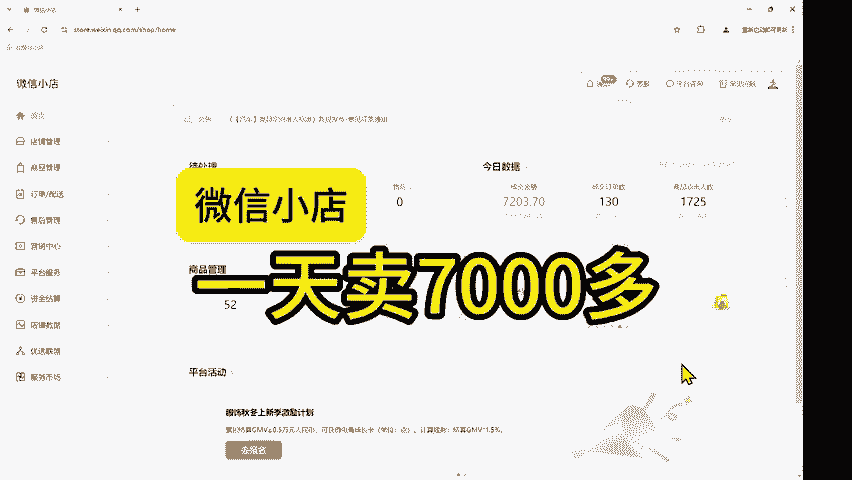

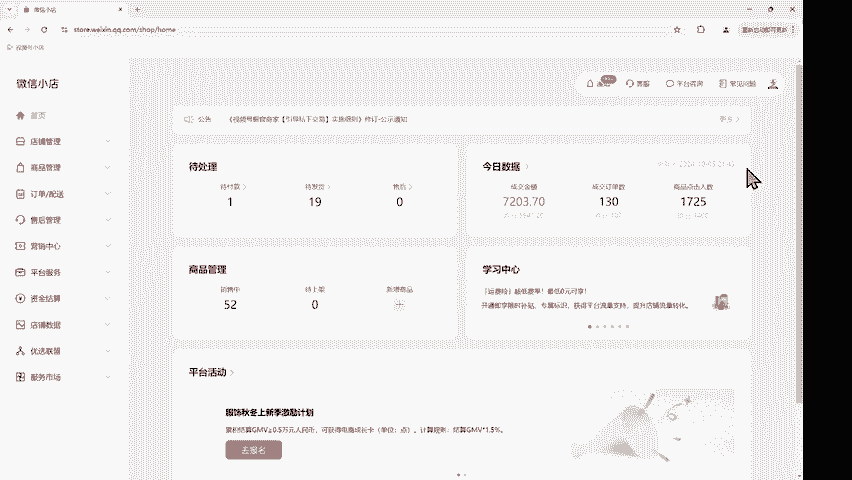

就这49啊，70，然后我们点开看一下。呃，昨天是5900OK然后近7天卖了，近7天是9月28号到10月5号，今天是到10月4号，今天是5号没有算，今天的是17000，然后加今天的这个7000多，对吧？

还是可以的。然后这个店铺呢是新店铺，有些朋友就是近期对这个微信小林比较感兴趣，但是不知道怎么做。其实现在比较简单了啊，比之前简单多了，我们点开看一下。

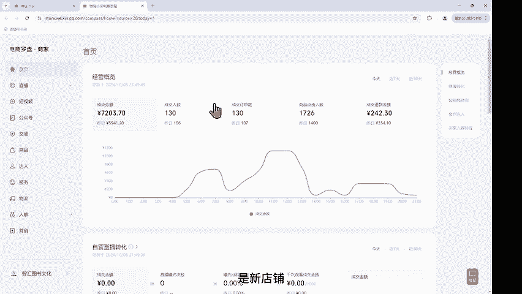

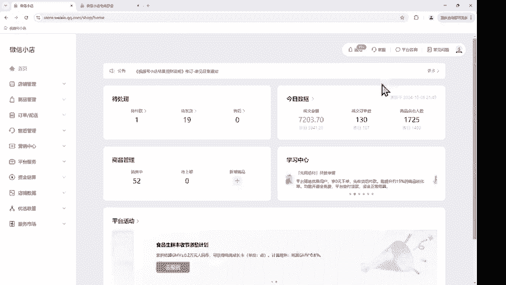

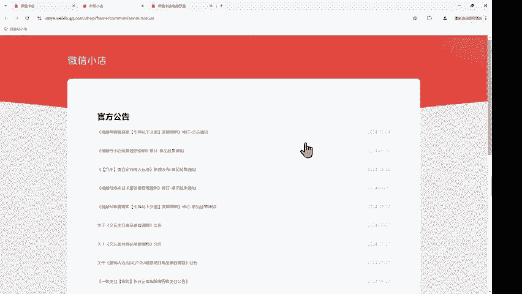

近期呢这个更新的这个功能都比较多啊。啊，我举几个例子啊，比如说你看这一个商家技术服务费管理规则，在9月30号发布的。那么这一个呢我们都知道啊，老手都知道它所谓的意见征集呢。

其实就是提前预告到10月6号完成，基本上是7号就发布了。那么它现在的一个好处是什么呢？就是它有一个补贴，什么意思呢？就是技术服务费的话，它有一个呃1%的一个补贴，O目前呢基本上都是1%。那么补贴多久呢？

就是90天啊，就是90天，从你开始出单啊，什么时候注册的啊，这个不太影响。然后就从出单开始算90天，90天或者是100万的这个销售额，O都是按照1%计算。你比如说你卖的商品售价是20块钱，那么也算1%。

对吧？就很少了啊。

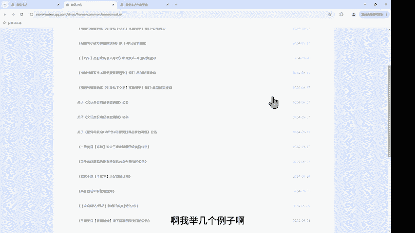

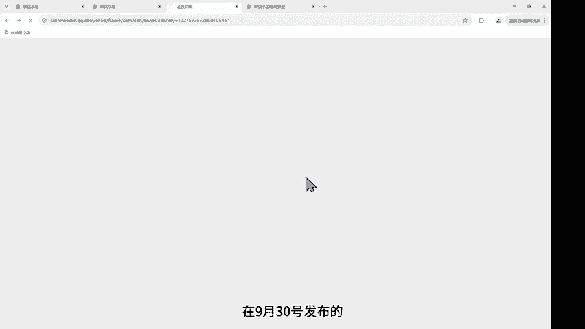

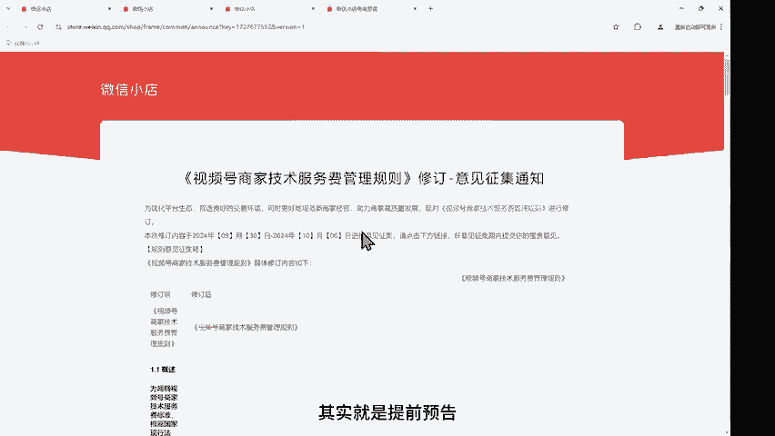

好，是关于技术付务费的。那么还有什么呢？第二个呢，就是我们说关于一个新的功能叫小绿书啊，近期比较火的小绿书关于优选联盟支持这个微信公众号带货的一个公告啊，就这个也是新发布的，是在9月27号发布的。

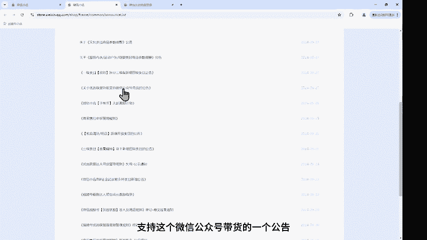

这些没有这个功能，关联微信小店店铺推广小店的一个商品，一个公众号呢，只能被一个店铺关联。当然如果说你没有这个小店的话呢，你也可以用这个达人的账号去做开通条件是粉丝大于100。然后满足条件之后呢。

在带货联盟商品当中去选择。那么这个小绿书呢跟这个呃视频放的这个作品时际间，它是有自然流量的啊，它就不像我们只是把上面放在那边不出单，它是有自然流量的啊，这个是非常好的一个功能。

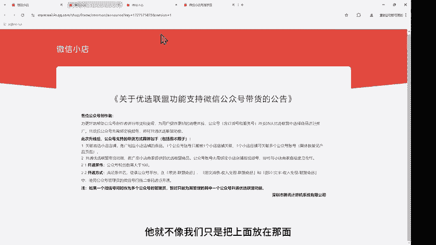

还有给大家看一个比较好的这个功能是什么？就是这个零保证金试运营哈。呃，有些同学说他说我开这个店铺，刚开始我没有太多资金啊，只有几千块钱的这个资金。那保证金呢正常是2000。你说那现在我不交。

我先出单的之后再交可以吗？可以啊，这个是没问题的。微信小店支持您保证金试运营类目，之前是比较少的。那么现在呢增加了多少个呢现在又增加了800多个，包括电脑办公服饰对吧？像这个个人护理家纺家亲日用啊。

有些同学做的是这些的家亲日用的一些产品，啊有些同学呢做的是这个建材类的啊，还有美妆护肤，你看这些都是您保证金就可以直接入住了，这个是非常的方便，包括图书都是可以的啊，像这些都是可以体育用品户外的啊。

像这些都是可以的。

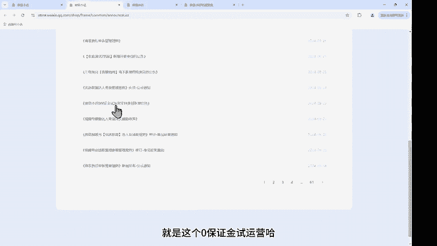

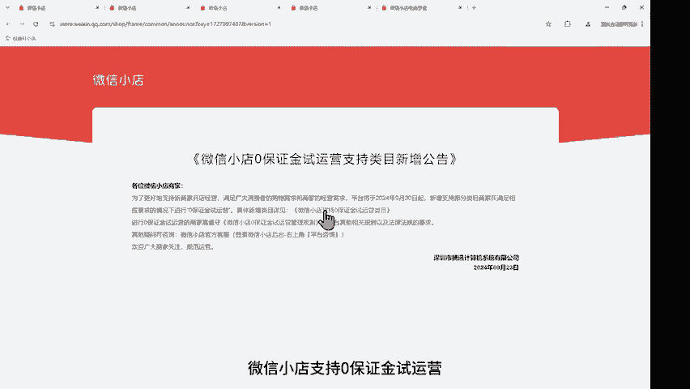

这也是为什么我近期没有时间去更新这个作品？因为呃这个好消息越来越多，我们肯定得抓紧时间去做这个事情啊。包括9月20号又发布了一条什么呢？就是这个观察期啊，因为我们商品的有个观察期。

那观察期每个店铺处于联盟观察期，所有商品一天最多只能卖5000。那么它现在改成什么呢？从9月27号开始改为了10万。

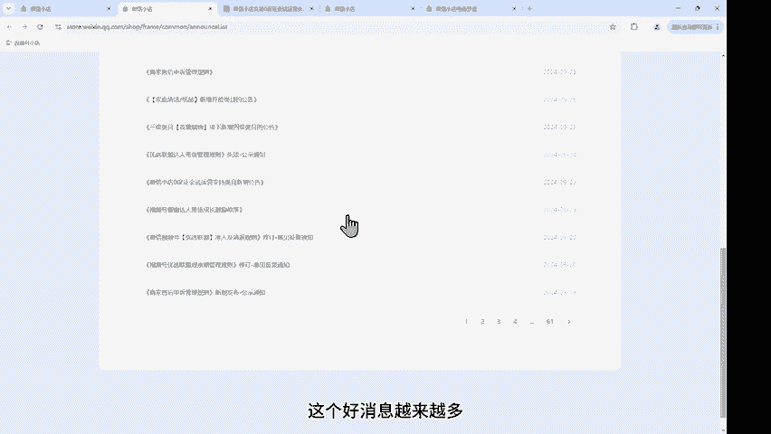

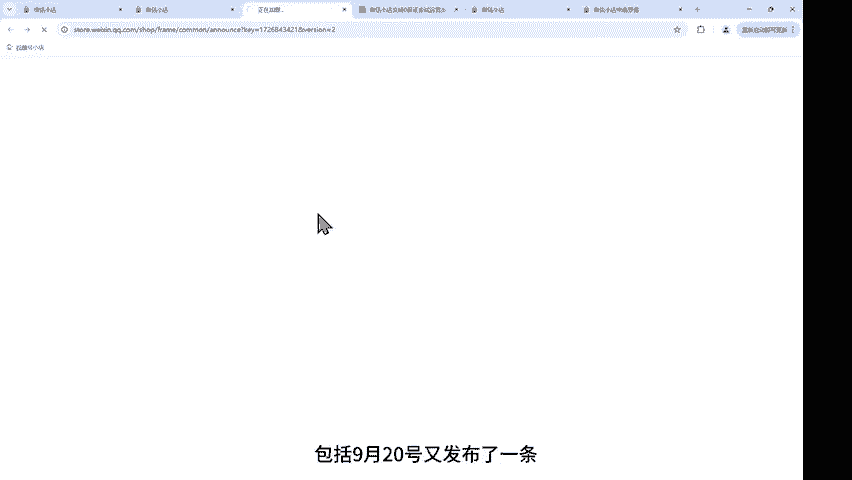

啊，也就是说以前老店对吧？他一天可以卖到爆，那么新店不行，新店观察期它只能到5000，现在呢基本上没有影响了。你一个新店铺，你一天最多可以卖10万的销售额，10万销售按照你进货的价是20%算。

那你你要拿出2万块钱的这个发货资金，基本上大家也拿不到2万，对不对？那基本上这个10万就够用了啊，所以现在这个行情的话，你有时间一定要去做这个小店。不管是为了他的这些新的一些政策。

还是说呃你看好这个平台抓紧时间去玩就对了。如果有什么不懂的呢，也可以来咨询我们。

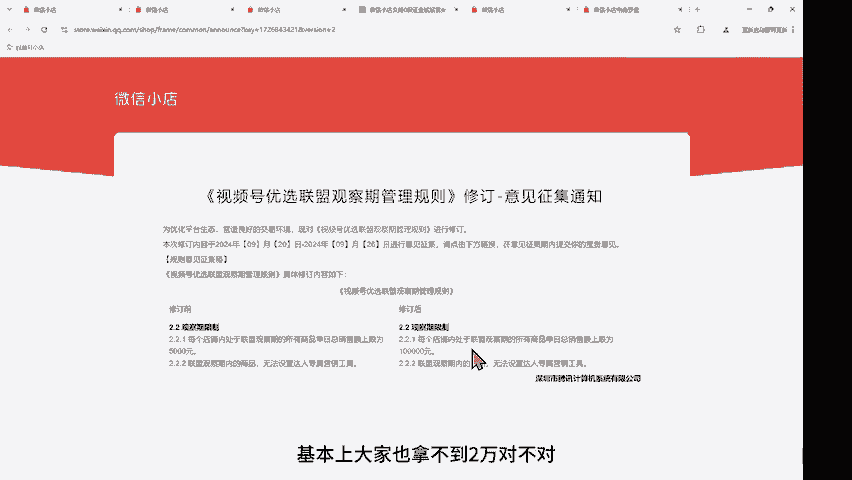

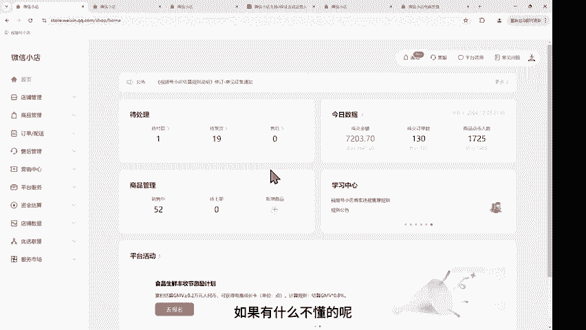