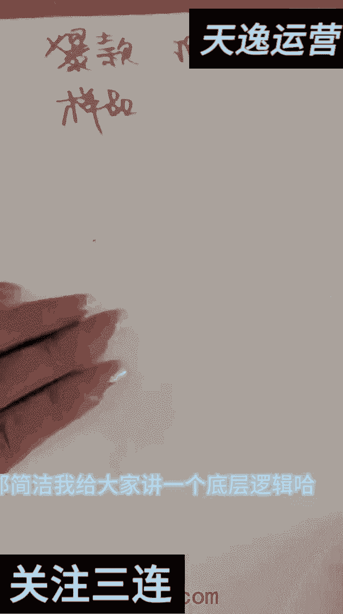
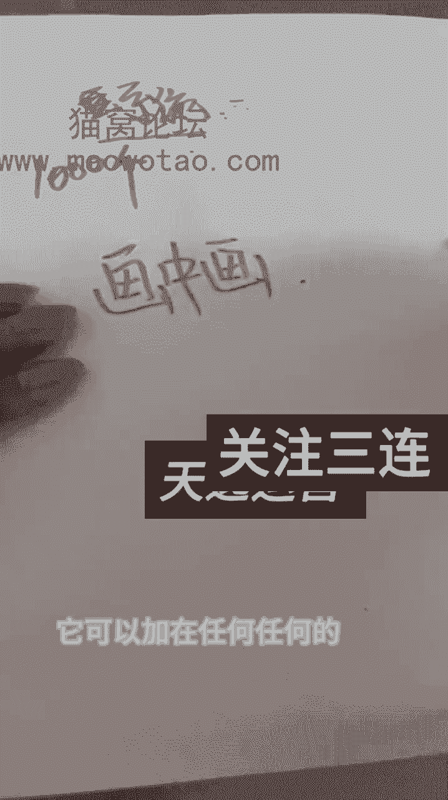
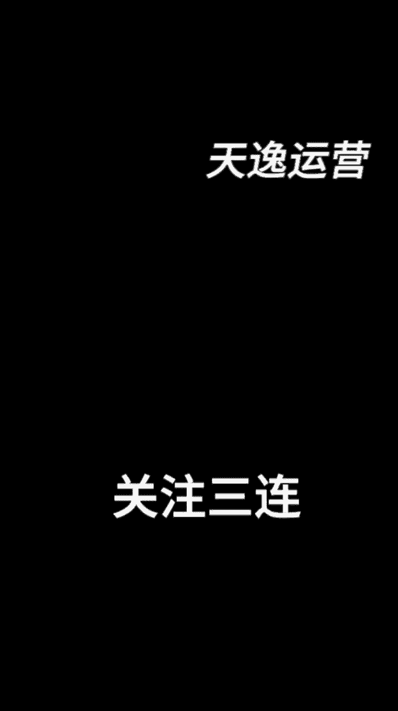

# 【微信视频号教程】微信视频号起号正确方法，抓住当下这波风口，打造月入10w的自媒体账号！ - P23：10-做防搬运视频的原理_1 - 糖拌W - BV1MTtTe8EGV

哈喽大家好大家好，我是小亚，那上一集的话我教了大家如何去剪辑对吧，我都跟大家讲了，剪辑很重要，那嗯剪辑呃，这节课我们就开始正式的剪辑了哈，那剪辑的时候我跟大家讲一下，你是想剪这种爆款爆款品呢。

还是捡我们自己给你们发的这个样品呢，样品里面挑一样去捡呢，这个你自己去看嗯，自己去看哈，来我教一下大家去如何找这个爆款哈，爆款跟爆款，那如果说样品的话，比如说我样品里里面给你发了木耳鞋，什么鞋。

刷鞋油是吧，你随便你自己挑一下，挑一下你喜欢的，那嗯就剪辑就行了，爆款的话哈，咱们就从这找直播打开发现直播打开，这是我的血缘，这是我的宣言，你看他都热麦了，他这在这干啥呢，哼这是我的轩辕号。

然后呢我们来看一下啊，就比如说我们在这个在这个平台在这里哈，在这里我们来干什么呢，在这里我们来看一下哈，哪个品卖的好，直播间人多，我们找一找，你看这个是枸杞，这是宝宝贴对吧，宝宝贴是这个这两天的爆品。

刚出来，这个人不这个人是吧，然后诶这个胶对吧，胶也是干出来，对不对，然后饺子馅诶这个也可以，这个也可以，九块九三瓶的大大油污也可以，然后大家自己看，对吧，你看见没有，这里都有哈。

还有这个是这也是交这这应该是个什么产品，看一下，呃那个高粱米高粱米，大家看一下，就这些品哈，那这这个是油污净，然后这个哎我觉得大家可以呃，这个是那个钢丝球抹布哈，我建议大家去剪个，如果我以我来看的话哈。

我建议大家去剪这个，剪这个这个是干出来的个品，肝出来一个品一无尽，这个九块九三瓶的油污净，干出来了，干出来九块九三瓶，价格也不高，新手的话卖的话就卖价格稍低一点，不要卖价格那么高的好不好。

然后我们打开哈，比如说像我们这个人，我们观察他对吧，然后我们去打开它，对不对，打开它以后呢，我们来看看他的那个作品，那他这个剪的应该就是他这个剪的是什么呢，他这个剪的就是那种大家看见没有是吧，剧情类的。

他这个剪的就是柱形类的，是不是朋友们，他这个剪的就是柱形类的哈，有个爱演戏的婆婆对吧，她剪的是柱形类了，那我们呢那我们就也去捡这种柱形类了，好不好，尤无尽尤无尽，对不对，那比如说我们选一个品，选好品。

选好品对吧，油污对不对，然后呢嗯嗯就是简洁，那简洁我给大家讲一个底层逻辑哈。

底层逻辑，那比如说我是个A对吧，然后呢B对不对，我们找视频都在一个地方找，对不对，朋友们，我我都讲了，找视频都在这个抖音和快手这里找，那比如说A和B找了什么呢，同一个视频，同一个视频哈，同一个视频对吧。

A和B找了同一个视频，对不对，那我们该怎么办呢，如果说哈A和B找了同一个视频，那我们如果都不剪辑的情况下，在不减的情况下直接什么呢，直接上传是吧，直接传直接床能行吗，对吧不行不可以，错的对不对。

为什么错的，因为被判什么呢，判违规对吧，明白吗，他就会被判违规，所以说我们要干什么呢，我们要学什么呢，学剪辑学剪辑，我们剪辑的目的就是说剪辑自己的视频，跟别人的视频不一样对吧，剪辑一个新的句型出来对吧。

那比如说A和B对吧，你A和B同时找了一个柱形，他也找了一个柱形，找完柱形之后，他给他加了画中画诶，然后呢贴纸对吧，然后呢再加了一些什么东西，对不对，比如说再加了一些移动对吧，移呃被移移动。

然后比如说像BB给他加了什么呢，B给的还加了一个额，B给他加了一个门板，B给他加了一个门板，然后再给他加了一个什么呢，加了一个那个呃滤镜，然后再给他加了一个什么呢，背景来朋友们。

大家大家能明白这个道理了吧，A和B找到同一A和B找到同一个视频，但是加的东西不一样诶，然后出来的视频呢参数就不一样了，出来的参视频参数就不一样了，所以说他们两个不会被判什么呢，判相同对吧。

它们就不会被判相同了，明白吧，他们就不会被判相同了哈，所以说大家明白没有，这个就是说我们要剪辑视频，剪辑视频剪自己润自己的手法，润自己哈，润自己的手法对吧，用自己的手法去剪剪出不一样的视频。

然后呢朋友们就是像我跟我老公哈，我跟我老公两个人，我们俩都问的是两个剪辑，两个剪辑手法，两个剪辑手法哈不一样的，所以说朋友们这个剪辑的重要性，大家明白了没有，那现在呢我不教大家系统的剪辑哈。

我不教大家出系统的剪辑，我不会去教你们，就说啊这个东西怎么解，第一步干什么，第二步干什么，我不会教你们这样的哈，因为我教了你之后，我的学员如果说是有1000个对吧，我现在学员是不是有3000个了对吧。

有3000个了，那我如果这样去教的话，那我3000个学员全部用我这个系统的减法，就是说先画中画，后贴纸，再加什么滤镜，我跟你说，你这3000个缺陷谁都入不了门，因为润的都是一个剪辑，那我现在姐妹们哈。

姐妹们这个课程是我新录的，那新录的呢，我现在要教他们什么呢，我现在要教你们什么呢，我现在要教你们就是说什么叫画中画，你们要明白什么叫画中画，那画中画就是像一味调料一样，它可以加在任何任何的。

他可以加在什么呢，任何任何剧情里面，知道吧，任何剧情里面，所以说你们切记，一定要知道这个分这个步骤是什么，比如说一个学员热门了对吧，一个学员热门了，你问他，你说朋友，你这个剪辑是什么，你他告诉你了。

你告诉你你也不懂，因为你不知道什么叫画中画，什么叫贴纸，那比如说像我这个学员对吧，我给大家看一个哈，我的一个学员，他什么呢，他我问他怎么剪辑，他给我发了个文字文字版过来了，那我把这个文字版发给你们。

你们不懂对不对，不懂是吧，呃比如说他说这个什么呢，最近奶的就画中画混合模式对吧，这些东西我跟你你们没做过的人肯定是不懂的，所以说今天我给大家，我先给大家分哈，分开剪辑我会教大家什么呢。

我会教大家什么是画中画，什么是贴纸，什么是滤镜，什么是什么，然后我会教大家什么哈，我给大家讲一下，我会教大家什么哈，我这节课就给大家梳理思路的哈，梳理思路来，这节课我会教大家什么，比如说这个剪辑对吧。

朋友们，大家看没有剪辑，我会教大家什么叫音频，什么叫文字，什么叫贴纸，什么叫画中画，什么叫特效，什么叫模板，什么叫滤镜，什么叫比例，什么叫背景，什么叫调节，你看工具栏都在这里，一级工具栏全在这里。

然后我什么，这是一级工种呢，那什么叫二级公主呢，二级公主男就把这个点开点开处理操作，点开去操作，那我告诉你们每一个厂，每一个那个工具是如何使用的，如何使用的，明白吗，如何使用哈。

所以说你们我教会你们之后，你们拿回家以后，你们自己去剪，比如说我现在是个A对吧，那我减什么，我自己想随心所欲的想加什么加什么，明白吗，想加什么加什么好不好，自己去加，又整理出来一套什么呢。

自己的剪辑属于自己的剪辑，后面呢我也会给大家发一些系统的，别人剪辑过的那个视频的剪辑教程，我也会给大家发，会给大家发一个总结的，那这节课呢，那朋友们，接下来你们就跟我学那个分课哈，分课好。

这节课我就是给大家梳理思路的梳理思路，那下节课我们就开始学习剪辑了，先从画中画开始好不好。

