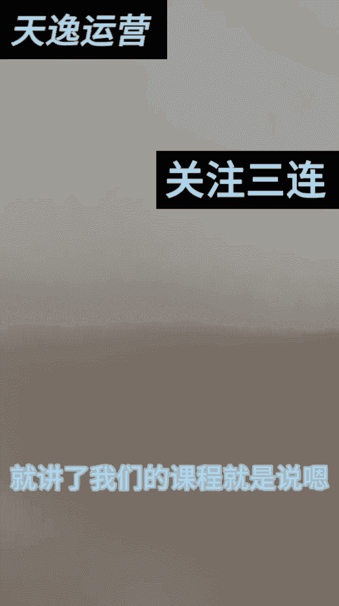
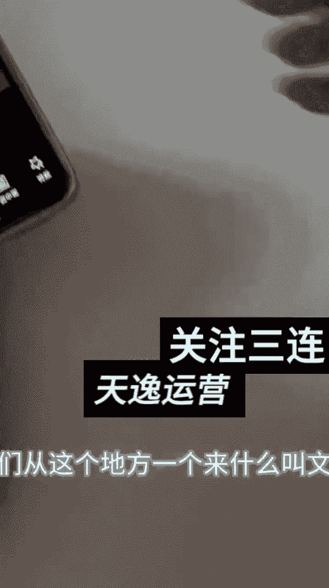

# 【微信视频号教程】微信视频号起号正确方法，抓住当下这波风口，打造月入10w的自媒体账号！ - P24：11-文字的编辑_1 - 糖拌W - BV1MTtTe8EGV

哈喽朋友们好，上节课我跟大家讲了，对不对，就讲了，我们的课程就是说嗯我们先教大家如何去剪辑。

那我第一今天来从第一步开始啊，我们先下载哈，可能嗯这个视频是我第，这个视频是我刚刚找的哈，怎么找怎么找视频，大家都知道吧，明白吧，怎么找，大家都明白哈，就搜那个民间故事会就行了哈。

然后我就找到了这个视频，我们点击然后复制链接，复制链接之后再下载对吧，出水印，然后粘贴出水印，保存视频哈，我的网速稍稍有一点点慢，好然后呢我给大家讲一下哈，什么打开剪映，点开开始创作。

点开这个视频添加上来，朋友们，我跟大家讲第一步，我跟大家讲什么叫额文字吧，第一步一个一个的来哈，我们从这个地方一个个来，什么叫文字。

这一步就是说文字，那文字哈我们分两种，第一种哈我们这干什么呢，点击添加，添加之后，大家看到没有有一个智能文案，智能包装新建文本哈，来新建文本是吧，前面两个我们用不上好，新建文本，我们可以写一个剧情演绎。

剧情演绎是吧，请勿模仿哈，是不是请勿模仿，对不对，是吧，然后这种提示词了嘛，对不对，我们可以给他放到这底下是吧，可以给它底下这个字，可以给它稍微的给它缩小一点，对不对，缩小一点。

那比如说编辑这个字母对吧，样式哎什么样式，这底下都有描边，粗体对吧，花字只要不是VIP的都可以选是吧，文字模板这里有选，然后动画是不是朋友们哈这里都有选，对不对，怎么出，你到时候你自己你自己去看。

你想要什么要什么要什么样的字体，对不对是吧，是不是都可以，对不对嗯，我比如说我要竖竖的哈，竖一点的字，我想让这个竖成为竖版，对不对，那我就直接让它成为竖版的字，这竖板子我们给它放到这行不行，朋友们。

然后呢放到这个地方，然后我们这个文字不就添加上了，然后我们直接给他拉到底，这个就是润润到全局上面了哈，润润到全轴上面了，这个就叫文字哈，这个就叫文字的添加，那我每一个哈。

每一个朋友们每一个切记都给它拖到这个尾部，跟这个对齐哈，跟这个对齐，大家明白吗，好来所有的朋友大家看见没有，这就是这就添加文字，那这个文字你们大家觉得颜色深的话，你们就把这个文字颜色稍微给它改改。

颜色改淡一颜色，改改那个淡一点拿掉，你就是吧，怎么选都可以哈，对不对，是不是好，那我们接下来哈，我们接下来干什么呢，接下来我们来干什么呢，这个就叫文字，对不对，文字分好多种哈，还有就是什么呢，识别字幕。

什么叫识别字幕呢，点开这个识别字母就是识别你整个视频的音，然后我们剪视频对吧，来朋友们，你们自己去看字，字幕识别中，字幕识别中，就是说你想把这个字原体的这个字给它改变，这个就叫改变字。

字幕识别中这个就是改字哈，来朋友们大家看见没有，这个就是识别出来这些字，大家看吗，这个字是吧，这就识别出来，然后这个字怎么改变哈，比如说我想改变，我们可以批量改变，我们可以编辑，然后想要红的变红的。

想要黄的变黄的，想要绿的变绿的是吧，都可以对吧，然后样式背景颜色花字都接都可以，对不对，比如说我想编绿的是吧，都可以的哈，这这都没有关系的，对不对，好，我们这里就是变字体哈。

然后这个字呢我们可以给他什么呢，就比如说这个字哈，我们可以给他，什么呢，调大哎，调小是不是调大调小，然后比如说我给它调小一点，我单做一个什么呢，我就给它放到最底下也不碍事，是不是这也行对吧。

我们放到最底下也不碍事对吧，如果说您觉得不好的话，您可以把这个颜色给它稍稍调淡一点对吧，编辑，然后呢不透明度，透明度给他拉低一点对吧，这也行呀，是不是这也可以呀，文字添加了，但是看不见是吧。

也不影响我们整个视频的，整个视频的什么进度对吧，这就叫文字，这些也是防搬运的哈，防搬运的，为了跟别人的视频不一样来，这就叫文字哈，然后这个文字模板识别歌词，对不对，来这里有识别，这里有文字模板。

模板的话，你随便加，比如说我想呃这个这个视频里面哈，有可以加到什么模板，那我们就随便加对吧，如果说你觉得不需要加的话，那你就不加，比如说我加一个，我加一个什么呢，大家看见没有，再一个哎可怜的男人行不行。

对啊，把这个估摸鸡丁对不对，可怜的男人，然后干什么呢，给他放到最上面，对不对，给它放到这上面也不要紧的哈，给它放到这个视频的最上面也不要紧，然后这个也是给他拖满，这就叫换了一个模板是吧。

这个这个就是添加文字，文字识别字幕，然后添加字哈，这就叫文字的添加，每个视频都可以添加文字，你想怎么改怎么改就行，大家明白吗，这就叫添加字幕，这就叫添加字幕，这就是文字里面的功能，我们能用得上的功能哈。

能润得上功能好。