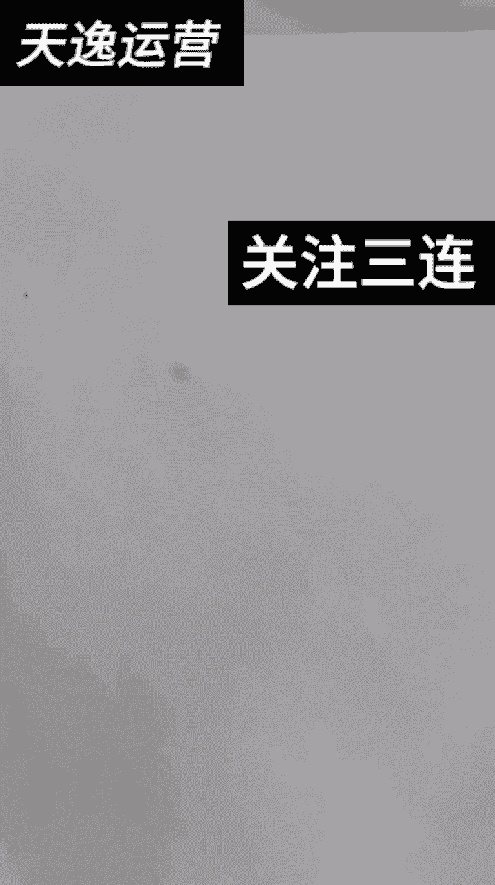
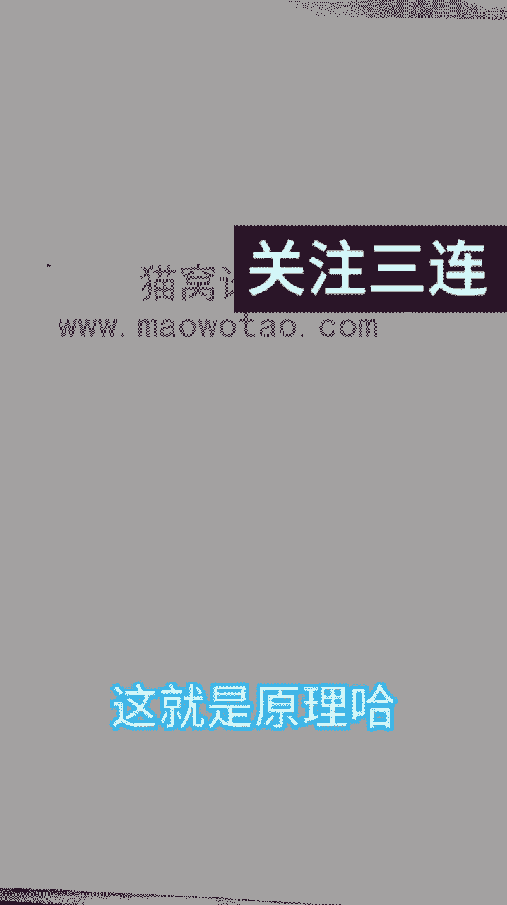

# 【微信视频号教程】微信视频号起号正确方法，抓住当下这波风口，打造月入10w的自媒体账号！ - P30：17-视频关键帧如何添加_1 - 糖拌W - BV1MTtTe8EGV

哈喽大家好哈，这节课我跟大家讲一下关键帧如何添加，如何操作哈，那这个是我们的视频哈，首先我跟大家讲关键帧在哪里呢，关键帧在这里一般是在这个位置哈，在这个位置，那首先呢我们添加关键帧。

这个关键帧可以用在贴纸上，也可以用在文字上，那我们先从文字开始吧，哈比如说文字文字，比如说我新建了一个模板是吧，比如说我小亚，我的名字叫小亚是吧，那我给他弄个红色，因为红色比较明显一点哈。

嗯你们不要弄红色哈，因为我是为了给你们讲解课程嘛对吧，为了讲解课程明显一点来，比如说我把这个小样给他拖到这里对吧，我想让这个小亚飞到这里来，对不对，那这个字步飞到这里来，我该怎么操作呢。

这里有一个关键帧菱形的对吧，我们给它点一下，这个线一定要在这个开头这里哈，开头这里，然后呢我们想让它飞到后面来呃，这个视频可以拉到尾部哈，那可以拉到尾部，我就不拉了哈，因为太长了，咱就不拉了。

是不是我五深度课程嘛，我就给你短一点哈，短一点，我先给你演示一下吧，把这个视频给它缩小，你做什么视频的时候，你把它缩小，我给它拉到尾部了，别新人再整不会了，来掀拉到尾部，我拉到这行不行，这个就是尾巴了。

对不对，这就是尾巴了哈，来我在这个大家看到没有，我在这个对不对，这个前面我加了个关键帧，然后呢我在这我滑到这个尾部来，划到这个尾部来，这一条线是对准了，最后最后了，贴着这个尾巴的时候。

哎咱们再给它加一下关键帧，然后大家看到没有，这条竖线在这个半边菱形上面，它压住了这条这个菱形，它是红色的，来看见没有，如果是这样，白色咱没办法操作哈，一定要是红色，一定要是红色才能操作哈，来压在这条线。

压在这里，然后我们把这个小样给他动一下，动到这里来好，这就可以了，这就叫关键帧，大家看见没有，这个小亚是随着这个视频是飘了，对不对，这个叫文字版的关键帧，那我们接下来哈，贴纸贴纸我们想一个不动的贴纸。

我们想让它动起来，比如说这个爱心对吧，你是羊仔，你给它动好对，然后呢我们也是给他哈，我们从这边吧，这次从这边哈，然后呢我们先给它也是同样的方法，在头上给他这个加号变减号一半，然后给他拉到尾部。

拉到尾部来，朋友们拉到尾部哈，哎拉到尾部继续来个关键帧，在关键帧的情况下，我们再去动这个视频，动这个贴纸哈，如果说你在这个红嗯，在这个这个线在这个中间，然后这个地方没有的话哈，咱是没办法没办法动的。

也能动，但是它不会是这样的，效果好不好，这就叫贴纸关键帧对吧，然后呢好还有一个什么关键帧呢，就是画中画，这个画中画关键帧呢，嗯我刚刚给你们看的都是画中画都隐藏了，对不对，咱们还有画中画还可以怎么润呢。

就是给他润的明显的部位哈，比如说像这个哈来后一定会做，然后就是说董事长撤了，我们开车走，这车是你的啊，嗯那，相亲啊，对你看啊，那董事长董事长玲玲，你在这里啊没有，你看他端着托盘出来了。

然后显示了这个拿了手上哪个产品，如果说我想用这个句型改成卖面条，或者说卖面条吧，就咱就说卖面条，那我董事长中产，这是我们的产品，那这个产品的话，我们就要把它盖住，怎么盖住，用画中画点。

画中画点添加来照片，照片里提前下载一张，提前下载一张这种贴图哈，好然后给它添加，添加以后呢，咱们把这个画中画给它缩小一点哈，缩小一点不要那么大，然后小一点龙须面给它盖住它原有的产品，大家看见没有来。

我大概看一下哈，这就是原有的产品，对不对，我们可以给他缩小一点，然后呢给它打个关键帧，打关键帧之后，然后我们再来到这，然后他这个他这个不是，你看他这个由远拉近，它这个它这个鞋油到这了，是不是变大了。

我们就可以把这个往后慢慢移移了之后，我们把手这样放大，然后把这个往下放，然后呢再来再来哈，你看这都遮住了，这都遮住了是吧，这都遮住了，然后我们再给他打一个，打一个什么呢，打一个关键帧，大家看见没有。

来看见没有，我就不骑车了，我们开车走，这车是你的啊啊等等等等，原来你在这里啊呀，你在这里相亲啊啊哈，你过来有什么事吗，现在天气越来越冷了，穿鞋子的人越来越多，这是咱公司的鞋。

那你看这个地方它有一点点没遮住是吧，没遮住，我们可以怎么呢，给他把关键帧点一个，然后再给它移过来，我们再来看一下效果哈，人相亲啊啊，看到没，他这个关键帧就动了，越来越冷了。

大家看到越来越多关键帧就动了啦，需要你摸一下，定个价这款鞋啦，我昨天在梦里已经测试过了，是不是这个关键帧它就动了，对不对，动了是吧，这个图片就动了，对不对，我再给大家演示一下哈，明白吧。

这个就是说添加在画中画上面，也可以添加在贴纸上面，也可以添加在什么呢，添加在那个呃就这个主主屏幕上哈，这就是哈大家明白了吧，这个就叫添加关键帧，那现在朋友们我教了大家文字，教大家贴纸，教画中画蒙版特效。

这个日镜比例这些全教给大家了，那我们做视频怎么做呢，做视频呢咱们拿回家之后哈，朋友们，你们拿回家之后呢，你们做视频对吧，比如说你拿到一个剧情之后，这就是原理哈。

你拿到矩形之后，比如说A然后呢你想加什么东西呢，加画中画是吧，对不对，加贴纸对不对，然后呢再加什么呢，再加门板是吧，这个你想怎么加就怎么加，你只要会就行了，你只要会哈，把这些东西都会了。

把这些东西都会了，然后你自己想怎么加怎么加，那比如说我加贴纸，我加贴纸，我要让它动起来，那就加一个关键帧，对不对，加个菱形的哈，那个关键帧是长这个样子的，菱形的对吧，对不对，然后呢。

咱们哈还有就是说呃那个再加一些什么文字，对不对，你想怎么加你就怎么加，想怎么加就怎么加，明白吗，做视频哈，为什么我不给你们，就是说呃去给你们，我后面我后面哈，我也给大家上传了几个几个人家剪好的剧情。

你们自己去看一下人家剪视频是怎么剪的，对不对，还有一个我教一下，大家就左右移动，左右移动，比如说我把这个视频给他分割一下哈，我把这个视频分割一下，然后给它分割一下是吧，比如说这个视频我想往左边移一点。

我就把这个点一下，把这个视频往左边移一点，先给它放大哈放大，然后往左边移一点，然后呢我们再来到这，哎我们也给它放大，然后把这个视频往右边移一点，大家明白吗，左右移，这就叫左右移动哈，你是羊仔吗对吧。

左右移动这个对视频也没有太大的影响的哈，你们可以看来都来了，为什么要走啊啊对吧，也没有什么太大的影响对吧，但是也能改变视频的参数啊，我们所有做这些动作都是为了改变视频的参数，跟原视频就是不一样。

跟原视频不一样，我们就是为了要干什么呢，把别人的视频变成我们自己的原创，知道吧，每个人手减法都不一样，每个人手的剪辑手法都不一样，所以说大家一定要会这些基础的功能哈，基础的功能，那嗯我给大家哈。

截个就是说给你们放一张截图哈，然后比如说这个截图对吧，我放大点，你们可以截图哈，你们可以截图，那我给你们这个是吧，现在我们是用的这个简洁方法对吧，用的这个简洁方法你能看得明白吗，对不对。

如果说能看得明白，那你这个剪辑功底就已经很到位了哈，好不好，朋友们来这节课哈。