# 【微信视频号教程】微信视频号起号正确方法，抓住当下这波风口，打造月入10w的自媒体账号！ - P31：18-短剧硬插广告简单版_1 - 糖拌W - BV1MTtTe8EGV

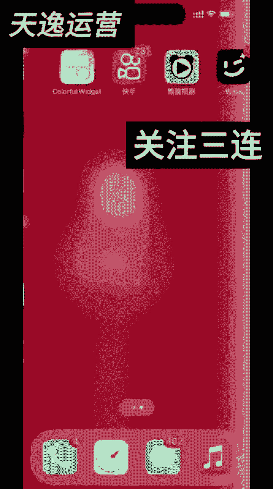

给大家录制一下我平时怎么剪辑的，我们把要剪辑的广告还有剧情都找好，去好水印之后，我们导入剪映大保留了，关键他为什么我们先导入剪映，对不对，我们比如说这个剧情，我要剪这个剧情，然后首先我们组我们导入进来。

第一步是选中它进行一个放大，放大之后我们把它你可以往左边移。

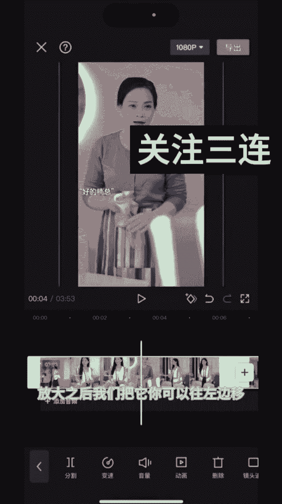

然后呢我们找到你不要管它。

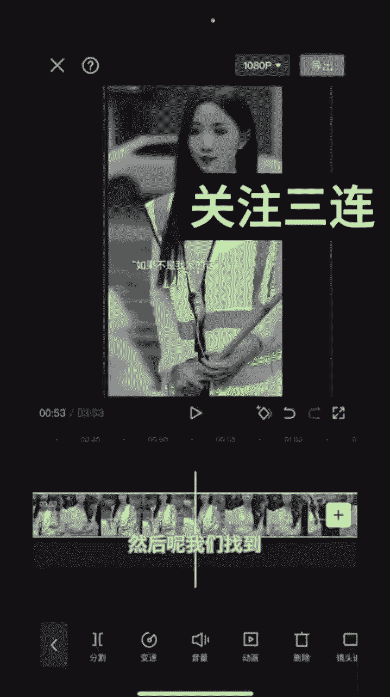

然后我们找到我们的剧情的一个。

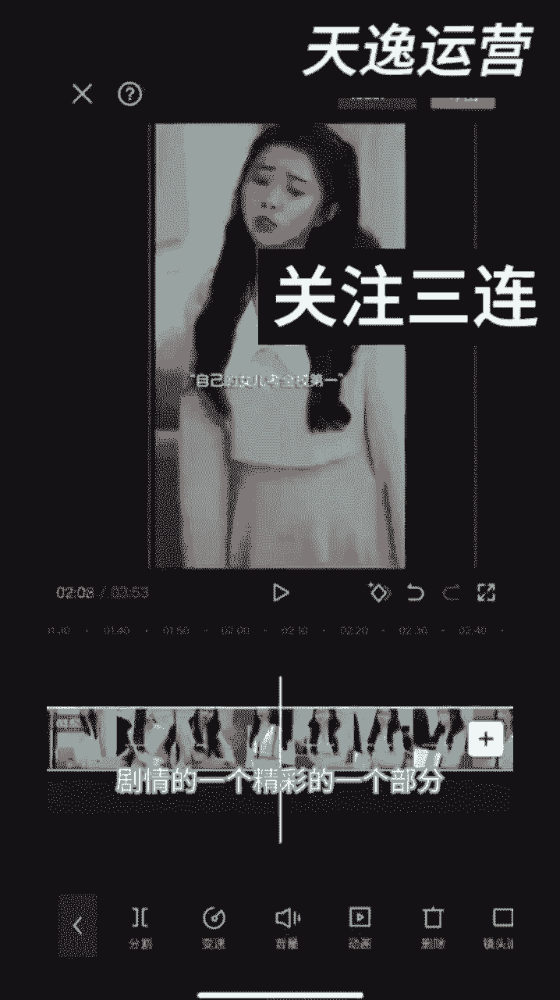

精彩的一个部分，就是我们小时候看电视，大家都知道的。

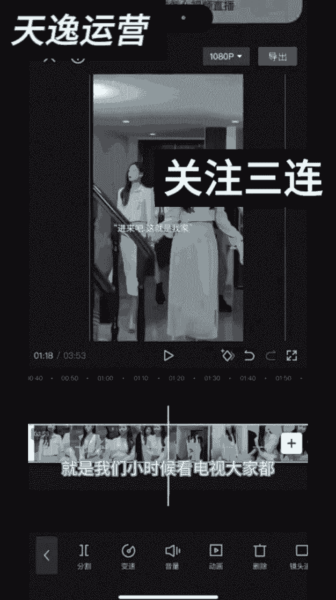

对不对，看到最精彩的时候呢，然后来就是突然给你来个广告那种感觉嘛，大概就是2分钟往后一点点。

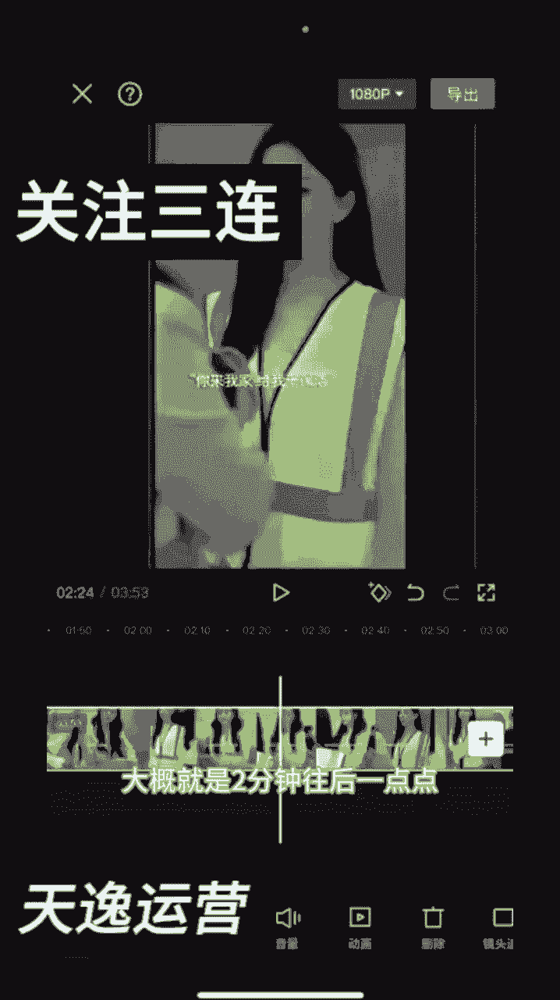

她在打电话的时候。

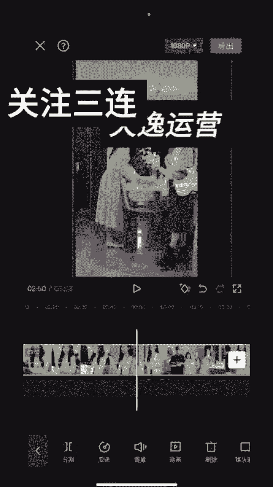

她说陈阿姨过来解释一下，对不对，这个就是精彩镜头的一个部分。

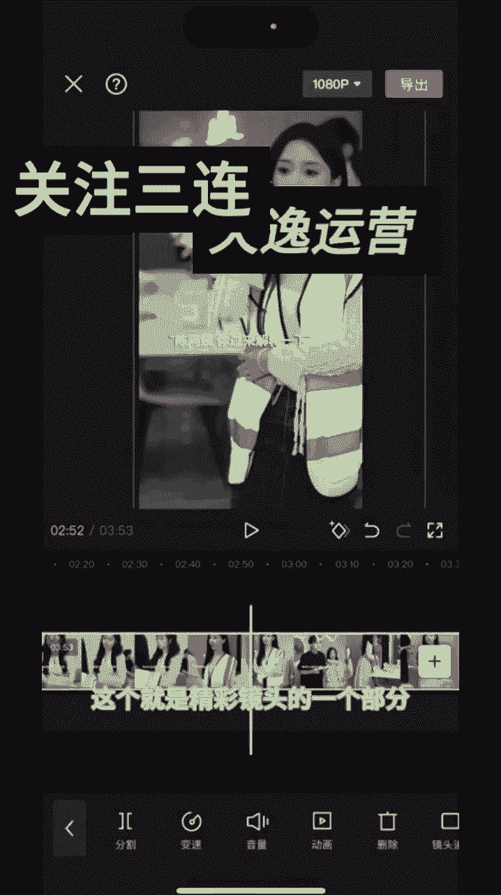

然后点分割，然后呢我们点加号插入自己要卖的广告，这些广告都是提前去好水印的，对不对，我们直接添加进来就可以了，整个广告要在一分钟，1分20秒左右，太短的话转化率很差，然后我们导入进来之后。

这边我们刚开始放大，不是移了一个方向吗，那我们现在给他调一个方向，就是他上半段我们跟下半段。

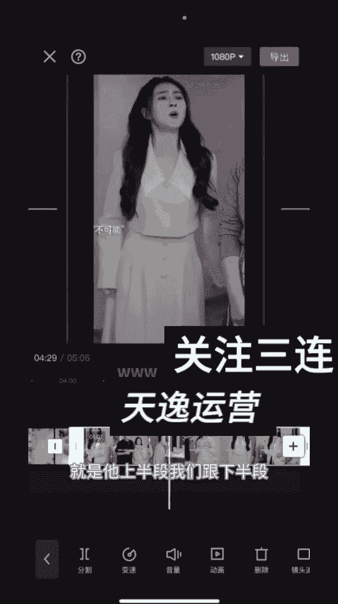

他的位置做一个参数的一个调整嘛。

然后这样子整个视频就剪辑好了，然后再加贴纸。

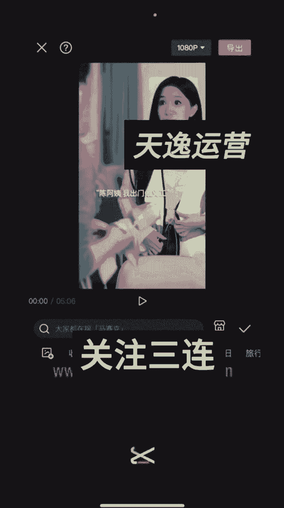

贴纸的话，我现在会加这种闪闪的，发布的是那种带花的嘛，然后把它放大，放大之后呢，把它稍微移出来一点。

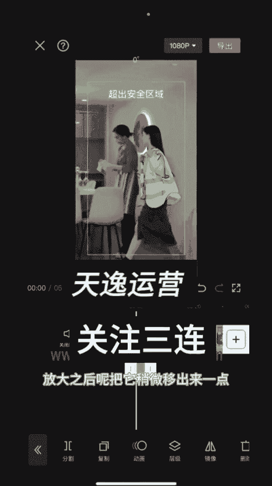

秋天先对齐它，对齐它，我们再去移吧。

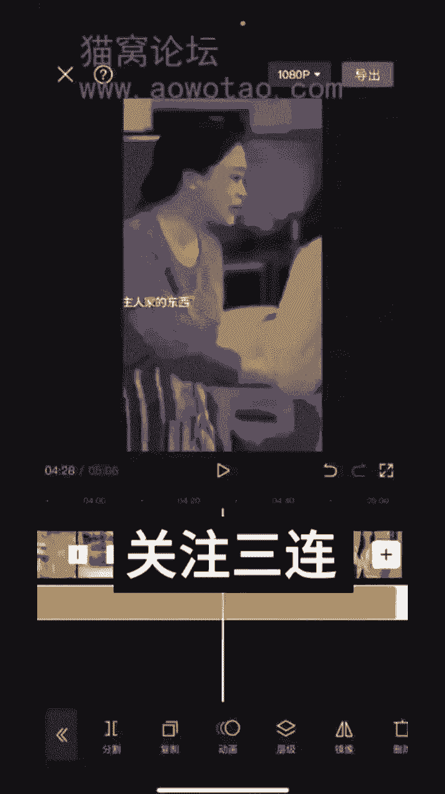

然后稍微移出来一点。

对不对，他这里就有了，然后你再看一下你说的难。

然后这个贴纸加完之后，我们再去加那种四个闪闪的，比如这种带星星的。

不明显的，我们把它对齐，整个屏幕对不对。

然后点复制123，复制四个，因为我们要四个角落各放一个，然后这里还有一个。

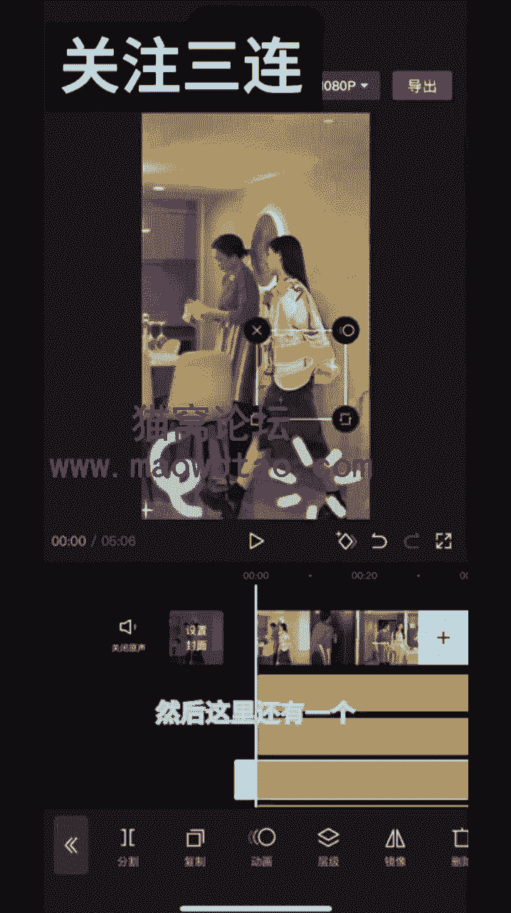

然后呢我们再加一个那种类似于电影感的这种，这种也可以。

一般加个这个也可以，这个都随意，随便你用那种电影感的任意一个都可以。

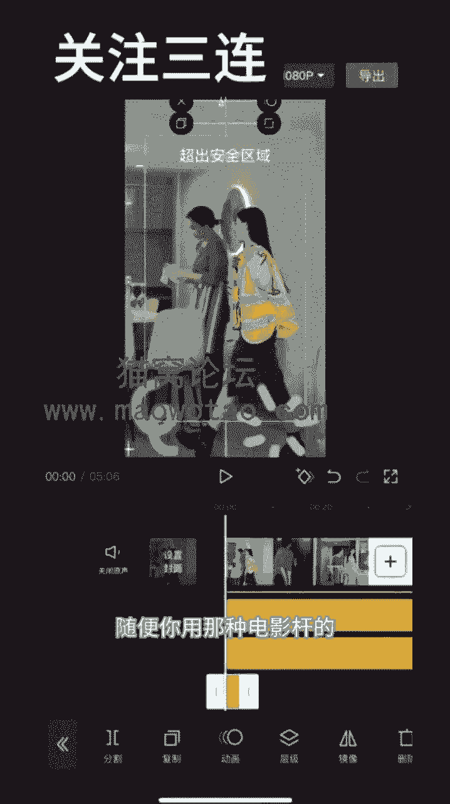

然后也是对齐整个屏幕就好了。

然后我们再加一个画中画，画中画的话，建议加自己的自拍，就比如说随便找一个，然后放大，放大之后我们点混合模式，这里随便挑一个。

拉到五以内三，反正五以内都是可以的，然后对齐就可以了。

然后我们选10806十帧导出就可以了。

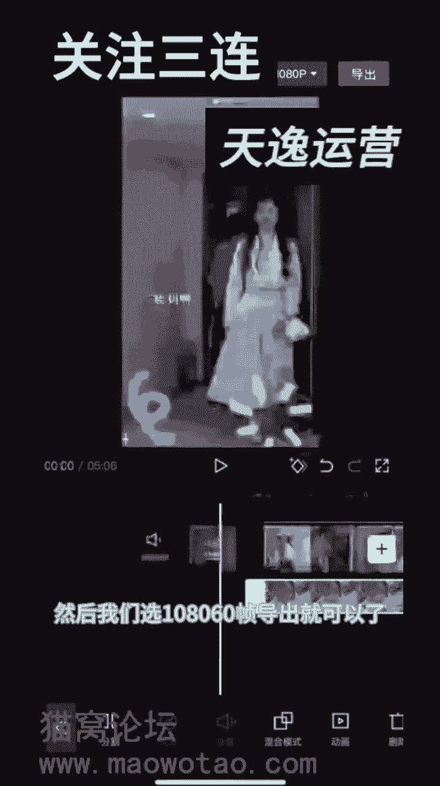

基本上这样去剪辑都能跑。

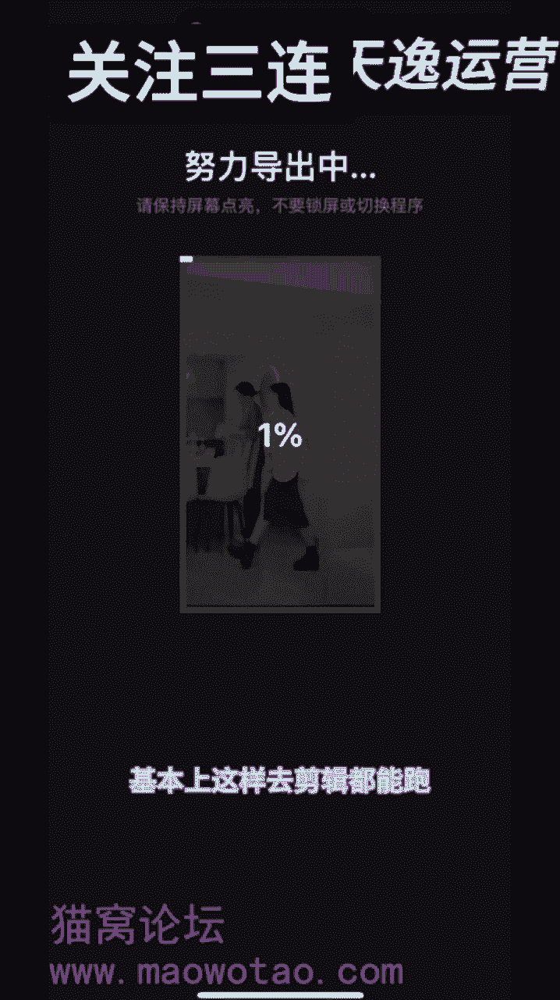