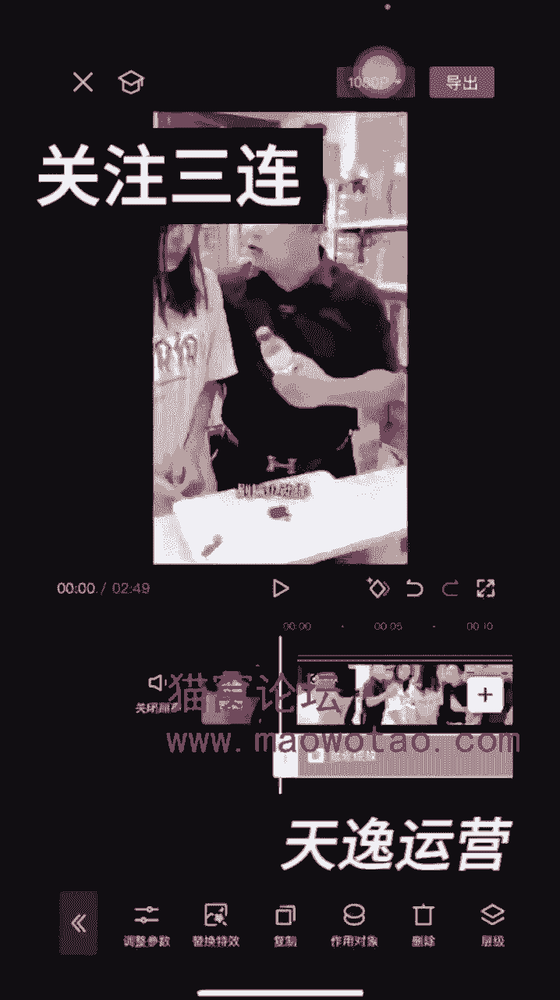

# 【微信视频号教程】微信视频号起号正确方法，抓住当下这波风口，打造月入10w的自媒体账号！ - P34：21-日销34万营业额小王剪辑法_1 - 糖拌W - BV1MTtTe8EGV

姐妹们，我给大家讲的视频的剪辑的视频，就是那个去好水印的水印，我们都会去对吧，因为小叶老师老师的话，群里都有讲去好水印的这个视频，我是这个视频，现在就是因为那个写这个视频，我就给大家看一下。

拿到视频的时候，就是导入进来的时候，我首先就是给他那个放大一点，这样子放大一点点，不会放的很大，我就是这样放大一点点，然后呢给他就是呃放大一点点，然后再给他去掐头去尾，就是这样子给它来回这样缩放。

知道吗，来回这样子弄，这样子，然后给他去呃，这样子去截掉一点，掐头去尾，截掉一点啊，这样子用手这样子放大，因为有的姐妹给我们录制视频，他们是录制的，我现在是用一个手拍着的啊，这样子去掉一点去掉一点。

然后再给它缩缩一下啊，嗯掐头去尾一样，刚才说就是给它放大，第一步给它放大，然后第二步给他掐头去尾，这个步骤其实弄反也没事，然后再给它变速，变速的话，我一般是就是一点一倍变速变一下，变速变一下以后呢。

我们要去找广告了，这个剧情我下载下来的是嗯，看人家是嗯直播广场，人家报单的啊，人家报单这个广告是加在哪个地方，它广告我们看他这个地方就是广告了，他原来是我现在要卖的是那个卖那个榨菜啊。

他们原来这个广告是那个卖的是沙琪玛，那我就是不是要把这个沙琪玛改成我这个榨菜，对吧，那广告我知道哪里加了啊，就是原剧情，他我剧情的话就是直播广场找的直播广场，我昨天看好像有一个有一个姐妹报的挺多。

就她啊不知道今天今天没有了，所以说他的剧情我都是提早，就是提早导入出来啊，加到这个地方，但是我也知道了，他这广告是加在哪里，有时候不知道的情况下，你可以拿手机录制一下，看人家广告是加在哪里的。

他是加在这个地方，这个地方就是等下变成榨菜了啊，这是我们店的，他的广告从哪个地方出来，从这个地方要出来了，你可以给他拉大一点，拉大一点，你看是不是这个地方要出来，那我们是不是要东西给挡住，是不是。

这里你分割一下啊，分割一下再缩放回来，这是我们的沙琪玛啊，广告我们要首先都知道了的，他在吃的过程他是不要的啊，他不要，我们也不要啊，因为爆单的人家剧情里，这个地方都是没有的。

因为这个地方在介绍人家的杀棋嘛，我们不需要啊，不需要我们给它放大，放大这个地方，把这部分裁剪掉就行了，把这部分不要，放大这部分是不需要的啊，不需要我们给它裁剪掉，这是不是还有点闪屏，我们给它弄掉。

这部分是不需要，其实我我剪辑，我感觉挺简单的，好这里再介绍这个了，我们也不需要再给它放大放大，从这个地方把这里都截掉，这里都截掉，它在吃这个我们不需要拉这个都截掉都不要，那当然了。

这个也不需要跟我们的剧情广告是不一样的，这这里可以方干净，方便携带，那这个可以这个给他留着的，前面这里都截掉就可以了，截掉看一下我有没有截图，看一下，对没错啊，好我们下一步下一步我们来要加广告。

就是怎么去加，是不是知道广告价在哪里了对吧，但是呢他这个地方他说这是我们新，这是我们水果。

是不是说的是他们的广告，是不是他们的水果奶盖，我就把这个地方裁剪掉了。

我又给它分割了一下啊，这是我们店的水果奶盖沙琪玛。

这个地方再给放大一点啊，这要放大一点，水果奶盖沙琪玛应该是这个地方给它分割啊，玛沙琪玛不要杀琪玛了，水果哪个下棋了。

新品水果奶酪，这是我们的新品就行了，不要水果奶盖烧起嘛，因为我们的新很菜是我们店的新皮。

要不你先吃一点，对，这是我们店的新品，要不你先吃一点。

你看这个是我们店的新皮，要不我们先吃一点，稍等一下，那行吧，请快点好，我们现在用那个东西来遮挡起来。

然后因为我们的广告卖的是榨菜啊，来画中画添加画中画，添加榨菜，这些图片都要提早找好的啊，嗯它从这个地方位置出来了，是不是到哪里，这里，你看从这个地方都是在在，假设沙琪玛是不是都有杀气嘛，这画面出来对吧。

好我们嗯这里选中啊。

这里选中，这里选中，然后这里有个加号这个地方抽一下啊，然后这样子的话就是这个这个图片，就是榨菜的图片会跟着我们的画面走动啊，你会移动的，你慢慢的移啊。

他是不就是把把里面的那个原来剧情里的，那个广告那个产品给挡住啊，给他挡住，不挡住的话，就是我们要做的话，就给他做刀，给他挡住啊，这样子去挡住挡住我们看一下啊。

这个是我们店的新品，要不你先吃一点，稍等一下，那行吧，你快点不行，做的时候你看这个广告里就是这里一点点啊，不要给他露出来，原原来的沙琪玛都得要去挡住，这点做的时候要做细致一点，因为我之前报的木耳。

他也是这样的，剧情，也是就是原来他是一个嗯硫磺沐浴露的广告，然后就是给他那个原来的广告，我们变成自己的木耳就行了，也是这种操作方法，操作步骤是一样的行吧，你快点啊，先生姐，稍等一下，那行吧，你快点。

要不这样，这个是我们店的新品，要不我们先吃一点，稍等一下，那行吧，你快点哎是吧，好这里的话，窗框已经加好了，这广告已经加完了，是不是广告已经加完了，这里是不是还有杀气吗，那我们不管它了。

我们后面的这些广告是加在这里的啊，哎好这里啊。

剧情广告是加在这个地方啊，报单的广告它是加在这个地方，它是三个榨菜，然后我们也这样子，这个大家就是你你卖什么产品，你就加什么广告，我加广告的时间，我现在是随便给弄的啊，我没有广告，我没我还没有做好。

都是就现在是这样子四个吧，时间我基本上时间都是控制在一分钟，40秒或者30秒左右的，加广告的时候呢。

我们这样加进去的时候，这个福陵榨菜他讲的是榨菜。

是不是，然后为了叠化弄一下叠化我就弄的是啥牌啊，这个福陵榨菜也太闪。

白馒头啥的都好吃，这个去皮广告就是自己找网上找的时候。

人家用什么广告，咱也用什么广告就行了，但是他们抖音上打广告不都是这样子的吗，就是说的人不一样，他就是拍的拍这广告的人不同，他就是内容里面的文案就是内容都一样的嘛。

所以说我们可以去换一下，比如说这个女的，她在讲解的，是不是，那我们可以去抖音上，找一个别的另外一个女的讲解就行了啊。

这广告是不是加了我加了几段广告，加了四段，反正我的广告时间都是在一分钟30秒。

或者一分钟40秒，这样子的行好，这就讲完了，是不是好，下面又出现了这个这个的广告。

沙琪玛，原来沙琪玛的那个了，是不是，那我们还是加画中画啊，还是加画中画，画中画加进去，还是跟刚才方法一样的，就是这样子，先给他拉大吧，拉到这个地方看这个位置啊。

好。

点一下点一下抽针，这个地方抽一下啊，好这个位置给挡住啊，挡住一点点拉一点点拉，给他这样挡住呀，这里出来了，放大一点，这个给放大一点，用手指给它放大一点，放大一点，就是原来的剧情不要录出来，要19块九。

还给包送到家呢，你要是喜欢吃的话，这些都送给你了，那还挺划算的，这个不行，这个地方还有一点露出来，反正不要给它露出来啊，把这个簪子弄断，不要给他露出来，哪儿都可以吃，现在要19块九，还给包包到家呢。

你要是喜欢吃的话，这些都送给你吧。

那还挺划算的不行，这个地方还是不行，是现在只要19块九，还给包送到家呢，你要是喜欢吃的话，这些都送给你了，反正这个地方大家弄的时候就是弄的细致一点，就是给它那个嗯再拉动一下就行了，感觉拉的没有不到位。

看这里还有露出来是吧，原来的纱起来露出，不要给露出来。

我还给包送到家呢，你要是喜欢吃的话，这些都送给你了，那还挺划算的。

那挺划算的，他是不是这样就好了，这这次往前面拉一下，老怕这些都送给你了，那还挺划算的，这个我我没有这个画面没有弄好。

大家可以就按照刚才那个方法，就是自己再调一下，我想很多姐妹都会的。

因为我们群里课程里面有很多讲过，就是这样子。

那还挺划算的。

挺划算的，警察你是把他包围了。

你们走不掉了，这是不是广告都加好了，所有广告也加好了，原来的广告画面是不是也都挡住了。

那现在我们开始弄什么，就是刚才是不是这里有分割过的了，是不是这一段时间我会给他那个移动一下。

就是左右移动正在给他放大，刚才有放大，现在再放大一点点，放大一点点，一往然后呢往左边这样。

左边去一点点，然后后面的后面这个这个广告再给他放大一点。

这是往右边这样子去一点点，然后中间这些广告呢我也会给他放大啊。

这个我是随意性的放大，因为我觉得剪辑手法都差不多，这样子给他放大一点。

这样子也给他放大一点，这里也给他放一下。

有的姐妹呢还会再再说给她在这个编辑一下，我是没有编辑，我嫌麻烦，没有编辑，这样子好了以后呢，后面加上贴纸贴纸，我就是往下面拉，这样子贴着贴纸给缩小，然后角落里放很角落里啊，看不基本上是看不出来。

我不喜欢露出来。

给他拉到底就行了，贴纸拉到底，贴纸拉到这四个贴纸，我是复制的，复制四个贴纸。

每个角落里一个，每个角落里一个，然后画中画，画中画我都是用自己的自拍，就是拍一些家里的一些素材，或者有时候拍拍自己发自己的扇子，拉大铺满。

然后混合模式叠加叠加这个到二或者三或者，反正五以内，他是不是化妆画，这里只能弄一半，我我不管它了，我是这样子，我后面就是又去弄了一个，重新再来一个画中画。

因为刚才那个化妆画里面，我不是弄了那个吗，榨菜嘛对吧，正片叠底这样子的。

再来一遍架子是不是全部铺满了，这个是一个画中画，然后滤镜的话，滤镜我是随意性的弄的滤镜我也是弄了一个啊。

这个这个什么滤镜啊，这个特效特效我也是有弄的，画面特效。

不要弄VIP的作用对象是作用在画滤镜。

我就呃这个特效我就弄了一个。

然后人物特效，人物特效我是没有弄啊，然后这里的滤镜滤镜我是用那个嗯。

这里我是随意性的弄一个的，就是弄最新的这种吧。

弄一个，然后还有什么东西啊，还有这个调节调节能点的。

基本我都是五以内，其实这些我们课程上都有的，五以内什么色调，这些我都有调能调的，因为我以前听过好多课程，他们有的姐妹都调的，她们也是有大包的。

他们都是这样，就都有调过的，然后他给他全拉到底，铺满拉到底就行了，我没有开VIP，所以只能这样子慢慢的拉拉到底，以后比例的话九比16，然后背景是这样子，背景我我这样随随意选择一个，随意选择一个。

然后要全局应用，全局应用。

然后我这样子就给他导入出来了，就这样子直接导入出来，我就这样子弄的。

