# 【打败全网99%的新媒体运营课程】零基础自学运营天菜教程 小红书运营起号／抖音短视频／直播带货 全平台精讲！ - P17：16、新媒体运营第十课：笔记关键词排名机制演示 - 大咖私域运营 - BV11VtTesEM6

hello大家好，我是方宇老师。欢迎大家来到我们这一堂课。那么这堂课呢我们继续来深入研究我们现在新媒体平台这样一个搜索排名它的一个核心的机制。好吧，我们逐步来大家带着大家把这个流程走一遍。OK好。

那么首先呢我们从我们的笔记发布之后，我们开始我们来看一下它笔记发布之后，到底系统会对这个笔记做哪些工作。第一步呢就是一个内容的审核了。内容审核呢主要就是看这篇笔记呢有没有违规，对吧？违规主要看哪些呢？

你是否有敏感词。然后呢，你是否有这个平台限制准入的这种类目或者一些其他的非法的这种东西。O然后呢，其次呢再看你这篇笔记，它有没有这个抄袭，有没有这个呃抄袭别人的东西，然后呢，包括你的这个素材的重复啊。

然后呢，你的这个非原创的东西啊，这种呢一定会去审核一下的。好吧。当然这个我们都上堂课也讲了，这第二步内容审核，当你的内容审核过关了之后呢，就进入到第三步。😊。

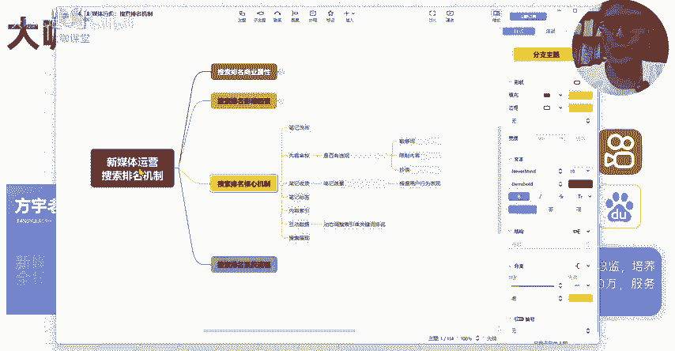

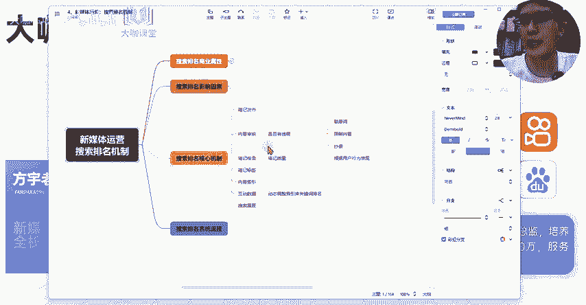

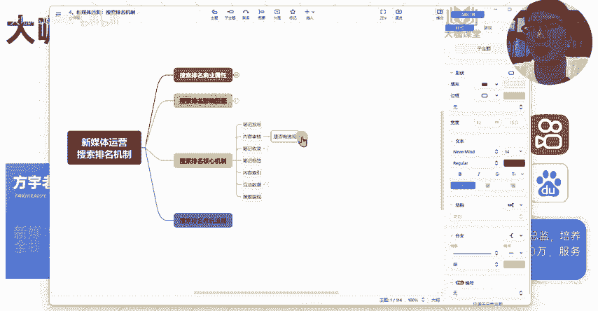

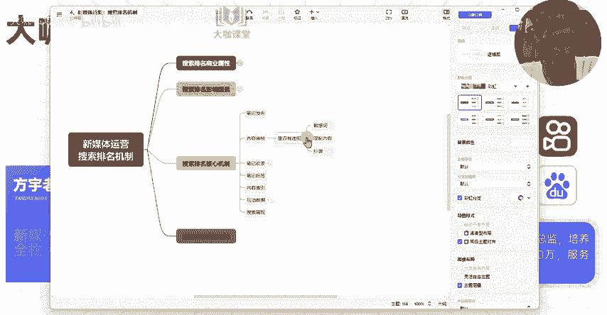

就是我们笔记的一个收入问题了。那么笔记收入根据什么来决定的呢？笔记收入呢，根据我们的一个账号权重。

和我们的笔记的质量，账号权重这一点就不多说了，你的账号所带目前所在这个系统里边所占据的这个流量层级啊，就代表了你这个账号群众到账号嘴一个权重的一个高低，然后呢，这是其中一个因素。

还有一个因素就是笔记的一个质量啊，并不是说你的这个账号呢目前权重比较高，你的账号的流量层级比较高，你发布的笔记它就一定会参与，一定会被收入，也会出现不被收录的情况。

那么这个笔记质量就来决定了笔记质量是根据什么来确定的呢？质量这个东西到底是谁来决定的呢？相信看过这一整套课程下来的同学应该都知道了什么决定的用户对吧？用户的一个行为表现能决定你这篇笔记的一个质量怎么样。

那么尤其是到了一定流量层级的这种呢笔记它的这个笔记质量的一个凸显是更加的直观的。你比如说你的这个账号目前权重很高，对吧？你的笔记发布出去之后，你的基础播放，你的基础曝光啊，就有1万个。

那么这一万个曝光里边，我们正常的可能讲至少。😊，说10分之110分之2对吧？10分之3这样的一个情况会有用户呢来点击你的这个笔记。那么如果说你的某一篇笔记的点击量连10分之1都到不了，对吧？

也就是说你连1000个小眼睛都没有，你只有这么两30百个小眼睛，那你这篇笔记肯定是有问题的。那么用户的一个行为就能告诉系统这篇笔记不行。那么如果说你比如说我们现在的流量层绩还比较低。你的初始的小眼睛呢。

你的这个曝光呢就只有千把对吧？然后呢，千把的曝光或者说甚至100曝光都没有500的曝光，哎，这里边呢你能有200的个小眼睛，虽然说小眼睛数量不多。

但是整体的你的这个呃笔记质量可能说在这个流量层绩下面表现的还可以。那么在这种行为下，你也可能你这篇笔记被收录的可能性就会更高。O这个是笔记收入，那么当你的笔记收入进去之后的同时啊。

我们可以也可以讲收录的同时，😊，你的这篇笔记呢，系统就会对你的这个内容啊进行一个分析，分析什么呢？分析你这篇笔记的一个特征。不知道还有没有同学记得我之前讲的这个内容当中呢。

有关于笔记特征提取的那么一节课，这面节课里边讲我们呃系统，它会根据你的笔记的内容的关键词，你的t标签，还有你的某些其他的这个呃账号的一个历史行为数据的表现来提取你这篇笔记可能是跟哪些内容相关的。

还有用户的一个反馈，也就是说你分发出去的100个用户里边，10个用户跟旅游相关，对吧？假如说你现在做的是旅游的内容，对吧？10个用户对旅游感兴趣。然后10个用户呢对女装感兴趣。

还有10个用户呢对数码感兴趣。哎，这100个用户10个分类当中有一个跟你的这个领域搭配的这个10个旅游相关的人群，他们对你的笔记表现还可以，对吧？

那么就可以从侧面反映出你这篇笔记可能是跟什么跟旅游相关的。那么这就是提取我们的标签和特征呢。这个时候呢，他就会提取你的标签。😊，对吧你的笔记他会给你打上你这个笔记是关于什么的呀，对吧？是关于旅游的啊。

还是关于什么内容的，你的从哪些方面来提取啊，这个标签的提取。就是我们前面讲的，你像这个呃我们先把用户标签写进来吧。然后呢用户的标签还有你的这个账号历史数据对吧？你历史你以前发的这个笔记。

然后呢给你打上的标签是什么，然后除了历史数据呢，还有你的这个标题呀啊，就是你的关键词了啊，剩下就是你的关键词，也就是说从你这篇文案当中拆分出来提炼出来的，你这篇笔记是关于什么的这样的一个关键词，好吧。

这个关键词我就不写了，它里边的因素，在前面我都已经讲了，这个就是标签，好吧，他来对你的标签呢进行一个分类。最终呢得到的比较关键的值反馈出来的，就是标签这么个东西。

也就是说会给你的笔记呢打上一些这个啊打标签，好吧，打标签。😊，好，那么接下来呢就到了我们的内容索引了啊，内容索引是什么意思呢？就是它会根据提炼出来的这些标签啊。

在它的系统里边对你的内容在不同的关键词里边去进行一个排序啊，就是他提前给你把这个关键词排名已经给你排好了。不是说你搜索完关键词，它再重新在这个数据库里边对你的这个内容去进行排序。不是的。

它是在这个笔记收录之后，把你的标签打好之后，它就会根据你的标签的历史数据表现啊，呃，就是现在的数据表现以及提炼的这个标签啊，以及它的这个呃后面的一个数据波动来决定你在某些标签下面的一个关键词排名。

那么内容索引这个东西呢，它是一个呃比较复杂的动态化过程。但是呢我也有办法来跟大家演示出来。那么呢这里呢我准备了一个画图，好吧，准备了一个画图，这个画图呢。

我们用这个画图呢来跟大家展示一下系统到底是怎么来给我们调整我们的排名，或者说在索引库里边来给我们做排名的。当然呢我们要做这个事情之前呢，我们得先要有一个笔记。😊。

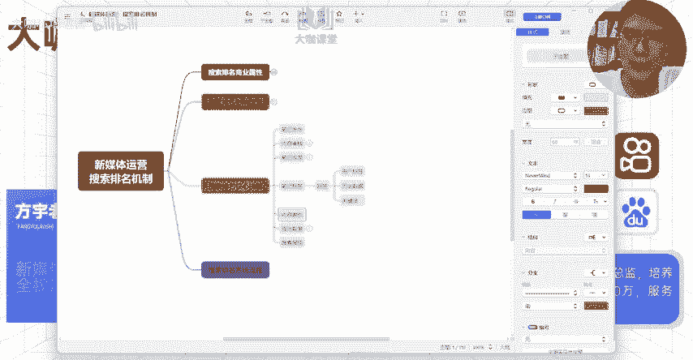

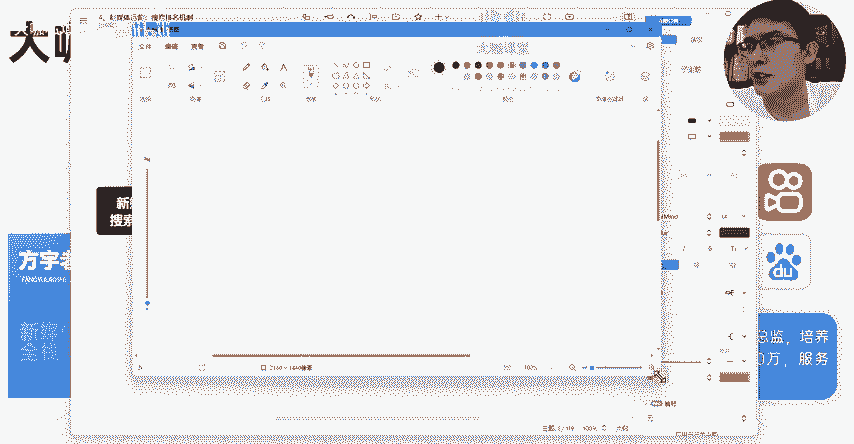

有一个笔记。那么笔记这里呢我就写个标题好了。😊，啊，我们再写个标题。我喜欢的温软雅黑呢。啊，好，就这个。这个笔记标题呢，我想一下啊。我们写个什么呢？我们写个跟旅游相关的吧。😊，嗯。8月去云南。云南。铝。

旅游的完整。攻略。学生党。你看。完整避坑攻略吧。OK然后呢我们给它加个粗，然后改个颜色。觉得这个字儿还有点小了，给它加到14吧。16。嗯。好，那么假设说我们现在呢写了这么一篇笔记哈。

我们写了这么一篇笔记。😊，Yeah。这个就没有办法调整了。好，没办法调整算。那我们现在写了一篇这个笔记，我们先不管文案内容哈。我们来看一下系统，从我们的标题和从我们的文案内容当中。

它可能会拆分出哪些标签来。那我们先列一下啊，我们从这里开始列。嗯，首先第一个哈。😊，我们先取几个代表性的吧啊，云南。对吧这是第一个。然后呢，除了云南还有什么呃旅游。😊，哎，这个。能不能保持一样的高度啊？

旅游。O然后的话呢还有个是。云南旅游。云南旅游，然后学生。然后呢，还有B坑。对我的字儿写错了哈，才发现哎。😊，哦，我还想起来一个事儿，那上个视频呢呃不是点了B站某些视频嘛，呃上个课程里边。

然后我本来是把系统声音关了的，结果呢我后来浏览发现哎这个系统关了，跟我这个手机的好像没有多大区别。然后呢还是这个声音给录下来了。那么给所有的这个耳机档同学们道个歉啊，不太好意思。这个这个后面呢。

我注意啊，注意尽量我们呃不在这里边去播放这个视频，或者说我提前准备好OK。😊，好，那么呢这里呢我们暂时就通过这个标题呢，我们先得出来这么几个标签。那么系统呢我们模仿系统。

它现在把我们的这个笔记啊分割到了这么几个标签里边。我们来看一下，假设说我们来模拟一下啊，假设说我们在这个云南下面有这个呃A笔记，然后呢，还有B笔记。😊，C笔记。D笔记。一、笔记。F笔记。OK然后呢。

这里边呢我们现在我们是基笔记，然后呢，我们给它改个颜色。哎，我们现在排名在哎，这个不是很好，不是很亮眼哈。我们呢现在在这个基笔记这里，我给它打个标识。😊，啊，就这样。好。

我们现在呢是在云南这里呢在索引库里边提取到我们关于云南的笔记。因为我们这个笔记里边肯定会有这些词儿，我们现在模拟这个过程，好吧，这个是呃云南下面的好，然后呢，接下来是关于旅游的，然后呢，在旅游下面。

我们在这个下面我们的笔记排名，哎，可能就不是这个了。😊，我们在这个旅游下面的笔记呢，我们可能排在这个F这一位。好，然后呢除此之外，云南旅游。云南旅游，那么我们这篇笔记呢排在这个。🤧意这里吧，好吧。

E这里。😊，然后呢，在学生这里。Yeah。学生这里呢我们排在这个呃排在H吧。🤧稍等一下啊，这个不是很智能，也没办法复制啊，可能我不太会用这个画图啊，然后呢，在B坑哎，这个字儿怎么又打错了？还筛了半天呢。

好，然后呢在B坑这里呢，我们可能处于排名一的位置。OK然后好，那么我们现在就是系统呢对我们的笔记进行拆分之后，每个比如说云南这个标签下面它会有这么多的笔记排在这里，在它的索引库里边。

那么我们笔记发完之后被收录了之后，我们可能在这个笔记库里边，我们排名在这个位置啊，我们排名在这个位置。然后呢，我们在旅游这个层面下面哎我们的笔记也参与了排名，它在排名在这个地方啊。

排名在这个地方F的位置，然后云南旅游呢，我们暂时排在D这个地方。然后呢，学生学生这个地方它也会参与一定的排名。然后呢，这个呃关于B坑它也会有一定的排名，也就是说相应的词汇，只要它体能提炼出来这种词汇。

我们笔记在相应下面也会有一定的排名。但是这个排名数据呢，它就不一样。也就是说在索引库里边，我们现在的这个索引库里边。😊，也就是说我们在现在的这个索引库里边啊，我们的笔记呢排名都已经是定好了的。然后呢。

当用户搜索云南旅游，他就会按照这个顺序呢去给用户去做展示啊，给用户去做这个展示。但是这里边有一个问题，就是我们的笔记啊，它跟这些内容啊，比如说学生啊，我们是讲旅游的嘛，我们的毕竟不是讲学生相关的话题。

那么这个东西呢不相关。那么前期它会在这里有一定的排名，到了后期会有一个什么情况呢？就是在这里边长期没有得到点击，长期没有得到数据支撑。那么后面呢你这个笔记就会从什么呀。

就会从这里被踢出关于学生的一个排名。也就说在初始的情况下，你是有这个的啊，这怎么调粗去来着。😊，那么在初始的情况下，你的你后面呢，你是有这个排名，但是在后面呢，你长期没有这个数据表现。

那么这个地方就会把你的给踢出去。那么后面的学生你就没有这个笔记的呃内容参与了。然后呢，B坑也是一样，可能说B坑这个东西呢，我们没有专门去讲这个B坑。当然我是就情况来讲啊，就情况来讲。

我没有专门去讲这个B坑。那么这个时候呢，你的笔记到后期在这里的排名，它也会被删除，也会被剔除，也就是你的笔记后期参与不了这个排名。哎，那么假设说我们现在笔记哎在旅游下面还有云南下面还有云南旅游下面。

我们最终系统发现我们的笔记在云南旅游下面呢，它得到的这个点击量和这个点击的这个数据，也就是根据我们上一节讲的这个我们搜索排名的这个一些影响因素，对吧？影响因素。在这些影响因素下面。

我们得到的这个结果还不错。那么这个时候呢你的笔记在这里边得到的这个数据它就会有一定排名的上升，它就会索引库里边上升。哎，也许到你上升到了第二名啊，也许你就上升到第二名。那么同样的在其他的这个笔记下面。

你有。😊。

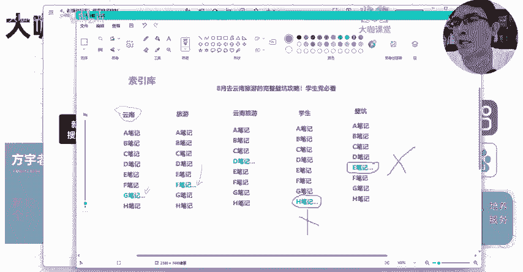

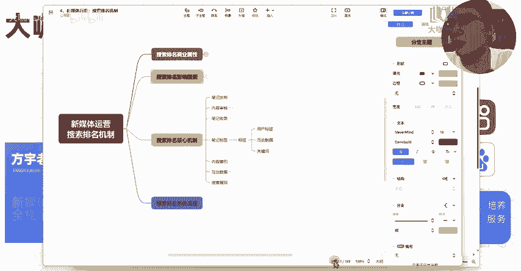

有一定的点击数据，这些标签下面你有一定的点击数据。但这些你可能你的这个因为长期你的笔记内容跟他们不相关，对吧？呃，搜旅游的人呢，他可能了解的不是云南旅游，他们这部分人他就不想看云南旅游的。

他就想看别的地方旅游。那么你这个这个笔记呢在旅游这个大词下面呢，它就可能会下降，对吧？排到后面去，但是呢你又跟旅游有相关有一定的展现，他也会有一定的点击行为，只不过数据比较少，他不会完全剔除，然后呢。

包括云南也是一样的，你的这个笔记啊，他的排名会继续往下坠，但是呢他不会完全删除，就是相关。所以说我们整个系统索引库，他在把你的笔记在他的一个索引库里边去进行一个排序的时候啊，他是会有一个动态调整。

也就是初始排名和后续的一个变动排名。这个大家一定要了解，好吧，一定要了解，这就是我们整个索引库的，我们模拟他的一个这样的一个过程。OK。😊。

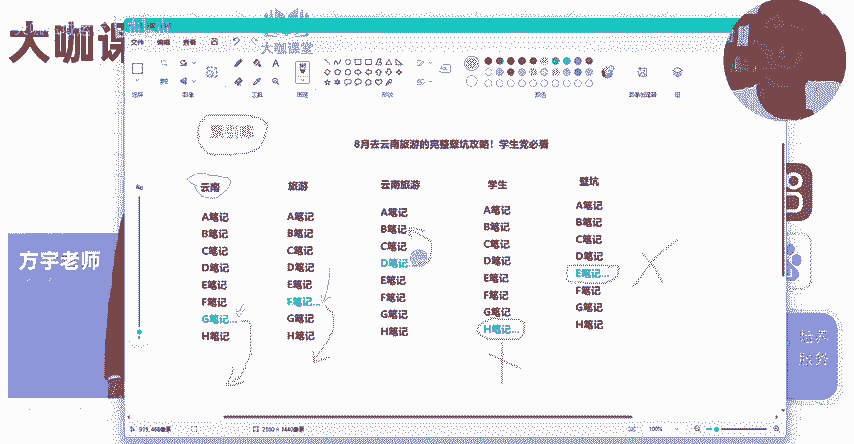

我们模拟它的一个这样的一个过程。然后呢，在这个过程当中，我们刚才所展示的它的一个变化，对不对？它的一个变化情况是根据什么呀？我们根据后期我们讲的影响，这个我们关键词展现的这些因素。比如说点击率，对吧？

搜索点击率搜索的一个场景下的跳出率，还有搜索场景下的一个用户的一个行为数据，这些都会影响我们的笔记在不同关键词下面的一个排名情况，这个相信非常直观，大家也能了解了。好吧，然后呢。

当你的这个关键词在索引库里边去调整好了排名之后呢，用户只要有搜索你像搜索这个云南旅游，哎，他就会按照这种排序来给你展现。然后呢，搜索云南你可能排的比较靠后，但是你也会有展现，可能说你往后面多翻一翻。

你能翻到，然后旅游也是一样。但是学生和B坑这种特别不相关的，他可能到后期呢你就没有了。你参与不了的。当然这个呢我们一般很难去发现啊。比如说我们现在拿某图文平台来看。😊。

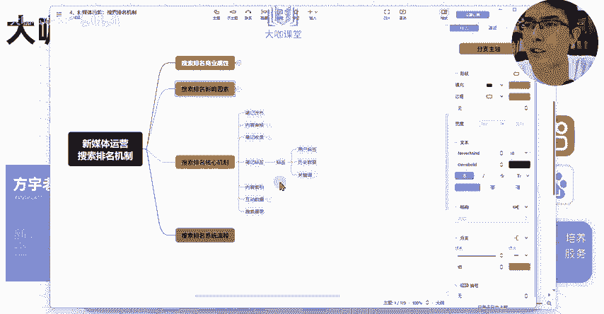

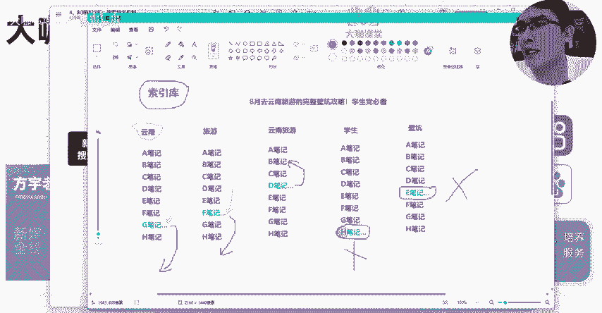

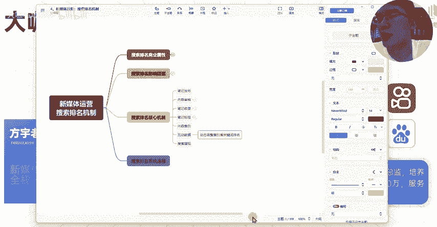

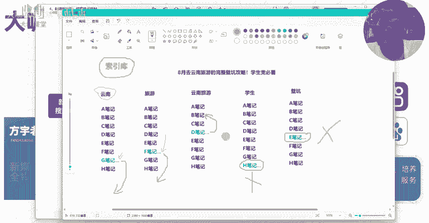

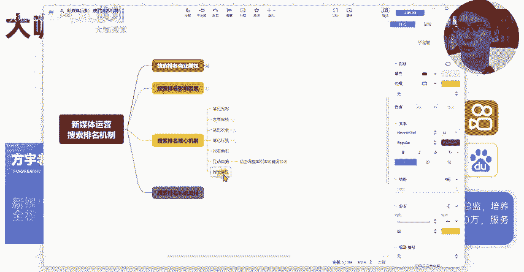

还有一个情况就是有一个东西叫做还有一个东西啊有一个东西叫做动态排名。这个你们也要了解一下。什么叫做动态排名呢？就是我们现在新媒体这些平台啊，他们是非常聪明的，也非常智能的。就是他去做这些排名的决策啊。

他去做这些排名的决策。你在某些情况下面，哪怕说你已经得到了一个还不错的这个排名数据。但是每一个用户他的一个搜索展现之后，搜索展现的时候，你的排名都可能会有一点动荡。

甚至说呃同样一个词儿下面你像我们这里有A笔记B笔记C笔记是吧？他可能在这个地方啊，我再来给你们讲一下。😊，嗯。好，那么我们来看这个情况哈。在这种情况下面某些搜索词啊。

它会在下面呢去根据用户的一个行为数据啊，为了更好的去匹配用户的一个兴趣爱好，就是给用户看更多他喜欢看的内容。他不会把这个搜索排名完全固定。就以我们这个什么呢？就以我们图文笔记平台。

他会在这个地方去动态展示。你看C笔记是不是一样的。😊，你看啊这个C笔记是不是一样的，但是这个2号笔记AB笔记这两个是不是就是不一样的了？我这里用这个区分数字来标识了啊。

一笔记就代表着排名第一的是另外一篇笔记已经不是A笔记了。然后B笔记排第二的这个地方已经变成了另外一篇叫做二笔记的一个图文内容了。然后C笔记可能是一样的。

然后你的D笔记可能原本在这里结果呢在这个新的排序下面它排在了这个地方，那么这个原本的位置呢也不一样了。这一一对应的一个排名结果，这个大家能理解吧啊，应该能够理解哈。

也就是说在系统的它的这个某些关键词下面这些热门的关键词或者一些呃其他的关键词下面它会有一些不同的这个索引库的一个值，啊，会有一些不同的这种索引库的值，它不会像我们以前做搜索引擎。

我们以前做搜索引擎的优化，我们的关键词可能下面的排名数据它就是一直固定的。你的更新呢也不会说很频繁。我们某一个搜索词场景下面只要是我们的数据我们的这个网站排的比较靠前的。

我们可能短时间内它就排的比较靠前。然后它的12345。😊，七8名基本上都是固定的，不会有太大的变化，都是同一个索引库的展现。但是现在的新媒体平台它变聪明了，它因它深知一个道理，什么道理呢？😊。

就是你像我们现在笔记平台，图文笔记平台和我们的视频平台，你们发现所有的内容，他们的一个重复度重复的这个概率是很高的。也就是说同样一篇呃两篇笔记可能说他们的文字内容不同，但是他们讲的都是同样一个点啊。

你又不能说他说它不好。但是在这种情况下面，你在笔记内容严重同质化的情况下，我们平台要把流量平均分发给不同的博主，他就要给别人机会，他就不能把这个关键词排名去固定。那么他就得去腾出多个索引库。

我们这里演示了两个，他可能还有更多，对吧？他可能还有更多。通过这种方式去动态调整不同数据不同笔记在这个呃搜索结果下面的一个展现情况。那么这一点大家能理解了吧？O那么这就是我们这一节课要跟大家讲的。

我们呃这个新媒体平台现在的一个整个搜索排名机制的完整流程和他的一个呃动态索引的一个步骤。O那么这节课就先给大家讲到这里，我们下节课。😊。

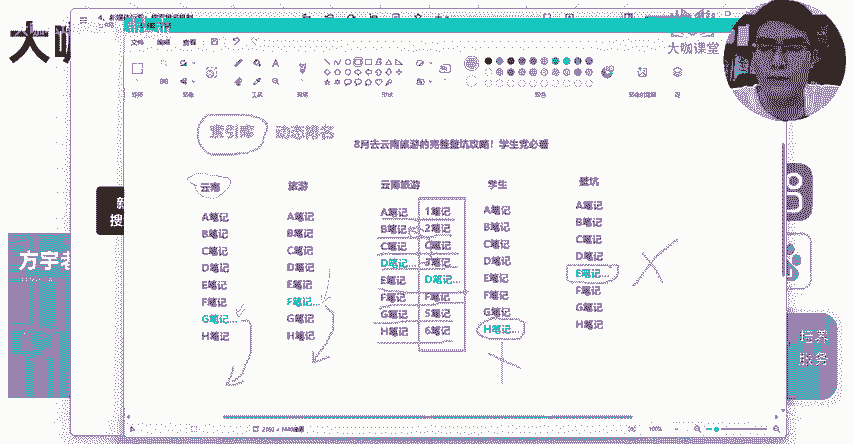